# Day61 TensorFlow와 Keras 라이브러리를 활용한 딥러닝(1)

# 텐서플로

- [tensorflow.org](https://www.tensorflow.org/)

- 텐서플로? edges와 node로 구조화 된 graph로 구성된 프로그램
  - 텐서보드를 통하여 시각적으로 볼 수 있다.

```python
import tensorflow as tf

a = tf.placeholder('float')
b = tf.placeholder('float')
# tf.placeholder : 프로그램이 실행 중에 값을 변경할 수 있는 변수 정의
# 데이터를 담는 버퍼와 같은 것

y = tf.multiply(a, b) # 노드 : 연산을 담당
sess = tf.Session() # 그래프를 실행하기 위해 필요한 파트
print(sess.run(y, feed_dict={a:3, b:2})) # session.run : 그래프 최종 실행 => 수치 연산 실행
# > 6.0
```

- cf. `placeholder`로 선언 된 변수가 있을 경우, `feed_dict` 옵션이 꼭 필요하다.

- 텐서플로우 처리 순서

  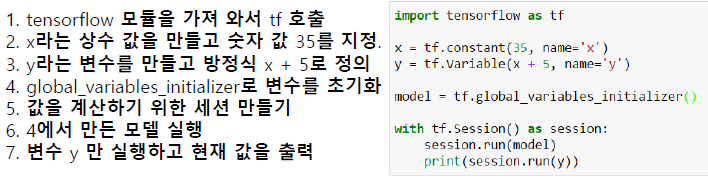

  - `name` 옵션은 텐서보드를 이용한 시각화 과정에서 사용하기 위한 옵션이다.
  - 변수 y를 실행하기 위해서는 변수 초기화과정이 꼭 필요하다.

- 텐서플로우 기초 연산 함수

  - `add` : 더하기
  - `substract` : 빼기
  - `multiply` : 곱하기(요소간 곱셈)
    - `matmul` : 행렬 곱
  - `divide` : 몫
  - `mod` : 나머지
  - `square` : 제곱
  - `round` : 반올림
  - `pow` : 거듭의 곱
  - `abs` : 절대값

- 텐서플로우 행렬 관련 함수

  - `matmul` : 행렬 곱
  - `diag` : 대각행렬을 리턴
  - `transpose` : 전치행렬을 리턴
  - `matrix_determinant` : 정방행렬의 행렬식 값을 리턴
  - `matrix_inverse` :  정방행렬의 역행렬을 리턴

- 텐서플로우 함수

  - `rank` : rank, 차원을 조회하는 함수

    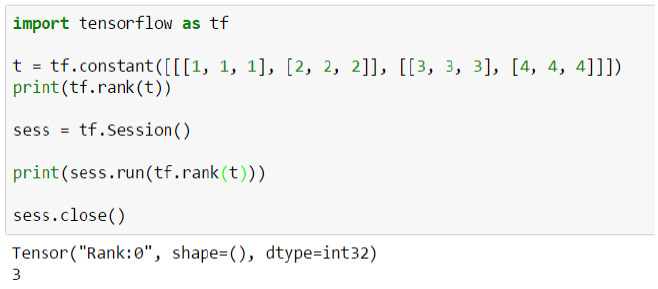

  - `shape` : shape를 조회하는 함수

    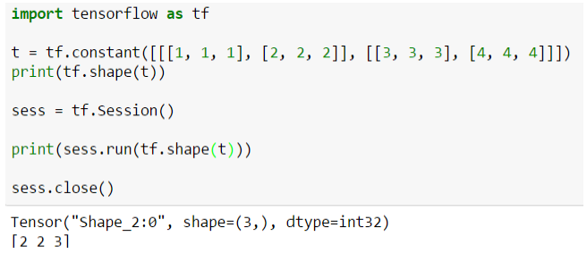

  - `size` : 전체 size를 조회하는 함수

    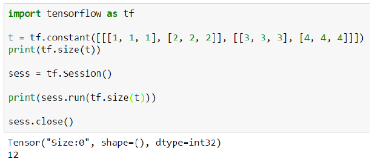

  - `placeholder` : 실행시 데이터에 제공할 영역을 지정하는 것

    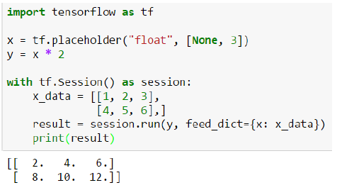

    - `None`은 아무 숫자나 들어가도 된다는 의미

    - 숫자가 있는 부분은 맞춰주어야 한다. shape을 맞춰주지 않으면 error 발생

    - `placeholder_with_default` : 초기값과 같이 데이터 영역을 지정하는 함수

      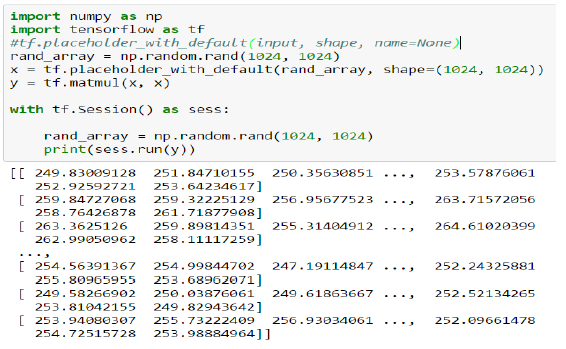

      - 초기값이 들어오므로 `feed_dict` 처리 없음

  - `random_normal` : normal 분포의 난수 발생

    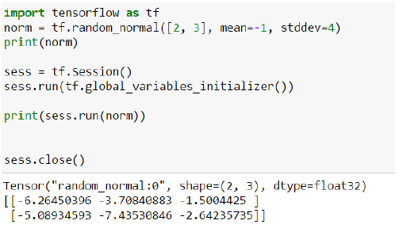

    - `seed` : 반복해서 생성시 동일한 값을 유지할 경우 사용

      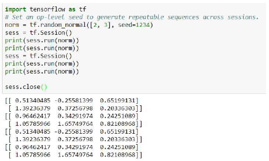

  - `random_uniform` : uniform 분포의 난수 발생

    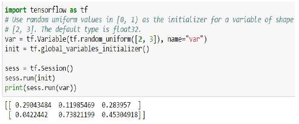

  - `suffle` : 행단위를 suffle해서 생성

    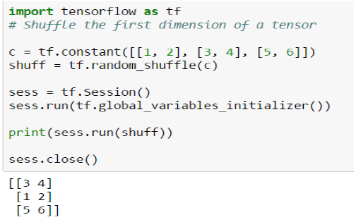

  - `open` : file을 직접 오픈해서 처리

    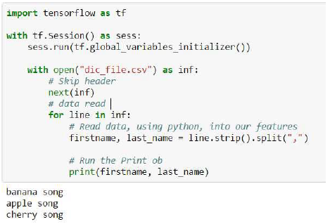

  - `read_file` : 파일을 읽고 처리

    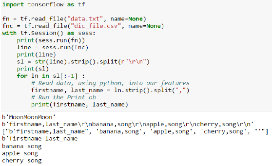

  - `gradients` : 함수에 대한 미분계수

    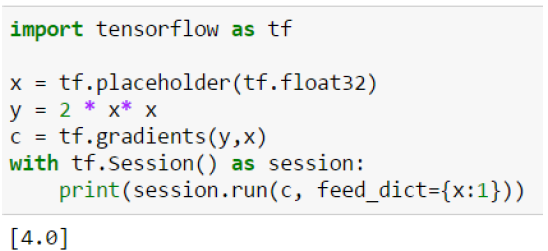

  - `reduce_mean/min/max` : 평균과 최소값, 최대값을 계산 & 차원을 줄여줌

    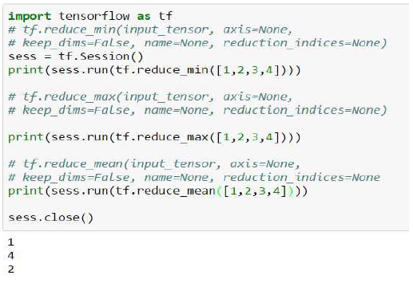

  - `tuple` :  텐서들을 모아서 tuple(list)로 반환

    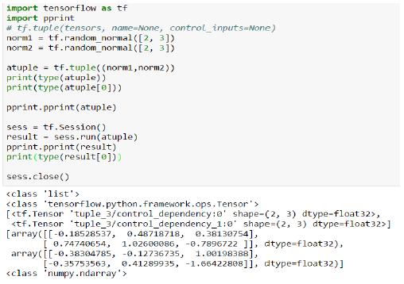

  - `argmin/argmax` : 축별 최소/최대 값에 대한 인덱스 찾기

    

  - `slice` : 데이터 중 일부 추출

    - `tf.slice(input_, begin, size, name=None)`

    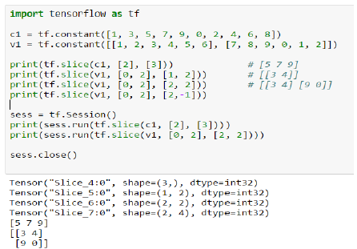

  - `global_variables_initializer` : 하나의 operation 객체로 초기화

    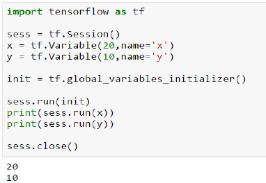

    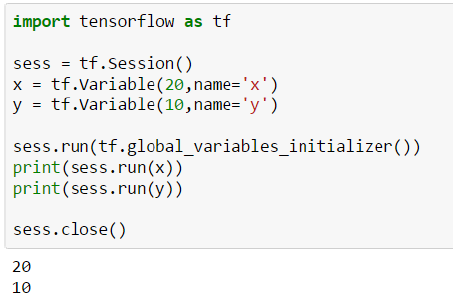

## 실습

```python
import tensorflow as tf
```

- tf.placeholder : 프로그램이 실행 중에 값을 변경할 수 있는 변수 정의
  - 데이터를 담는 버퍼와 같은 것

```python
a = tf.placeholder('float')
b = tf.placeholder('float')

y = tf.multiply(a, b) # 노드 : 연산을 담당
sess = tf.Session() # 그래프를 실행하기 위해 필요한 파트
print(sess.run(y, feed_dict={a:3, b:2}))
# session.run : 그래프 최종 실행 => 수치 연산 실행
# > 6.0
```

```python
hello = tf.constant('Hello')
print(hello)
# > Tensor("Const:0", shape=(), dtype=string)

sess = tf.Session()
print(sess.run(hello))
# > b'Hello'
```

- 랭크:0 tensor, shape:[]
- [1, 2, 3] # 랭크:1, shape:[3]
- [[1, 2, 3],[1, 2, 3]] # 랭크:2, shape:[2, 3]
- [[[1, 2, 3]],[[4, 5, 6]]] # 랭크:3, shape:[2, 1, 3]

```python
a = tf.constant(10)
b = tf.constant(20)
print(a)
# > Tensor("Const_1:0", shape=(), dtype=int32)

print(a+b)
# > Tensor("add:0", shape=(), dtype=int32)

print(tf.add(a, b))
# > Tensor("Add_1:0", shape=(), dtype=int32)

sess = tf.Session()
sess.run(tf.add(a, b))
# > 30

c = tf.add(a, b)
sess.run(c)
# > 30

sess.run(a)
# > 10

sess.run(b)
# > 20

sess.run([a, b])
# > [10, 20]

sess.close()
```

> tf.Session() 또한 메모리를 차지 하므로, 사용하지 않을 때는 닫아주는 것이 좋다.

```python
a = tf.placeholder(dtype='float')
# == tf.placeholder(tf.float32)
b = tf.placeholder(tf.float32)
adderNode = a + b
print(a)
# > Tensor("Placeholder_2:0", dtype=float32)

print(b)
# > Tensor("Placeholder_3:0", dtype=float32)

print(adderNode)
# > Tensor("add_4:0", dtype=float32)

sess = tf.Session()
print(sess.run(adderNode))
```

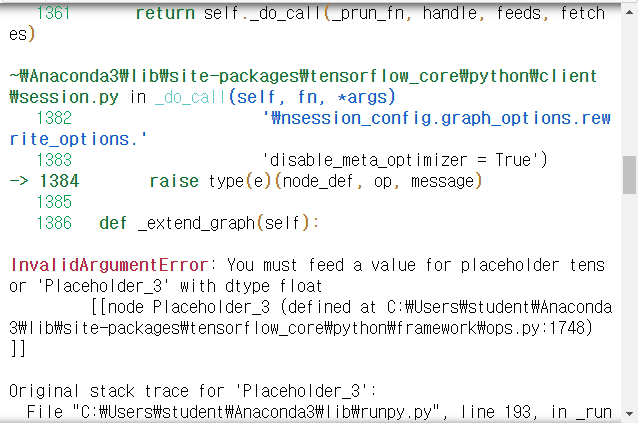

```python
print(sess.run(adderNode, feed_dict={a:5, b:3}))
# > 8.0

print(sess.run(adderNode, feed_dict={a:[5, 1], b:[3, 2]}))
# > [8. 3.]

triple = tf.multiply(adderNode, 3)
sess.run(triple, feed_dict={a:2, b:3})
# > 15.0
```

```python
x = tf.placeholder(tf.float32, [None, 3])
print(x)
# > Tensor("Placeholder_4:0", shape=(?, 3), dtype=float32)

xdata = [[1, 2, 3], [4, 5, 6]]
sess.run(x, feed_dict={x:xdata})
# > array([[1., 2., 3.],
# >        [4., 5., 6.]], dtype=float32)

xdata2 = [[1, 2], [4, 5]]
sess.run(x, feed_dict={x:xdata2})
```

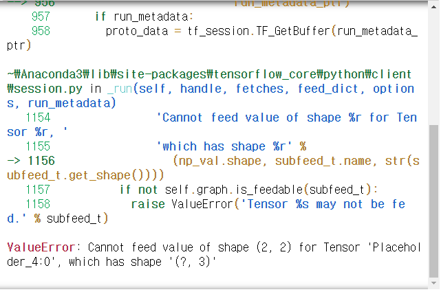

- H(x) = wx+b

```python
# w = tf.Variable(tf.random_normal([2, 1]))
# w = tf.Variable([[1], [2]])
# hf = tf.matmul(x, w) + b

xdata = [[1, 2, 3], [4, 5, 6]] # 2행 3열
x = tf.placeholder(tf.float32, [None, 3])
w = tf.Variable(tf.random_normal([3, 1])) # variable # 3,1
b = tf.Variable(tf.random_normal([1])) # variable #1

hf = tf.matmul(x, w) + b
sess = tf.Session()
sess.run(tf.global_variables_initializer())
sess.run(hf, feed_dict={x:xdata})
# > array([[-1.7737756],
# >        [-6.6980143]], dtype=float32)
```

### 텐서플로 기반 선형 회귀모델

```python
xtrain = [80, 95, 97] # 모의고사 점수
ytrain = [82, 90, 98] # 수능 점수
# 모의고사 70점 => 수능 ?

w = tf.Variable(tf.random_normal([1]))
b = tf.Variable(tf.random_normal([1]))

hf = xtrain*w + b

sess = tf.Session()
sess.run(tf.global_variables_initializer())
sess.run([w ,b , hf])
# > [array([-0.3920345], dtype=float32),
# >  array([1.7713823], dtype=float32),
# >  array([-29.591377, -35.471897, -36.255966], dtype=float32)]
```

```python
hf = xtrain*w + b
cost = tf.reduce_mean(tf.square(hf - ytrain)) # 오차제곱합평균
opt = tf.train.GradientDescentOptimizer(0.01) # 0.01 : 최적값을 찾기 위한 step size
train = opt.minimize(cost)
# fit the line
print(sess.run(cost), sess.run(w), sess.run(b))
# > 15406.832 [-0.3920345] [1.7713823]

sess.run(train)
print(sess.run(cost), sess.run(w), sess.run(b))
# > 417075970.0 [225.40778] [4.2468443]

sess.run(train)
print(sess.run(cost), sess.run(w), sess.run(b))
# > 11297143000000.0 [-36936.7] [-402.7775]

sess.run(train)
print(sess.run(cost), sess.run(w), sess.run(b))
# > 3.0600044e+17 [6079198.] [66585.625]
```

- step size가 커서 발산 함 => step size = 0.0001

```python
w = tf.Variable(tf.random_normal([1]))
b = tf.Variable(tf.random_normal([1]))
sess = tf.Session()
sess.run(tf.global_variables_initializer())
sess.run([w ,b , hf])
hf = xtrain*w + b
cost = tf.reduce_mean(tf.square(hf - ytrain)) 
opt = tf.train.GradientDescentOptimizer(0.0001)
train = opt.minimize(cost)
print(sess.run(cost), sess.run(w), sess.run(b))
# > 6192.2656 [0.1431845] [-1.4766562]

sess.run(train)
print(sess.run(cost), sess.run(w), sess.run(b))
# > 2668.679 [1.5739716] [-1.4609573]

sess.run(train)
print(sess.run(cost), sess.run(w), sess.run(b))
# > 1153.2838 [0.635663] [-1.4712064]

sess.run(train)
print(sess.run(cost), sess.run(w), sess.run(b))
# > 501.55502 [1.2510039] [-1.4644389]
```

- 반복문으로 시행

```python
w = tf.Variable(tf.random_normal([1]))
b = tf.Variable(tf.random_normal([1]))
sess = tf.Session()
sess.run(tf.global_variables_initializer())
sess.run([w ,b , hf])
hf = xtrain*w + b
cost = tf.reduce_mean(tf.square(hf - ytrain)) 
opt = tf.train.GradientDescentOptimizer(0.0001)
train = opt.minimize(cost)

for step in range(2001) :
    sess.run(train)
    if step%100 == 0 :
        print(step, sess.run(cost), sess.run(w), sess.run(b))
# > 0 58.20131 [0.9197506] [-0.4785065]
# > 100 9.486442 [0.99642473] [-0.47501662]
# > 200 9.485758 [0.9963957] [-0.4723672]
# > 300 9.48504 [0.99636656] [-0.46971777]
# > 400 9.484343 [0.9963376] [-0.46706834]
# > 500 9.483632 [0.9963087] [-0.46441892]
# > 600 9.482947 [0.9962795] [-0.4617695]
# > 700 9.482235 [0.9962504] [-0.45912018]
# > 800 9.481545 [0.9962214] [-0.4564722]
# > 900 9.480838 [0.99619246] [-0.45382547]
# > 1000 9.480144 [0.99616337] [-0.45117903]
# > 1100 9.479443 [0.9961345] [-0.44853258]
# > 1200 9.4787245 [0.9961057] [-0.44588614]
# > 1300 9.478048 [0.9960767] [-0.4432397]
# > 1400 9.47733 [0.9960477] [-0.44059324]
# > 1500 9.476639 [0.9960186] [-0.4379468]
# > 1600 9.475935 [0.9959895] [-0.43530154]
# > 1700 9.475232 [0.9959608] [-0.43265772]
# > 1800 9.474532 [0.9959316] [-0.43001425]
# > 1900 9.473851 [0.9959029] [-0.4273708]
# > 2000 9.473153 [0.9958737] [-0.42472732]
```

- 모의고사 점수가 50점 => 수능점수?

```python
yhat = 50*sess.run(w)[0] + sess.run(b)[0]
print('예상되는 수능점수는', yhat)
# > 예상되는 수능점수는 49.36895716190338
```

# 연습문제

- car 데이터에서
- 임의의 실린더 수(10, 12, 16)가 입력 -> hp?
- cost, w, b 출력
- cost 함수 시각화(w축)
- learning rate, training 조절

```python
import pandas as pd
path = '../data_for_analysis/carsdata/'
cars = pd.read_csv(path + 'cars.csv')
cars.head()
```

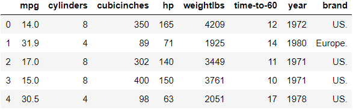

```python
x = cars[' cylinders']
y = cars[' hp']

w = tf.Variable(tf.random_normal([1]))
b = tf.Variable(tf.random_normal([1]))

hf = w*x + b
cost = tf.reduce_mean(tf.square(hf - y))
opt = tf.train.GradientDescentOptimizer(0.0001)
train = opt.minimize(cost)

sess = tf.Session()
sess.run(tf.global_variables_initializer())

print("step \tcost \t\tw \t\tb")
for step in range(2001) : 
    sess.run(train)
    if step%100 == 0 :
        print(step, "\t", sess.run(cost),"\t",
              sess.run(w), "\t", sess.run(b))
# > step 	cost 		w 		b
# > 0 	 10331.157 	 [2.107633] 	 [0.06369535]
# > 100 	 2875.2632 	 [10.475542] 	 [1.4213192]
# > 200 	 1057.1594 	 [14.608639] 	 [2.0858905]
# > 300 	 613.81165 	 [16.650547] 	 [2.4082367]
# > 400 	 505.69266 	 [17.659807] 	 [2.561598]
# > 500 	 479.31763 	 [18.159145] 	 [2.631525]
# > 600 	 472.87616 	 [18.406668] 	 [2.6602607]
# > 700 	 471.29523 	 [18.529844] 	 [2.6686652]
# > 800 	 470.89966 	 [18.591614] 	 [2.6670387]
# > 900 	 470.79303 	 [18.62306] 	 [2.6604705]
# > 1000 	 470.75705 	 [18.639526] 	 [2.6514711]
# > 1100 	 470.73828 	 [18.648598] 	 [2.6412816]
# > 1200 	 470.7237 	 [18.654015] 	 [2.6305141]
# > 1300 	 470.71014 	 [18.657627] 	 [2.6194715]
# > 1400 	 470.6969 	 [18.660347] 	 [2.6083014]
# > 1500 	 470.68384 	 [18.662619] 	 [2.5970798]
# > 1600 	 470.6708 	 [18.66468] 	 [2.585849]
# > 1700 	 470.6578 	 [18.666588] 	 [2.5746195]
# > 1800 	 470.6449 	 [18.668495] 	 [2.5633914]
# > 1900 	 470.63193 	 [18.670403] 	 [2.5521858]
# > 2000 	 470.61905 	 [18.672268] 	 [2.540984]
```

```python
for i in [10, 12, 16] :
    yhat = i * sess.run(w)[0] + sess.run(b)[0]
    print("실린더 수 {}에 예상되는 hp는 {} 이다.".format(i, yhat))
# > 실린더 수 10에 예상되는 hp는 189.26366305351257 이다.
# > 실린더 수 12에 예상되는 hp는 226.6081988811493 이다.
# > 실린더 수 16에 예상되는 hp는 301.29727053642273 이다.
```

