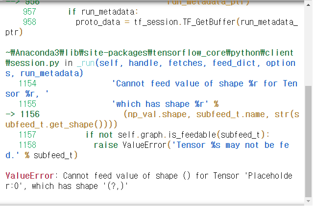
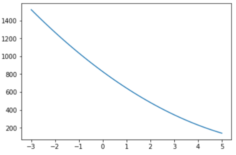
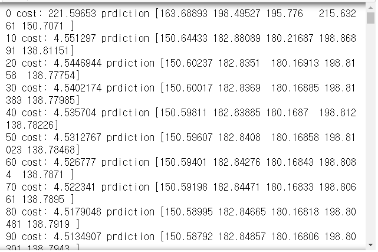
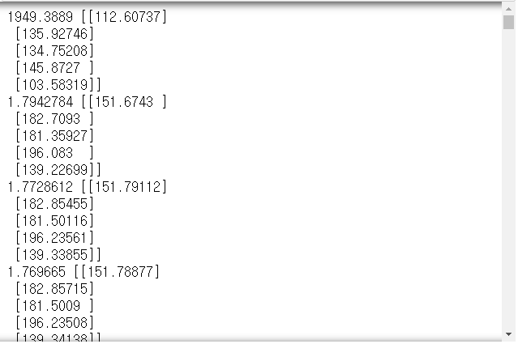
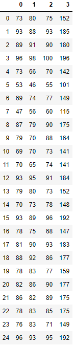
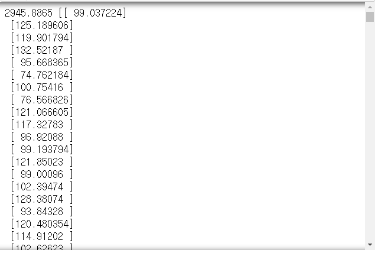
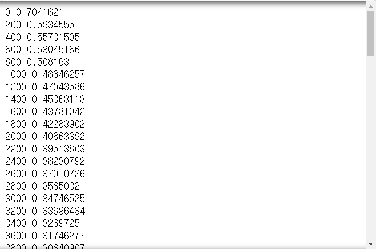
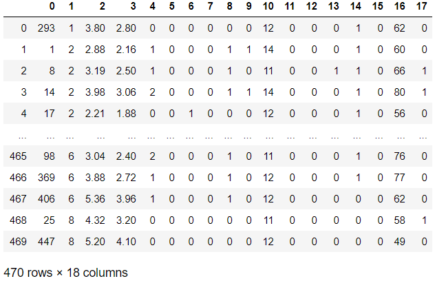

# Day62 TensorFlow와 Keras 라이브러리를 활용한 딥러닝(2)

# TensorFlow

## 선형회귀

```python
import pandas as pd
import numpy as np
import tensorflow as tf

tf.set_random_seed(777)
np.random.seed(777)
```

```python
# ydata = xdata * w + b
w = tf.Variable(tf.random_normal([1]), name='weight')
b = tf.Variable(tf.random_normal([1]), name='bias')

x = tf.placeholder(tf.float32, shape=[None])
y = tf.placeholder(tf.float32, shape=[None])

hf = x*w + b
cost = tf.reduce_mean(tf.square(hf - y))

opt = tf.train.GradientDescentOptimizer(learning_rate=0.01)
train = opt.minimize(cost)

sess = tf.Session()
sess.run(tf.global_variables_initializer())

for step in range(2001) :
    _, cv, bv, wv = sess.run([train, cost, b ,w], feed_dict={x:[1, 2, 3], y:[2, 3, 4]})
    if step%100 == 0 :
        print(step, cv, bv, wv)
# > 0 1.2680145e-05 [0.99062073] [1.004126]
# > 100 7.836899e-06 [0.9926268] [1.0032434]
# > 200 4.8426396e-06 [0.9942038] [1.0025498]
# > 300 2.992618e-06 [0.9954434] [1.0020045]
# > 400 1.8498291e-06 [0.9964177] [1.001576]
# > 500 1.1435844e-06 [0.9971835] [1.0012392]
# > 600 7.069316e-07 [0.9977855] [1.0009742]
# > 700 4.370141e-07 [0.9982587] [1.000766]
# > 800 2.702485e-07 [0.99863064] [1.0006027]
# > 900 1.6722198e-07 [0.99892294] [1.0004737]
# > 1000 1.0351378e-07 [0.9991527] [1.0003726]
# > 1100 6.4145e-08 [0.9993332] [1.0002937]
# > 1200 3.970142e-08 [0.9994752] [1.0002307]
# > 1300 2.4592376e-08 [0.9995867] [1.0001817]
# > 1400 1.5318506e-08 [0.9996741] [1.0001435]
# > 1500 9.467025e-09 [0.9997438] [1.0001129]
# > 1600 5.8990772e-09 [0.9997974] [1.0000888]
# > 1700 3.6464343e-09 [0.999841] [1.00007]
# > 1800 2.296403e-09 [0.9998738] [1.0000559]
# > 1900 1.4598527e-09 [0.9998992] [1.0000439]
# > 2000 8.852794e-10 [0.9999218] [1.0000342]
```

- shape을 맞춰주지 않을 경우 error 발생

```python
print(sess.run(hf, feed_dict={x:10}))
```



- 찾은 회귀식을 이용한 예측

```python
print(sess.run(hf, feed_dict={x:[10]}))
# > [11.000264]

print(sess.run(hf, feed_dict={x:[10, 10.5]}))
# > [11.000264 11.500281]

print(sess.run(hf, feed_dict={x:[10, 10.5, 20, 100]}))
# > [ 11.000264  11.500281  21.000607 101.00334 ]
```

### 변수값 초기화

```python
w = tf.Variable([100.], tf.float32)
b = tf.Variable([-10.], tf.float32)
x = tf.placeholder(tf.float32)
y = tf.placeholder(tf.float32)

hf = x*w + b
cost = tf.reduce_sum(tf.square(hf - y))

opt = tf.train.GradientDescentOptimizer(learning_rate=0.01)
train = opt.minimize(cost)

xtrain = [1, 2, 3, 4, 5]
ytrain = [0, -1, -2, -3, -4]

sess = tf.Session()
sess.run(tf.global_variables_initializer())

for i in range(1000) :
    sess.run(train, {x:xtrain, y:ytrain})

wv, bv, costv = sess.run([w, b, cost], feed_dict={x:xtrain, y:ytrain})
print('weight:%s, bias:%s, cost:%s' %(wv, bv, costv))
# > weight:[-0.9999995], bias:[0.99999833], cost:2.5579538e-12
```

- weight에 따른 loss 시각화
  - x = [1, 3, 5]
  - y = [10, 28, 40]
  - b는 무시
  - w = tf.placeholder(tf.float32)
  - hf = x\*w
  - loss = tf.reduce_mean(tf.square(hf - y))
  - => 선형회귀모델 작성
  - 시각화 -> weight 값을 -3 부터 5 까지 0.1씩 증가시켜가면서 cost 값의 변화를 출력

```python
import matplotlib.pyplot as plt
x = [1, 3, 5]
y = [10, 28, 40]
w = tf.placeholder(tf.float32)
hf = x*w
loss = tf.reduce_mean(tf.square(hf - y))
sess = tf.Session()
sess.run(tf.global_variables_initializer())

wHistory = list()
cHistory = list()
for i in range(-30, 51) :
    currW = i*0.1
    lossv = sess.run(loss, feed_dict={w:currW})
    wHistory.append(currW)
    cHistory.append(lossv)

plt.plot(wHistory, cHistory)
plt.show()
```



### 경사하강법에서 update 구문 작성

```python
xdata = [1, 2, 3]
ydata = [1, 2, 3]
w = tf.Variable(tf.random_normal([1]))
x = tf.placeholder(tf.float32)
y = tf.placeholder(tf.float32)

hf = x*w

lr = 0.1
cost = tf.reduce_mean(tf.square(hf- y))
gradient = tf.reduce_mean((w*x - y)*x)
descent = w - lr*gradient
update = w.assign(descent)

sess.run(tf.global_variables_initializer())
for step in range(21) :
    sess.run(update, feed_dict={x:xdata, y:ydata})
    print(step, sess.run(cost, feed_dict={x:xdata, y:ydata}), sess.run(w, feed_dict={x:xdata, y:ydata}))
# > 0 0.35160756 [0.72551054]
# > 1 0.10001282 [0.8536056]
# > 2 0.028448073 [0.92192304]
# > 3 0.0080919005 [0.95835894]
# > 4 0.0023016909 [0.9777914]
# > 5 0.00065470376 [0.9881554]
# > 6 0.00018622912 [0.99368286]
# > 7 5.2972613e-05 [0.99663085]
# > 8 1.5067771e-05 [0.9982031]
# > 9 4.285563e-06 [0.9990417]
# > 10 1.2190276e-06 [0.9994889]
# > 11 3.4674488e-07 [0.9997274]
# > 12 9.8608474e-08 [0.9998546]
# > 13 2.8071435e-08 [0.99992245]
# > 14 7.975345e-09 [0.99995863]
# > 15 2.274973e-09 [0.99997795]
# > 16 6.448282e-10 [0.99998826]
# > 17 1.8353437e-10 [0.99999374]
# > 18 5.199278e-11 [0.99999666]
# > 19 1.44998085e-11 [0.9999982]
# > 20 4.2443085e-12 [0.99999905]
```

### multi variable linear regression

- 변수 하나당 한 변수로 만들어 줄 경우

```python
# 5명의 모의고사 점수
x1data = [73, 93, 90, 95, 72]
x2data = [80, 88, 92, 98, 66]
x3data = [75, 92, 90, 100, 70]
# 5명의 수능 점수
ydata = [152, 185, 180, 195, 140]

x1 = tf.placeholder(tf.float32)
x2 = tf.placeholder(tf.float32)
x3 = tf.placeholder(tf.float32)

w1 = tf.Variable(tf.random_normal([1]))
w2 = tf.Variable(tf.random_normal([1]))
w3 = tf.Variable(tf.random_normal([1]))
b = tf.Variable(tf.random_normal([1]))
hf = x1*w1 + x2*w2 + x3*w3 + b

cost = tf.reduce_mean(tf.square(hf - y))
opt = tf.train.GradientDescentOptimizer(1e-5)
train = opt.minimize(cost)

sess = tf.Session()
sess.run(tf.global_variables_initializer())

for step in range(2001):
    cv, hfv, _  = sess.run([cost, hf, train], 
                           feed_dict={x1:x1data, x2:x2data,
                                      x3:x3data, y:ydata})
    if step%10 == 0 :
        print(step, 'cost:', cv, 'prdiction', hfv)
```



- X 변수를 행렬 형태로 변형 할 경우

```python
xdata = [[73, 93, 90, 95, 72],
         [80, 88, 92, 98, 66],
         [75, 92, 90, 100, 70]]
ydata = [[152], [185], [180], [195], [140]]

xdata = np.array(xdata).T
xdata
# > array([[ 73,  80,  75],
# >        [ 93,  88,  92],
# >        [ 90,  92,  90],
# >        [ 95,  98, 100],
# >        [ 72,  66,  70]])

x = tf.placeholder(tf.float32, shape=[None, 3]) # 보통 행은 None으로 선언(data의 개수를 원하는대로 적용할 수 있도록)
y = tf.placeholder(tf.float32, shape=[None, 1])
w = tf.Variable(tf.random_normal([3,1]))
b = tf.Variable(tf.random_normal([1]))

hf = tf.matmul(x, w) + b

cost = tf.reduce_mean(tf.square(hf - y))
opt = tf.train.GradientDescentOptimizer(1e-5)
train = opt.minimize(cost)

sess = tf.Session()
sess.run(tf.global_variables_initializer())
for step in range(2001) :
    _, cv, hfv = sess.run([train, cost, hf], feed_dict={x:xdata, y:ydata})
    if step%10 == 0:
        print(cv, hfv)
```



- .csv 파일에 적용하기

    ```python
    path = '../data_for_analysis/'
    test = pd.read_csv(path + 'data-01-test-score.csv', header=None)

    test
    ```

	

    ```python
    xtrain = test.drop(3, axis=1)
    ytrain = pd.DataFrame(test[3])
    ytrain.shape
    # > (25, 1)

    x = tf.placeholder(tf.float32, shape=[None, 3])
    y = tf.placeholder(tf.float32, shape=[None, 1])

    w = tf.Variable(tf.random_normal([3, 1]))
    b = tf.Variable(tf.random_normal([1]))

    hf = tf.matmul(x, w) + b
    cost = tf.reduce_mean(tf.square(hf - y))
    opt = tf.train.GradientDescentOptimizer(1e-5)
    train = opt.minimize(cost)

    sess = tf.Session()
    sess.run(tf.global_variables_initializer())

    for step in range(2001) :
        _, cv, hfv = sess.run([train, cost, hf], feed_dict={x:xtrain, y:ytrain})
        if step%10 == 0 :
            print(cv, hfv)
    ```

    

    - 90, 90, 90일때 예상되는 점수?

        ```python
        sess.run(hf, feed_dict={x:[[90, 90, 90]]})
        # > array([[181.01852]], dtype=float32)
        ```

## logistic classification

```python
xdata = [[1, 2], [2, 3], [3, 1], [4, 3], [5, 3], [6, 2]]
ydata = [[0], [0], [0], [1], [1], [1]]

x = tf.placeholder(tf.float32, shape=[None, 2])
y = tf.placeholder(tf.float32, shape=[None, 1])

w = tf.Variable(tf.random_normal([2, 1]))
b = tf.Variable(tf.random_normal([1]))

hf = tf.sigmoid(tf.matmul(x, w) + b)
cost = -tf.reduce_mean(y*tf.log(hf) + (1-y)*tf.log(1-hf))

train = tf.train.GradientDescentOptimizer(0.01).minimize(cost)

# 0.5 기준(크면->1.0, 작으면->0.0)
predicted = tf.cast(hf > 0.5, dtype=tf.float32)

with tf.Session() as sess :
    sess.run(tf.global_variables_initializer())
    for step in range(20001) :
        _, cv = sess.run([train, cost], feed_dict={x:xdata, y:ydata})
        if step%200 == 0 :
            print(step, cv)
```



```python
with tf.Session() as sess :
    sess.run(tf.global_variables_initializer())
    for step in range(20001) :
        _, cv = sess.run([train, cost], feed_dict={x:xdata, y:ydata})

    hv, pv = sess.run([hf, predicted], feed_dict={x:xdata, y:ydata})
    print('예측값:', hv, ',\n 예측분류:', pv)
# > 예측값: [[0.00993226]
# >  [0.11402582]
# >  [0.17968647]
# >  [0.8463896 ]
# >  [0.9730111 ]
# >  [0.9917567 ]] ,
# >  예측분류: [[0.]
# >  [0.]
# >  [0.]
# >  [1.]
# >  [1.]
# >  [1.]]
```

```python
accuracy = tf.reduce_mean(tf.cast(tf.equal(predicted, y), dtype=tf.float32))

with tf.Session() as sess :
    sess.run(tf.global_variables_initializer())
    for step in range(20001) :
        _, cv = sess.run([train, cost], feed_dict={x:xdata, y:ydata})

    hv, pv, av= sess.run([hf, predicted, accuracy], feed_dict={x:xdata, y:ydata})
    print('예측값:', hv, ',\n 예측분류:', pv, ', \n판단:', av)
# > 예측값: [[0.00993226]
# >  [0.11402582]
# >  [0.17968647]
# >  [0.8463896 ]
# >  [0.9730111 ]
# >  [0.9917567 ]] ,
# >  예측분류: [[0.]
# >  [0.]
# >  [0.]
# >  [1.]
# >  [1.]
# >  [1.]] , 
# > 판단: 1.0
```


# 연습문제

- 주어진 데이터(ThoraricSurgery.csv)를 이용하여
  1. 위에 작성한 방식처럼 트레이닝/테스트 데이터
  2. 70(트레이닝):30(테스트)의 비율로 분리
  3. 70(트레이닝) -> 모델 생성 -> 30(테스트) => 정확도

```python
path = '../data_for_analysis/dataset_1/'
data = pd.read_csv(path + 'ThoraricSurgery.csv', header=None)
data
```



```python
from sklearn.model_selection import train_test_split
xTrain, xTest, yTrain, yTest = train_test_split(np.array(data.drop([17], axis=1)), data[17], test_size=0.3, shuffle=True, random_state=1234)
yTrain = pd.DataFrame(yTrain)
yTest = pd.DataFrame(yTest)
```

```python
x = tf.placeholder(tf.float32, shape=[None, 17])
y = tf.placeholder(tf.float32, shape=[None, 1])

w = tf.Variable(tf.random_normal([17, 1], mean=0.01, stddev=0.01))
b = tf.Variable(tf.random_normal([1]))

hf = tf.sigmoid(tf.matmul(x, w) + b)
cost = -tf.reduce_mean(y*tf.log(hf) + (1-y)*tf.log(1-hf))

train = tf.train.GradientDescentOptimizer(1e-6).minimize(cost)

predict = tf.cast(hf > 0.5, dtype=tf.float32)
accuracy = tf.reduce_mean(tf.cast(tf.equal(predict, y), dtype=tf.float32))

with tf.Session() as sess :
    sess.run(tf.global_variables_initializer())
    for step in range(1001) :
        _, cv, hfv = sess.run([train, cost, hf], feed_dict={x:xTrain, y:yTrain})
    print("final cost value :", cv)
    
    accu = sess.run(accuracy, feed_dict={x:xTest, y:yTest})
    print("test data accuracy :", accu)
# > final cost value : 0.4735445
# > test data accuracy : 0.8865248

# for step in range(10001) 일 경우
# > final cost value : 0.4489641
# >test data accuracy : 0.89361703
```

> w = tf.Variable(tf.random_normal([17, 1], mean=0.01, stddev=0.01))
>
> : tf.matmul(x, w)에서 x값이 크면 클수록 TensorFlow에서 값이 안보이는 경우가 생길 수 있기 때문에(ex. NaN) 이를 방지하고자 한 것이다.