# Day63 TensorFlow와 Keras 라이브러리를 활용한 딥러닝(3)

# Keras

- [keras](https://keras.io/)

- 파이썬으로 작성된 오픈 소스 신경망 라이브러리
- 모듈화
  - 모듈 독립적 -> 모듈 조합 -> 새로운 모델 생성
  - 모듈 : Neural Layers, Cost Function, Optimizers, Inintialization Schemes, Activation Function, Regularization Schemes
- 확장성
  - 새로운 모듈을 새로운 클래스와 함수로서 추가하기 쉬움.
- 케라스 모델 생성 절차
  1. 데이터 셋 생성
     - 훈련, 검증, 테스트
  2. 모델 구성
     - 시퀀스 모델 생성 후 레이어를 추가(간단한 모델)
     - 복잡한 모델은 케라서 API 사용
  3. 모델 학습과정 설정
     - Cost 함수, 최적화 방법 정의
     - **Compile 함수가 사용됨**
  4. 모델 학습
     - 트레이닝 데이터롤 모델 학습
     - **fit 함수가 사용됨**
  5. 훈련 set, 검증 set의 cost, 정확도 측정
  6. 모델 평가
     - 테스트 set으로 평가
     - **evaluate 함수가 사용됨**
  7. 모델 사용
     - 입력 -> 모델 -> 출력(예측)
     - **predict 함수가 사용됨**

## 케라스 모델 생성 실습

```python
from keras.utils import np_utils
from keras.datasets import mnist
from keras.models import Sequential
from keras.layers import Dense, Activation
```

### 1. 데이터셋 생성하기

```python
(xTrain, yTrain), (xTest, yTest) = mnist.load_data()

xTrain.shape
# > (60000, 28, 28)

xTest.shape
# > (10000, 28, 28)

xTrain = xTrain.reshape(60000, 784).astype('float32')/255.0
xTest = xTest.reshape(10000, 784).astype('float32')/255.0

yTrain.shape
# > (60000,)

yTrain
# > array([5, 0, 4, ..., 5, 6, 8], dtype=uint8)

# 원핫인코딩
yTrain = np_utils.to_categorical(yTrain)
yTest = np_utils.to_categorical(yTest)
yTrain
# > array([[0., 0., 0., ..., 0., 0., 0.],
# >        [1., 0., 0., ..., 0., 0., 0.],
# >        [0., 0., 0., ..., 0., 0., 0.],
# >        ...,
# >        [0., 0., 0., ..., 0., 0., 0.],
# >        [0., 0., 0., ..., 0., 0., 0.],
# >        [0., 0., 0., ..., 0., 1., 0.]], dtype=float32)
```

### 2. 모델 구성

```python
model = Sequential()
model.add(Dense(units=64, input_dim=28*28, activation='relu'))
model.add(Dense(units=10, activation='softmax'))
```

### 3. 모델 학습과정 설정

```python
model.compile(loss='categorical_crossentropy', optimizer='sgd', metrics=['accuracy'])
```

### 4. 모델 학습

```python
hist = model.fit(xTrain, yTrain, epochs=5, batch_size=32)
# > Epoch 1/5
# > 60000/60000 [==============================] - 2s 36us/step - loss: 0.6788 - accuracy: 0.8230
# > Epoch 2/5
# > 60000/60000 [==============================] - 2s 28us/step - loss: 0.3471 - accuracy: 0.9026
# > Epoch 3/5
# > 60000/60000 [==============================] - 2s 28us/step - loss: 0.3014 - accuracy: 0.9157
# > Epoch 4/5
# > 60000/60000 [==============================] - 2s 28us/step - loss: 0.2745 - accuracy: 0.9233
# > Epoch 5/5
# > 60000/60000 [==============================] - 2s 28us/step - loss: 0.2539 - accuracy: 0.9288
```

> epoch : 주어진 데이터 전체에 대해 몇번 반복하여 학습할 것인가
>
> batch_size : 몇 개의 샘플로 가중치를 갱신할 것인가

### 5. 훈련 set, 검증 set의 cost, 정확도 측정

```python
print(hist.history['loss']) # cost
print(hist.history['accuracy'])
# > [0.67884269597133, 0.34709640015761056, 0.30136468087832136, 0.2744826017439365, 0.2539007051169872]
# > [0.82301664, 0.90265, 0.91565, 0.92331666, 0.9288167]
```

### 6. 모델 평가

```python
res = model.evaluate(xTest, yTest, batch_size=32)
print(res)
# > 10000/10000 [==============================] - 0s 20us/step
# > [0.23793360604941846, 0.9333999752998352]
```

### 모델 예측

```python
xhat = xTest[0:1]
yhat = model.predict(xhat)
yhat
# > array([[6.3548199e-05, 6.1889516e-08, 3.0884601e-04, 1.8151880e-03,
# >         1.3725678e-06, 4.5986049e-05, 7.1720789e-09, 9.9739093e-01,
# >         2.6663181e-05, 3.4743338e-04]], dtype=float32)
```

## EarlyStopping

- 학생 5명, 모델 5개
  - 훈련 set : 모의고사
  - 검증 set : 
  - 테스트 set : 작년수능
  - => 학습 : 문제, 답안지 제공
- 훈련 set(70) : 시험 set(30)
  - 훈련 set : 훈련 set(70, 하이퍼파라메타 튜닝), 검증 set(30)
  - 실전 set : 올해 수능
  - overfitting이 있을 수 있으니 Early Stopping을 고려
  - 각 epoch마다 정확도의 평균이나, 분산을 고려할 수 있다.

### overfitting

```python
import numpy as np
np.random.seed(3)
```

- 데이터 불러오기 & 분할

```python
(xTrain, yTrain), (xTest, yTest) = mnist.load_data()

xVal = xTrain[50000:]
yVal = yTrain[50000:]
xTrain = xTrain[:50000]
yTrain = yTrain[:50000]

xTrain = xTrain.reshape(50000, 784).astype('float32')/255.0
xVal = xVal.reshape(10000, 784).astype('float32')/255.0
xTest = xTest.reshape(10000, 784).astype('float32')/255.0
```

- 훈련, 검정 데이터 선택

```python
tri = np.random.choice(50000, 700)
vri = np.random.choice(10000, 300)

xtrain = xTrain[tri]
ytrain = yTrain[tri]
xval = xVal[vri]
yval = yVal[vri]
```

- y값 원핫인코딩

```python
ytrain = np_utils.to_categorical(ytrain)
yval = np_utils.to_categorical(yval)

yTest = np_utils.to_categorical(yTest)
```

- 모델생성 & 훈련

```python
model = Sequential()
model.add(Dense(input_dim=28*28, units=2, activation='relu'))
model.add(Dense(units=10, activation='softmax'))

model.compile(loss='categorical_crossentropy', optimizer='sgd', metrics=['accuracy'])

hist = model.fit(xtrain, ytrain, epochs=3000, batch_size=10, validation_data=(xval, yval))
```

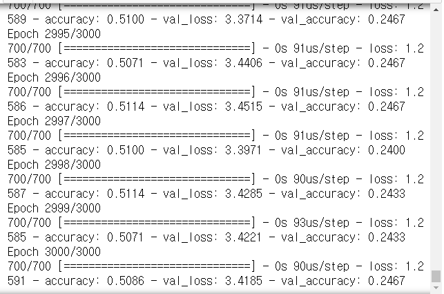

- 시각화

```python
import matplotlib.pyplot as plt

figs, loss_ax = plt.subplots()
acc_ax = loss_ax.twinx()
loss_ax.plot(hist.history['loss'], 'y', label='train loss')
loss_ax.plot(hist.history['val_loss'], 'r', label='val loss')

acc_ax.plot(hist.history['accuracy'], 'b', label='train acc')
acc_ax.plot(hist.history['val_accuracy'], 'g', label='val acc')

acc_ax.set_ylabel('accuracy')

loss_ax.legend(loc='upper left')
acc_ax.legend(loc='lower left')
loss_ax.set_xlabel('epoch')
loss_ax.set_ylabel('loss')
plt.show()
```

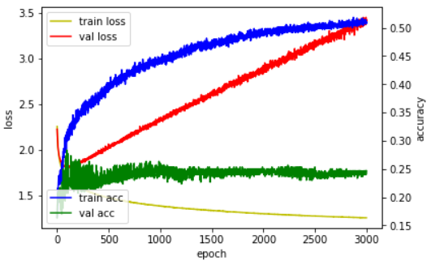

- 예측

```python
res = model.evaluate(xTest, yTest, batch_size=32)
print('cost : ' + str(res[0]))
print('accuracy : ' + str(res[1]))
# > 10000/10000 [==============================] - 0s 16us/step
# > cost : 3.706244239425659
# > accuracy : 0.2597000002861023
```

### earlystopping

- 조기 종료 : earlystopping
- callback(함수) : 어떤 상황이 되었을 때(val loss가 떨어지다가 올라가는 시작하는 시점), 함수 내에서 또 다른 어떤 함수를 호출하는 것

- defalut로 할 경우

```python
from keras.callbacks import EarlyStopping

model = Sequential()
model.add(Dense(input_dim=28*28, units=2, activation='relu'))
model.add(Dense(units=10, activation='softmax'))

model.compile(loss='categorical_crossentropy', optimizer='sgd', metrics=['accuracy'])

es = EarlyStopping()

hist = model.fit(xtrain, ytrain, epochs=3000, batch_size=10, validation_data=(xval, yval), callbacks=[es])
```

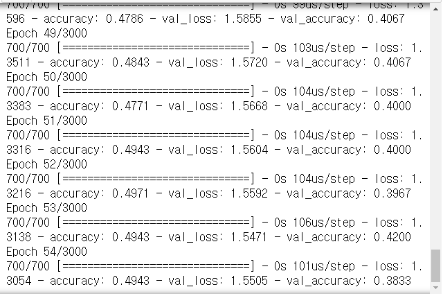

```python
figs, loss_ax = plt.subplots()
acc_ax = loss_ax.twinx()
loss_ax.plot(hist.history['loss'], 'y', label='train loss')
loss_ax.plot(hist.history['val_loss'], 'r', label='val loss')

acc_ax.plot(hist.history['accuracy'], 'b', label='train acc')
acc_ax.plot(hist.history['val_accuracy'], 'g', label='val acc')

acc_ax.set_ylabel('accuracy')

loss_ax.legend(loc='upper left')
acc_ax.legend(loc='lower left')
loss_ax.set_xlabel('epoch')
loss_ax.set_ylabel('loss')
plt.show()
```

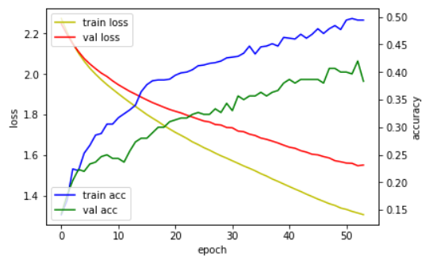

```python
res = model.evaluate(xTest, yTest, batch_size=10)
print(res)
# > 10000/10000 [==============================] - 0s 45us/step
# > [1.43065049046278, 0.43720000982284546]
```

- 최소 epoch 횟수를 지정해 줄 경우

```python
model = Sequential()
model.add(Dense(input_dim=28*28, units=2, activation='relu'))
model.add(Dense(units=10, activation='softmax'))

model.compile(loss='categorical_crossentropy', optimizer='sgd', metrics=['accuracy'])

es = EarlyStopping(patience=30) # 최소 epoch 횟수
hist = model.fit(xtrain, ytrain, epochs=3000, batch_size=10, validation_data=(xval, yval), callbacks=[es])
```

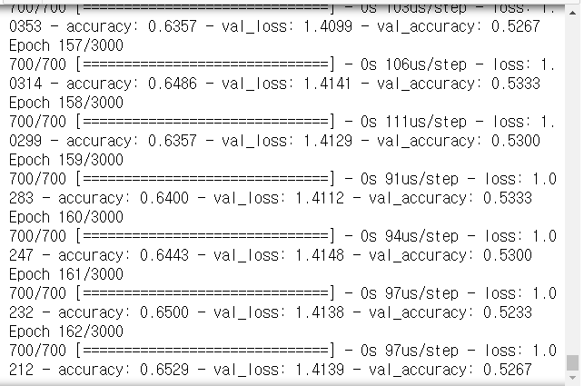

```python
figs, loss_ax = plt.subplots()
acc_ax = loss_ax.twinx()
loss_ax.plot(hist.history['loss'], 'y', label='train loss')
loss_ax.plot(hist.history['val_loss'], 'r', label='val loss')

acc_ax.plot(hist.history['accuracy'], 'b', label='train acc')
acc_ax.plot(hist.history['val_accuracy'], 'g', label='val acc')

acc_ax.set_ylabel('accuracy')

loss_ax.legend(loc='upper left')
acc_ax.legend(loc='lower left')
loss_ax.set_xlabel('epoch')
loss_ax.set_ylabel('loss')
plt.show()
```

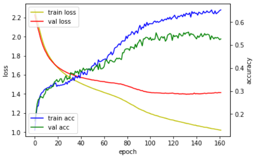

```python
res = model.evaluate(xTest, yTest, batch_size=10)
print(res)
# > 10000/10000 [==============================] - 0s 47us/step
# > [1.3751712386012078, 0.5180000066757202]
```

## Keras 실습

### ThoraricSurgery.csv

```python
import tensorflow as tf

seed = 123
np.random.seed(seed)
tf.set_random_seed(seed)

path_thoraric = '../data_for_analysis/dataset_1/'
dataset = np.loadtxt(path_thoraric + 'ThoraricSurgery.csv', delimiter=',')
dataset
# > array([[293.  ,   1.  ,   3.8 , ...,   0.  ,  62.  ,   0.  ],
# >        [  1.  ,   2.  ,   2.88, ...,   0.  ,  60.  ,   0.  ],
# >        [  8.  ,   2.  ,   3.19, ...,   0.  ,  66.  ,   1.  ],
# >        ...,
# >        [406.  ,   6.  ,   5.36, ...,   0.  ,  62.  ,   0.  ],
# >        [ 25.  ,   8.  ,   4.32, ...,   0.  ,  58.  ,   1.  ],
# >        [447.  ,   8.  ,   5.2 , ...,   0.  ,  49.  ,   0.  ]])

dataset.shape
# > (470, 18)

x = dataset[:, 0:17]
y = dataset[:, 17] # 수술 후 생존(1), 사망(0)
```

- keras 적용

```python
model = Sequential()
model.add(Dense(30, input_dim=17, activation='relu'))
model.add(Dense(1, activation='sigmoid'))

model.compile(loss='mean_squared_error', optimizer='adam', metrics=['accuracy'])

model.fit(x, y, epochs=30, batch_size=10)
```

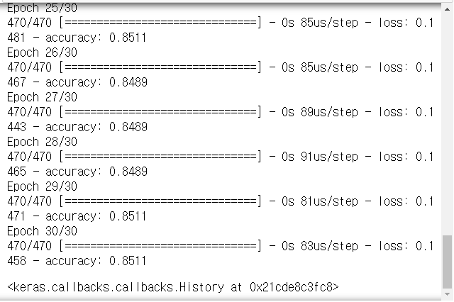

```python
print(model.evaluate(x, y)[1])
# > 470/470 [==============================] - 0s 109us/step
# > 0.8531914949417114
```

> accuracy rate : 0.85
>
> => data에 0이 많아서 모두 0으로 추정하면 위와 비슷한 결과가 나온다. 따라서 수정 필요

### data-03-diabetes.csv

```python
path_simul = '../data_for_analysis/실습데이터/'
xy = np.loadtxt(path_simul + 'data-03-diabetes.csv', delimiter=',')
xy
# > array([[-0.294118 ,  0.487437 ,  0.180328 , ..., -0.53117  , -0.0333333,
# >          0.       ],
# >        [-0.882353 , -0.145729 ,  0.0819672, ..., -0.766866 , -0.666667 ,
# >          1.       ],
# >        [-0.0588235,  0.839196 ,  0.0491803, ..., -0.492741 , -0.633333 ,
# >          0.       ],
# >        ...,
# >        [-0.411765 ,  0.21608  ,  0.180328 , ..., -0.857387 , -0.7      ,
# >          1.       ],
# >        [-0.882353 ,  0.266332 , -0.0163934, ..., -0.768574 , -0.133333 ,
# >          0.       ],
# >        [-0.882353 , -0.0653266,  0.147541 , ..., -0.797609 , -0.933333 ,
# >          1.       ]])

xdata = xy[:, 0:-1]
xdata
# > array([[-0.294118  ,  0.487437  ,  0.180328  , ...,  0.00149028,
# >         -0.53117   , -0.0333333 ],
# >        [-0.882353  , -0.145729  ,  0.0819672 , ..., -0.207153  ,
# >         -0.766866  , -0.666667  ],
# >        [-0.0588235 ,  0.839196  ,  0.0491803 , ..., -0.305514  ,
# >         -0.492741  , -0.633333  ],
# >        ...,
# >        [-0.411765  ,  0.21608   ,  0.180328  , ..., -0.219076  ,
# >         -0.857387  , -0.7       ],
# >        [-0.882353  ,  0.266332  , -0.0163934 , ..., -0.102832  ,
# >         -0.768574  , -0.133333  ],
# >        [-0.882353  , -0.0653266 ,  0.147541  , ..., -0.0938897 ,
# >         -0.797609  , -0.933333  ]])

ydata = xy[:,[-1]]
ydata
```

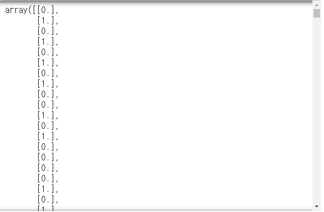

> xdata가 2차원 array이므로, ydata 또한 2차원 array로 생성

```python
print(xdata.shape, ydata.shape)
# > (759, 8) (759, 1)
```

- tensorflow로 모델 생성

```python
w = tf.Variable(tf.random_normal([8, 1]))
b = tf.Variable(tf.random_normal([1]))
x = tf.placeholder(tf.float32, shape=[None, 8])
y = tf.placeholder(tf.float32, shape=[None, 1])

hf = tf.sigmoid(tf.matmul(x ,w) + b)
cost = -tf.reduce_mean(y*tf.log(hf) + (1-y)*tf.log(1-hf))

train = tf.train.GradientDescentOptimizer(0.01).minimize(cost)

predicted = tf.cast(hf > 0.5, dtype=tf.float32)
accuracy = tf.reduce_mean(tf.cast(tf.equal(predicted, y), dtype=tf.float32))
```

- 모델 적용

```python
with tf.Session() as sess :
    sess.run(tf.global_variables_initializer())
    for step in range(10001) :
        cv, _ = sess.run([cost, train], feed_dict={x:xdata, y:ydata})
        if step%200 == 0 :
            print(step, cv)
    hv, pv, av = sess.run([hf, predicted, accuracy], feed_dict={x:xdata, y:ydata})
    print(hv, pv, av)
```

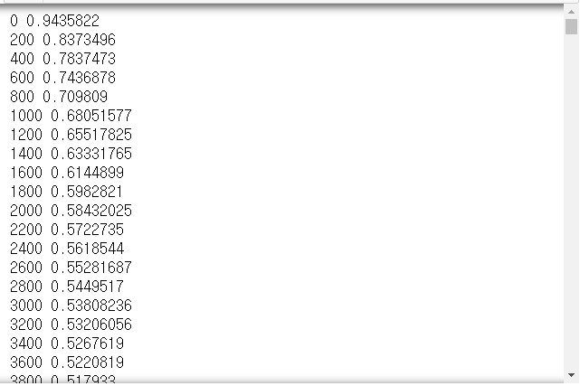

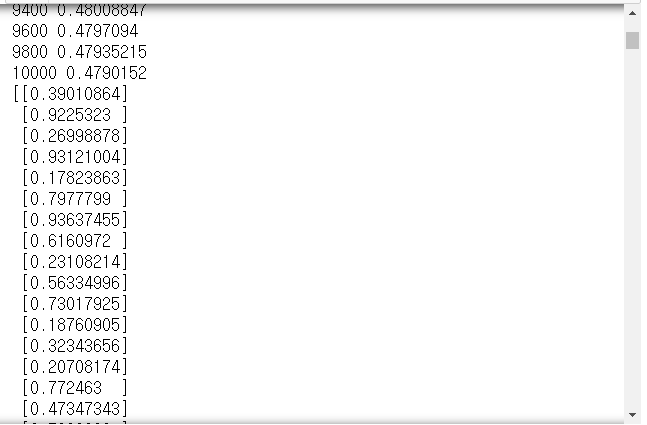

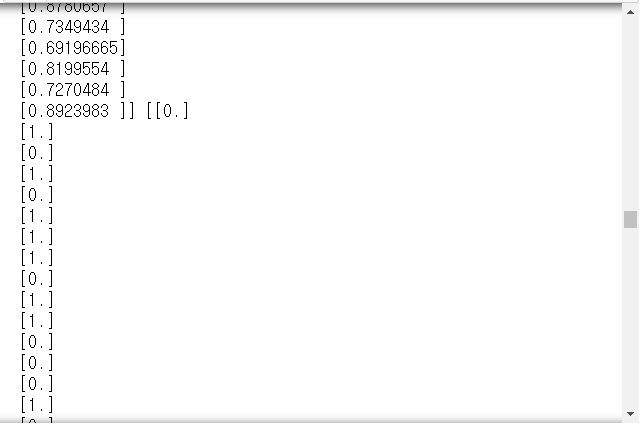

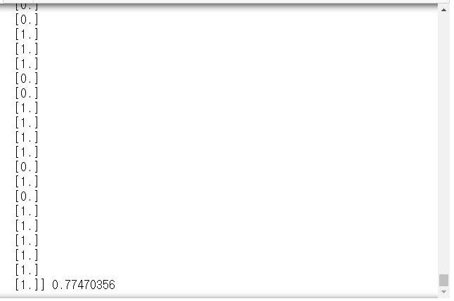

# 연습문제

1. 주식 데이터
   - 관심있는 종목 데이터 다운로드
   - 제공되는 데이터(약 3년)
   - 4개의 입력변수 -> 1개의 출력변수(close)
   - 데이터를 트레이닝(70)/테스트(30) 데이터로 분리
   - 최근 1개월 데이터로 테스트
2. tree.csv 파일로 예측
   - Girth, Height => Volume 예측

## 1.

- [인베스팅닷컴_NAVER](https://kr.investing.com/equities/nhn-corp-historical-data) 데이터 사용

```python
import pandas as pd
path = '../data_for_analysis/'
naver = pd.read_csv(path + 'NAVERstock.csv', encoding='ansi',
                    date_parser='Date')
naver
```

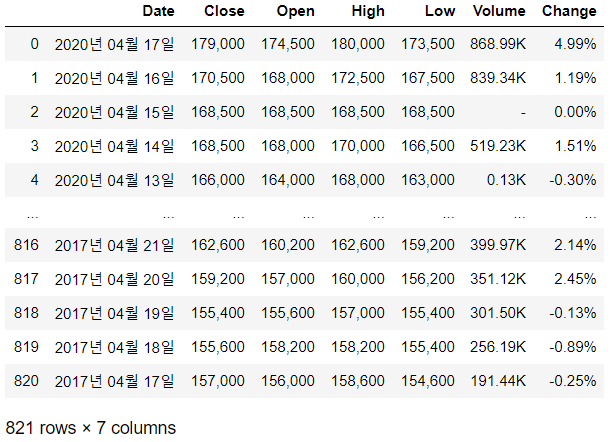

```python
for col in ['Close', 'Open', 'High', 'Low'] :
    naver[col] = naver[col].str.replace(',', '').astype('int64')

naver.Change = naver.Change.str.replace('%', '').astype('float64')

for i in range(len(naver.Volume)) :
    v = naver.Volume[i]
    if v == '-' :
        v = 0
    elif 'K' in v :
        v = int(float(v.replace('K', ''))*1000)
    elif 'M' in v :
        v = int(float(v.replace('M', ''))*10000)
    naver.Volume[i] = v

naver
```

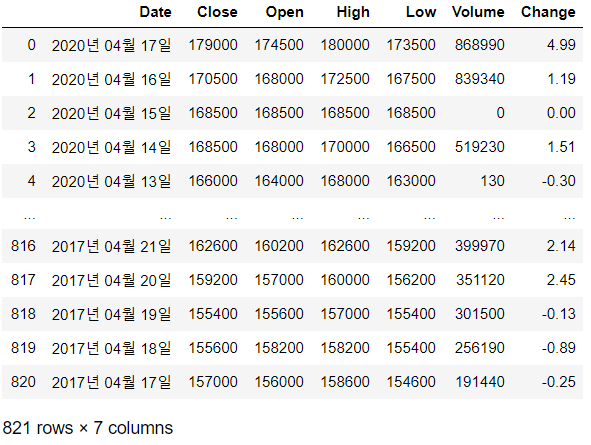

```python
naver = naver.sort_values(by='Date').reset_index(drop=True)
naver
```

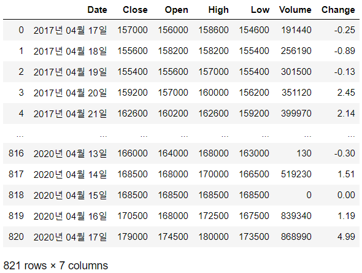

```python
finalTest = naver[-27:]
finalTest
```

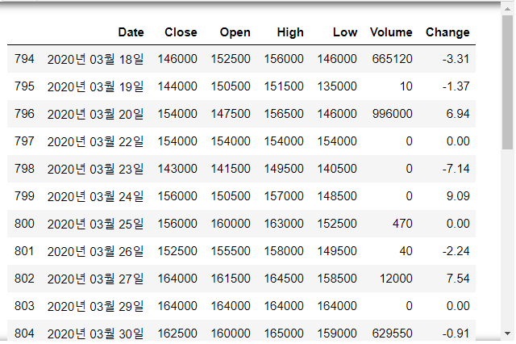

```python
print(naver.shape, finalTest.shape)
# > (821, 7) (27, 7)

train = naver[:555]
test = naver[555:-27]
train
```

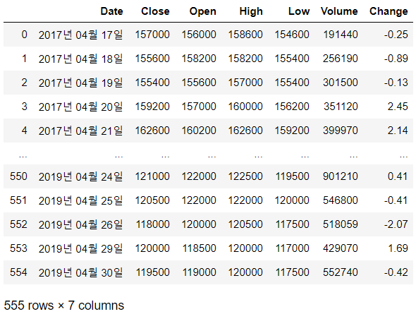

```python
test
```

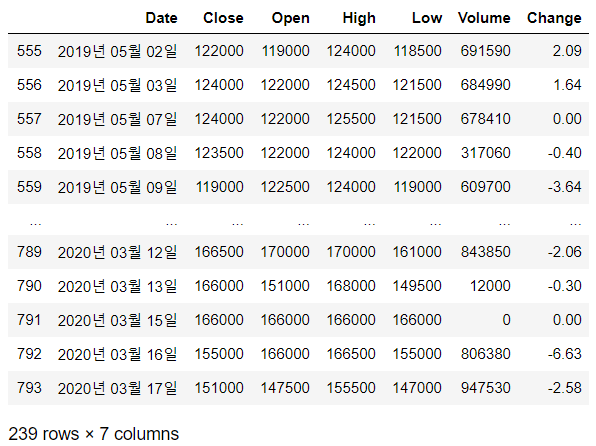

```python
trainX = train[['Open', 'High', 'Low', 'Volume']].values
trainY = train[['Close']].values
trainX
# > array([[156000, 158600, 154600, 191440],
# >        [158200, 158200, 155400, 256190],
# >        [155600, 157000, 155400, 301500],
# >        ...,
# >        [120000, 120500, 117500, 518059],
# >        [118500, 120000, 117000, 429070],
# >        [119000, 120000, 117500, 552740]], dtype=object)

trainY
```

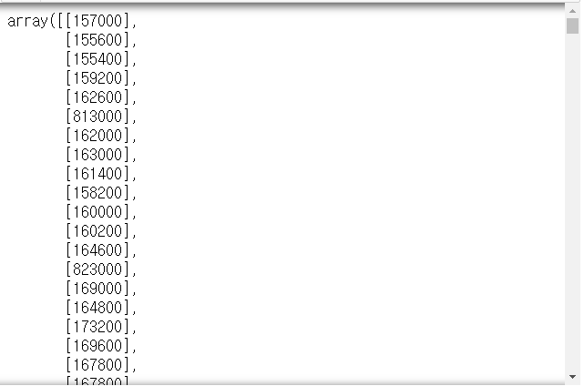

```python
testX = test[['Open', 'High', 'Low', 'Volume']].values
testY = test[['Close']].values

print(trainX.shape, trainY.shape)
# > (555, 4) (555, 1)
```

```python
w = tf.Variable(tf.random_normal([4, 1], mean=0.01, stddev=0.01))
b = tf.Variable(tf.random_normal([1], mean=0.01, stddev=0.01))
x = tf.placeholder(tf.float32, shape=[None, 4])
y = tf.placeholder(tf.float32, shape=[None, 1])

hf = tf.reduce_mean(tf.matmul(x, w) + b)
cost = tf.reduce_mean(tf.square(hf - y))

train_model = tf.train.GradientDescentOptimizer(1e-10).minimize(cost)
```

```python
with tf.Session() as sess :
    sess.run(tf.global_variables_initializer())
    for step in range(10) :
        cv, _ = sess.run([cost, train_model], feed_dict={x:trainX, y:trainY})
        print(step, cv)
# > 0 80763765000.0
# > 1 138409340000000.0
# > 2 4.5571833e+17
# > 3 1.500891e+21
# > 4 4.9431256e+24
# > 5 1.6279998e+28
# > 6 5.3617553e+31
# > 7 1.7658751e+35
# > 8 inf
# > 9 inf
```

>  추후에 scale과 코드 수정을 통하여 보완 필요

