# Day64 미니프로젝트

# 미니프로젝트

1. 독버섯/식용버섯 분류기
    - [UCI-Mushroom](https://archive.ics.uci.edu/ml/datasets/Mushroom) 의 agaricus-lepiota.data
    - binary classification(logistic, knn 성능 비교) 
    - 데이터 전처리
    - 트레이닝/테스트(70:30)
    - 상관분석 (시각화)

2. 아파트 관리비 분석
    1. 관리비 구성
        - 공용관리비=일반관리비+청소비+경비비+소독비+승강기유지비+수선유지비
        - 일반관리비=인건비+제세공과금
        - 제세공과금=통신료+제세공과금등
    2. 공용관리비 항목에 대해 아래와 같은 분석을 실시하시오.
        1. 일반관리비, 청소비, 경비비, 소독비, 승강기유지비, 수선유지비 각 항목에 대해 공용관리비에서 차지하는 비중의 변화가 어떠한지 연도별로 분석하시오.(시각화)
        2. 공용관리비를 줄이고자 한다고 가정했을때, 일반관리비, 청소비, 경비비, 소독비, 승강기유지비, 수선유지비 항목중 증가되는 비율이 가장 높은 항목(비용을 줄여야 하는 항목)은 무엇인가?(시각화)
        3. 특정 연도에  과다 청구된 해가 있는지 조사하시오.(시각화)
    3. 일반관리비 항목에 대해 아래와 같은 분석을 실시하시오.
        1. 인건비, 제사무비, 제세공과금, 피복비, 교육훈련비, 차량유지비, 그밖의부대비용 각 항목에 대해 일반관리비에서 차지하는 비중의 변화가 어떠한지 연도별로 분석하시오.(시각화)
        2. 특정 연도에  과다 청구된 해가 있는지 조사하시오.(시각화)

## 1. 독버섯/식용버섯 분류기

- 데이터 불러오기

  ```python
  import pandas as pd
  path = '../data_for_analysis/'
  mushroom = pd.read_csv(path + 'agaricus-lepiota.data', header=None)
  mushroom.head()
  ```

  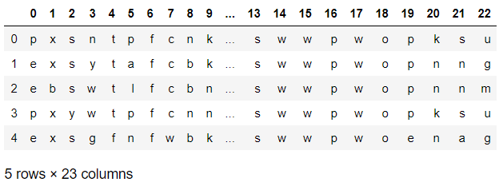

### 데이터 전처리

- mushroom data의 열 이름 바꾸기

  ```python
  mushroom.columns = [
      'class', 'cap-shape', 'cap-surface', 'cap-color',
      'bruises', 'odor', 
      'gill-attachment', 'gill-spacing', 'gill-size', 'gill-color', 
      'stalk-shape', 'stalk-root', 'stalk-surface-above-ring',
      'stalk-surface-below-ring', 'stalk-color-above-ring',
      'stalk-color-below-ring', 
      'veil-type', 'veil-color', 
      'ring-number', 'ring-type', 
      'spore-print-color', 'population', 'habitat']
  mushroom.head()
  ```

  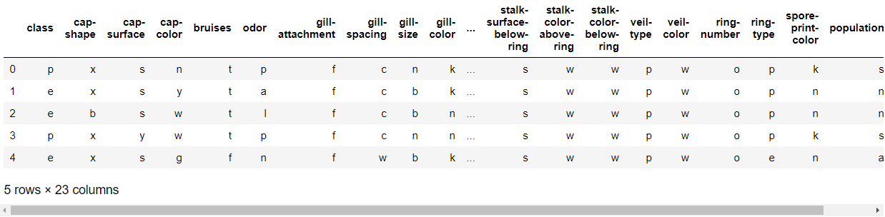

- 결측치 확인

  ```python
  mushroom.isnull().sum()
  # > class                       0
  # > cap-shape                   0
  # > cap-surface                 0
  # > cap-color                   0
  # > bruises                     0
  # > odor                        0
  # > gill-attachment             0
  # > gill-spacing                0
  # > gill-size                   0
  # > gill-color                  0
  # > stalk-shape                 0
  # > stalk-root                  0
  # > stalk-surface-above-ring    0
  # > stalk-surface-below-ring    0
  # > stalk-color-above-ring      0
  # > stalk-color-below-ring      0
  # > veil-type                   0
  # > veil-color                  0
  # > ring-number                 0
  # > ring-type                   0
  # > spore-print-color           0
  # > population                  0
  # > habitat                     0
  # > dtype: int64
  ```

- 각 변수별 level 확인

  ```python
  for col in mushroom.columns :
      print(col, mushroom[col].unique())
  # > class ['p' 'e']
  # > cap-shape ['x' 'b' 's' 'f' 'k' 'c']
  # > cap-surface ['s' 'y' 'f' 'g']
  # > cap-color ['n' 'y' 'w' 'g' 'e' 'p' 'b' 'u' 'c' 'r']
  # > bruises ['t' 'f']
  # > odor ['p' 'a' 'l' 'n' 'f' 'c' 'y' 's' 'm']
  # > gill-attachment ['f' 'a']
  # > gill-spacing ['c' 'w']
  # > gill-size ['n' 'b']
  # > gill-color ['k' 'n' 'g' 'p' 'w' 'h' 'u' 'e' 'b' 'r' 'y' 'o']
  # > stalk-shape ['e' 't']
  # > stalk-root ['e' 'c' 'b' 'r' '?']
  # > stalk-surface-above-ring ['s' 'f' 'k' 'y']
  # > stalk-surface-below-ring ['s' 'f' 'y' 'k']
  # > stalk-color-above-ring ['w' 'g' 'p' 'n' 'b' 'e' 'o' 'c' 'y']
  # > stalk-color-below-ring ['w' 'p' 'g' 'b' 'n' 'e' 'y' 'o' 'c']
  # > veil-type ['p']
  # > veil-color ['w' 'n' 'o' 'y']
  # > ring-number ['o' 't' 'n']
  # > ring-type ['p' 'e' 'l' 'f' 'n']
  # > spore-print-color ['k' 'n' 'u' 'h' 'w' 'r' 'o' 'y' 'b']
  # > population ['s' 'n' 'a' 'v' 'y' 'c']
  # > habitat ['u' 'g' 'm' 'd' 'p' 'w' 'l']
  ```

- veil-type은 하나의 값만 가지므로 무의미한 변수로 고려하여 제거

  ```python
  mushroom = mushroom.drop('veil-type', axis=1)
  mushroom.head()
  ```

  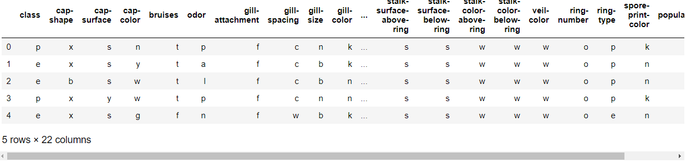

- pd.get_dummies를 이용한 가변수 생성

  ```python
  mushroom_adj = pd.DataFrame()
  for col in mushroom.columns :
      tmp = pd.get_dummies(mushroom[col], prefix=col, 
                           drop_first=True) # 가변수 함정을 피하기 위하여
      mushroom_adj = pd.concat([mushroom_adj, tmp], axis=1)
  mushroom_adj.head()
  ```

  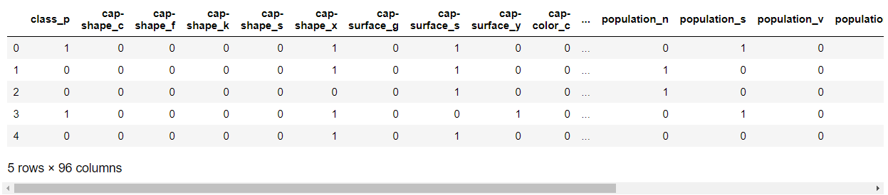

  

### 상관분석 & 시각화

```python
import matplotlib.pyplot as plt
import seaborn as sns

plt.figure(figsize=(50,50))
sns.heatmap(data=mushroom_adj.corr(), annot=True, 
            fmt='.2f', linewidths=0.5, cmap='Blues')
```

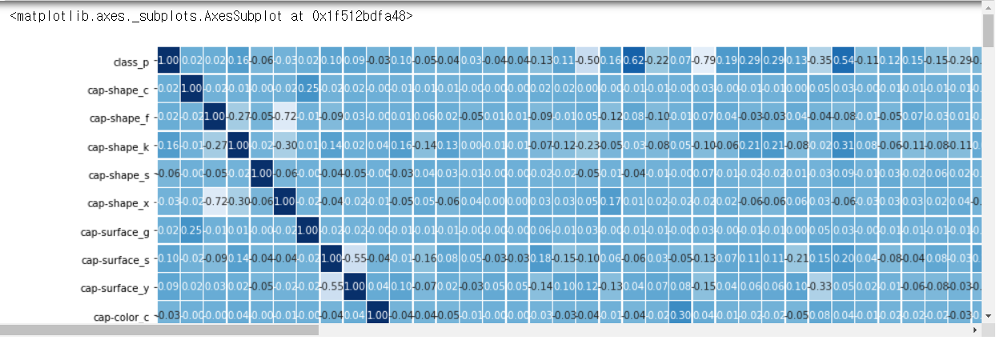

### binary classification(logistic, knn 성능 비교)

```python
from sklearn.model_selection import train_test_split
from sklearn.linear_model import LogisticRegression
from sklearn.neighbors import KNeighborsClassifier
```

- 데이터 분할

  ```python
  trainX, testX, trainY, testY = train_test_split(
      mushroom_adj.drop('class_p', axis=1), mushroom_adj[['class_p']], 
      test_size=0.3, shuffle=True, random_state=1234)
  ```

- logistic regression

  ```python
  lr_model = LogisticRegression()
  lr_model.fit(trainX, trainY)
  print('훈련 데이터 정확도 :', lr_model.score(trainX, trainY))
  print('테스트 데이터 정확도 :', lr_model.score(testX, testY))
  # > 훈련 데이터 정확도 : 0.9998241294407316
  # > 테스트 데이터 정확도 : 0.9987694831829368
  ```

  ```python
  lr_model.coef_
  # > array([[ 0.53770113,  0.09521794, -0.05767318, -0.4754103 , -0.15864564,
  # >          1.29899313,  0.59350728,  0.36969236, -0.76917598,  0.13479117,
  # >         -0.05001717, -0.42210203,  0.71047345, -0.4657314 , -0.4245519 ,
  # >          0.17849546, -0.498039  , -0.61068726,  3.25222902,  2.90105993,
  # >         -1.48047015,  0.24806345, -4.07917143,  2.93766764,  1.31501313,
  # >          1.2700798 ,  0.33754029, -2.84172957,  3.16493665, -0.59184901,
  # >         -0.07829956, -0.01420634, -0.53855241, -0.80305818, -0.16254915,
  # >         -0.64324256,  0.65175774, -0.28199015, -0.53084912,  0.13036052,
  # >         -0.90777371,  2.2013976 , -1.38982423,  0.84672377, -1.32441426,
  # >          1.624914  , -0.73281323,  0.43927495,  0.65591186,  0.15660598,
  # >          1.42200498,  0.24806345, -0.52582947, -0.36195971, -0.10983703,
  # >         -0.49687053,  0.37963004, -0.15222603,  0.78167687,  0.24806345,
  # >         -0.41164456, -0.32052222, -0.99476721, -0.49687053,  0.53159527,
  # >          0.18117638,  1.10103903, -0.22211675, -0.30824759,  0.78167687,
  # >         -0.11357455, -0.15793015, -1.82399745,  0.58474482,  0.24806345,
  # >         -0.56061065,  0.82311844, -1.5326475 , -1.93317287, -0.13297003,
  # >          4.06974957, -1.89512493,  0.91299589, -0.1579876 ,  1.3900925 ,
  # >         -0.9620728 ,  0.29717859,  0.49224461, -1.18463162,  0.66162659,
  # >          0.21544815,  0.7943693 , -0.20979663,  0.61291966, -1.27043237]])
  ```

  

- knn

  ```python
  knn_model = KNeighborsClassifier(n_neighbors=5)
  knn_model.fit(trainX, trainY)
  print('훈련 데이터 정확도 :', knn_model.score(trainX, trainY))
  print('테스트 데이터 정확도 :', knn_model.score(testX, testY))
  # > 훈련 데이터 정확도 : 1.0
  # > 테스트 데이터 정확도 : 1.0
  ```

## 2. 아파트 관리비 분석

```python
import pandas as pd

path_apar = '../data_for_analysis/아파트관리비분석용 데이터셋/'
management = pd.DataFrame()
for year in range(2012, 2020) :
    tmp = pd.read_excel(path_apar + str(year) + '년.xls')
    management = pd.concat([management, tmp.합계], axis=1)

management.index = tmp.분류
management.columns = range(2012, 2020)
management
```

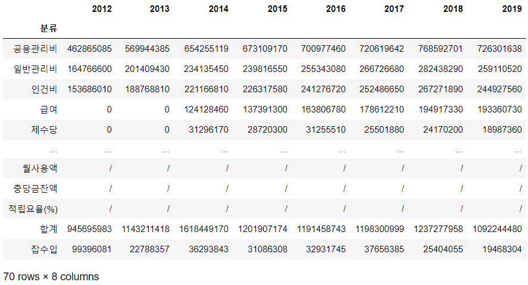

- 공용관리비, 일반관리비로 데이터 분리

  ```python
  commonList = ['일반관리비', '청소비', '경비비', '소독비',
                '승강기유지비', '수선유지비']
  common = management.loc[commonList]
  common = common.astype('int64')
  common
  ```

  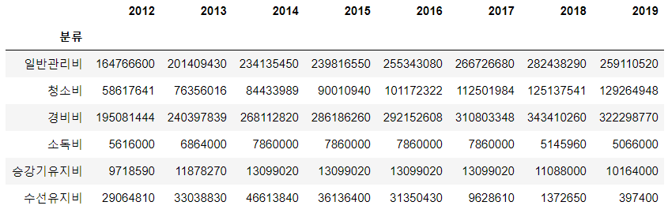

  ```python
  generalList = ['인건비', '제사무비', '제세공과금', '피복비', 
                 '교육훈련비', '차량유지비', '그밖의부대비용']
  general = management.loc[generalList]
  general = general.astype('int64')
  general
  ```

  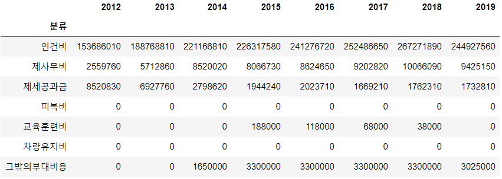

### 공용관리비 항목에 대한 분석

```python
import matplotlib.pyplot as plt

# 한글깨짐 방지
import matplotlib
from matplotlib import font_manager, rc
import platform
if platform.system()=='Windows':
    font_name=font_manager.FontProperties(fname='c:/Windows/Fonts/malgun.ttf').get_name()
    rc('font', family=font_name)
matplotlib.rcParams['axes.unicode_minus']=False

import warnings
warnings.filterwarnings('ignore')
```

- 일반관리비, 청소비, 경비비, 소독비, 승강기유지비, 수선유지비 각 항목에 대해 공용관리비에서 차지하는 비중의 변화가 어떠한지 연도별로 분석

  ```python
  common_prop = common / common.sum()
  common_prop
  ```

  

  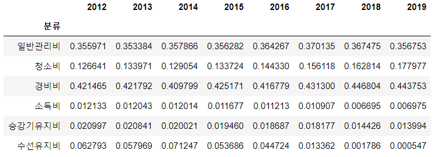

  ```python
  plt.figure(figsize=(25, 20))
  common_prop.T.plot()
  plt.legend(loc='center right', 
             bbox_to_anchor=(1.2, 0.5), 
             fontsize=10,
             bbox_transform=plt.gcf().transFigure)
  ```

  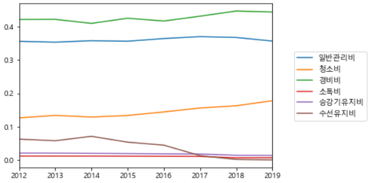

  > 연도가 지남에 따라 일반관리비의 경우 조금 늘었다가 최근에는 다시 줄어들고 있다.
  >
  > 청소비는 비중이 점점 늘어가고 있다.
  >
  > 경비비는 증가와 감소를 반복하지만 최근의 경우 늘어나고 있다.
  >
  > 소독비와 승강기 유지비는 변화없이 유지되고 있다.
  >
  > 수선유지비는 후반으로 갈수록 비중이 줄어들고 있고, 최근에는 소독비보다 적은 비중을 차지한다.

  

  - 공용관리비를 줄이고자 한다고 가정했을때, 일반관리비, 청소비, 경비비, 소독비, 승강기유지비, 수선유지비 항목중 증가되는 비율이 가장 높은 항목(비용을 줄여야 하는 항목)은 무엇인가?

    ```python
    common_change = pd.DataFrame()
    for year in range(2013, 2020) :
        tmp = (common[year] - common[year-1])/common[year-1]
        common_change = pd.concat([common_change, tmp], axis=1)
    common_change.columns = range(2013, 2020)
    common_change
    ```

    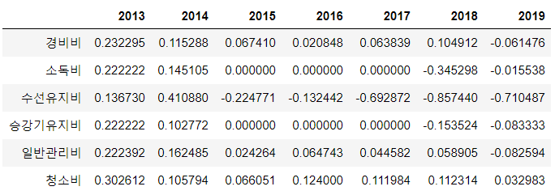

    ```python
    plt.figure(figsize=(25, 20))
    common_change.T.plot()
    plt.legend(loc='center right', 
               bbox_to_anchor=(1.2, 0.5), 
               fontsize=10,
               bbox_transform=plt.gcf().transFigure)
    ```

    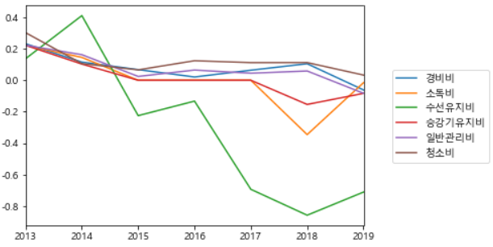

    > 전년대비 변화율을 구한 결과로 그린 그래프를 보면,
    >
    > 경비비와 일반관리비, 청소비가 양수인 값들이 다른 비용에비해 많이 존재하므로 이를 줄일 항목으로 고려할 수 있다.

  - 특정 연도에  과다 청구된 해가 있는지 조사하시오.

    ```python
    plt.figure(figsize=(25, 20))
    common.T.plot()
    plt.legend(loc='center right', 
               bbox_to_anchor=(1.2, 0.5), 
               fontsize=10,
               bbox_transform=plt.gcf().transFigure)
    ```

    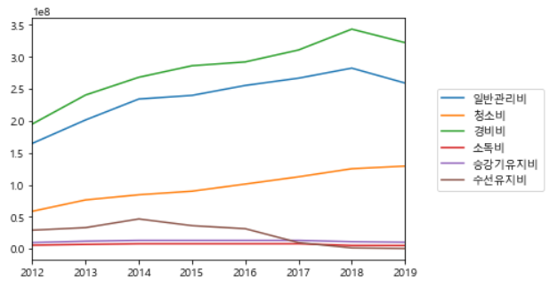

    > 일반관리비와 경비비의 최고점이 2018년도이므로 2018년이 그나마 과다 청구된 해라고 고려할 수 있다.

### 일반관리비 항목에 대한 분석

- 인건비, 제사무비, 제세공과금, 피복비, 교육훈련비, 차량유지비, 그밖의부대비용 각 항목에 대해 일반관리비에서 차지하는 비중의 변화가 어떠한지 연도별로 분석하시오.

  ```python
  general_prop = general / general.sum()
  general_prop
  ```

  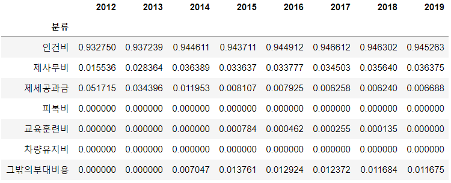

  ```python
  plt.figure(figsize=(25, 20))
  general_prop.T.plot()
  plt.legend(loc='center right', 
             bbox_to_anchor=(1.2, 0.5), 
             fontsize=10,
             bbox_transform=plt.gcf().transFigure)
  ```
  
  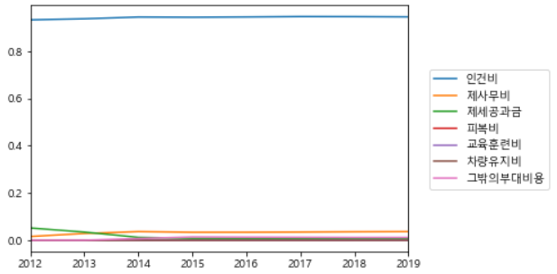

- 특정 연도에  과다 청구된 해가 있는지 조사하시오.

  ```python
  plt.figure(figsize=(25, 20))
  general.T.plot()
  plt.legend(loc='center right', 
             bbox_to_anchor=(1.2, 0.5), 
             fontsize=10,
             bbox_transform=plt.gcf().transFigure)
  ```

  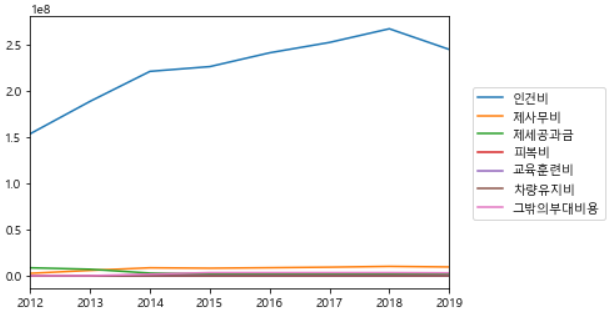

  ```python
  plt.figure(figsize=(25, 20))
  general.drop('인건비').T.plot()
  plt.legend(loc='center right', 
             bbox_to_anchor=(1.2, 0.5), 
             fontsize=10,
             bbox_transform=plt.gcf().transFigure)
  ```

  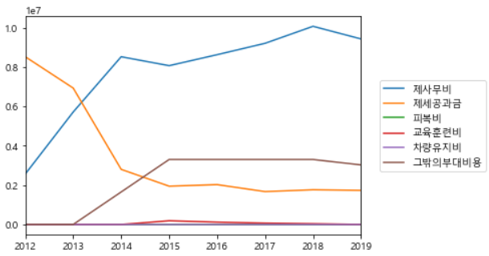

  > 인건비의 경우 시간에 지남에 따라 시급이 올라가므로 제외를 하고, 다른 항목들을 살펴보면
  >
  > 제사무비는 2015년과 2019년에 전년도보다 감소한 것으로 보아 2014년과 2018년에 과다 지출을 하였다고 생각해볼 수 있다.
  >
  > 나머지 변수의 경우 감소 혹은 유지되고 있는 상태라서 과다청구가 되고있다고 생각되지 않는다.

