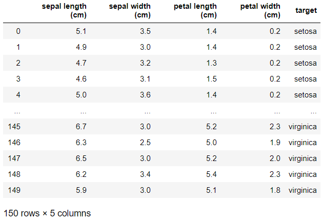
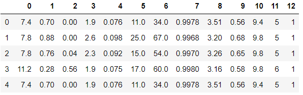

# Day65 TensorFlow와 Keras 라이브러리를 활용한 딥러닝(4)

## 선형회귀

```python
import numpy as np

x = [2, 4, 6, 8]
y = [81, 93, 91, 97]

# x와 y의 평균값
mx = np.mean(x)
my = np.mean(y)

# 기울기 공식의 분모
divisor = sum([(mx - i)**2 for i in x])
divisor
# > 20.0

# 기울기 공식의 분자
def top(x, mx, y, my):
    d = 0
    for i in range(len(x)) :
        d += (x[i] - mx)*(y[i] - my)
    return d

dividend = top(x, my, y, my)

print('분모 :', divisor)
print('분자 :', dividend)
# > 분모 : 20.0
# > 분자 : 46.0

# w:직선의 기울기 = y값의 증가량 / x값의 증가량
w = dividend / divisor
w
# > 2.3

b = my - (mx*w)
b
# > 79.0
```

> 추정식 : y = 2.3x +79

### RMSE 구하기

```python
wb = [2.3, 79] # 기울기, y 절편
data = [[2, 81], [4, 93], [6, 91], [8, 97]]
# 공부한시간=2, 실제점수=81, 예측점수=83.6
# ...
# 공부한시간=8, 실제점수=97, 예측점수=97.4
# rmse

x = [i[0] for i in data]
y = [i[1] for i in data]

yhat = [wb[0]*x_i + wb[1] for x_i in x]
yhat
# > [83.6, 88.2, 92.8, 97.4]

for i in range(len(x)) :
    print('공부시간=%.f, 실점수=%.f, 예측점수=%.f' %(x[i], y[i], yhat[i]))
# > 공부시간=2, 실점수=81, 예측점수=84
# > 공부시간=4, 실점수=93, 예측점수=88
# > 공부시간=6, 실점수=91, 예측점수=93
# > 공부시간=8, 실점수=97, 예측점수=97

se = list()
for i in range(len(y)) :
    se.append((yhat[i] - y[i])**2)
se
# > [6.7599999999999705,
# >  23.039999999999974,
# >  3.2399999999999896,
# >  0.16000000000000456]

rmse = np.sqrt(np.mean(se))
rmse
# > 2.880972058177584
```

### TensorFlow 이용

```python
import tensorflow as tf

# 기울기 범위:0~10, y절편:0~100
w = tf.Variable(tf.random_normal([1], 0, 10, dtype=tf.float32, seed=0))
b = tf.Variable(tf.random_normal([1], 0, 100, dtype=tf.float32, seed=0))

hf = w*x + b
rmse = tf.sqrt(tf.reduce_mean(tf.square(hf - y)))
lr = 0.1

train = tf.train.GradientDescentOptimizer(lr).minimize(rmse)

with tf.Session() as sess :
    sess.run(tf.global_variables_initializer())
    for step in range(5001) :
        sess.run(train)
        if step%500 == 0 :
            print('RMSE=%.4f, 기울기=%.4f, y절편=%.4f' %(sess.run(rmse), sess.run(w), sess.run(b)))
# > RMSE=148.2724, 기울기=-3.4730, y절편=-39.8162
# > RMSE=39.1741, 기울기=18.3349, y절편=-16.6897
# > RMSE=31.1224, 기울기=15.0189, y절편=3.0989
# > RMSE=23.1091, 기울기=11.7108, y절편=22.8404
# > RMSE=15.1940, 기울기=8.4230, y절편=42.4604
# > RMSE=7.6713, 기울기=5.2181, y절편=61.5861
# > RMSE=3.1116, 기울기=2.7825, y절편=76.1204
# > RMSE=2.8819, 기울기=2.3299, y절편=78.8215
# > RMSE=2.8810, 기울기=2.3018, y절편=78.9894
# > RMSE=2.8810, 기울기=2.3001, y절편=78.9993
# > RMSE=2.8810, 기울기=2.3001, y절편=78.9993
```

### x변수 추가

```python
data = [[2, 0, 81], [4, 4, 93], [6, 2, 91], [8, 3, 97]]
# 공부한시간=2, 과외시간=0, 실제점수=81, 예측점수=83.6
# ...
# 공부한시간=8, 과외시간=3, 실제점수=97, 예측점수=97.4
# rmse
x = [li[0:2] for li in data]
y = [li[2] for li in data]
x
# > [[2, 0], [4, 4], [6, 2], [8, 3]]

w = tf.Variable(tf.random_normal([2, 1], 0, 10, dtype=tf.float32, seed=0))
b = tf.Variable(tf.random_normal([1], 0, 100, dtype=tf.float32, seed=0))

hf = tf.matmul(np.array(x).astype('float32'), w) + b
rmse = tf.sqrt(tf.reduce_mean(tf.square(hf - y)))
lr = 0.1

train = tf.train.GradientDescentOptimizer(lr).minimize(rmse)

with tf.Session() as sess :
    sess.run(tf.global_variables_initializer())
    for step in range(5001) :
        sess.run(train)
        if step%500 == 0 :
            tmp_w = sess.run(w)
            print('RMSE=%.4f, 기울기=%.4f %.4f, y절편=%.4f' %(sess.run(rmse), tmp_w[0], tmp_w[1] , sess.run(b)))
# > RMSE=104.2024, 기울기=-3.5250 21.2249, y절편=-39.8193
# > RMSE=45.0700, 기울기=13.4644 11.0139, y절편=-19.0881
# > RMSE=36.8128, 기울기=12.6534 5.5759, y절편=0.3716
# > RMSE=29.1167, 기울기=10.2455 3.6908, y절편=19.7417
# > RMSE=21.6234, 기울기=7.5151 2.6052, y절편=38.8734
# > RMSE=14.5722, 기울기=4.8164 1.6632, y절편=57.4297
# > RMSE=8.8487, 기울기=2.3851 0.8235, y절편=74.1239
# > RMSE=6.2887, 기울기=0.7916 0.2733, y절편=85.0647
# > RMSE=5.9241, 기울기=0.2124 0.0733, y절편=89.0418
# > RMSE=5.8969, 기울기=0.0553 0.0191, y절편=90.1201
# > RMSE=5.8950, 기울기=0.0144 0.0050, y절편=90.4012
```

## 로지스틱회귀

```python
data = [[2, 0], [4, 0], [6, 0], [8, 1], [10, 1], [12, 1], [14, 1]]
xdata = [i[0] for i in data]
ydata = [i[1] for i in data]

w = tf.Variable(tf.random_normal([1], dtype=tf.float32, seed=0))
b = tf.Variable(tf.random_normal([1], dtype=tf.float32, seed=0))

hf = 1 / (1+tf.exp(w*xdata + b))
cost = -tf.reduce_mean(np.array(ydata)*tf.log(hf) + (1-np.array(ydata)*tf.log(1-hf)))
```

## 모델 평가 방법

- 정확도
    - 데이터를 얼마나 옳게 분류하는가
- 민감도
    - 양성에 대해 얼마나 민감하는가
    - 양성을 양성에 분류할수록 높음
- 특이도
    - 음성에 대해 얼마나 민감한가
    - 음성을 음성에 분류할수록 높음
- 재현율
    - 실제 양성 중에 얼마나 양성으로 판단했는가

## softmax

```python
x_data = [[1, 2, 1, 1],
          [2, 1, 3, 2],
          [3, 1, 3, 4],
          [4, 1, 5, 5],
          [1, 7, 5, 5],
          [1, 2, 5, 6],
          [1, 6, 6, 6],
          [1, 7, 7, 7]]
y_data = [[0, 0, 1], # 원핫인코딩 된 상태
          [0, 0, 1],
          [0, 0, 1],
          [0, 1, 0],
          [0, 1, 0],
          [0, 1, 0],
          [1, 0, 0],
          [1, 0, 0]]

x = tf.placeholder('float', [None, 4])
y = tf.placeholder('float', [None, 3])
# y의 3 : 분류기의 개수(분류 결과 종류의 가지 수)

w = tf.Variable(tf.random_normal([4, 3]))
b = tf.Variable(tf.random_normal([3]))

hf = tf.nn.softmax(tf.matmul(x, w) + b)

cost = -tf.reduce_sum(y * tf.log(hf), axis=1)
opt = tf.train.GradientDescentOptimizer(0.1).minimize(cost)
```

```python
with tf.Session() as sess :
    sess.run(tf.global_variables_initializer())
    for step in range(2001) :
        _, cv = sess.run([opt, cost], feed_dict={x:x_data, y:y_data})
        if step%200 == 0 :
            print(step, cv)
# > 0 [5.8116026e+00 7.0990677e+00 1.1416086e+01 1.0654043e-03 2.6941663e-05
# >  7.9634978e-05 1.1092869e+01 1.2680240e+01]
# > 200 [4.2558622e-05 7.3424387e-01 5.5165982e+00 2.3841885e-06 9.8173308e-01
# >  0.0000000e+00 3.2350101e+00 1.7681851e+00]
# > 400 [1.1920929e-07 4.8406303e-01 3.0239763e+00 4.7683727e-07 1.3519223e-01
# >  0.0000000e+00 4.1739335e+00 1.5534995e+00]
# > 600 [0.0000000e+00 2.6306990e-04 3.6055391e-04 1.4890237e-02 1.3069888e+01
# >  1.1920929e-07 8.3446537e-07 0.0000000e+00]
# > 800 [0.0000000e+00 7.7045360e-03 1.7686646e-02 1.2040211e-05 1.5236108e-04
# >  0.0000000e+00 4.7401128e+00 6.0701627e-01]
# > 1000 [0.0000000e+00 1.2725937e-03 2.5033667e-03 1.5033421e-04 9.0183141e-03
# >  7.1525596e-07 6.9388724e-03 5.9604822e-06]
# > 1200 [0.0000000e+00 7.5666909e-04 1.0086019e-03 5.9562776e-04 5.3950385e-03
# >  3.8147045e-06 4.6950956e-03 3.8147045e-06]
# > 1400 [0.0000000e+00 6.9069868e-04 8.2186842e-04 8.4316503e-04 4.0230504e-03
# >  1.0609683e-05 3.6778648e-03 2.8610270e-06]
# > 1600 [0.0000000e+00 6.9201092e-04 7.8911916e-04 9.2907186e-04 3.2757469e-03
# >  2.2769234e-05 3.0628212e-03 2.3841885e-06]
# > 1800 [0.0000000e+00 7.0298580e-04 7.8470493e-04 9.6283999e-04 2.7895102e-03
# >  4.1843337e-05 2.6459501e-03 2.0265600e-06]
# > 2000 [0.0000000e+00 7.1366259e-04 7.8732963e-04 9.7799429e-04 2.4414039e-03
# >  6.9262998e-05 2.3478391e-03 1.6689314e-06]
```

```python
# [[1, 11, 7, 9], [1, 3, 4, 3], [1, 1, 0, 1]] -> hf 예측
test = [[1, 11, 7, 9], [1, 3, 4, 3], [1, 1, 0, 1]]
with tf.Session() as sess :
    sess.run(tf.global_variables_initializer())
    for step in range(2001) :
        _, cv = sess.run([opt, cost], feed_dict={x:x_data, y:y_data})
    res = sess.run(hf, feed_dict={x:test})
    print(res, sess.run(tf.argmax(res, 1)))
# > [[4.09549998e-12 1.00000000e+00 7.40628804e-14]
# >  [9.99893427e-01 1.06495456e-04 6.23443341e-08]
# >  [1.79815014e-36 1.04817596e-13 1.00000000e+00]] [1 0 2]
```

## 실습

### iris data

```python
from sklearn.datasets import load_iris
iris = load_iris()
iris = pd.DataFrame(np.c_[iris['data'], iris['target']], columns=iris['feature_names']+ ['target'])
iris['target'] = iris['target'].map({0:'setosa', 1:'versicolor', 2:'virginica'})
iris
```



```python
from sklearn.model_selection import train_test_split

trainX, testX, trainY, testY = train_test_split(iris.iloc[:, :4], pd.get_dummies(iris.iloc[:, 4]), test_size=0.3, shuffle=True, stratify=iris.iloc[:, 4], random_state=1234)
```

```python
x = tf.placeholder('float', [None, 4])
y = tf.placeholder('float', [None, 3])

w = tf.Variable(tf.random_normal([4, 3]))
b = tf.Variable(tf.random_normal([3]))

hf = tf.nn.softmax(tf.matmul(x, w) + b)

cost = tf.reduce_mean(tf.nn.softmax_cross_entropy_with_logits(labels=y, logits=hf))
opt = tf.train.GradientDescentOptimizer(1e-6).minimize(cost)
```

```python
with tf.Session() as sess :
    sess.run(tf.global_variables_initializer())
    for step in range(10001) :
        sess.run(opt, feed_dict={x:trainX, y:trainY})
    
    correct_prediction = tf.equal(tf.argmax(hf, 1), tf.argmax(y, 1))
    accuracy = tf.reduce_mean(tf.cast(correct_prediction, tf.float32))
    
    print('Train accuracy :', sess.run(accuracy, feed_dict={x:trainX, y:trainY}))
    print('Test accuracy :', sess.run(accuracy, feed_dict={x:testX, y:testY}))
# > Train accuracy : 0.33333334
# > Test accuracy : 0.33333334
```

```python
with tf.Session() as sess :
    sess.run(tf.global_variables_initializer())
    for step in range(100001) :
        sess.run(opt, feed_dict={x:trainX, y:trainY})
    
    correct_prediction = tf.equal(tf.argmax(hf, 1), tf.argmax(y, 1))
    accuracy = tf.reduce_mean(tf.cast(correct_prediction, tf.float32))
    
    print('Train accuracy :', sess.run(accuracy, feed_dict={x:trainX, y:trainY}))
    print('Test accuracy :', sess.run(accuracy, feed_dict={x:testX, y:testY}))
# > Train accuracy : 0.33333334
# > Test accuracy : 0.33333334
```

### wine.csv

```python
path_data = '../data_for_analysis/dataset_1/'
wine = pd.read_csv(path_data + 'wine.csv', header=None)
wine.head()
```



```python
trainX, testX, trainY, testY = train_test_split(wine.iloc[:, :12], wine.iloc[:, [12]], test_size=0.3, shuffle=True, stratify=wine.iloc[:, [12]], random_state=1234)
```

```python
x = tf.placeholder('float', [None, 12])
y = tf.placeholder('float', [None, 1])

w = tf.Variable(tf.random_normal([12, 1]))
b = tf.Variable(tf.random_normal([1]))

hf = tf.sigmoid(tf.matmul(x, w) + b)

cost = -tf.reduce_mean(y*tf.log(hf) + (1-y)*tf.log(1-hf))
opt = tf.train.GradientDescentOptimizer(0.01).minimize(cost)
```

```python
with tf.Session() as sess :
    sess.run(tf.global_variables_initializer())
    for step in range(1001) :
        sess.run(opt, feed_dict={x:trainX, y:trainY})
    
    correct_prediction = tf.equal(tf.cast(hf > 0.5, tf.float32), y)
    accuracy = tf.reduce_mean(tf.cast(correct_prediction, tf.float32))
    
    print('Train accuracy :', sess.run(accuracy, feed_dict={x:trainX, y:trainY}))
    print('Test accuracy :', sess.run(accuracy, feed_dict={x:testX, y:testY}))
# > Train accuracy : 0.7539037
# > Test accuracy : 0.75384617
```

```python
with tf.Session() as sess :
    sess.run(tf.global_variables_initializer())
    for step in range(10001) :
        sess.run(opt, feed_dict={x:trainX, y:trainY})
    
    correct_prediction = tf.equal(tf.cast(hf > 0.5, tf.float32), y)
    accuracy = tf.reduce_mean(tf.cast(correct_prediction, tf.float32))
    
    print('Train accuracy :', sess.run(accuracy, feed_dict={x:trainX, y:trainY}))
    print('Test accuracy :', sess.run(accuracy, feed_dict={x:testX, y:testY}))
# > Train accuracy : 0.7539037
# > Test accuracy : 0.75384617
```

