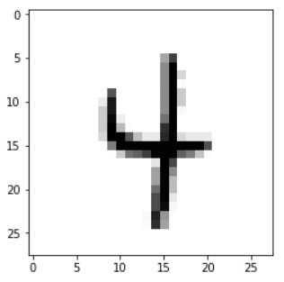
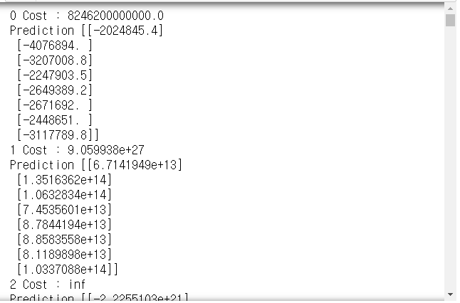
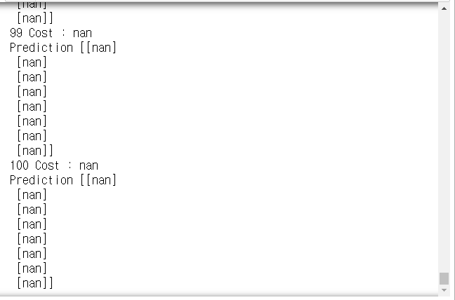
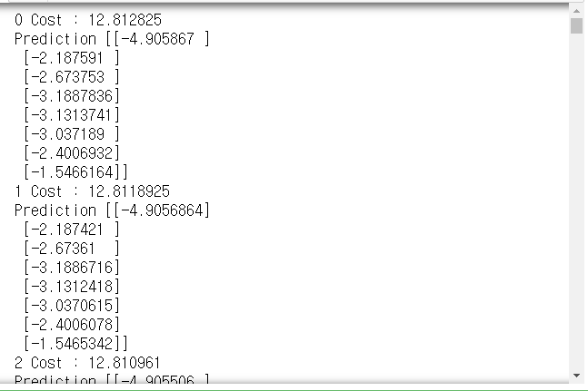
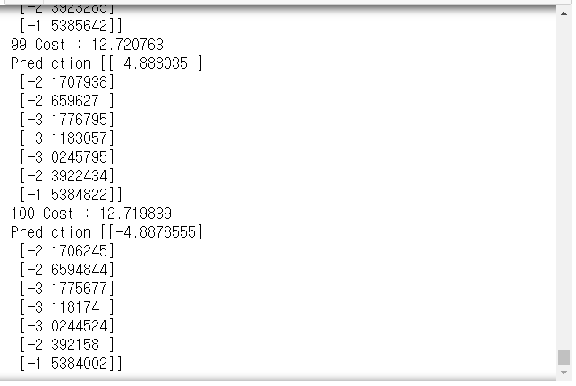
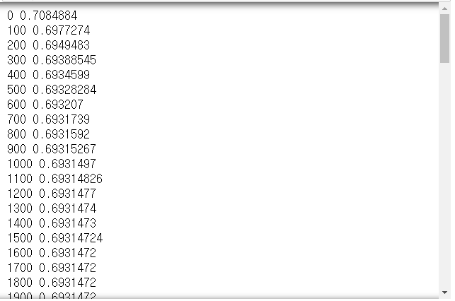
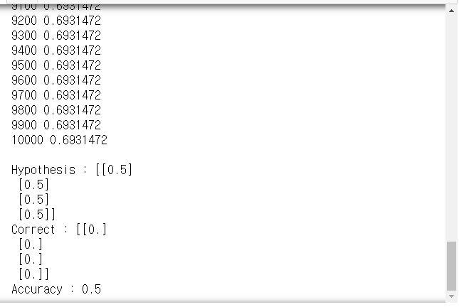
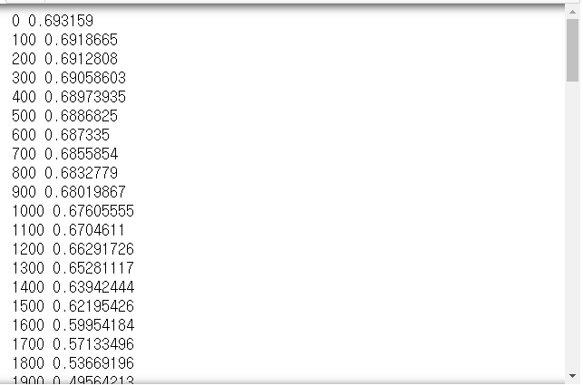
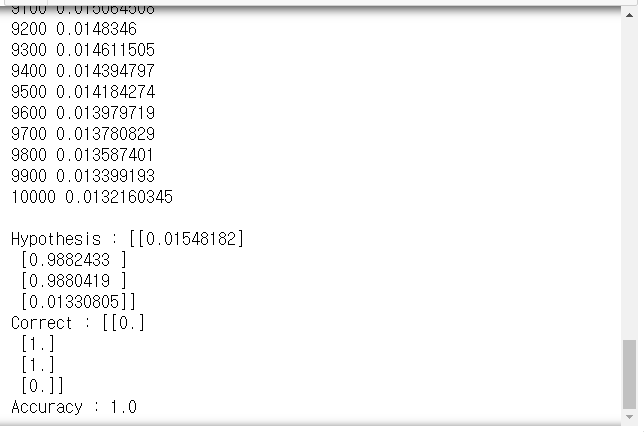

# Day66 TensorFlow와 Keras 라이브러리를 활용한 딥러닝(5)

# 실습

## mnist 분류

### TensorFlow

```python
import tensorflow as tf
import matplotlib.pyplot as plt
import random

tf.set_random_seed(777)
from tensorflow.examples.tutorials.mnist import input_data

mnist = input_data.read_data_sets('MNIST_data', one_hot=True)
```

```python
x = tf.placeholder(tf.float32, [None, 784])
y = tf.placeholder(tf.float32, [None, 10])

w = tf.Variable(tf.random_normal([784, 10]))
b = tf.Variable(tf.random_normal([10]))

hf = tf.nn.softmax(tf.matmul(x, w) + b)
cost = tf.reduce_mean(-tf.reduce_sum(y*tf.log(hf), axis=1))

train = tf.train.GradientDescentOptimizer(0.1).minimize(cost)

isCorrect = tf.equal(tf.argmax(hf, axis=1), tf.argmax(y, axis=1))

accuracy = tf.reduce_mean(tf.cast(isCorrect, tf.float32))
# tf.cast : boolean을 숫자로 변환

numEpochs = 15
batchSize = 100

mnist.train.num_examples # train data의 갯수를 나타내는 상수
# > 55000

numiter = int(mnist.train.num_examples / batchSize)
```

```python
with tf.Session() as sess :
    sess.run(tf.global_variables_initializer())
    # 트레이닝
    for epoch in range(numEpochs) : # 15epoch
        avgCv = 0
        for i in range(numiter) : # 550번 반복
            # batchSize에 맞게 데이터 추출
            batchX, batchY = mnist.train.next_batch(batchSize)
            _, cv = sess.run([train, cost], feed_dict={x:batchX, y:batchY})
            avgCv += cv/numiter
        print('epoch : {:04d}, cost : {:.9f}'.format(epoch+1, avgCv))
    print('accuracy :', accuracy.eval(session=sess, feed_dict={x:mnist.test.images, y:mnist.test.labels}))
    
    r = random.randint(0, mnist.test.num_examples-1)
    print('label :', sess.run(tf.argmax(mnist.test.labels[r:r+1], 1)))
    print('prediction :', sess.run(tf.argmax(hf, 1), feed_dict={x:mnist.test.images[r:r+1]}))
    
    plt.imshow(mnist.test.images[r:r+1].reshape(28, 28), cmap='Greys')
    plt.show()
# > epoch : 0001, cost : 2.833301730
# > epoch : 0002, cost : 1.061346991
# > epoch : 0003, cost : 0.837722797
# > epoch : 0004, cost : 0.733728429
# > epoch : 0005, cost : 0.669795939
# > epoch : 0006, cost : 0.624772107
# > epoch : 0007, cost : 0.591003596
# > epoch : 0008, cost : 0.563903716
# > epoch : 0009, cost : 0.541222038
# > epoch : 0010, cost : 0.522424466
# > epoch : 0011, cost : 0.506267796
# > epoch : 0012, cost : 0.492151307
# > epoch : 0013, cost : 0.479882534
# > epoch : 0014, cost : 0.468705961
# > epoch : 0015, cost : 0.458789313
# > accuracy : 0.8948
# > label : [4]
# > prediction : [4]
```



### Keras

- 학습모델 저장/불러오기
- 다층 퍼셉트론 모델

```python
from keras.utils import np_utils
from keras.datasets import mnist
from keras.models import Sequential
from keras.layers import Dense, Activation
import numpy as np

(xTrain, yTrain), (xTest, yTest) = mnist.load_data()
xTrain.shape
# > (60000, 28, 28)

xTest.shape
# > (10000, 28, 28)

xTrain = xTrain.reshape(60000, 784).astype('float32')/255.0
xTest = xTest.reshape(10000, 784).astype('float32')/255.0

yTrain.shape
# > (60000,)

yTest
# > array([7, 2, 1, ..., 4, 5, 6], dtype=uint8)
```

- one_hot encoding

  ```python
  yTrain = np_utils.to_categorical(yTrain)
  yTest = np_utils.to_categorical(yTest)
  yTest
  # > array([[0., 0., 0., ..., 1., 0., 0.],
  # >        [0., 0., 1., ..., 0., 0., 0.],
  # >        [0., 1., 0., ..., 0., 0., 0.],
  # >        ...,
  # >        [0., 0., 0., ..., 0., 0., 0.],
  # >        [0., 0., 0., ..., 0., 0., 0.],
  # >        [0., 0., 0., ..., 0., 0., 0.]], dtype=float32)
  ```

```py
xValidation = xTrain[42000:]
xTrain = xTrain[:42000]
yValidation = yTrain[42000:]
yTrain = yTrain[:42000]
```

- 모델 구성

```python
model = Sequential()
model.add(Dense(units=64, input_dim=28*28, activation='relu'))
model.add(Dense(units=10, activation='softmax'))
```

- 환경 설정(compile)

```python
model.compile(loss='categorical_crossentropy', optimizer='sgd', metrics=['accuracy'])
```

- 학습(fit)

```python
model.fit(xTrain, yTrain, epochs=5, batch_size=50, validation_data=(xValidation, yValidation))
# > Train on 42000 samples, validate on 18000 samples
# > Epoch 1/5
# > 42000/42000 [==============================] - 1s 34us/step - loss: 0.9780 - accuracy: 0.7510 - val_loss: 0.5193 - val_accuracy: 0.8648
# > Epoch 2/5
# > 42000/42000 [==============================] - 1s 32us/step - loss: 0.4554 - accuracy: 0.8800 - val_loss: 0.3933 - val_accuracy: 0.8927
# > Epoch 3/5
# > 42000/42000 [==============================] - 1s 31us/step - loss: 0.3758 - accuracy: 0.8960 - val_loss: 0.3480 - val_accuracy: 0.9021
# > Epoch 4/5
# > 42000/42000 [==============================] - 1s 30us/step - loss: 0.3386 - accuracy: 0.9044 - val_loss: 0.3220 - val_accuracy: 0.9092
# > Epoch 5/5
# > 42000/42000 [==============================] - 1s 31us/step - loss: 0.3142 - accuracy: 0.9110 - val_loss: 0.3034 - val_accuracy: 0.9148
```

- 모델 평가하기(test data)

```python
metrics = model.evaluate(xTest, yTest, batch_size=50)
print('evaluate result :' + str(metrics))
# > 10000/10000 [==============================] - 0s 15us/step
# > evaluate result :[0.292735608080402, 0.9171000123023987]
```

```python
idx = np.random.choice(xTest.shape[0], 5)
xhat = xTest[idx]
yhat = model.predict_classes(xhat)
yhat # xhat에 대한 예측값
# > array([8, 6, 1, 8, 3], dtype=int64)

print('predict value :', yhat)
print('real value :', np.argmax(yTest[idx], axis=1))
# > predict value : [8 6 1 8 3]
# > real value : [2 6 1 8 3]

for i in range(5) :
    print('예측값 :', yhat[i], '실제값 :', np.argmax(yTest[idx][i]))
# > 예측값 : 8 실제값 : 2
# > 예측값 : 6 실제값 : 6
# > 예측값 : 1 실제값 : 1
# > 예측값 : 8 실제값 : 8
# > 예측값 : 3 실제값 : 3
```

- 모델 : 모델 아키텍처와 모델 가중치로 구성
  - 모델 아키텍처 : 모델이 어떤 층으로 구성
  - 모델 가중치 : weight, bias
- save() : 케라스 모델 저장 함수(아키텍처 + 가중치)
  - 파일형식 : 'h5'로 저장

- 모델 저장

```python
model.save('mnist_model.h5')
```

- 모델 요약

  ```python
  model.summary()
  # > Model: "sequential_3"
  # > _________________________________________________________________
  # > Layer (type)                 Output Shape              Param #   
  # > =================================================================
  # > dense_4 (Dense)              (None, 64)                50240     
  # > _________________________________________________________________
  # > dense_5 (Dense)              (None, 10)                650       
  # > =================================================================
  # > Total params: 50,890
  # > Trainable params: 50,890
  # > Non-trainable params: 0
  # > _________________________________________________________________
  ```

  > dense_2 => 784(input_dim)*64(units) + 64(units) = 50240(Param #)
  >
  > dense_3 => 64(input_dim)*10(units) + 10(units) = 650(Param #)

- 저장된 모델 사용하기

  - 실제 데이터 사용

    ```python
    (xTrain, yTrain), (xTest, yTest) = mnist.load_data()
    xTest = xTest.reshape(10000, 784).astype('float32')/255.0
    yTest = np_utils.to_categorical(yTest)
    idx = np.random.choice(xTest.shape[0], 10)
    xhat = xTest[idx]
    ```

  - 모델 불러오기

    ```python
    from keras.models import load_model
    model = load_model('mnist_model.h5')
    yhat = model.predict_classes(xhat)
    
    print('predict value :', yhat)
    print('real value :', np.argmax(yTest[idx], axis=1))
    # > predict value : [8 2 4 0 1 0 2 8 3 6]
    # > real value : [8 2 4 0 1 0 2 8 3 6]
    ```

## 주식 데이터

```python
xy = np.array([[828.659973, 833.450012, 908100, 828.349976, 831.659973],
               [823.02002, 828.070007, 1828100, 821.655029, 828.070007],
               [819.929993, 824.400024, 1438100, 818.97998, 824.159973],
               [816, 820.958984, 1008100, 815.48999, 819.23999],
               [819.359985, 823, 1188100, 818.469971, 818.97998],
               [819, 823, 1198100, 816, 820.450012],
               [811.700012, 815.25, 1098100, 809.780029, 813.669983],
               [809.51001, 816.659973, 1398100, 804.539978, 809.559998]])
```

- 데이터 분할

  ```python
  xdata = xy[:, :-1]
  ydata = xy[:, [-1]]
  xdata
  # > array([[8.28659973e+02, 8.33450012e+02, 9.08100000e+05, 8.28349976e+02],
  # >        [8.23020020e+02, 8.28070007e+02, 1.82810000e+06, 8.21655029e+02],
  # >        [8.19929993e+02, 8.24400024e+02, 1.43810000e+06, 8.18979980e+02],
  # >        [8.16000000e+02, 8.20958984e+02, 1.00810000e+06, 8.15489990e+02],
  # >        [8.19359985e+02, 8.23000000e+02, 1.18810000e+06, 8.18469971e+02],
  # >        [8.19000000e+02, 8.23000000e+02, 1.19810000e+06, 8.16000000e+02],
  # >        [8.11700012e+02, 8.15250000e+02, 1.09810000e+06, 8.09780029e+02],
  # >        [8.09510010e+02, 8.16659973e+02, 1.39810000e+06, 8.04539978e+02]])
  
  ydata
  # > array([[831.659973],
  # >        [828.070007],
  # >        [824.159973],
  # >        [819.23999 ],
  # >        [818.97998 ],
  # >        [820.450012],
  # >        [813.669983],
  # >        [809.559998]])
  ```

- 모델 생성

  ```python
  x = tf.placeholder(tf.float32, shape=[None, 4])
  y = tf.placeholder(tf.float32, shape=[None, 1])
  
  w = tf.Variable(tf.random_normal([4, 1]))
  b = tf.Variable(tf.random_normal([1]))
  
  hf = tf.matmul(x, w) + b
  cost = tf.reduce_mean(tf.square(hf - y))
  
  train = tf.train.GradientDescentOptimizer(1e-5).minimize(cost)
  ```

- 모델 적용

  ```python
  with tf.Session() as sess :
      sess.run(tf.global_variables_initializer())
      for step in range(101) :
          cv, hv, _ = sess.run([cost, hf, train], feed_dict={x:xdata, y:ydata})
          print(step, 'Cost :', cv, '\nPrediction', hv)
  ```

  

  

  > 데이터 정규화 필요

### 정규화

```python
xy.shape
# > (8, 5)

def myMinMax(data) :
#     print(np.min(data, axis=0)) # 열 단위로 최소값
    bj = data - np.min(data, 0)
    bm = np.max(data, 0) - np.min(data, 0)
    
    return bj/bm

xy = myMinMax(xy)
xy
# > array([[1.        , 1.        , 0.        , 1.        , 1.        ],
# >        [0.70548491, 0.70439552, 1.        , 0.71881783, 0.83755792],
# >        [0.54412549, 0.50274824, 0.57608696, 0.60646801, 0.6606331 ],
# >        [0.33890353, 0.31368023, 0.10869565, 0.45989134, 0.43800918],
# >        [0.51436   , 0.4258239 , 0.30434783, 0.58504805, 0.42624401],
# >        [0.49556179, 0.4258239 , 0.31521739, 0.48131134, 0.49276137],
# >        [0.11436064, 0.        , 0.20652174, 0.22007776, 0.18597238],
# >        [0.        , 0.07747099, 0.5326087 , 0.        , 0.        ]])
```

```python
xdata = xy[:, :-1]
ydata = xy[:, [-1]]

ydata
# > array([[1.        ],
# >        [0.83755792],
# >        [0.6606331 ],
# >        [0.43800918],
# >        [0.42624401],
# >        [0.49276137],
# >        [0.18597238],
# >        [0.        ]])
```

- 모델 생성

  ```python
  x = tf.placeholder(tf.float32, shape=[None, 4])
  y = tf.placeholder(tf.float32, shape=[None, 1])
  
  w = tf.Variable(tf.random_normal([4, 1]))
  b = tf.Variable(tf.random_normal([1]))
  
  hf = tf.matmul(x, w) + b
  cost = tf.reduce_mean(tf.square(hf - y))
  
  train = tf.train.GradientDescentOptimizer(1e-5).minimize(cost)
  ```

- 모델 적용

  ```python
  with tf.Session() as sess :
      sess.run(tf.global_variables_initializer())
      for step in range(101) :
          cv, hv, _ = sess.run([cost, hf, train], feed_dict={x:xdata, y:ydata})
          print(step, 'Cost :', cv, '\nPrediction', hv)
  ```

  

  

- 문제 : 역정규화를 하여 예측 종가를 출력

## xor 문제(텐서플로우)

- TensorFlow, Keras로 각각 구현
- 단일 퍼셉트론, 멀티 퍼셉트론으로 각각 구현

```python
xdata = np.array([[0,0], [0, 1], [1, 0], [1, 1]])
ydata = np.array([[0], [1], [1], [0]])
```

### TensorFlow

#### 단일 퍼셉트론

- 트레이닝 회수 : 10000번, lr=0.1
- 예측값 출력

```python
x = tf.placeholder(tf.float32, [None, 2])
y = tf.placeholder(tf.float32, [None, 1])

w = tf.Variable(tf.random_normal([2, 1]))
b = tf.Variable(tf.random_normal([1]))

hf = tf.sigmoid(tf.matmul(x, w) + b)
cost = -tf.reduce_mean(y*tf.log(hf) + (1-y)*tf.log(1-hf))

train = tf.train.GradientDescentOptimizer(0.1).minimize(cost)

predict = tf.cast(hf > 0.5, dtype=tf.float32)
accuracy = tf.reduce_mean(tf.cast(tf.equal(predict, y), tf.float32))
    
with tf.Session() as sess :
    sess.run(tf.global_variables_initializer())
    
    for step in range(10001) :
        _, cv = sess.run([train, cost], feed_dict={x:xdata, y:ydata})
        if step%100 == 0 :
            print(step, cv)
    
    h, c, a = sess.run([hf, predict, accuracy], feed_dict={x:xdata, y:ydata})
    print('\nHypothesis :', h, '\nCorrect :', c, '\nAccuracy :', a)
```





#### 멀티레이어 퍼셉트론

- 히든레이어 1개

  ```python
  x = tf.placeholder(tf.float32, [None, 2])
  y = tf.placeholder(tf.float32, [None, 1])
  
  # 첫번째 히든레이어
  w1 = tf.Variable(tf.random_normal([2, 2]))
  b1 = tf.Variable(tf.random_normal([2]))
  layer1 = tf.sigmoid(tf.matmul(x, w1) + b1)
  
  # 출력 레이어
  w2 = tf.Variable(tf.random_normal([2, 1]))
  b2 = tf.Variable(tf.random_normal([1]))
  hf = tf.sigmoid(tf.matmul(layer1, w2) + b2)
  
  cost = -tf.reduce_mean(y*tf.log(hf) + (1-y)*tf.log(1-hf))
  
  train = tf.train.GradientDescentOptimizer(0.1).minimize(cost)
  
  predict = tf.cast(hf > 0.5, dtype=tf.float32)
  accuracy = tf.reduce_mean(tf.cast(tf.equal(predict, y), tf.float32))
      
  with tf.Session() as sess :
      sess.run(tf.global_variables_initializer())
      
      for step in range(10001) :
          _, cv = sess.run([train, cost], feed_dict={x:xdata, y:ydata})
          if step%100 == 0 :
              print(step, cv)
      
      h, c, a = sess.run([hf, predict, accuracy], feed_dict={x:xdata, y:ydata})
      print('\nHypothesis :', h, '\nCorrect :', c, '\nAccuracy :', a)
  ```

  

  

- 히든레이어 2개

  ```python
  x = tf.placeholder(tf.float32, [None, 2])
  y = tf.placeholder(tf.float32, [None, 1])
  
  # 첫번째 히든레이어
  w1 = tf.Variable(tf.random_normal([2, 2]))
  b1 = tf.Variable(tf.random_normal([2]))
  layer1 = tf.sigmoid(tf.matmul(x, w1) + b1)
  
  # 두번째 히든레이어
  w2 = tf.Variable(tf.random_normal([2, 2]))
  b2 = tf.Variable(tf.random_normal([2]))
  layer2 = tf.sigmoid(tf.matmul(layer1, w2) + b2)
  
  # 출력 레이어
  w3 = tf.Variable(tf.random_normal([2, 1]))
  b3 = tf.Variable(tf.random_normal([1]))
  hf = tf.sigmoid(tf.matmul(layer2, w3) + b3)
  
  cost = -tf.reduce_mean(y*tf.log(hf) + (1-y)*tf.log(1-hf))
  
  train = tf.train.GradientDescentOptimizer(0.1).minimize(cost)
  
  predict = tf.cast(hf > 0.5, dtype=tf.float32)
  accuracy = tf.reduce_mean(tf.cast(tf.equal(predict, y), tf.float32))
      
  with tf.Session() as sess :
      sess.run(tf.global_variables_initializer())
      
      for step in range(10001) :
          sess.run([train, cost], feed_dict={x:xdata, y:ydata})
      
      h, c, a = sess.run([hf, predict, accuracy], feed_dict={x:xdata, y:ydata})
      print('Hypothesis :', h, '\nCorrect :', c, '\nAccuracy :', a)
  # > Hypothesis : [[0.49040747]
  # >  [0.5057825 ]
  # >  [0.50134254]
  # >  [0.50954   ]] 
  # > Correct : [[0.]
  # >  [1.]
  # >  [1.]
  # >  [1.]] 
  # > Accuracy : 0.75
  ```

- 히든레이어 wide & deep

  ```python
  x = tf.placeholder(tf.float32, [None, 2])
  y = tf.placeholder(tf.float32, [None, 1])
  
  # 첫번째 히든레이어
  w1 = tf.Variable(tf.random_normal([2, 10]))
  b1 = tf.Variable(tf.random_normal([10]))
  layer1 = tf.sigmoid(tf.matmul(x, w1) + b1)
  
  # 두번째 히든레이어
  w2 = tf.Variable(tf.random_normal([10, 10]))
  b2 = tf.Variable(tf.random_normal([10]))
  layer2 = tf.sigmoid(tf.matmul(layer1, w2) + b2)
  
  # 세번째 히든레이어
  w3 = tf.Variable(tf.random_normal([10, 10]))
  b3 = tf.Variable(tf.random_normal([10]))
  layer3 = tf.sigmoid(tf.matmul(layer2, w3) + b3)
  
  # 출력 레이어
  w4 = tf.Variable(tf.random_normal([10, 1]))
  b4 = tf.Variable(tf.random_normal([1]))
  hf = tf.sigmoid(tf.matmul(layer3, w4) + b4)
  
  cost = -tf.reduce_mean(y*tf.log(hf) + (1-y)*tf.log(1-hf))
  
  train = tf.train.GradientDescentOptimizer(0.1).minimize(cost)
  
  predict = tf.cast(hf > 0.5, dtype=tf.float32)
  accuracy = tf.reduce_mean(tf.cast(tf.equal(predict, y), tf.float32))
      
  with tf.Session() as sess :
      sess.run(tf.global_variables_initializer())
      
      for step in range(10001) :
          sess.run([train, cost], feed_dict={x:xdata, y:ydata})
      
      h, c, a = sess.run([hf, predict, accuracy], feed_dict={x:xdata, y:ydata})
      print('Hypothesis :', h, '\nCorrect :', c, '\nAccuracy :', a)
  # > Hypothesis : [[7.0480583e-04]
  # >  [9.9783033e-01]
  # >  [9.9890411e-01]
  # >  [1.9329184e-03]] 
  # > Correct : [[0.]
  # >  [1.]
  # >  [1.]
  # >  [0.]] 
  # > Accuracy : 1.0
  ```

- hidden layer에 `relu` 사용

  ```python
  x = tf.placeholder(tf.float32, [None, 2])
  y = tf.placeholder(tf.float32, [None, 1])
  
  # 첫번째 히든레이어
  w1 = tf.Variable(tf.random_normal([2, 10]))
  b1 = tf.Variable(tf.random_normal([10]))
  layer1 = tf.nn.relu(tf.matmul(x, w1) + b1)
  
  # 두번째 히든레이어
  w2 = tf.Variable(tf.random_normal([10, 10]))
  b2 = tf.Variable(tf.random_normal([10]))
  layer2 = tf.nn.relu(tf.matmul(layer1, w2) + b2)
  
  # 세번째 히든레이어
  w3 = tf.Variable(tf.random_normal([10, 10]))
  b3 = tf.Variable(tf.random_normal([10]))
  layer3 = tf.nn.relu(tf.matmul(layer2, w3) + b3)
  
  # 출력 레이어
  w4 = tf.Variable(tf.random_normal([10, 1]))
  b4 = tf.Variable(tf.random_normal([1]))
  hf = tf.sigmoid(tf.matmul(layer3, w4) + b4)
  
  cost = -tf.reduce_mean(y*tf.log(hf) + (1-y)*tf.log(1-hf))
  
  train = tf.train.GradientDescentOptimizer(0.1).minimize(cost)
  
  predict = tf.cast(hf > 0.5, dtype=tf.float32)
  accuracy = tf.reduce_mean(tf.cast(tf.equal(predict, y), tf.float32))
      
  with tf.Session() as sess :
      sess.run(tf.global_variables_initializer())
      
      for step in range(10001) :
          sess.run([train, cost], feed_dict={x:xdata, y:ydata})
      
      h, c, a = sess.run([hf, predict, accuracy], feed_dict={x:xdata, y:ydata})
      print('Hypothesis :', h, '\nCorrect :', c, '\nAccuracy :', a)
  # > Hypothesis : [[1.6233109e-05]
  # >  [9.9994802e-01]
  # >  [9.9999547e-01]
  # >  [2.4876183e-05]] 
  # > Correct : [[0.]
  # >  [1.]
  # >  [1.]
  # >  [0.]] 
  # > Accuracy : 1.0
  ```

### Keras

- layer 추가하는 방법
  - `Dense(8, input_dim=4, init='uniform', activation='relu')`
  - `Dense(1, input_dim=3, activation='sigmoid')` : 이진분류의 출력계층
  - `Dense(10, input_dim=4, activation='softmax')` : 다중분류의 출력계층

#### 단일 퍼셉트론

```python
model = Sequential()
model.add(Dense(units=1, input_dim=2, activation='sigmoid'))

model.compile(loss='mean_squared_error', optimizer='sgd', metrics=['binary_accuracy'])

model.fit(xdata, ydata, epochs=10000, batch_size=4, verbose=0)

metrics = model.evaluate(xdata, ydata, batch_size=4)
print('evaluate result :', metrics)
# > 4/4 [==============================] - 0s 62ms/step
# > evaluate result : [0.2501285970211029, 0.5]
```

#### 멀티레이어 퍼셉트론

- 히든레이어 1개

  ```python
  model = Sequential()
  model.add(Dense(units=2, input_dim=2, activation='sigmoid'))
  model.add(Dense(units=1, input_dim=2, activation='sigmoid'))
  
  model.compile(loss='mean_squared_error', optimizer='sgd', metrics=['binary_accuracy'])
  
  model.fit(xdata, ydata, epochs=10000, batch_size=4, verbose=0)
  
  metrics = model.evaluate(xdata, ydata, batch_size=4)
  print('evaluate result :', metrics)
  # > 4/4 [==============================] - 0s 62ms/step
  # > evaluate result : [0.23539778590202332, 0.75]
  ```

- 히든레이어 2개

  ```python
  model = Sequential()
  model.add(Dense(units=2, input_dim=2, activation='sigmoid'))
  model.add(Dense(units=2, input_dim=2, activation='sigmoid'))
  model.add(Dense(units=1, input_dim=2, activation='sigmoid'))
  
  model.compile(loss='mean_squared_error', optimizer='sgd', metrics=['binary_accuracy'])
  
  model.fit(xdata, ydata, epochs=10000, batch_size=4, verbose=0)
  
  metrics = model.evaluate(xdata, ydata, batch_size=4)
  print('evaluate result :', metrics)
  # > 4/4 [==============================] - 0s 65ms/step
  # > evaluate result : [0.25007474422454834, 0.5]
  ```

- 히든레이어 wide & deep

  ```python
  model = Sequential()
  model.add(Dense(units=10, input_dim=2, activation='sigmoid'))
  model.add(Dense(units=10, input_dim=10, activation='sigmoid'))
  model.add(Dense(units=10, input_dim=10, activation='sigmoid'))
  model.add(Dense(units=1, input_dim=10, activation='sigmoid'))
  
  model.compile(loss='mean_squared_error', optimizer='sgd', metrics=['binary_accuracy'])
  
  model.fit(xdata, ydata, epochs=10000, batch_size=4, verbose=0)
  
  metrics = model.evaluate(xdata, ydata, batch_size=4)
  print('evaluate result :', metrics)
  # > 4/4 [==============================] - 0s 65ms/step
  # > evaluate result : [0.24999631941318512, 0.5]
  ```

- hidden layer에 `relu` 사용

  ```python
  model = Sequential()
  model.add(Dense(units=10, input_dim=2, activation='relu'))
  model.add(Dense(units=10, input_dim=10, activation='relu'))
  model.add(Dense(units=10, input_dim=10, activation='relu'))
  model.add(Dense(units=1, input_dim=10, activation='sigmoid'))
  
  model.compile(loss='mean_squared_error', optimizer='sgd', metrics=['binary_accuracy'])
  
  model.fit(xdata, ydata, epochs=10000, batch_size=4, verbose=0)
  
  metrics = model.evaluate(xdata, ydata, batch_size=4)
  print('evaluate result :', metrics)
  # > 4/4 [==============================] - 0s 65ms/step
  # > evaluate result : [0.00787266343832016, 1.0]
  ```

# 연습문제

1. `mnist` 정확도 90% 이상으로 높이기(텐서플로우)
2. `pima-indians-diabetes.csv` 파일로 분석하기

## 1.

```python
mnist = input_data.read_data_sets('MNIST_data', one_hot=True)
```

```python
x = tf.placeholder(tf.float32, [None, 784])
y = tf.placeholder(tf.float32, [None, 10])

w1 = tf.Variable(tf.random_normal([784, 256]))
b1 = tf.Variable(tf.random_normal([256]))
layer1 = tf.nn.relu(tf.matmul(x, w1) + b1)

w2 = tf.Variable(tf.random_normal([256, 10]))
b2 = tf.Variable(tf.random_normal([10]))
hf = tf.nn.softmax(tf.matmul(layer1, w2) + b2)

cost = tf.reduce_mean(-tf.reduce_sum(y*tf.log(hf), axis=1))

train = tf.train.GradientDescentOptimizer(0.001).minimize(cost)

predict_correct = tf.equal(tf.argmax(hf, axis=1), tf.argmax(y, axis=1))
accuracy = tf.reduce_mean(tf.cast(predict_correct, tf.float32))

epoch = 15000
batchsize = 100

numiter = int(mnist.train.num_examples / batchsize)

with tf.Session() as sess :
    sess.run(tf.global_variables_initializer())

    for e in range(epoch) :
        for i in range(numiter) :
            batchX, batchY = mnist.train.next_batch(batchsize)
            sess.run(train, feed_dict={x:batchX/255.0, y:batchY})
print('accuracy :', accuracy.eval(session=sess, feed_dict={x:mnist.test.images/255.0, y:mnist.test.labels}))
# > accuracy : 0.9053
```

## 2.

- TensorFlow

```python
x = tf.placeholder(tf.float32, shape=[None, 8])
y = tf.placeholder(tf.float32, shape=[None, ])

# 첫번째 레이어
w1 = tf.Variable(tf.random_normal([8, 32]))
b1 = tf.Variable(tf.random_normal([32]))
l1 = tf.nn.relu(tf.matmul(x, w1) + b1)

# 두번째 레이어 
w2 = tf.Variable(tf.random_normal([32, 32]))
b2 = tf.Variable(tf.random_normal([32]))
l2 = tf.nn.relu(tf.matmul(l1, w2) + b2)

# 출력 레이어
w3 = tf.Variable(tf.random_normal([32, 1]))
b3 = tf.Variable(tf.random_normal([1]))
hf = tf.sigmoid(tf.matmul(l2, w3) + b3)

cost = -tf.reduce_mean(y*tf.log(hf) + (1-y)*tf.log(1-hf))

train = tf.train.GradientDescentOptimizer(0.01).minimize(cost)

predict = tf.cast(hf > 0.5, dtype=tf.float32)
accuracy = tf.reduce_mean(tf.cast(tf.equal(predict, y), tf.float32))

with tf.Session() as sess :
    sess.run(tf.global_variables_initializer())
    
    for _ in range(1000) :
        sess.run(train, feed_dict={x:trainX, y:testY})
    
    print('accuracy :', sess.run(accuracy, 
                                 feed_dict={x:testX, y:testY}))
# > accuracy : 0.6363636
```

- Keras

```python
model = Sequential()
model.add(Dense(units=32, input_dim=8, activation='relu'))
model.add(Dense(units=32, activation='relu'))
model.add(Dense(units=1, activation='sigmoid'))

model.compile(loss='binary_crossentropy', 
              optimizer='sgd', metrics=['accuracy'])

model.fit(trainX, trainY, epochs=1000, batch_size=32, verbose=0)
model.evaluate(testX, testY)[1]
# > 0.7142857313156128
```


