# Day67 TensorFlow와 Keras 라이브러리를 활용한 딥러닝(6)

## Vanishing Gradient Problem

- 기울기 값이 사라지는 문제
- 인공신경망을 기울기 값을 베이스로 하는 방법(backprpagation)으로 학습시키려고 할 때 발생하는 어려움
- 네트워크에서 앞쪽 레이어의 파라미터들을 학습시키고, 튜닝하기 어렵게 만들고, 이는 레이어가 늘어날수록 더 악화됨
- 이는 특정한 activation function을 통해서 기울기 베이스의 학습방법을 사용할 때 문제가 됨(ex. `sigmoid`, `tanh`)

- cf. 이를 보완하기 위하여 `ReLu`를 사용하는데 이 함수 또한 불안한 점이 존재하여 이를 변형한 함수를 만들어내고 있다.

# 가중치 초기화 방법

## Xavier Initialization

- Xavier Initialization 또는 Glorot Initialization라고 하는 초기화  방법은 이전 노드와 다음 노드의 개수에 의존하는 방법
- Uniform 분포와 Normal 분포를 따르는 두가지 방법이 사용
- Xavier Normal Initialization
  - 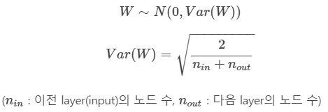
- Xavier Uniform Initialization
  - 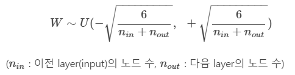
- Xavier 함수는 비선형함수(ex. `sigmoid`, `tanh`)에서 효과적인 결과를 나타냄
- 하지만 `ReLu`에서 사용 시 출력값이 0으로 수렴하는 현상이 존재
- python 코드 : `tf.keras.initializers.xavier_initializer()`

## He Initialization

- `ReLu`에서 사용하는 초기화 방법
- 이 방법 또한 Uniform 분포와 Normal 분포를 따르는 두가지 방법이 사용
- He Normal Initialization
  - 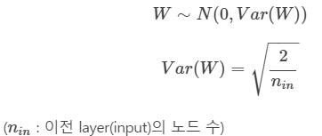
- He Uniform Initialization
  - 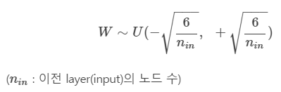
- python 코드 : `tf.keras.initializers.he_normal()` or `tf.keras.initializers.he_uniform()`


## 실습

### TensorFlow

> TensorFlow에서 feed_dict에 keep_prob:0.7을 줄 수 있는데, 이는 drop out 확률을 설정하는 옵션
>
> test에서는 keep_prob:1.0 사용

```python
import tensorflow as tf
import random
import pandas as pd
import matplotlib.pyplot as plt
import seaborn as sns

from tqdm import tqdm
from tensorflow.examples.tutorials.mnist import input_data

mnist = input_data.read_data_sets('MNIST_data/', one_hot=True)

trainingEpoch = 15
batchSize = 100
```


#### Xavier Initialization

```python
x = tf.placeholder(tf.float32, shape=[None, 28*28])
y = tf.placeholder(tf.float32, shape=[None, 10])

# 첫번째 레이어
# Xavier algorithm으로 초기화
w1 = tf.get_variable(
    'w1', shape=[28*28, 256], 
    initializer=tf.contrib.layers.xavier_initializer())
b1 = tf.Variable(tf.random_normal([256]))
l1 = tf.nn.relu(tf.matmul(x, w1) + b1)

# 두번째 레이어
w2 = tf.get_variable(
    'w2', shape=[256, 256], 
    initializer=tf.contrib.layers.xavier_initializer())
b2 = tf.Variable(tf.random_normal([256]))
l2 = tf.nn.relu(tf.matmul(l1, w2) + b2)

# 세번째 레이어
w3 = tf.get_variable(
    'w3', shape=[256, 256], 
    initializer=tf.contrib.layers.xavier_initializer())
b3 = tf.Variable(tf.random_normal([256]))
l3 = tf.nn.relu(tf.matmul(l2, w3) + b3)

# 네번째 레이어
w4 = tf.get_variable(
    'w4', shape=[256, 256], 
    initializer=tf.contrib.layers.xavier_initializer())
b4 = tf.Variable(tf.random_normal([256]))
l4 = tf.nn.relu(tf.matmul(l3, w4) + b4)

# 출력 레이어
w5 = tf.get_variable(
    'w5', shape=[256, 10], 
    initializer=tf.contrib.layers.xavier_initializer())
b5 = tf.Variable(tf.random_normal([10]))
hf = tf.matmul(l4, w5) + b5

cost = tf.reduce_mean(
    tf.nn.softmax_cross_entropy_with_logits_v2(logits=hf,
                                               labels=y))
```

> - 전통적 경사하강법은 매번 미분을 하므로 속도가 느림
> - 하여 확률적 경사하강법(sgd) 로 변형, 속도 개선
> - 모멘텀(momentum) sgd : 확률적 경사하강법 + 관성
> - 아다그리드 : step size 개선
> - rmsprop : 아다그리드 개선
> - 아담(Adam) : 모멘텀 + rmsprop

- optimizer로 `adam` 사용

```python
optimizer = tf.train.AdamOptimizer(0.001).minimize(cost)
prediction = tf.equal(tf.argmax(hf, 1), tf.argmax(y, 1))
accuracy = tf.reduce_mean(tf.cast(prediction, tf.float32))
```

```python
sess = tf.Session()
sess.run(tf.global_variables_initializer())

for epoch in range(trainingEpoch) :
    totalBatch = int(mnist.train.num_examples / batchSize)
    avgCost = 0
    
    for i in range(totalBatch) :
        batchX, batchY = mnist.train.next_batch(batchSize)
        cv, _ = sess.run([cost, optimizer], 
                         feed_dict={x:batchX, y:batchY})
        avgCost += cv / totalBatch

print('accuracy :', sess.run(accuracy, feed_dict={x:mnist.test.images, y:mnist.test.labels}))
# > accuracy : 0.9805
```

- `pbar` 사용할 경우

  ```python
  sess = tf.Session()
  sess.run(tf.global_variables_initializer())
  
  for epoch in range(trainingEpoch) :
      totalBatch = int(mnist.train.num_examples / batchSize)
      avgCost = 0
      
      pbar = tqdm(range(totalBatch))
      
      for i in pbar :
          batchX, batchY = mnist.train.next_batch(batchSize)
          cv, _ = sess.run([cost, optimizer], 
                           feed_dict={x:batchX, y:batchY})
          avgCost += cv / totalBatch
          pbar.set_description('cost:%f' % avgCost)
  
  print('accuracy :', sess.run(accuracy, feed_dict={x:mnist.test.images, y:mnist.test.labels}))
  ```

  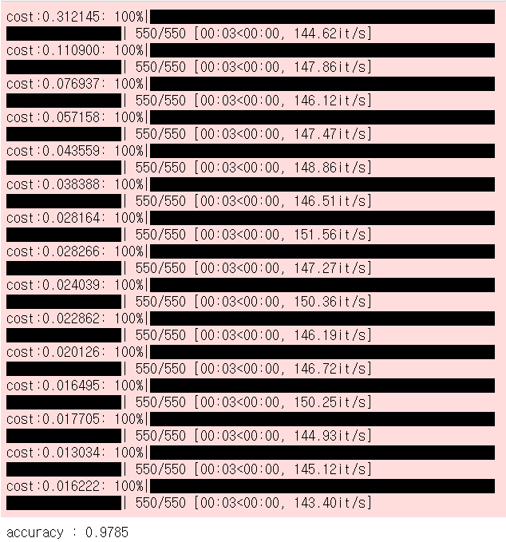

#### He Initialization

```python
tf.reset_default_graph() # 앞서 생성한 tensorflow graph 삭제

x = tf.placeholder(tf.float32, shape=[None, 28*28])
y = tf.placeholder(tf.float32, shape=[None, 10])

# 첫번째 레이어
w1 = tf.get_variable(
    'w1', shape=[28*28, 256], 
    initializer=tf.keras.initializers.he_normal())
b1 = tf.Variable(tf.random_normal([256]))
l1 = tf.nn.relu(tf.matmul(x, w1) + b1)

# 두번째 레이어
w2 = tf.get_variable(
    'w2', shape=[256, 256], 
    initializer=tf.keras.initializers.he_normal())
b2 = tf.Variable(tf.random_normal([256]))
l2 = tf.nn.relu(tf.matmul(l1, w2) + b2)

# 세번째 레이어
w3 = tf.get_variable(
    'w3', shape=[256, 256], 
    initializer=tf.keras.initializers.he_normal())
b3 = tf.Variable(tf.random_normal([256]))
l3 = tf.nn.relu(tf.matmul(l2, w3) + b3)

# 네번째 레이어
w4 = tf.get_variable(
    'w4', shape=[256, 256], 
    initializer=tf.keras.initializers.he_normal())
b4 = tf.Variable(tf.random_normal([256]))
l4 = tf.nn.relu(tf.matmul(l3, w4) + b4)

# 출력 레이어
w5 = tf.get_variable(
    'w5', shape=[256, 10], 
    initializer=tf.keras.initializers.he_normal())
b5 = tf.Variable(tf.random_normal([10]))
hf = tf.matmul(l4, w5) + b5

cost = tf.reduce_mean(
    tf.nn.softmax_cross_entropy_with_logits_v2(logits=hf,
                                               labels=y))

optimizer = tf.train.AdamOptimizer(0.001).minimize(cost)
prediction = tf.equal(tf.argmax(hf, 1), tf.argmax(y, 1))
accuracy = tf.reduce_mean(tf.cast(prediction, tf.float32))
```

```python
sess = tf.Session()
sess.run(tf.global_variables_initializer())

for epoch in range(trainingEpoch) :
    totalBatch = int(mnist.train.num_examples / batchSize)
    avgCost = 0
    
    for i in range(totalBatch) :
        batchX, batchY = mnist.train.next_batch(batchSize)
        cv, _ = sess.run([cost, optimizer], 
                         feed_dict={x:batchX, y:batchY})
        avgCost += cv / totalBatch

print('accuracy :', sess.run(accuracy, feed_dict={x:mnist.test.images, y:mnist.test.labels}))
# > accuracy : 0.9784
```

### 시각화

- 오분류된 데이터 살펴보기

```python
# 오분류된 데이터 추출
index = list()
ori = list()
pred = list()

labels = sess.run(tf.argmax(mnist.test.labels, 1))
predictions = sess.run(tf.argmax(hf, 1), feed_dict={x:mnist.test.images})
for i in range(0, mnist.test.num_examples) :
    if predictions[i] != labels[i] :
        index.append(i)
        ori.append(labels[i])
        pred.append(predictions[i])


res = pd.DataFrame({'label':ori, 'predict':pred}, index=index)
print(res)
# >       label  predict
# > 115       4        9
# > 149       2        3
# > 217       6        5
# > 247       4        2
# > 259       6        0
# > ...     ...      ...
# > 9811      2        8
# > 9839      2        7
# > 9867      2        8
# > 9892      8        5
# > 9944      3        8
# > 
# > [216 rows x 2 columns]
```

- histogram

```python
plt.figure(figsize=(12, 6))
plt.hist(res['predict'], bins=10)
plt.xlabel('fault prediction')
plt.grid()
plt.show()
```

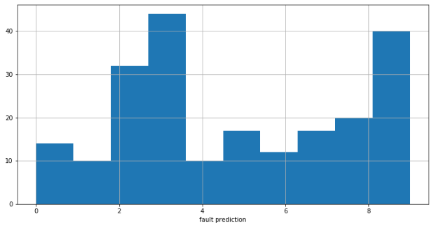

- violinplot

```python
plt.figure(figsize=(12, 6))
sns.violinplot(x='label', y='predict', data=res)
plt.grid()
plt.show()
```

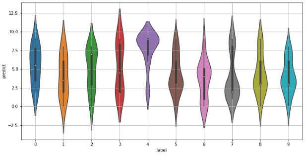

- swarmplot

```python
plt.figure(figsize=(12, 6))
sns.swarmplot(x='label', y='predict', data=res)
sns.despine(offset=10, trim=True)
plt.grid()
plt.show()
```

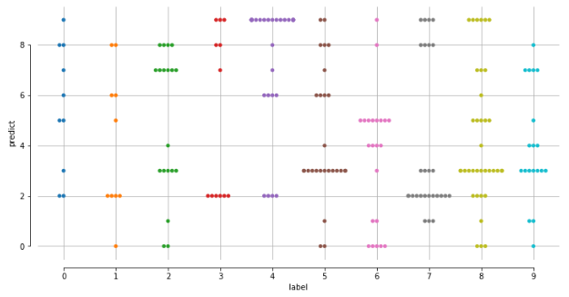

- 일부데이터만 시각적으로 살펴보기

```python
# label이 3인 데이터에서 8개의 index 추출
ver = res.query('label==3').sample(n=8).index
ver
# > Int64Index([3549, 2109, 2927, 4443, 2921, 5734, 9944, 6023], dtype='int64')

# 추출된 8개의 index로 그래프 그리기
cnt = 0
for n in ver :
    cnt += 1
    plt.subplot(4, 4, cnt)
    plt.imshow(mnist.test.images[n].reshape(28, 28), cmap='Greys')
    t = 'label :' + str(res['label'][n]) + ' pred :' + str(res['predict'][n])
    plt.title(t)
plt.tight_layout()
plt.show()
```

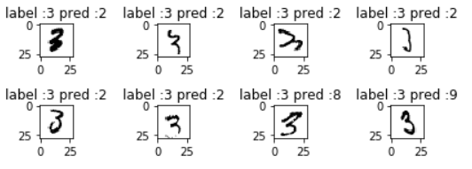

### Keras

```python
from keras.models import Sequential
from keras.layers import Dense
import numpy as np
```


#### pima-indians-diabetes.csv

```python
# seed 생성
np.random.seed(42)
tf.set_random_seed(42)

path_data = '../data_for_analysis/dataset_1/'
data = np.loadtxt(path_data + 'pima-indians-diabetes.csv',
                  delimiter=',')

x = data[:, 0:8]
y = data[:, 8]
x.shape
# > (768, 8)

y.shape
# > (768,)
```

```python
model = Sequential()
model.add(Dense(units=12, input_dim=8, activation='relu'))
model.add(Dense(units=8, input_dim=12, activation='relu'))
model.add(Dense(units=1, activation='sigmoid'))

model.compile(loss='binary_crossentropy', optimizer='adam', 
              metrics=['accuracy'])

model.fit(x, y, epochs=200, batch_size=10)

model.evaluate(x, y)
# > [0.463053185492754, 0.7838541865348816]
```

#### mnist

```python
from keras.datasets import mnist
(trainImage, trainLabel), (testImage, testLabel) = mnist.load_data()
```

```python
trainImage = trainImage.reshape((60000, 28*28))
trainImage = trainImage.astype('float32')/255
testImage = testImage.reshape((10000, 28*28))
testImage = testImage.astype('float32')/255

from keras.utils import to_categorical
trainLabel = to_categorical(trainLabel)
testLabel = to_categorical(testLabel)
```

```python
model2 = Sequential()
model2.add(Dense(512, input_shape=(28*28, ), activation='relu'))
model2.add(Dense(10, activation='softmax'))

model2.compile(loss='categorical_crossentropy',
               optimizer='rmsprop', metrics=['accuracy'])

# batch_size : 2**n으로 값을 주는게 연산이 가장 빠르다.
model2.fit(trainImage, trainLabel, epochs=5, batch_size=128)

l, a = model2.evaluate(testImage, testLabel)
a # 정확도
# > 0.9786999821662903
```

----

- cf. 이미지 데이터

  - 일반적 : 이미지(개수, 높이, 너비, 채널(색의 개수))(TensorFlow, ...)

  - 씨아노 : 이미지(개수, 채널, 높이, 너비)

    

  - 비디오 : (프레임, 높이, 너비, 채널) 5차원 텐서, 프레임(이미지)의 연속

    - ex. 60초 짜리, 100\*200 유투브 비디오
      - 초당 4프레임을 샘플링
      - 4\*60 = 240 프레임
        - (240, 100, 200, 3)
      - 이러한 비디오가 5개이면
        - (5, 240, 100, 200, 3)

----

#### imdb

- 영화 리뷰 분류

```python
from keras.datasets import imdb

# 자주 등장하는 10,000개의 단어만 추출하여 사용
(trainData, trainLabel), (testData, testLabel) = imdb.load_data(num_words=10000)

trainData.shape
# > (25000,)

len(trainData[0])
# > 218

trainLabel[0] # 긍정리뷰
# > 1
```

```python
print([len(seq) for seq in trainData])
```

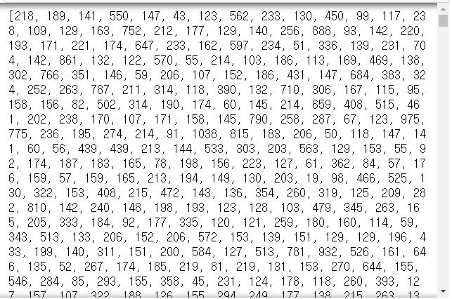

```python
print(max([max(seq) for seq in trainData]))
# > 9999
```

- 영문으로 바꿔보기

```python
word_index = imdb.get_word_index()
word_index
```

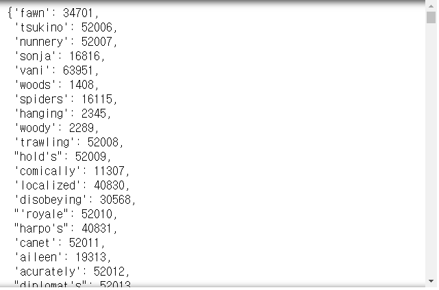

```python
rev_wordIndex = dict([(value, key) for (key, value) in word_index.items()])
rev_wordIndex
```

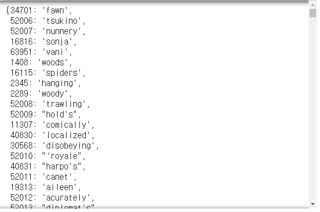

```python
decReview = ' '.join([rev_wordIndex.get(i, '?') for i in trainData[0]])
# get(i, '?') : key에 i가 없을 경우 '?' 출력
decReview
# > "the as you with out themselves powerful lets loves their becomes reaching had journalist of lot from anyone to have after out atmosphere never more room and it so heart shows to years of every never going and help moments or of every chest visual movie except her was several of enough more with is now current film as you of mine potentially unfortunately of you than him that with out themselves her get for was camp of you movie sometimes movie that with scary but and to story wonderful that in seeing in character to of 70s musicians with heart had shadows they of here that with her serious to have does when from why what have critics they is you that isn't one will very to as itself with other and in of seen over landed for anyone of and br show's to whether from than out themselves history he name half some br of and odd was two most of mean for 1 any an boat she he should is thought frog but of script you not while history he heart to real at barrel but when from one bit then have two of script their with her nobody most that with wasn't to with armed acting watch an for with heartfelt film want an"
```

- 동일한 길이의 리스가 되도록 패딩작업 수행
  - 원핫인코딩

```python
def vec_seq(data, dim=10000) : # 훈련데이터 -> 벡터로 변환
    res = np.zeros((len(data), dim))
    for i, s in enumerate(data) :
        res[i, s] = 1
    return res
    
xTrain = vec_seq(trainData)
xTest = vec_seq(testData)

xTrain[0]
# > array([0., 1., 1., ..., 0., 0., 0.])

xTest[0]
# > array([0., 1., 1., ..., 0., 0., 0.])

xTrain.shape
# > (25000, 10000)

yTrain = trainLabel.astype('float32')
yTest = testLabel.astype('float32')

yTest.shape
# > (25000,)
```

- Train, Validation set 분할

```python
xVal = xTrain[:10000]
p_xTrain = xTrain[10000:]
yVal = yTrain[:10000]
p_yTrain = yTrain[10000:]
```

- 신경망 모델

```python
model = Sequential()
model.add(Dense(16, activation='relu', input_shape=(10000,)))
model.add(Dense(16, activation='relu'))
model.add(Dense(1, activation='sigmoid'))

model.compile(loss='binary_crossentropy', 
              optimizer='rmsprop', metrics=['accuracy'])

history = model.fit(p_xTrain, p_yTrain, epochs=20, batch_size=512, validation_data=(xVal, yVal))
```

```python
model.evaluate(xTest, yTest)
# > [0.7668838533973694, 0.8485999703407288]

model.predict(xTest)
# > array([[0.00452176],
# >        [1.        ],
# >        [0.9617934 ],
# >        ...,
# >        [0.00356573],
# >        [0.01140317],
# >        [0.40021524]], dtype=float32)
```


#### 시각화

```python
history.history
```

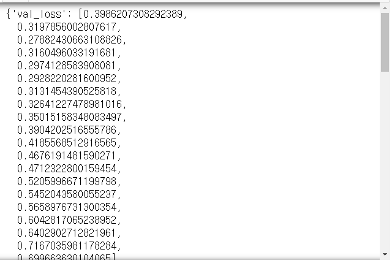

```python
history.history.keys()
# > dict_keys(['val_loss', 'val_accuracy', 'loss', 'accuracy'])
```

```python
historyDict = history.history
acc = history.history['accuracy']
val_accuracy = history.history['val_accuracy']
loss = history.history['loss']
val_loss = history.history['val_loss']
```

```python
epo = range(1, len(acc)+1)
plt.plot(epo, loss, 'bo', label='Training loss')
plt.plot(epo, val_loss, 'b', label='Validation loss')
plt.xlabel('epoch')
plt.ylabel('Loss')
plt.legend()
plt.show()
```

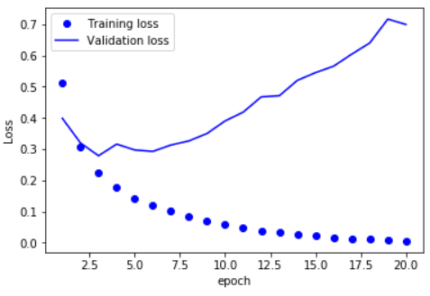

```python
epo = range(1, len(acc)+1)
plt.plot(epo, acc, 'bo', label='Training accuracy')
plt.plot(epo, val_accuracy, 'b', label='Validation accuracy')
plt.xlabel('epoch')
plt.ylabel('Loss')
plt.legend()
plt.show()
```

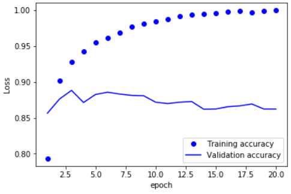

# 연습문제

1. boston_housing data(회귀)
   - `loss='mse'`, `optimizer='rmsprop'`, `metrics=['mae']`
   - Keras, TensorFlow로 수행
2. iris data(분류)
   - `loss='categorical_crossentropy'`, `optimizer='adam'`, `metrics=['accuracy']`
   - Keras, TensorFlow로 수행(정확도 최대한)

## 1. boston_housing data(회귀)

```python
from keras.datasets import boston_housing

(trainData, trainTarget), (testData, testTraget) = boston_housing.load_data()

trainData.shape
# > (404, 13)

trainTarget
```

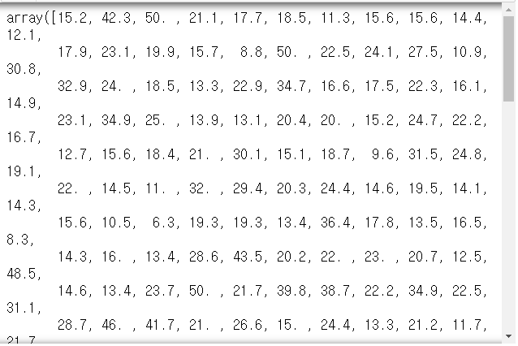

### TensorFlow

```python
tf.reset_default_graph() # 앞서 생성된 모델 제거

# tensorflow
x = tf.placeholder(tf.float32, shape=[None, 13])
y = tf.placeholder(tf.float32, shape=[None, ])

# 첫번째 레이어
w1 = tf.get_variable(
    'w1', shape=[13, 8], 
    initializer=tf.keras.initializers.he_normal())
b1 = tf.Variable(tf.random_normal([8]))
l1 = tf.nn.relu(tf.matmul(x, w1) + b1)

# 두번째 레이어
w2 = tf.get_variable(
    'w2', shape=[8, 8],
    initializer=tf.keras.initializers.he_normal())
b2 = tf.Variable(tf.random_normal([8]))
l2 = tf.nn.relu(tf.matmul(l1, w2) + b2)

# 세번째 레이어
w3 = tf.get_variable(
    'w3', shape=[8, 8],
    initializer=tf.keras.initializers.he_normal())
b3 = tf.Variable(tf.random_normal([8]))
l3 = tf.nn.relu(tf.matmul(l2, w3) + b3)

# 네번째 레이어
w4 = tf.get_variable(
    'w4', shape=[8, 8],
    initializer=tf.keras.initializers.he_normal())
b4 = tf.Variable(tf.random_normal([8]))
l4 = tf.nn.relu(tf.matmul(l3, w4) + b4)

# 출력 레이어
w5 = tf.get_variable(
    'w5', shape=[8, 1],
    initializer=tf.keras.initializers.he_normal())
b5 = tf.Variable(tf.random_normal([1]))
hf = tf.nn.relu(tf.matmul(l4, w5) + b5)

cost = tf.reduce_mean(tf.square(hf - y))

optimizer = tf.train.RMSPropOptimizer(0.001).minimize(cost)

with tf.Session() as sess :
    sess.run(tf.global_variables_initializer())
    for _ in range(200) :
        sess.run(optimizer, feed_dict={x:trainData, y:trainTarget})
    print(sess.run(cost, feed_dict={x:testData, y:testTraget}))
# > 94.776436
```

### Keras

```python
model = Sequential()
model.add(Dense(units=8, input_dim=13, activation='relu'))
model.add(Dense(units=8, activation='relu'))
model.add(Dense(units=8, activation='relu'))
model.add(Dense(units=8, activation='relu'))
model.add(Dense(units=1, activation='relu'))

model.compile(loss='mse', optimizer='rmsprop', metrics=['mae'])
model.fit(trainData, trainTarget, epochs=200, batch_size=16, verbose=0)

model.evaluate(testData, testTarget)
# > [32.245553558948, 4.010960578918457]
```

## 2. iris data(분류)

```python
from sklearn.datasets import load_iris

iris = sns.load_dataset('iris')
iris
```

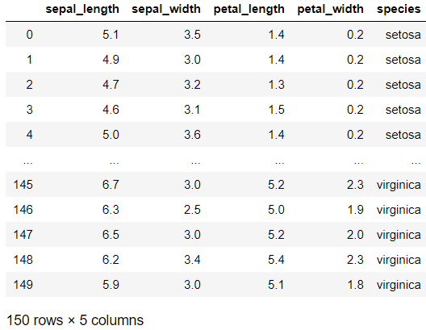

```python
iris_species = pd.get_dummies(iris.species)
iris_species
```

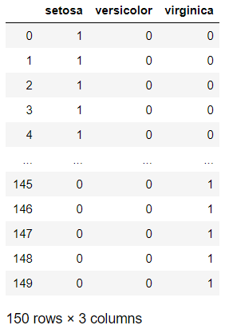

```python
from sklearn.model_selection import train_test_split
trainX, testX, trainY, testY = train_test_split(
    iris.iloc[:, :4], iris_species, 
    test_size=0.3, random_state=1234)

print(trainX.shape, testX.shape, trainY.shape, testY.shape)
# > (105, 4) (45, 4) (105, 3) (45, 3)
```

### TensorFlow

```python
tf.reset_default_graph() # 앞서 생성된 모델 제거

# tensorflow
x = tf.placeholder(tf.float32, shape=[None, 4])
y = tf.placeholder(tf.float32, shape=[None, 3])

# 첫번째 레이어
w1 = tf.get_variable(
    'w1', shape=[4, 32],
    initializer=tf.keras.initializers.he_normal())
b1 = tf.Variable(tf.zeros([32]))
l1 = tf.nn.relu(tf.matmul(x, w1) + b1)

# 두번째 레이어
w2 = tf.get_variable(
    'w2', shape=[32, 32],
    initializer=tf.keras.initializers.he_normal())
b2 = tf.Variable(tf.zeros([32]))
l2 = tf.nn.relu(tf.matmul(l1, w2) + b2)

# 세번째 레이어
w3 = tf.get_variable(
    'w3', shape=[32, 32],
    initializer=tf.keras.initializers.he_normal())
b3 = tf.Variable(tf.zeros([32]))
l3 = tf.nn.relu(tf.matmul(l2, w3) + b3)

# 출력 레이어
w4 = tf.get_variable(
    'w4', shape=[32, 3],
    initializer=tf.keras.initializers.he_normal())
b4 = tf.Variable(tf.zeros([3]))
hf = tf.nn.relu(tf.matmul(l3, w4) + b4)

cost = tf.reduce_mean(
    tf.nn.softmax_cross_entropy_with_logits_v2(logits=hf,
                                               labels=y))

optimizer = tf.train.AdamOptimizer(0.001).minimize(cost)
prediction = tf.equal(tf.argmax(hf, 1), tf.argmax(y, 1))
accuracy = tf.reduce_mean(tf.cast(prediction, tf.float32))

with tf.Session() as sess :
    sess.run(tf.global_variables_initializer())
    for _ in range(200) :
        sess.run(optimizer, feed_dict={x:trainX, y:trainY})
    print('accuracy :', sess.run(accuracy, feed_dict={x:testX, y:testY}))
# > accuracy : 0.9777778
```

### Keras

```python
model = Sequential()
model.add(Dense(units=32, input_dim=4, activation='relu'))
model.add(Dense(units=32, activation='relu'))
model.add(Dense(units=32, activation='relu'))
model.add(Dense(units=3, activation='softmax'))

model.compile(loss='categorical_crossentropy', optimizer='adam', metrics=['accuracy'])

model.fit(trainX, trainY, epochs=200, batch_size=16, verbose=0)

model.evaluate(testX, testY)[1]
# > 0.9777777791023254
```

