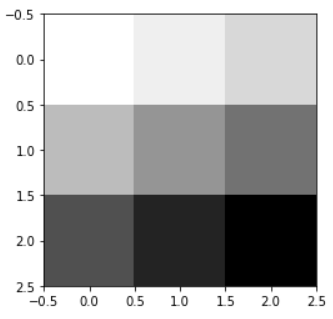
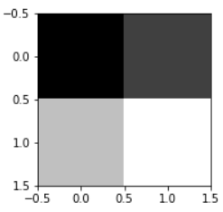
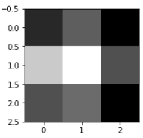

# Day68 CNN을 활용한 이미지 데이터 모델링(1)

# CNN

> CNN(Convolutional Neural Network)
>
> - 데이터의 특징을 추출하여 특징들의 패턴을 파악하는 구조
>
> - 이미지에서 특징들을 추출해서, 특징값을 input으로 대입

- MLP(DNN) -> 컴퓨터비전
  - 강아지 사진 -> 모델 -> 강아지로 판단

- CNN
  - 사진 -> 특징 추출(Convolution Layer) (-> Pooling Layer(특징의 대표값 추출)) (-> (Convolution Layer) -> 평탄화 작업(flatteining) -> Neural Network -> 확률을 통해 분류
  - Convolution Layer : 입력데이터로 부터 특징을 추출하는 역할을 수행하는 계층
    - 여러개의 필터와 이에 연결된 활성화 함수로 이루어져 있음
    - 필터(or kernel) : 특징을 추출하는 기능
    - 활성화 함수(ex. `ReLu`) : 필터가 추출한 값을 비선형 값으로 변경
  - 패딩 : 입력과 동일한 높이와 너비를 가진 출력 특성 맵을 얻기위한 옵션
  - 스트라이드 : 특징을 발견하도록 이동하는 너비
  - 풀링
    - 크기를 줄이므로써 속도를 개선
    - 영역의 대표적인 특징
    - 위치나 각도 등의 변화에 대해 잘 적응하도록 수행하는 작업

## 실습

```python
import numpy as np
import tensorflow as tf
import matplotlib.pyplot as plt
```

### 예시

```python
image = np.array([[[[1], [2], [3]], 
                   [[4], [5], [6]], 
                   [[7], [8], [9]]]], dtype=np.float32)
image.shape
# > (1, 3, 3, 1)

plt.imshow(image.reshape(3, 3), cmap='Greys')
```



```python
weight = tf.constant([[[[1.]], [[1.]]], 
                      [[[1.]], [[1.]]]])
print(weight.shape)
# > (2, 2, 1, 1)
```

```python
sess = tf.InteractiveSession()
conv2d = tf.nn.conv2d(image, weight, strides=[1,1,1,1], padding='VALID') 
# strides=[?, 좌우, 위아래, 채널]
conv2dimg = conv2d.eval() # 합성곱 연산

conv2dimg.shape
# > (1, 2, 2, 1)

conv2dimg
# > array([[[[12.],
# >          [16.]],
# > 
# >         [[24.],
# >          [28.]]]], dtype=float32)

for i, img in enumerate(conv2dimg) :
    print(img.reshape(2, 2))
    plt.subplot(1, 2, i+1)
    plt.imshow(img.reshape(2, 2), cmap='gray')
# > [[12. 16.]
# >  [24. 28.]]
```



```python
for i, img in enumerate(conv2dimg) :
    print(img.reshape(3, 3))
    plt.subplot(1, 2, i+1)
    plt.imshow(img.reshape(3, 3), cmap='gray')
# > [[12. 16.  9.]
# >  [24. 28. 15.]
# >  [15. 17.  9.]]
```



### MNIST

```python
import random
from tensorflow.examples.tutorials.mnist import input_data

tf.reset_default_graph()
mnist = input_data.read_data_sets('MNIST_data/', one_hot=True)
epochs = 15
lr = 0.001
batchSize = 100
```

- 단순 CNN

```python
# 입력층
x = tf.placeholder(tf.float32, [None, 28*28])
ximg = tf.reshape(x, [-1, 28, 28, 1])
y = tf.placeholder(tf.float32, [None, 10])


# 히든1 : weight(w1=필터)
w1 = tf.Variable(tf.random_normal([3, 3, 1, 32], stddev=0.01))
# [3, 3, 1, 32] : 3, 3(필터의 높이와 너비), 1(채널의 개수), 32(필터의 개수)
# conv -> (?, 28, 28, 32)
# relu -> (?, 28, 28, 32)
# pool -> (?, 14, 14, 32)
L1 = tf.nn.conv2d(ximg, w1, strides=[1, 1, 1, 1], padding='SAME')
L1 = tf.nn.relu(L1)
# 풀링, ksize(풀링의 크기)
L1 = tf.nn.max_pool(L1, ksize=[1, 2, 2, 1], 
                    strides=[1, 2, 2, 1], padding='SAME')


# 히든2
w2 = tf.Variable(tf.random_normal([3, 3, 32, 64], stddev=0.01))
# conv -> (?, 14, 14, 64)
# relu -> (?, 14, 14, 64)
# pool -> (?, 7, 7, 64)
L2 = tf.nn.conv2d(L1, w2, strides=[1, 1, 1, 1], padding='SAME')
L2 = tf.nn.relu(L2)
L2 = tf.nn.max_pool(L2, ksize=[1, 2, 2, 1], strides=[1, 2, 2, 1], padding='SAME')

# flatten
L2_flat = tf.reshape(L2, [-1, 7*7*64])
# flat -> [?, 7*7*64=3136]

# 마지막 계츨 FC(Fully Connected) 7*7*64 -> 10 output
w3 = tf.get_variable(
    'w3', shape=[7*7*64, 10], 
    initializer=tf.contrib.layers.xavier_initializer())
b = tf.Variable(tf.random_normal([10]))

hf = tf.matmul(L2_flat, w3) + b

cost = tf.reduce_mean(
    tf.nn.softmax_cross_entropy_with_logits_v2(
        logits=hf, labels=y))
opt = tf.train.AdamOptimizer(lr).minimize(cost)

sess = tf.Session()
sess.run(tf.global_variables_initializer())

for epoch in range(epochs) :
    avgCost = 0
    totalBatch = int(mnist.train.num_examples / batchSize)
    for i in range(totalBatch) :
        batchX, batchY = mnist.train.next_batch(batchSize)
        fd = {x:batchX, y:batchY}
        cv, _ = sess.run([cost, opt], feed_dict=fd)
        avgCost += cv/totalBatch
    print('에폭 :', '%04d' %(epoch+1), 
          'cost =', '{:.5f}'.format(avgCost))

pred = tf.equal(tf.argmax(hf, 1), tf.argmax(y, 1))
acc = tf.reduce_mean(tf.cast(pred, tf.float32))
print('accuracy :', sess.run(acc, 
                             feed_dict={x:mnist.test.images,
                                        y:mnist.test.labels}))
# > 에폭 : 0001 cost = 0.34627
# > 에폭 : 0002 cost = 0.09774
# > 에폭 : 0003 cost = 0.07200
# > 에폭 : 0004 cost = 0.05694
# > 에폭 : 0005 cost = 0.04885
# > 에폭 : 0006 cost = 0.04185
# > 에폭 : 0007 cost = 0.03627
# > 에폭 : 0008 cost = 0.03181
# > 에폭 : 0009 cost = 0.02873
# > 에폭 : 0010 cost = 0.02554
# > 에폭 : 0011 cost = 0.02208
# > 에폭 : 0012 cost = 0.01870
# > 에폭 : 0013 cost = 0.01659
# > 에폭 : 0014 cost = 0.01583
# > 에폭 : 0015 cost = 0.01335
# > accuracy : 0.9886
```


- drop out 추가

```python
tf.reset_default_graph()
```

```python
# 입력층
keep_prob = tf.placeholder(tf.float32) #추가된 부분#
x = tf.placeholder(tf.float32, [None, 28*28])
ximg = tf.reshape(x, [-1, 28, 28, 1])
y = tf.placeholder(tf.float32, [None, 10])


# 히든1 : weight(w1=필터)
w1 = tf.Variable(tf.random_normal([3, 3, 1, 32], stddev=0.01))
# [3, 3, 1, 32] : 3, 3(필터의 높이와 너비), 1(채널의 개수), 32(필터의 개수)
# conv -> (?, 28, 28, 32)
# relu -> (?, 28, 28, 32)
# pool -> (?, 14, 14, 32)
L1 = tf.nn.conv2d(ximg, w1, strides=[1, 1, 1, 1], padding='SAME')
L1 = tf.nn.relu(L1)
# 풀링, ksize(풀링의 크기)
L1 = tf.nn.max_pool(L1, ksize=[1, 2, 2, 1], 
                    strides=[1, 2, 2, 1], padding='SAME')
L1 = tf.nn.dropout(L1, keep_prob=keep_prob) #추가된 부분#


# 히든2
w2 = tf.Variable(tf.random_normal([3, 3, 32, 64], stddev=0.01))
# conv -> (?, 14, 14, 64)
# relu -> (?, 14, 14, 64)
# pool -> (?, 7, 7, 64)
L2 = tf.nn.conv2d(L1, w2, strides=[1, 1, 1, 1], padding='SAME')
L2 = tf.nn.relu(L2)
L2 = tf.nn.max_pool(L2, ksize=[1, 2, 2, 1], strides=[1, 2, 2, 1], padding='SAME')
L2 = tf.nn.dropout(L2, keep_prob=keep_prob) #추가된 부분#

# flatten
L2_flat = tf.reshape(L2, [-1, 7*7*64])
# flat -> [?, 7*7*64=3136]

# 마지막 계츨 FC(Fully Connected) 7*7*64 -> 10 output
w3 = tf.get_variable(
    'w3', shape=[7*7*64, 10], 
    initializer=tf.contrib.layers.xavier_initializer())
b = tf.Variable(tf.random_normal([10]))

hf = tf.matmul(L2_flat, w3) + b

cost = tf.reduce_mean(
    tf.nn.softmax_cross_entropy_with_logits_v2(
        logits=hf, labels=y))
opt = tf.train.AdamOptimizer(lr).minimize(cost)

sess = tf.Session()
sess.run(tf.global_variables_initializer())

for epoch in range(epochs) :
    avgCost = 0
    totalBatch = int(mnist.train.num_examples / batchSize)
    for i in range(totalBatch) :
        batchX, batchY = mnist.train.next_batch(batchSize)
        fd = {x:batchX, y:batchY, keep_prob:0.7} #추가된 부분#
        cv, _ = sess.run([cost, opt], feed_dict=fd)
        avgCost += cv/totalBatch
    print('에폭 :', '%04d' %(epoch+1), 
          'cost =', '{:.5f}'.format(avgCost))

pred = tf.equal(tf.argmax(hf, 1), tf.argmax(y, 1))
acc = tf.reduce_mean(tf.cast(pred, tf.float32))
print('accuracy :', sess.run(acc, 
                             feed_dict={x:mnist.test.images,
                                        y:mnist.test.labels, 
                                        keep_prob:1.})) #추가된 부분#
# > 에폭 : 0001 cost = 0.42639
# > 에폭 : 0002 cost = 0.14222
# > 에폭 : 0003 cost = 0.11081
# > 에폭 : 0004 cost = 0.09389
# > 에폭 : 0005 cost = 0.08057
# > 에폭 : 0006 cost = 0.07164
# > 에폭 : 0007 cost = 0.06217
# > 에폭 : 0008 cost = 0.05765
# > 에폭 : 0009 cost = 0.05241
# > 에폭 : 0010 cost = 0.04970
# > 에폭 : 0011 cost = 0.04787
# > 에폭 : 0012 cost = 0.04471
# > 에폭 : 0013 cost = 0.04125
# > 에폭 : 0014 cost = 0.03945
# > 에폭 : 0015 cost = 0.03659
# > accuracy : 0.9905
```

- layer 추가

```python
tf.reset_default_graph()
```

```python
# 입력층
keep_prob = tf.placeholder(tf.float32)
x = tf.placeholder(tf.float32, [None, 28*28])
ximg = tf.reshape(x, [-1, 28, 28, 1])
y = tf.placeholder(tf.float32, [None, 10])


# 히든1 : weight(w1=필터)
w1 = tf.Variable(tf.random_normal([3, 3, 1, 32], stddev=0.01))
# [3, 3, 1, 32] : 3, 3(필터의 높이와 너비), 1(채널의 개수), 32(필터의 개수)
# conv -> (?, 28, 28, 32)
# relu -> (?, 28, 28, 32)
# pool -> (?, 14, 14, 32)
L1 = tf.nn.conv2d(ximg, w1, strides=[1, 1, 1, 1], padding='SAME')
L1 = tf.nn.relu(L1)
# 풀링, ksize(풀링의 크기)
L1 = tf.nn.max_pool(L1, ksize=[1, 2, 2, 1], 
                    strides=[1, 2, 2, 1], padding='SAME')
L1 = tf.nn.dropout(L1, keep_prob=keep_prob)


# 히든2
w2 = tf.Variable(tf.random_normal([3, 3, 32, 64], stddev=0.01))
# conv -> (?, 14, 14, 64)
# relu -> (?, 14, 14, 64)
# pool -> (?, 7, 7, 64)
L2 = tf.nn.conv2d(L1, w2, strides=[1, 1, 1, 1], padding='SAME')
L2 = tf.nn.relu(L2)
L2 = tf.nn.max_pool(L2, ksize=[1, 2, 2, 1], strides=[1, 2, 2, 1], padding='SAME')
L2 = tf.nn.dropout(L2, keep_prob=keep_prob)


# 히든3
w3 = tf.Variable(tf.random_normal([3, 3, 64, 64], stddev=0.01))
# conv -> (?, 14, 14, 64)
# relu -> (?, 14, 14, 64)
# pool -> (?, 7, 7, 64)
L3 = tf.nn.conv2d(L2, w3, strides=[1, 1, 1, 1], padding='SAME')
L3 = tf.nn.relu(L3)
L3 = tf.nn.max_pool(L3, ksize=[1, 2, 2, 1], strides=[1, 1, 1, 1], padding='SAME')
L3 = tf.nn.dropout(L3, keep_prob=keep_prob)


# 히든4
w4 = tf.Variable(tf.random_normal([3, 3, 64, 64], stddev=0.01))
# conv -> (?, 14, 14, 64)
# relu -> (?, 14, 14, 64)
# pool -> (?, 7, 7, 64)
L4 = tf.nn.conv2d(L3, w4, strides=[1, 1, 1, 1], padding='SAME')
L4 = tf.nn.relu(L4)
L4 = tf.nn.max_pool(L4, ksize=[1, 2, 2, 1], strides=[1, 1, 1, 1], padding='SAME')
L4 = tf.nn.dropout(L4, keep_prob=keep_prob)


# flatten
L4_flat = tf.reshape(L4, [-1, 7*7*64])
# flat -> [?, 7*7*64=3136]

# 마지막 계츨 FC(Fully Connected) 7*7*64 -> 10 output
w5 = tf.get_variable(
    'w5', shape=[7*7*64, 10], 
    initializer=tf.contrib.layers.xavier_initializer())
b = tf.Variable(tf.random_normal([10]))

hf = tf.matmul(L4_flat, w5) + b

cost = tf.reduce_mean(
    tf.nn.softmax_cross_entropy_with_logits_v2(
        logits=hf, labels=y))
opt = tf.train.AdamOptimizer(lr).minimize(cost)

sess = tf.Session()
sess.run(tf.global_variables_initializer())

for epoch in range(epochs) :
    avgCost = 0
    totalBatch = int(mnist.train.num_examples / batchSize)
    for i in range(totalBatch) :
        batchX, batchY = mnist.train.next_batch(batchSize)
        fd = {x:batchX, y:batchY, keep_prob:0.7}
        cv, _ = sess.run([cost, opt], feed_dict=fd)
        avgCost += cv/totalBatch
    print('에폭 :', '%04d' %(epoch+1), 
          'cost =', '{:.5f}'.format(avgCost))

pred = tf.equal(tf.argmax(hf, 1), tf.argmax(y, 1))
acc = tf.reduce_mean(tf.cast(pred, tf.float32))
print('accuracy :', sess.run(acc, 
                             feed_dict={x:mnist.test.images,
                                        y:mnist.test.labels, 
                                        keep_prob:1.}))
# > 에폭 : 0001 cost = 0.47762
# > 에폭 : 0002 cost = 0.09975
# > 에폭 : 0003 cost = 0.07359
# > 에폭 : 0004 cost = 0.06050
# > 에폭 : 0005 cost = 0.05577
# > 에폭 : 0006 cost = 0.04584
# > 에폭 : 0007 cost = 0.04422
# > 에폭 : 0008 cost = 0.04265
# > 에폭 : 0009 cost = 0.03868
# > 에폭 : 0010 cost = 0.03618
# > 에폭 : 0011 cost = 0.03358
# > 에폭 : 0012 cost = 0.03298
# > 에폭 : 0013 cost = 0.03203
# > 에폭 : 0014 cost = 0.02791
# > 에폭 : 0015 cost = 0.02973
# > accuracy : 0.993
```


