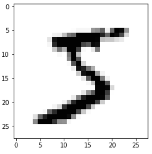
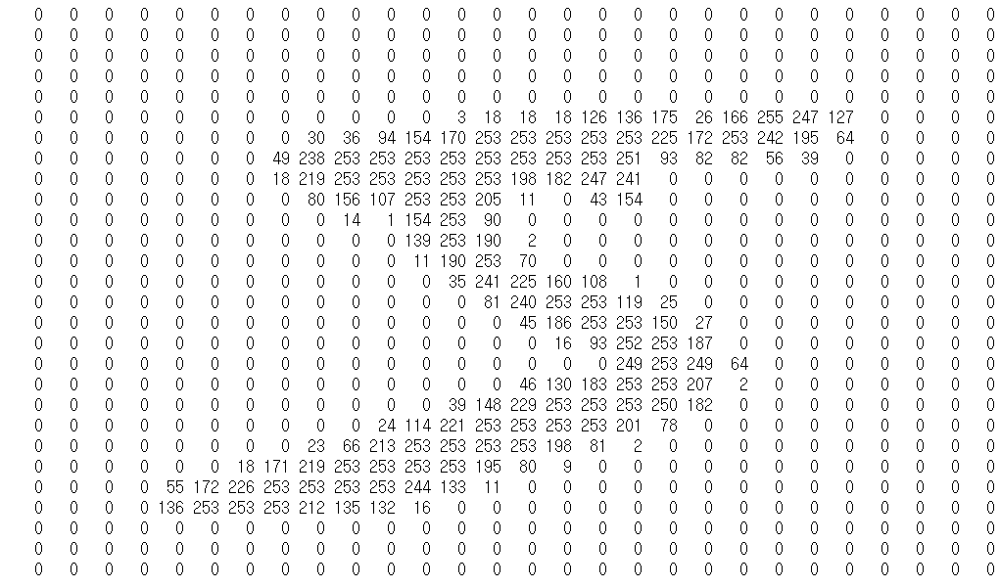
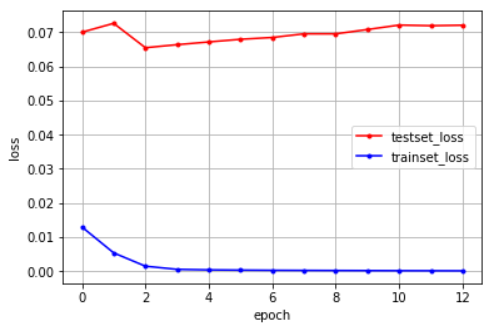
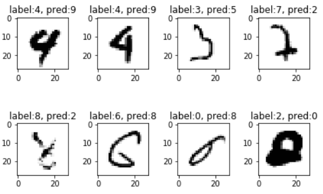
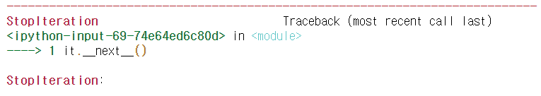
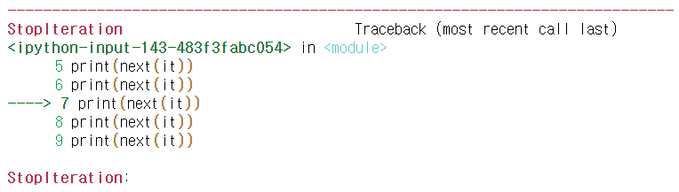
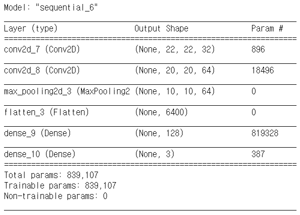
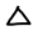
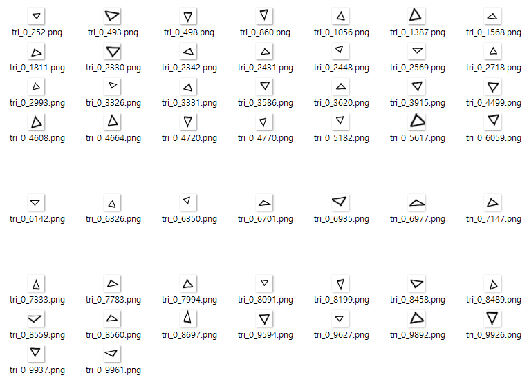
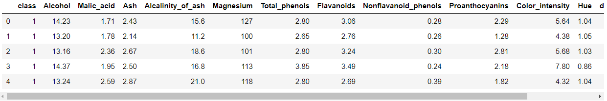

# Day69 TensorFlow와 Keras 라이브러리를 활용한 딥러닝(8)

# MNIST

```python
from keras.datasets import mnist
from keras.utils import np_utils
import numpy as np
import sys
import tensorflow as tf
import os
```

```python
(xTrain, yTrain), (xTest, yTest) = mnist.load_data()

xTrain.shape, yTrain.shape, xTest.shape, yTest.shape
# > ((60000, 28, 28), (60000,), (10000, 28, 28), (10000,))
```
- 데이터 살펴보기

  ```python
  import matplotlib.pyplot as plt
  plt.imshow(xTrain[0], cmap='Greys')
  plt.show()
  ```

  

  ```python
  for x in xTrain[0] :
      for i in x :
          sys.stdout.write('%4d' % i)
      sys.stdout.write('\n')
  ```

  

  ```python
  print(yTrain[0])
  # > 5
  ```

## DNN(Keras)

- 데이터 전처리

  ```python
  xTrain = xTrain.reshape(xTrain.shape[0], 784)
  xTrain = xTrain.astype('float64')
  # float64 : 포용범위가 더 넓음, 메모리 공간 많이 차지
  
  xTrain = xTrain/255
  xTest = xTest.reshape(xTest.shape[0], 784).astype('float64')/255
  ```
  
  - 원핫인코딩
  
    ```python
    yTrain = np_utils.to_categorical(yTrain, 10)
    yTest = np_utils.to_categorical(yTest, 10)
    
    yTrain[0]
    # > array([0., 0., 0., 0., 0., 1., 0., 0., 0., 0.], dtype=float32)
    ```

```python
from keras.models import Sequential
from keras.layers import Dense
from keras.callbacks import ModelCheckpoint, EarlyStopping
```

- 모델

  - 모델 구성

    ```python
    model = Sequential()
    model.add(Dense(512, input_dim=784, activation='relu'))
    model.add(Dense(10, activation='softmax'))
    ```

  - 모델 환경 설정

    ```python
    model.compile(loss='categorical_crossentropy',
                  optimizer='adam', metrics=['accuracy'])
    ```

  - 모델 최적화

    ```python
    modelDir = './myModel/'
    if not os.path.exists(modelDir) :
        # 만약 modelDir 경로가 존재하지 않는다면
        modelPath='./myModel/{epoch:02d}-{val_loss:.4f}.hdf5'
        os.mkdir(modelDir) # 디렉토리 생성 함수
    ```

  - 모델 저장 옵션

    ```python
    checkpointer = ModelCheckpoint(filepath=modelPath, 
                                   monitor='val_loss', 
                                   verbose=1,
                                   save_best_only=True)
    ```

    > - ModelCheckpoint 콜백 함수: keras에서 모델을 학습할때마다 중간중간에 콜백형태로 알려줌
    >   - 콜백 함수 : 어떤 상황에서 시스템이 호출하는 함수
    >   - save_best_only : 모델의 정확도가 최고값을 갱신했을 때만 저장

  - 모델 멈춤 옵션

    ```python
    es = EarlyStopping(monitor='val_loss', patience=10)
    ```

  - 모델 생성

    ```python
    history = model.fit(xTrain, yTrain, 
                        validation_data=(xTest, yTest), 
                        epochs=30, batch_size=200, 
                        callbacks=[es, checkpointer])
    # > Train on 60000 samples, validate on 10000 samples
    # > Epoch 1/30
    # > 60000/60000 [==============================] - 3s 49us/step - loss: 0.0130 - accuracy: 0.9959 - val_loss: 0.0700 - val_accuracy: 0.9797
    # > 
    # > Epoch 00001: val_loss did not improve from 0.05886
    # > ...
    # > Epoch 13/30
    # > 60000/60000 [==============================] - 3s 48us/step - loss: 1.5536e-04 - accuracy: 1.0000 - val_loss: 0.0720 - val_accuracy: 0.9834
    # > 
    # > Epoch 00013: val_loss did not improve from 0.05886
    ```

    > 10번의 epoch동안 val_loss가 감소하지 않아서 13에서 멈춤

  - test accuracy

    ```python
    print('test accuracy : %.4f' % (model.evaluate(xTest, yTest))[1])
    # > 10000/10000 [==============================] - 0s 42us/step
    # > test accuracy : 0.9834
    ```

- 시각화

  - error of test, train set

    ```python
    yVloss = history.history['val_loss'] # test set
    yLoss = history.history['loss'] # train set
    ```

  - 그래프

    ```python
    xLen = np.arange(len(yLoss))
    plt.plot(xLen, yVloss, 
             marker='.', c='red', label='testset_loss')
    plt.plot(xLen, yLoss, 
             marker='.', c='blue', label='trainset_loss')
    plt.legend()
    plt.grid()
    plt.xlabel('epoch')
    plt.ylabel('loss')
    plt.show()
    ```

    

## CNN(Keras)

- 데이터 전처리

  ```python
  (xTrain, yTrain), (xTest, yTest) = mnist.load_data()
  xTrain = xTrain.reshape(xTrain.shape[0], 28, 28, 1).astype('float32')/255
  xTest = xTest.reshape(xTest.shape[0], 28, 28, 1).astype('float32')/255
  ```

  - 원핫인코딩

    ```python
    yTrain = np_utils.to_categorical(yTrain, 10)
    yTest = np_utils.to_categorical(yTest, 10)
    ```

```python
from keras.layers import *
# Conv2D, MaxPooling2D, Dropout, Flatten 등 모든 모듈 import
```

- 모델

  - 모델 구성
    ```python
    model = Sequential()
    model.add(Conv2D(32, kernel_size=(3, 3), 
                     input_shape=(28, 28, 1),
                     activation='relu'))
    # Conv2D : 컨볼루션 계층을 추가하는 함수
    # Conv2D(필터개수, 필터크기(kernel_size), 
    #        input_shape=(행, 열, 채널), 
    #        activation(활성함수))
    model.add(Conv2D(64, (3, 3), 
                     activation='relu'))
    ```

    - 맥스풀링 추가

      ```python
      model.add(MaxPooling2D(pool_size=2))
      ```

    - 드롭아웃

      - overfitting 감소
      - hidden layer의 node 중 일부를 선정하여 학습하는 방법
      - 학습데이터에 지나치게 치우쳐서 학습되는 과정합을 방지

      ```python
      model.add(Dropout(0.25)) # 드롭아웃 비율
      ```

    - Flatten

      ```python
      model.add(Flatten()) # Flatten() : 1차원으로 변경하는 함수
      ```

    - DNN

      ```python
      model.add(Dense(128, activation='relu'))
      model.add(Dropout(0.5))
      model.add(Dense(10, activation='softmax'))
      ```
    
  - 모델 환경 설정

    ```python
    model.compile(loss='categorical_crossentropy',
                  optimizer='adam', metrics=['accuracy'])
    ```

  - 모델 최적화

    ```python
    modelDir = './myCnnModel/'
    if not os.path.exists(modelDir) :
        modelPath='./myCnnModel/{epoch:02d}-{val_loss:.4f}.hdf5'
        os.mkdir(modelDir)
    ```

  - 모델 저장 옵션

    ```python
    checkpointer = ModelCheckpoint(filepath=modelPath, 
                                   monitor='val_loss', 
                                   verbose=1, 
                                   save_best_only=True)
    ```

  - 모델 멈춤 옵션

    ```python
    es = EarlyStopping(monitor='val_loss', patience=10)
    ```

  - 모델 생성

    ```python
    history = model.fit(xTrain, yTrain, 
                        validation_data=(xTest, yTest), 
                        epochs=30, batch_size=200, 
                        callbacks=[es, checkpointer])
    # > Train on 60000 samples, validate on 10000 samples
    # > Epoch 1/30
    # > 60000/60000 [==============================] - 65s 1ms/step - loss: 0.2679 - accuracy: 0.9190 - val_loss: 0.0563 - val_accuracy: 0.9809
    # > 
    # > Epoch 00001: val_loss improved from inf to 0.05635, saving model to ./myCnnModel/01-0.0563.hdf5
    # > ...
    # > Epoch 18/30
    # > 60000/60000 [==============================] - 65s 1ms/step - loss: 0.0143 - accuracy: 0.9952 - val_loss: 0.0274 - val_accuracy: 0.9925
    # > 
    # > Epoch 00018: val_loss did not improve from 0.02482
    ```

- 시각화

  - 예측이 틀린 이미지 8개(2*4) 출력
  - ex. label:9, pred:4
    - 해당 9 이미지
  
  ```python
  index = list()
  origin = list()
  pred = list()
  
  labels = np.argmax(yTest, 1) # 실제 값
  predictions = model.predict_classes(xTest) # 예측 값
  ```
  
  - `실제값 != 예측값` 인 index와 label들 저장
    ```python
    for i in range(len(labels)) :
        if prediction[i] != labels[i] :
            index.append(i)
            origin.append(labels[i])
            pred.append(predictions[i])
    ```
  
  - DataFrame으로 저장
    ```python
    import pandas as pd
    res = pd.DataFrame({'label':origin, 'predict':pred}, index=index)
    print(res)
    # >       label  predict
    # > 92        9        4
    # > 151       9        8
    # > 321       2        7
    # > 340       5        3
    # > 619       1        8
    # > ...     ...      ...
    # > 9664      2        7
    # > 9729      5        6
    # > 9839      2        7
    # > 9850      0        8
    # > 9982      5        6
    # > 
    # > [75 rows x 2 columns]
    ```
  
  - 임의로 8개 추출하기
  
    ```python
    choice = res.sample(n=8).index
    choice
    # > Int64Index([4860, 4783, 883, 1226, 6625, 3853, 6651, 2462], dtype='int64')
    ```
  
  - 추출된 8개의 그래프 그리기
  
    ```python
    cnt = 0
    for n in choice :
        cnt += 1
        plt.subplot(2, 4, cnt)
        plt.imshow(xTest[n].reshape(28,28), cmap='Greys')
        t = 'label:' + str(res['label'][n]) + ', pred:' + str(res['predict'][n])
        plt.title(t)
    plt.tight_layout()
    plt.show()
    ```
  
    

# cf. 생성한 모델 저장하고 불러오기

```python
model.save('파일명.h5')
from keras.models import load_model
model = load_model('모델파일명.h5')
model.summary() # 모델 구조
분류결과 = model.predict_classes(테스트 데이터)
```

# 이터레이터, 제너레이터

- 이터레이터, 제너레이터
  - iterator : 값을 차례대로 꺼낼 수 있는 객체
        - for i in range(100)
            - 정확한 의미 : 0~99까지 값을 차례대로 꺼낼 수 있는 이터레이터 객체 생성
        
    - iterable(반복가능객체, 문자열, 딕셔너리, 리스트, 셋)
         - 객체가 iter메서드를 포함 여부 : 객체가 반복 가능한지 확인
         - ex. `dir([1, 2, 3])`를 입력하면 `'__iter__'` 나옴

## 이터레이터


```python
it = [1, 2, 3].__iter__()
it
# > <list_iterator at 0x1d21f952dc8>

it.__next__()
# > 1

it.__next__()
# > 2

it.__next__()
# > 3

it.__next__()
```



- 반복가능 객체 확인

  ```python
  'hello'.__iter__()
  # > <str_iterator at 0x1d21a273b08>
  
  {'a':1, 'b':2}.__iter__()
  # > <dict_keyiterator at 0x1d21f966598>
  
  {1, 2, 3}.__iter__()
  # > <set_iterator at 0x1d21f9668b8>
  
  it = range(3).__iter__()
  it
  # > <range_iterator at 0x1d21f9285d0>
  
  it.__next__()
  # > 0
  ```

- 이터레이터 생성 방법

  1. range에서 `__iter__`로 이터레이터 객체 생성
  2. 반복할 때마다 이터레이터에서 `__next__`를 호출해서 숫자를 꺼내서 i에 저장

  - 내가 만든 클래스에 __iter__, __next__ 두 메서드를 구현하면, 이터레이터 생성 가능

  ```python
  class MyCounter :
      def __init__(self, stop) :
          self.current = 0
          self.stop = stop
          
      def __iter__(self) :
          return self
      
      def __next__(self) :
          if self.current < self.stop :
              r = self.current
              self.current += 1
              return r
          else :
              raise StopIteration
      
  for i in MyCounter(3) :
      print(i) # 0 1 2
  # > 0
  # > 1
  # > 2
  ```

  - map 활용

    ```python
    a, b, c = map(int, input().split())
    # < 1 2 3 
    
    a, b, c
    # > (1, 2, 3)
    ```

  - `__getitme__`을 이용한 이터레이터 생성

    ```python
    class MyCounter :
        def __getitem__(self, index) :
            if index < self.stop :
                return index # *10를 해주면 0 10, 20 출력
            else :
                raise StopIteration
                
        def __init__(self, stop) :
            self.current = 0
            self.stop = stop
    
    MyCounter(3)
    # > <__main__.MyCounter at 0x1d21fc02248>
    
    MyCounter(3)[0]
    # > 0
    
    for i in MyCounter(3) :
        print(i)
    # > 0
    # > 1
    # > 2
    ```

- 파이썬 `iter`함수 : 객체의 `__iter__`메서드를 호출

  - iter(객체, 반복을 끝낼 값)

  ```python
  import random
  it=iter(lambda :random.randint(0,5),2)
  # random.randint(0, 5)에서 0~5의 임의 정수를 발생 시켜서 2가 발생하면 멈춤
  print(next(it))
  print(next(it))
  print(next(it))
  print(next(it))
  print(next(it))
  print(next(it))
  print(next(it))
  # > 0
  # > 3
  # > 4
  ```

  

- 파이썬 `next`함수 : 객체의 `__next__`메서드를 호출

  ```python
  it = iter(range(3))
  next(it)
  # > 0
  
  next(it)
  # > 1
  ```


## 제너레이터

- 이터레이터를 생성하는 함수
- 함수 내부에 yield 키워드를 주면 이터레아터가 생성

```python
def myGen() :
    yield 0
    yield 1
    yield 2
    
for i in myGen() :
    print(i)
# > 0
# > 1
# > 2
```

```python
mg = myGen()
dir(mg)
# > ['__class__',
# >  '__del__',
# >  '__delattr__',
# >  '__dir__',
# >  '__doc__',
# >  '__eq__',
# >  '__format__',
# >  '__ge__',
# >  '__getattribute__',
# >  '__gt__',
# >  '__hash__',
# >  '__init__',
# >  '__init_subclass__',
# >  '__iter__', #### iterator
# >  '__le__',
# >  '__lt__',
# >  '__name__',
# >  '__ne__',
# >  '__new__',
# >  '__next__', #### iterator
# >  '__qualname__',
# >  '__reduce__',
# >  '__reduce_ex__',
# >  '__repr__',
# >  '__setattr__',
# >  '__sizeof__',
# >  '__str__',
# >  '__subclasshook__',
# >  'close',
# >  'gi_code',
# >  'gi_frame',
# >  'gi_running',
# >  'gi_yieldfrom',
# >  'send',
# >  'throw']
```

- [keras.io의 imageDataGenerator](https://keras.io/preprocessing/image/#imagedatagenerator-class)
  1. 이미지 제너레이터 클래스 객체 생성
  2. flow_from_directory() 호출 -> 제너레이터 생성

```python
from keras.preprocessing.image import ImageDataGenerator
```

- Train Data로 Generator 생성
  ```python
  path_image = '../data_for_analysis/do/'
  
  trainDataGen = ImageDataGenerator(rescale=1./255)
  trainGenerator = trainDataGen.flow_from_directory(
      path_image + 'train', 
      target_size=(24, 24), 
      batch_size=3, 
      class_mode='categorical'
  )
  # > Found 45 images belonging to 3 classes.
  ```
```
  
  > 폴더의 갯수로 class 설정
  
- Test Data로 Generator 생성
  ```python
  testDataGen = ImageDataGenerator(rescale=1./255)
  testGenerator = testDataGen.flow_from_directory(
      path_image + 'test', 
      target_size=(24, 24), 
      batch_size=3, 
      class_mode='categorical'
  )
  # > Found 15 images belonging to 3 classes.
```

- 모델 생성

  ```python
  # 크기(24, 24), 채널(3), 필터(3*3), 필터개수(32), relu
  model = Sequential()
  model.add(Conv2D(32, kernel_size=(3, 3), 
                   activation='relu', 
                   input_shape=(24, 24, 3)))
  
  # 필터(3*3), 필터개수(64), relu
  model.add(Conv2D(64, kernel_size=(3, 3), 
                   activation='relu'))
  
  # maxpool(2*2)
  model.add(MaxPooling2D(pool_size=(2, 2)))
  
  # flatten -> Dense(128개 뉴런 출력) -> Dense(softmax)
  model.add(Flatten())
  model.add(Dense(128, activation='relu'))
  model.add(Dense(3, activation='softmax'))
  
  model.summary()
  ```

  

- 모델 학습 설정

  ```python
  model.compile(loss='categorical_crossentropy', 
                optimizer='adam', metrics=['accuracy'])
  ```

  - fit_generator() : 제너레이터로 생성된 데이터 학습

    ```python
    model.fit_generator(
        trainGenerator, # 훈련데이터 제너레이터 
        steps_per_epoch=15, # 45개의 이미지 / batch_size
        epochs=50,
        validation_data=testGenerator,
        validation_steps=5
    )
    # > Epoch 1/50
    # > 15/15 [==============================] - 1s 36ms/step - loss: 0.6787 - accuracy: 0.8000 - val_loss: 0.4110 - val_accuracy: 1.0000
    # > ...
    # > Epoch 50/50
    # > 15/15 [==============================] - 0s 19ms/step - loss: 3.7167e-06 - accuracy: 1.0000 - val_loss: 0.0826 - val_accuracy: 1.0000
    ```

  - Test Generator로 cost, accuracy 구하기

    ```python
    scores = model.evaluate_generator(
        testGenerator, steps=5
    )
    scores # cost, accuracy
    # > [2.1457124603330158e-05, 1.0]
    ```

- 모델 예측

  ```python
  res = model.predict_generator(testGenerator, steps=5)
  print(res)
  # > [[3.8550625e-09 1.9931931e-06 9.9999797e-01]
  # >  [4.7655326e-06 9.9999380e-01 1.3916969e-06]
  # >  [9.9999940e-01 6.2497418e-07 4.4903053e-10]
  # >  [1.9184169e-01 7.8058779e-01 2.7570462e-02]
  # >  [1.8685793e-06 3.8601359e-04 9.9961215e-01]
  # >  [9.9984241e-01 1.5664742e-04 1.0115828e-06]
  # >  [9.4559269e-08 9.7551833e-07 9.9999893e-01]
  # >  [2.0775390e-07 1.9601182e-06 9.9999785e-01]
  # >  [6.0901255e-07 9.9999928e-01 1.0925723e-07]
  # >  [9.9999774e-01 2.2929564e-06 9.3934927e-10]
  # >  [2.0486873e-07 9.9999964e-01 1.3121681e-07]
  # >  [7.2138851e-06 3.7029614e-03 9.9628985e-01]
  # >  [2.2150796e-06 9.9999750e-01 2.4517371e-07]
  # >  [9.9994290e-01 1.8325853e-05 3.8723083e-05]
  # >  [9.9999523e-01 4.7363560e-06 2.2515387e-08]]
  ```


# 이미지 증식

- `ImageDataGenerator` 클래스를 이용하여 이미지 증식
  - 옵션
    - `rotation_range`
      - 회전
        - ex. 90(0~90동 사이 랜덤)
    - `width_shift_range` 
      - 이동
      - 0~1사이의 비율
        - ex. 0.1(이미지 너비의 10% 좌/우 이동)
    - `height_shift_range`
      - 이동
      - 0~1사이의 비율
        - ex. 0.1(이미지 높이의 10% 위/아래 이동)
    - `shear_range`
      - 변형
      - 라디안
        - ex. 0.5(반시계방향 밀어서 변형)
          - 정삼각형의 경우 -> 높이가 높아지고, 밑변이 좁아짐
    - `zoom_range`
      - 확대/축소
        - ex. 0.3(0.7~1.3 사이의 크기로 변형)
    - `horizontal_flip`
      - 수평 축으로 뒤집기
        - ex. T/F : 정삼각형 -> 역삼각형 
    - `vertical_flip`
      - 수직축으로 뒤집기
        - ex. `ㅏ` -> `ㅓ`

```python
from keras.preprocessing.image import array_to_img, img_to_array, load_img
```

- 데이터 증식 설정
  ```python
  augGen = ImageDataGenerator(rescale=1./255, 
                              rotation_range=15, 
                              width_shift_range=0.1, 
                              height_shift_range=0.1, 
                              shear_range=0.5,
                              zoom_range=[0.8, 2.0], 
                              horizontal_flip=True, 
                              vertical_flip=True, 
                              fill_mode='nearest'
                             )
  ```


- 예
  ```python
  img = load_img(path_image + 'train/triangle/triangle001.png')
  img
  ```
  
  
  
  - shape 맞춰주기
  
    ```python
    x = img_to_array(img)
    x.shape
    # > (24, 24, 3)
  
    x = x.reshape((1,)+x.shape)
    x.shape
    # > (1, 24, 24, 3)
    ```
  
  - 이미지 증식
  
    ```python
    i = 0
    
    ```
  
  for batch in augGen.flow(x, batch_size=1, 
                             save_to_dir='store', 
                             save_prefix='tri', 
                             save_format='png') :
        i += 1
        if i > 50 : break
    ```
    
    
  
    ```


# 연습문제

1. [UCI-Wine](https://archive.ics.uci.edu/ml/datasets/Wine) 분류

- 데이터 불러오기
  ```python
  wine = pd.read_csv('../data_for_analysis/wine.data', header=None)
  wine.head()
  ```

  

- 데이터 열 이름 변경
  ```python
  wine.columns = ['class', 'Alcohol', 'Malic_acid', 
                  'Ash', 'Alcalinity_of_ash', 'Magnesium', 
                  'Total_phenols', 'Flavanoids', 
                  'Nonflavanoid_phenols', 'Proanthocyanins', 
                  'Color_intensity', 'Hue', 'diluted_wines', 
                  'Proline']
  wine.head()
  ```
  
  
  
- 데이터 분할

  ```python
  from sklearn.model_selection import train_test_split
  
  trainX, testX, trainY, testY = train_test_split(
      wine.iloc[:, 1:],
      pd.get_dummies(wine['class']),
      test_size=0.3,
      random_state=1234
  )
  
  trainX.shape, testX.shape, trainY.shape, testY.shape
  # > ((124, 13), (54, 13), (124, 3), (54, 3))
  ```

- 모델 생성 & 평가

  ```python
  model = Sequential()
  model.add(Dense(128, input_dim=13, activation='relu'))
  model.add(Dense(3, activation='softmax'))
  
  model.compile(loss='categorical_crossentropy',
                optimizer='adam', metrics=['accuracy'])
  
  es = EarlyStopping(monitor='val_loss', patience=5)
  
  model.fit(trainX, trainY,
            validation_data=(testX, testY), 
            epochs=30, batch_size=16, callbacks=[es])
  
  print('test accuracy : %.4f' % model.evaluate(testX, testY)[1])
  # > Train on 124 samples, validate on 54 samples
  # > Epoch 1/30
  # > 124/124 [==============================] - 0s 2ms/step - loss: 11.1389 - accuracy: 0.3306 - val_loss: 12.5480 - val_accuracy: 0.2963
  # > ...
  # > 124/124 [==============================] - 0s 129us/step - loss: 0.4090 - accuracy: 0.8629 - val_loss: 0.7049 - val_accuracy: 0.7593
  # > 54/54 [==============================] - 0s 93us/step
  # > test accuracy : 0.7593
  ```

  


