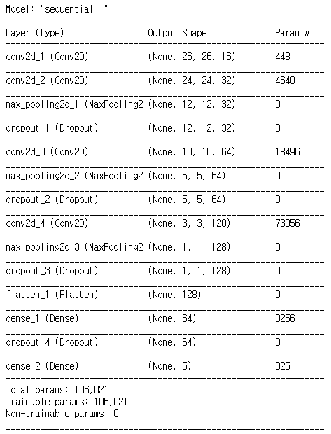
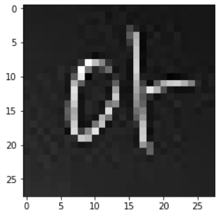
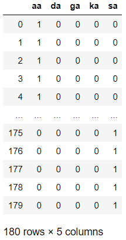

# Day70 미니프로젝트

프로젝트 주제(2가지) : 글자 인식, 작성자 인식 - keras 및 tensorflow

- 2개 버전으로 작성후 공유폴더에 소스 코드 및 테스트 데이터 정확도 제출

  1. 파일 크기 : 28*28*3
  2. 트레이닝 파일 개수: 5(글자수)\*2(세트)\*18(명)=180개
  3. 테스트 파일 개수: 5(글자수)\*1(세트)\*18(명)=90개
  4. 파일명 형식:글자\_이름\_일련번호\_고유번호.jpg
     - 글자 : 가(ga), 다(da), 사(sa), 아(aa), 카(ka)
     - 이름 : 성명 이니셜 2 or 3글자로 구성
     - 일련번호 : 01~02(트레이닝), 03(테스트)
     - 고유번호 : 01~18
  5. 공유폴더 주소 : 70.12.113.130 -> 이미지공유폴더

  - 예시)
    - 글자:'가', 작성자:'박경호', 공유번호:03 인 경우,
    - 파일명 =>
      - ga_pkh_01_03.jpg (트레이닝 데이터로 사용)
      - ga_pkh_02_03.jpg (트레이닝 데이터로 사용)
      - ga_pkh_03_03.jpg (테스트 데이터로 사용)

## 글자 인식

### Keras

```python
import tensorflow as tf
from keras.models import Sequential
from keras.utils import np_utils
from keras.layers import *
from keras.callbacks import EarlyStopping
import numpy as np
import matplotlib.pyplot as plt
from keras.preprocessing.image import ImageDataGenerator
```

- 제너레이터 생성

```python
tf.set_random_seed(1234)
np.random.seed(1234)
path_image = '../data_for_analysis/handwriting/'

trainDataGen = ImageDataGenerator(rescale=1./255, 
                                  validation_split=0.2)

trainGenerator = trainDataGen.flow_from_directory(
    path_image + 'letter/train',
    target_size=(28, 28),
    batch_size=5,
    class_mode='categorical',
    subset='training'
)

valGenerator = trainDataGen.flow_from_directory(
    path_image + 'letter/train',
    target_size=(28, 28),
    batch_size=5,
    class_mode='categorical',
    subset='validation'
)
# > Found 145 images belonging to 5 classes.
# > Found 35 images belonging to 5 classes.
```

```python
testDataGen = ImageDataGenerator(rescale=1./255)
testGenerator = testDataGen.flow_from_directory(
    path_image + 'letter/test',
    target_size=(28, 28),
    batch_size=5,
    class_mode='categorical'
)
# > Found 90 images belonging to 5 classes.
```

- 모델생성

```python
tf.set_random_seed(1234)
np.random.seed(1234)

# 모델 생성
# 필터개수(32), 필터(3*3), relu, 크기(28, 28), 채널(3)
model = Sequential()
model.add(Conv2D(16, kernel_size=(3, 3), 
                 activation='relu', 
                 input_shape=(28, 28, 3)))


# 필터개수(64), 필터(3*3), relu
model.add(Conv2D(32, (3, 3), activation='relu'))

# maxpool(2*2)
model.add(MaxPooling2D(pool_size=(2, 2)))

# dropout
model.add(Dropout(0.2, seed=1234))

model.add(Conv2D(64, (3, 3), activation='relu'))
model.add(MaxPooling2D(pool_size=(2, 2)))
model.add(Dropout(0.2, seed=1234))

model.add(Conv2D(128, (3, 3), activation='relu'))
model.add(MaxPooling2D(pool_size=(2, 2)))
model.add(Dropout(0.2, seed=1234))

# 평탄화 -> Dense(128, relu) -> Dense(5, softmax)
model.add(Flatten())
model.add(Dense(64, activation='relu'))
model.add(Dropout(0.2, seed=1234))
model.add(Dense(5, activation='softmax'))

model.summary()
```



- 모델 학습 설정

```python
# 모델 학습 설정
model.compile(loss='categorical_crossentropy',
              optimizer='adam',
              metrics=['accuracy'])

# EarlyStopping
early_stop = EarlyStopping(monitor='val_loss', patience=10)
```

- 모델 적합

```python
# 모델 적합
model.fit_generator(
    trainGenerator,
    steps_per_epoch=trainGenerator.samples//5,
    epochs=100,
    callbacks=[early_stop],
    validation_data=valGenerator,
    validation_steps=valGenerator.samples//5
)
# > Epoch 1/100
# > 29/29 [==============================] - 1s 38ms/step - loss: 1.6378 - accuracy: 0.1586 - val_loss: 1.6194 - val_accuracy: 0.2000
# > ...
# > Epoch 33/100
# > 29/29 [==============================] - 1s 27ms/step - loss: 0.1117 - accuracy: 0.9793 - val_loss: 0.9507 - val_accuracy: 0.8857
```

- test Generator로 cost, accuracy

```python
scores = model.evaluate_generator(testGenerator)
scores
# > [1.4395259618759155, 0.800000011920929]
```

### TensorFlow


- data **파일명** 불러오기

```python
import os

train_list = list()
test_list = list()
for l in ['aa', 'da', 'ga', 'ka', 'sa'] : 
    train_list.extend(os.listdir(path_image + 'letter/train/' + l))
    test_list.extend(os.listdir(path_image + 'letter/test/' + l))
```

- data **파일** 불러오기

```python
from matplotlib import image

tmp = list()
for fname in train_list :
    data = image.imread(path_image + 'letter/train/' + fname[0:2] + '/' + fname)
    if len(data.shape) == 3 : # 채널이 3인 경우 1로 다운
        data = np.dot(data[..., :3], [0.299, 0.587, 0.144])
    tmp.append(data)

trainX = np.append([tmp[0]], [tmp[1]], axis=0)
for i in range(2, len(tmp)) :
    trainX = np.append(trainX, [tmp[i]], axis=0)

trainX.shape
# > (180, 28, 28)
```

```python
plt.imshow(trainX[0], cmap='Greys')
plt.show()
```



```python
tmp = list()
for fname in test_list :
    data = image.imread(path_image + 'letter/test/' + fname[0:2] + '/' + fname)
    if len(data.shape) == 3 : # 채널이 3인 경우 1로 다운
        data = np.dot(data[..., :3], [0.299, 0.587, 0.144])
    tmp.append(data)

testX = np.append([tmp[0]], [tmp[1]], axis=0)
for i in range(2, len(tmp)) :
    testX = np.append(testX, [tmp[i]], axis=0)

testX.shape
# > (90, 28, 28)
```

- label 저장하기

```python
trainY = np.array([fname[0:2] for fname in train_list])
testY = np.array([fname[0:2] for fname in test_list])
testY
# > array(['aa', 'aa', 'aa', 'aa', 'aa', 'aa', 'aa', 'aa', 'aa', 'aa', 'aa',
# >        'aa', 'aa', 'aa', 'aa', 'aa', 'aa', 'aa', 'da', 'da', 'da', 'da',
# >        'da', 'da', 'da', 'da', 'da', 'da', 'da', 'da', 'da', 'da', 'da',
# >        'da', 'da', 'da', 'ga', 'ga', 'ga', 'ga', 'ga', 'ga', 'ga', 'ga',
# >        'ga', 'ga', 'ga', 'ga', 'ga', 'ga', 'ga', 'ga', 'ga', 'ga', 'ka',
# >        'ka', 'ka', 'ka', 'ka', 'ka', 'ka', 'ka', 'ka', 'ka', 'ka', 'ka',
# >        'ka', 'ka', 'ka', 'ka', 'ka', 'ka', 'sa', 'sa', 'sa', 'sa', 'sa',
# >        'sa', 'sa', 'sa', 'sa', 'sa', 'sa', 'sa', 'sa', 'sa', 'sa', 'sa',
# >        'sa', 'sa'], dtype='<U2')
```

- label 더미로 변경

```python
import pandas as pd
trainY = pd.get_dummies(trainY)
testY = pd.get_dummies(testY)
trainY
```



```python
trainY.shape
# > (180, 5)
```

- 전에 생성한 그래프가 존재할 경우 삭제

```python
tf.reset_default_graph()
```

- 모델 생성 및 적합, test data에 적용하기

```python
num_class = 5
image_pixels = 28*28
lr = 0.01
epochs = 100

keep_prob = tf.placeholder(tf.float32)
x = tf.placeholder(dtype=tf.float32, shape=[None, 28, 28])
ximg = tf.reshape(x, [-1, 28, 28, 1])
y = tf.placeholder(dtype=tf.float32, shape=[None, num_class])


# hidden 1
layer1_units = 32
w1 = tf.Variable(
    tf.random_normal([3, 3, 1, layer1_units],
                     stddev=1/tf.sqrt(float(image_pixels))), 
    name='w1')
layer1 = tf.nn.relu(tf.nn.conv2d(ximg, w1,
                                 strides=[1, 1, 1, 1], 
                                 padding='SAME'))
layer1 = tf.nn.max_pool(layer1, ksize=[1, 2, 2, 1],
                        strides=[1, 2, 2, 1], padding='SAME')
layer1 = tf.nn.dropout(layer1, keep_prob=keep_prob)


# hidden 2
layer2_units = 64
w2 = tf.Variable(
    tf.random_normal([3, 3, layer1_units, layer2_units],
                        stddev=1/tf.sqrt(float(image_pixels))),
    name='w2'
)
layer2 = tf.nn.relu(tf.nn.conv2d(layer1, w2, 
                                 strides=[1, 1, 1, 1], 
                                 padding='SAME'))
layer2 = tf.nn.max_pool(layer2, ksize=[1, 2, 2, 1],
                        strides=[1, 2, 2, 1], padding='SAME')
layer2 = tf.nn.dropout(layer2, keep_prob=keep_prob)


# flatten
layer2_flat = tf.reshape(layer2, [-1, 7*7*layer2_units])


# FC(Fully Connected)
w3 = tf.get_variable(
    name='w3', shape=[7*7*layer2_units, 5],
    initializer=tf.contrib.layers.xavier_initializer()
)
b = tf.Variable(tf.zeros([num_class], name='b'))
hf = tf.matmul(layer2_flat, w3) + b


cost = tf.reduce_mean(
    tf.nn.softmax_cross_entropy_with_logits_v2(hf, y)
)
opt = tf.train.AdamOptimizer(lr).minimize(cost)

sess = tf.Session()
sess.run(tf.global_variables_initializer())

for epoch in range(epochs) :
    fd = {x:trainX, y:trainY, keep_prob:0.7}
    cv, _ = sess.run([cost, opt], feed_dict=fd)
    
    # print('epoch : %04d, cost = %.5f' % (epoch+1, cv))
    
pred = tf.equal(tf.argmax(hf, 1), tf.argmax(y, 1))
acc = tf.reduce_mean(tf.cast(pred, tf.float32))
print('accuracy : ', sess.run(acc,
                             feed_dict={x:testX, y:testY,
                                        keep_prob:1.}))
# > accuracy :  0.2
```

