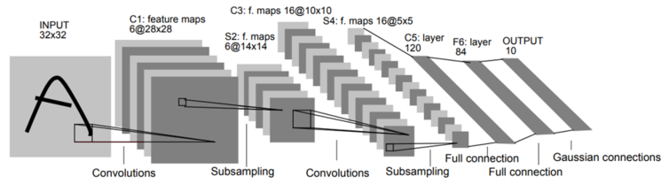
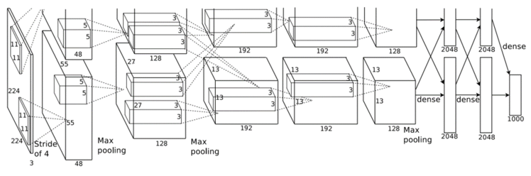
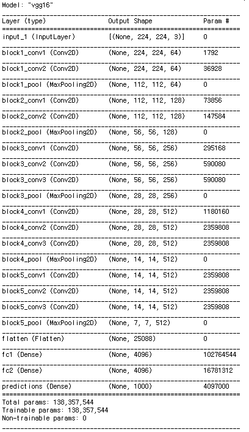
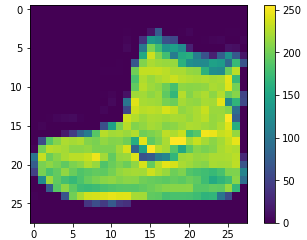
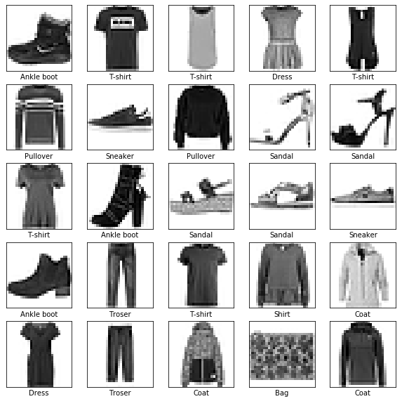
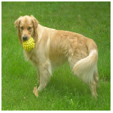
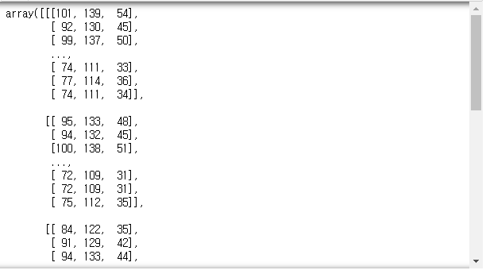
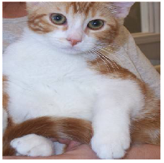
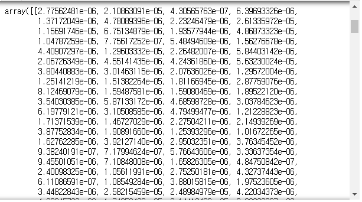

# Day72 CNN을 활용한 이미지 데이터 모델링(4)

## CNN 기반 유명 네트워크

- keras에 구현되어 있는 모델들 [keras.io/applications](https://keras.io/applications/ )

1. LeNet(1, 2, ..., 5)

   - CNN 계열의 단군 할아버지

   - LeNet-5의 구조

     

2. ImageNet Classification with Deep CNN

   - Alex가 만들어 AlexNet으로 많이 불림

   - [ImageNet Classification with Deep Convolutional Neural Networks](https://papers.nips.cc/paper/4824-imagenet-classification-with-deep-convolutional-neural-networks.pdf) 5p, 핵심 구조

     

   - 두 개의 GPU로 병렬연산을 수행할 수 있도록 한 병렬구조

3. VGGNet

   - [Return of the Devil in the Detail: Delving Deep into Convolution Nets](https://arxiv.org/pdf/1405.3531.pdf)
   - VGG-(F, M, S), VGG16, VGG19, ...
     - F, M, S는 속도 의미, S는 느리지만 정확도는 가장 높음

4. GoogLeNet

   - [Going Deeper with Convolutions](http://openaccess.thecvf.com/content_cvpr_2015/papers/Szegedy_Going_Deeper_With_2015_CVPR_paper.pdf)
   - 진보한 네트워크

5. ResNet

   - [Deep Residual Learning for Image Recognition](http://openaccess.thecvf.com/content_cvpr_2016/papers/He_Deep_Residual_Learning_CVPR_2016_paper.pdf)
   - VGGNet을 응욯버전으로 성능 개선

6. SENet(Squeeze-and-Excitation Networks)

   - [Squeeze-and-Excitation Networks](http://openaccess.thecvf.com/content_cvpr_2018/papers/Hu_Squeeze-and-Excitation_Networks_CVPR_2018_paper.pdf)
     - 2018년에 발표된 논문 
   - SE block으로 성능 대폭 향상

## VGGNet(이미지 분류)

- 네트워크가 다 만들어져 있어 바로 분류 가능

### VGGNet 모델 불러오기

```python
import tensorflow
from tensorflow.keras.applications.vgg16 import VGG16, decode_predictions
```

```python
vgg = VGG16()
vgg.summary()
```



### fashion_mnist 분류

```python
import tensorflow as tf
from tensorflow import keras
import numpy as np
import matplotlib.pyplot as plt
```

- 데이터 불러오기

  ```python
  fashion_mnist = keras.datasets.fashion_mnist
  (trainImages, trainLabels),(testImages, testLabels) = fashion_mnist.load_data()
  ```

- 분류 이름 할당

  ```python
  classNames=['T-shirt', 'Troser', 'Pullover', 
              'Dress', 'Coat', 'Sandal', 
              'Shirt', 'Sneaker', 'Bag', 'Ankle boot']
  ```

- 데이터 확인

  ```python
  trainLabels
  # > array([9, 0, 0, ..., 3, 0, 5], dtype=uint8)
  
  testLabels
  # > array([9, 2, 1, ..., 8, 1, 5], dtype=uint8)
  
  trainImages.shape
  # > (60000, 28, 28)
  
  trainLabels.shape # 0~9로 이루어짐
  # > (60000,)
  
  testImages.shape
  # > (10000, 28, 28)
  ```

- 이미지 출력

  ```python
  plt.figure()
  plt.imshow(trainImages[0])
  plt.colorbar()
  plt.show()
  ```

  

  ```python
  trainLabels[0]
  # > 9
  ```

  ```python
  plt.figure(figsize=(10,10))
  for i in range(25):
      plt.subplot(5, 5, i+1)
      plt.xticks([])
      plt.yticks([])
      plt.imshow(trainImages[i], cmap=plt.cm.binary)
      plt.xlabel(classNames[trainLabels[i]])
  plt.show()
  ```

  

- 전처리(정규화)

  ```python
  trainImages = trainImages/255.0
  testImages = testImages/255.0
  ```

- 구현해보기
  1. 층 설정(Sequential, Dense,...)
  2. 모델 설정(model.compile(opt, loss, met))
  3. 모델 훈련(fit 설정)
  4. 정확도 평가(evaluate)

- 모델 구현

  ```python
  from tensorflow.keras import Sequential
  from tensorflow.keras.layers import *
  ```

  - 층 설정

    ```python
    model = keras.Sequential()
    model.add(Flatten(input_shape=(28, 28))) 
    # 배열 변환해주는 층. Flatten:28*28(2차원 배열) => 784픽셀(1차원 배열)
    model.add(Dense(128, activation='relu'))
    model.add(Dense(10, activation='softmax'))
    ```

  - 모델 설정

    ```python
    model.compile(loss='sparse_categorical_crossentropy',
                  optimizer='adam', metrics=['accuracy'])
    ```

    > binary_crossentropy
    >
    > categorical_crossentropy : 원핫인코딩이 반드시 되어있어야 가능
    >
    > sparse_crossentropy : 원핫인코딩 없이 사용 가능, 숫자끼리 비교

  - 모델 훈련

    ```python
    model.fit(trainImages, trainLabels, epochs=5)
    # > Train on 60000 samples
    # > Epoch 1/5
    # > 60000/60000 [==============================] - 3s 42us/sample - loss: 0.5018 - acc: 0.8246
    # > Epoch 2/5
    # > 60000/60000 [==============================] - 2s 38us/sample - loss: 0.3770 - acc: 0.8652
    # > Epoch 3/5
    # > 60000/60000 [==============================] - 2s 38us/sample - loss: 0.3392 - acc: 0.8765
    # > Epoch 4/5
    # > 60000/60000 [==============================] - 2s 37us/sample - loss: 0.3143 - acc: 0.8842
    # > Epoch 5/5
    # > 60000/60000 [==============================] - 2s 37us/sample - loss: 0.2952 - acc: 0.8917
    ```

  - 정확도 평가

    ```python
    testLoss, testAcc = model.evaluate(testImages, testLabels)
    print(testAcc)
    # > 10000/10000 [==============================] - 0s 28us/sample - loss: 0.3445 - acc: 0.8756
    # > 0.8756
    ```

- 예측

  ```python
  pre = model.predict(testImages)
  classNames[np.argmax(pre[0])]
  # > 'Ankle boot'
  ```

### cat, dog 품종 예측하기

- 개

```python
from PIL import Image # 이미지 파일 불러올 수 있는 패키지

path_dvc = '../data_for_analysis/dogs-vs-cats/train/'
Image.open(path_dvc + 'dog.66.jpg').resize((224,224))
```



```python
img = np.array(Image.open(path_dvc + 'dog.66.jpg').resize((224,224))) # 이미지 데이터를 수치로 
img
```



```python
img.shape
# > (224, 224, 3)

yhat = vgg.predict(img.reshape(-1,224,224,3)) # 4차원으로
# yhat: vgg를 이용한 예측결과

yhat.shape # 분류 결과가 1000개
# > (1, 1000)

labelidx = np.argmax(yhat)
labelidx # 예측확률이 가장 높은 index
# > 212
```

```python
label = decode_predictions(yhat) # 확률이 높은 품종 데이터 추출
np.shape(label)
# > (1, 5, 3)

label
# > [[('n02100735', 'English_setter', 0.97402024),
# >   ('n02101556', 'clumber', 0.024954088),
# >   ('n02100877', 'Irish_setter', 0.00043494563),
# >   ('n02102480', 'Sussex_spaniel', 0.0002594847),
# >   ('n02101006', 'Gordon_setter', 0.00019695534)]]

print('예상 품종: ', label[0][0][1])
print('확률: ',label[0][0][2]) 
# > 예상 품종:  English_setter
# > 확률:  0.97402024
```

- 고양이

```python
Image.open(path_dvc + 'cat.9.jpg').resize((224,224))
```



```python
img_cat = np.array(Image.open(path_dvc + 'cat.9.jpg').resize((224,224)))
yhat_cat = vgg.predict(img_cat.reshape(-1,224,224,3))

label = decode_predictions(yhat_cat)
print('예상 품종: ', label[0][0][1])
print('확률: ',label[0][0][2])  
# > 예상 품종:  Egyptian_cat
# > 확률:  0.46320504
```

## ResNet

- Cats, Dogs 분류하기
- [Usage examples for image classification models](https://keras.io/applications/) 예시 활용

```python
from keras.applications.resnet50 import ResNet50
from keras.preprocessing import image
from keras.applications.resnet50 import preprocess_input, decode_predictions
import numpy as np
```

```python
model = ResNet50(weights='imagenet')

img_path = path_dvc + 'dog.66.jpg'
img = image.load_img(img_path, target_size=(224, 224))
x = image.img_to_array(img)
x = np.expand_dims(x, axis=0)
x = preprocess_input(x)

preds = model.predict(x)
# decode the results into a list of tuples (class, description, probability)
# (one such list for each sample in the batch)
preds
```



```python
# 가장 유사한 품종 출력
print('Predicted:', decode_predictions(preds, top=3)[0])
# > Predicted: [('n02099601', 'golden_retriever', 0.76901), ('n02099712', 'Labrador_retriever', 0.06806359), ('n02100735', 'English_setter', 0.024903713)]
```

# 연습문제

- fashion data
  1. 예측이미지 / 실제이미지 라벨 비교시 많이 틀린 이미지 출력
     - 정답: 신발, 예측을 잘못한 모든 케이스에 대해 어떤 예측으로 했는지 출력(최대값)
  2. fashion mnist 구현(신경망) -> CNN
- 비행기 인식(내일 수업시간에 같이 할 것)