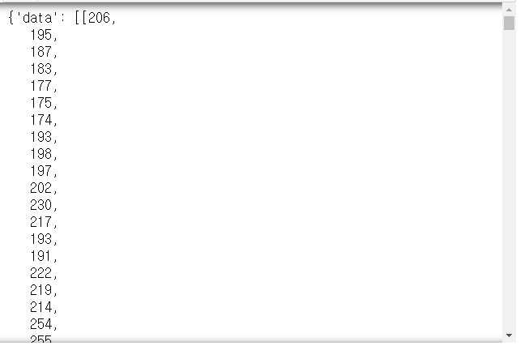
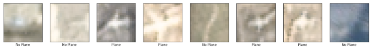
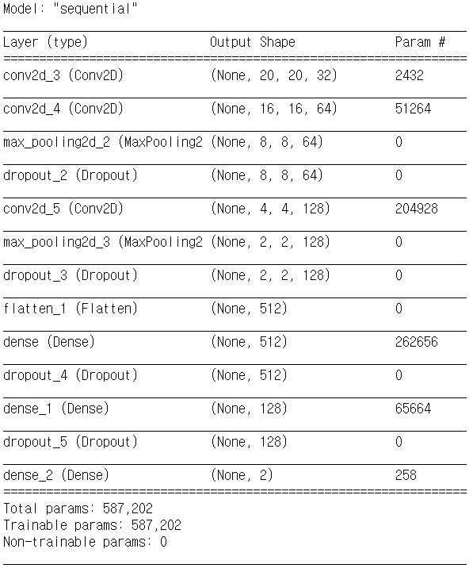
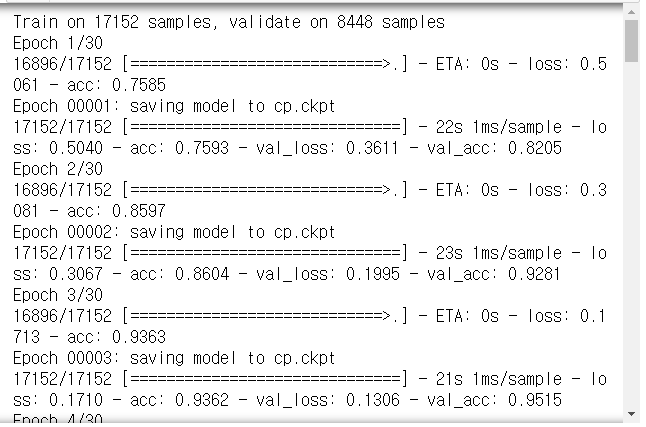
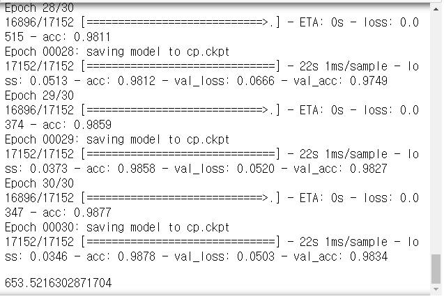

# Day73 TensorFlow와 Keras 라이브러리를 활용한 딥러닝(11)

# CNN

## 비행기 인식

- [Kaggle - Planes in Satellite Imagery](https://www.kaggle.com/rhammell/planesnet)

```python
import json
import pandas as pd
import numpy as np
import tensorflow as tf
from tensorflow import keras
from sklearn.model_selection import train_test_split
from tensorflow.keras.utils import to_categorical
import matplotlib.pyplot as plt
```

- 데이터 불러오기

```python
path_planes = '../data_for_analysis/planesnet/'
f_plane = open(path_planes + 'planesnet/planesnet.json')
f_plane
# > <_io.TextIOWrapper name='../data_for_analysis/planesnet/planesnet/planesnet.json' mode='r' encoding='cp949'>

plane_dataset = json.load(f_plane)
f_plane.close() # 메모리를 차지하므로 사용이 끝났으면 닫는 것이 좋다.

plane_dataset
```



```python
plane_dataset.keys()
# > dict_keys(['data', 'labels', 'locations', 'scene_ids'])
```

- cf. 숫자형 데이터 타입
  - int8, 16, 32, 64
  - uint8, 16, 32, 64(부호가 없는 정수형 타입)
  - float8, 16, 32, 64
  - int8 : 8bit로 정수를 표현
  - 굳이 큰 메모리가 필요하지 않다면 사이즈에 맞게 할당하는 것이 좋다.

- 데이터 전처리

```python
plane_x = np.array(plane_dataset['data']).astype('uint8')
plane_y = np.array(plane_dataset['labels']).astype('uint8')

plane_x.shape, plane_y.shape
# > ((32000, 1200), (32000,))
```

```python
plane_x = plane_x.reshape([-1, 3, 20, 20]).transpose([0, 2, 3, 1]) # transpose([0, 2, 3, 1]) ; 데이터 차원 순서 지정
plane_x
# > (32000, 20, 20, 3)
```

- 데이터 순서 섞기

```python
shuffle_index = np.arange(32000)
np.random.shuffle(shuffle_index)
shuffle_index
# > array([29069, 22099,   700, ..., 16982, 28674, 11706])

plane_x = plane_x[shuffle_index]
plane_y = plane_y[shuffle_index]
```

- 정규화

```python
plane_x = plane_x/255.0
```

- 분류 이름 dict 생성

```python
plane_class = {0:'No Plane', 1:'Plane'}
```

- 데이터 일부 시각화

```python
plt.figure(figsize=(20, 10))
for i in range(8) :
    plt.subplot(1, 8, i+1)
    plt.xticks([])
    plt.yticks([])
    plt.imshow(plane_x[i], cmap=plt.cm.binary)
    plt.xlabel(plane_class[plane_y[i]])
```



- 데이터 분할

```python
plane_x_train, plane_x_test, plane_y_train, plane_y_test = train_test_split(plane_x, plane_y, test_size=0.2)
```

- 모델 생성

```python
def cnn_model(inputshape) :
    model = tf.keras.Sequential([
        keras.layers.Conv2D(32, (5, 5), # units, filter
                            input_shape=inputshape, 
                            activation='relu', 
                            padding='SAME'),
        keras.layers.Conv2D(64, (5, 5),
                            activation='relu'),
        keras.layers.MaxPooling2D(2, 2),
        keras.layers.Dropout(0.25),
        
        
        keras.layers.Conv2D(128, (5, 5),
                            activation='relu'),
        keras.layers.MaxPooling2D(2, 2),
        keras.layers.Dropout(0.25),
        
        keras.layers.Flatten(),
        
        keras.layers.Dense(512, activation='relu'),
        keras.layers.Dropout(0.35),
        
        keras.layers.Dense(128, activation='relu'),
        keras.layers.Dropout(0.35),
        
        keras.layers.Dense(2, activation='softmax')
    ])
    model.summary()
    
    return model

training_plane = cnn_model((20, 20, 3))
```



- check point 설정

```python
import os
checkpoint_path1 = 'cp.ckpt'
checkpoint_dir1 = os.path.dirname(checkpoint_path1)

cp_callback1 = tf.keras.callbacks.ModelCheckpoint(
    checkpoint_path1,
    save_weight_only=True, verbose=1)
```

- 모델 컴파일

```python
training_plane.compile(
    optimizer=tf.keras.optimizers.Adam(),
    loss=tf.keras.losses.sparse_categorical_crossentropy,
    metrics=['accuracy'])
```

- 걸리는 시간 확인해보기

  - `time.time()`

    ```python
    import time
    
    time.time() # 기준날짜로 부터 지난 초
    # > 1588125478.6933694
    ```

  ```python
  strat_time_plane = time.time()
  
  history = training_plane.fit(plane_x_train, plane_y_train,
                               validation_split=0.33,
                               epochs=30,
                               callbacks=[cp_callback1],
                               batch_size=256)
  # validation_split=0.33 ; xTrain, yTrain을 33% 분리하여 검증데이터로 사용
  
  training_time_plane = time.time() - start_time_plane
  training_time_plane
  ```

  

  

- 검증

```python
training_plane.evaluate(plane_x_test, plane_y_test)
# > 6400/6400 [==============================] - 2s 322us/sample - loss: 0.0490 - acc: 0.9833
# > [0.04897006652623531, 0.98328125]
```

- 예측

```python
prediction_plane = training_plane.predict(plane_x_test)
```


# RNN

- 이론 자료
  - [Understanding LSTM Networks of colah](https://colah.github.io/posts/2015-08-Understanding-LSTMs/)
  - [stanford univ syllabus](http://cs231n.stanford.edu/2017/syllabus.html)
    - [lecture 10](http://cs231n.stanford.edu/slides/2017/cs231n_2017_lecture10.pdf)
    - cf. 'vanilla' : 아무것도 첨가되지 않은, 일반적인


# 연습문제

1. 비행기 인식 결과를 이용하여 loss, accuracy 그래프 작성

   - x축:epochs, y축:loss or accuracy

2. sonar 분류

   ```python
   from sklearn.prepocessing import LabelEncoder
   ```

   1. 모델

      ```python
      e = LabelEncoder()
      e.fit(ydata)
      y = e.transform(ydata)
      ```

      - loss='mse', opt='adam', ...
      - 과적합 발생

   2. 학습셋과 테스트셋 분리

      - ex. 데이터 100개
        - 70개 학습용, 30개 테스트용
        - 70개 학습 -> 모델 -> 30개 테스트

   3. 모델 저장/불러오기

      ```python
      from keras.models import load_model
      ```

      - 저장 : `model.save('mymodel.h5')`
      - 불러오기 : `model = load_model('mymodel.h5')`

   4. k-fold cross validation

   5. fold 교차 검증 : 데이터를 5개로 나눔