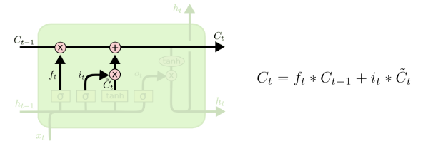
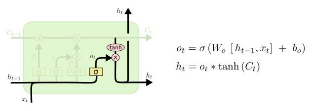
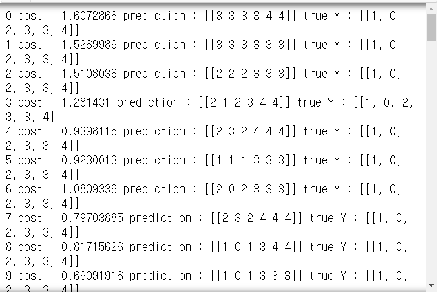
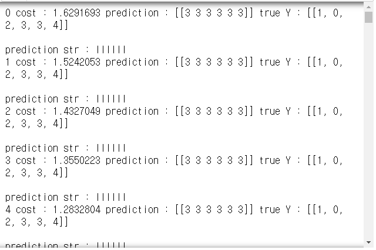

# Day74 RNN을 활용한 챗봇  시스템 구축(1)

## LSTM 계층

- [colah's Undetstanding LSTMs](https://colah.github.io/posts/2015-08-Understanding-LSTMs/)



- `C_t` : 기억 셀(t시점에서의 LSTM의 기억이 저장)
  - 과거(`0`)부터 현재(`t`)까지 필요한 모든 정보가 저장



- `h_t` : `C_t`를 바탕으로 다음 시점의 LSTM에 보낼 현재 셀의 상태정보로서 `h_t`는 현재 셀(`C_t`)의 값을 `tanh` 함수로 변환한 값

## 실습

```python
import tensorflow as tf
import numpy as np
```

### 간단 버전

```python
hidden_size = 2
cell = tf.contrib.rnn.BasicLSTMCell(num_units=hidden_size)
# 출력 shape = (1, 1, 2)

xdata = np.array([[[1, 0, 0, 0]]], dtype=np.float32)
xdata.shape
# > (1, 1, 4)

sess = tf.Session()
outputs, _states = tf.nn.dynamic_rnn(cell, xdata, dtype=np.float32)
sess.run(tf.global_variables_initializer())
print(sess.run(outputs))
# > [[[-0.08726157 -0.16790345]]]
```

- cf.

```python
# 실행하면 안됨
# h -> [1, 0, 0, 0]
xdata = np.array([['h', 'e', 'l', 'l', 'o'],
                  ['e', 'o', 'l', 'l', 'l'], 
                  ['l', 'l', 'e', 'e', 'l']], dtype=np.float32)
# xdata를 OneHot을 수행하면 shape=(3, 5, 4)
hidden_size = 2
cell = tf.contrib.rnn.BasicLSTMCell(num_units=hidden_size)
# xdata를 OneHot encoding하고 Session을 수행하면 결과 값의 shape은 (3, 5, 2)이다.
```

### hihello

- hihello 문자열
  - 입력 : hihell
  - 출력 : ihello

```python
tf.reset_default_graph()
```

```python
idx2char = ['h', 'i', 'e', 'l', 'o']
xdata=[[0, 1, 0, 2, 3, 3]] # hihell 입력
xOneHot = [[
    [1, 0, 0, 0, 0], # h
    [0, 1, 0, 0, 0], # i
    [1, 0, 0, 0, 0], # h
    [0, 0, 1, 0, 0], # e
    [0, 0, 0, 1, 0], # l
    [0, 0, 0, 1, 0]  # l
]]
ydata = [[1, 0, 2, 3, 3, 4]] # ihello 출력
```

- 사용할 변수 선언

```python
num_classes = 5
input_dim = 5 # 원핫 크기
hidden_size = 5 # RNN(LSTM) CELL에서 출력 크기
batch_size = 1 # 문장 1개
sequence_length = 6 # 문장의 길이(6개 입력, 6개 출력)
learning_rate = 0.1
```

- 모델 설계

```python
x = tf.placeholder(tf.float32, 
                   [None, sequence_length, input_dim])
y = tf.placeholder(tf.int32, [None, sequence_length])

# LSTM cell 설정
cell = tf.contrib.rnn.BasicLSTMCell(num_units=hidden_size, 
                                    state_is_tuple=True)
initial_state = cell.zero_state(batch_size, tf.float32) # 0으로 초기화
outputs, _states = tf.nn.dynamic_rnn(
    cell, x, initial_state=initial_state, dtype=tf.float32
)

xForFc = tf.reshape(outputs, [-1, hidden_size])
outputs1 = tf.contrib.layers.fully_connected(
    inputs=xForFc, num_outputs=num_classes, 
    activation_fn=None
    # None : activation_fn 사용 안함
    # 층이 여러개이면 'relu' 사용
)
outputs1 = tf.reshape(outputs1, 
                     [batch_size, sequence_length, num_classes])

weight = tf.ones([batch_size, sequence_length])

sequence_loss = tf.contrib.seq2seq.sequence_loss(
    logits=outputs1, targets=y, weights=weight
)

loss = tf.reduce_mean(sequence_loss)
train = tf.train.AdamOptimizer(learning_rate).minimize(loss)

prediction = tf.argmax(outputs1, axis=2)
```

- training

```python
with tf.Session() as sess :
    sess.run(tf.global_variables_initializer())
    for i in range(100) :
        loosv, _ = sess.run([loss, train], 
                            feed_dict={x:xOneHot, y:ydata})
        res = sess.run(prediction, feed_dict={x:xOneHot})
        print(i, 'cost :', loosv, 'prediction :', res, 
              'true Y :', ydata)
```



```python
tf.reset_default_graph()
```


```python
with tf.Session() as sess :
    sess.run(tf.global_variables_initializer())
    for i in range(100) :
        loosv, _ = sess.run([loss, train], 
                            feed_dict={x:xOneHot, y:ydata})
        res = sess.run(prediction, feed_dict={x:xOneHot})
        print(i, 'cost :', loosv, 'prediction :', res, 
              'true Y :', ydata)
        
        s = [idx2char[c] for c in np.squeeze(res)]
        print('\nprediction str :', ''.join(s))
```



----

## np.squeeze()

```python
x = np.array([1, 2])
x.shape
# > (2,)

y = np.expand_dims(x, axis=0)
y.shape
# > (1, 2)

y
# > array([[1, 2]])

y = np.expand_dims(x, axis=1)
y.shape
# > (2, 1)

y
# > array([[1],
# >        [2]])
```

```python
x = np.array([[[0], [1], [2]]])
x.shape
# > (1, 3, 1)

np.squeeze(x)
# > array([0, 1, 2])
```

----

### MNIST

- MNIST => RNN 구조 -> 딥러닝

```python
from tensorflow.examples.tutorials.mnist import input_data

mnist = input_data.read_data_sets('./mnist/data', one_hot=True)
```

- 사용할 변수 선언

```python
lr = 0.01
total_epoch = 30
batch_size = 128

n_input = 28 # 한번에 입력받는 데이터 개수
n_step = 28 # 28줄
n_hidden = 128 # 셀에서 나가는 출력의 개수
n_class = 10 # 숫자의 종류 0~9

total_batch = int(mnist.train.num_examples/batch_size)
```

- 모델을 위한 변수 형태 선언

```python
x = tf.placeholder(tf.float32, [None, n_step, n_input])
y = tf.placeholder(tf.float32, [None, n_class])

w = tf.Variable(tf.random_normal([n_hidden, n_class]))
b = tf.Variable(tf.random_normal([n_class]))
```

- rnn 학습할 셀 생성

```python
cell = tf.nn.rnn_cell.BasicLSTMCell(num_units=n_hidden)
```

- rnn 망 구성

```python
output, _states = tf.nn.dynamic_rnn(cell, x, dtype=tf.float32)
# output : [batch_size, n_step, n_hidden]
# -> 구조변경(y) -> [n_step, batch_size, n_hidden]
# -> [batch_size, n_class]

output = tf.transpose(output, [1, 0, 2])
output = output[-1] # n_step이 빠짐
# output=[batch_size, n_hidden]

model = tf.matmul(output, w) + b
cost = tf.reduce_mean(
    tf.nn.softmax_cross_entropy_with_logits(logits=model, 
                                            labels=y)
)
opt = tf.train.AdamOptimizer(lr).minimize(cost)
```

- 신경망 모델 학습

```python
sess = tf.Session()
sess.run(tf.global_variables_initializer())

for epoch in range(total_epoch) :
    total_cost = 0
    for i in range(total_batch) :
        batchX, batchY = mnist.train.next_batch(batch_size)
        batchX = batchX.reshape((batch_size, n_step, n_input))
        # 128, 784 -> 128, 28, 28
        _, costv = sess.run([opt, cost], 
                            feed_dict={x:batchX, y:batchY})
        total_cost += costv
    print('epoch : %4d' %(epoch+1), 
          'cost average : {:.3f}'.format(total_cost/total_batch))
# > epoch :    1 cost average : 0.047
# > epoch :    2 cost average : 0.045
# > epoch :    3 cost average : 0.039
# > epoch :    4 cost average : 0.037
# > epoch :    5 cost average : 0.036
# > epoch :    6 cost average : 0.031
# > epoch :    7 cost average : 0.037
# > epoch :    8 cost average : 0.030
# > epoch :    9 cost average : 0.028
# > epoch :   10 cost average : 0.026
# > epoch :   11 cost average : 0.026
# > epoch :   12 cost average : 0.025
# > epoch :   13 cost average : 0.029
# > epoch :   14 cost average : 0.026
# > epoch :   15 cost average : 0.027
# > epoch :   16 cost average : 0.022
# > epoch :   17 cost average : 0.025
# > epoch :   18 cost average : 0.029
# > epoch :   19 cost average : 0.028
# > epoch :   20 cost average : 0.023
# > epoch :   21 cost average : 0.028
# > epoch :   22 cost average : 0.028
# > epoch :   23 cost average : 0.020
# > epoch :   24 cost average : 0.020
# > epoch :   25 cost average : 0.022
# > epoch :   26 cost average : 0.026
# > epoch :   27 cost average : 0.028
# > epoch :   28 cost average : 0.024
# > epoch :   29 cost average : 0.019
# > epoch :   30 cost average : 0.019
```

- 정확도 확인

```python
isCorrect = tf.equal(tf.argmax(model, 1), tf.argmax(y, 1))
accuracy = tf.reduce_mean(tf.cast(isCorrect, tf.float32))
testSize = len(mnist.test.images)
testX = mnist.test.images.reshape(testSize, n_step, n_input)
testY = mnist.test.labels

print(sess.run(accuracy, feed_dict={x:testX, y:testY}))
# > 0.981
```

