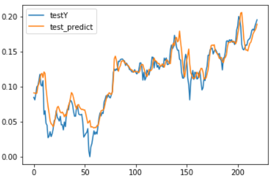

# Day76 TensorFlow와 Keras 라이브러리를 활용한 딥러닝(14)

케라스 RNN 신경망 : SimpleRNN, LSTM, GRU

- 입력형식
  - LSTM(3, input_dim=1)
    - 3 : 메모리 셀의 개수(Dense에서 출력 뉴런 수와 같은 의미)
    - input_dim : 입력 속성의 개수
    - input_length : 시퀀스 데이터의 입력 길이
    - 또 다른 옵션
      - return_sequences : 시퀀스 출력 여부(True/False)
        - many to many : return_sequences=True
        - many to one : return_sequences=False
      - stateful : 상태유지 모드(True/False)
        - 현재 샘플의 마지막 셀의 상태가 다음 샘플의 입력으로 전달 할 것인지 여부를 지정
  - ex. 
    - hihell -> ihello

## 주가예측(TensorFlow)

```python
import tensorflow as tf
import numpy as np
import matplotlib.pyplot as plt
import pandas as pd
import seaborn as sns
```

- MinMaxScaler 함수 생성

```python
def MinMaxScaler(data) :
    up = data - data.min(axis=0)
    under = data.max(axis=0) - train_set.min(axis=0)
    return up/under
```

- 데이터 불러오기

```python
path_data = '../data_for_analysis/실습데이터/'
xy = np.loadtxt(path_data + 'data-02-stock_daily.csv',
                delimiter=',')
xy
# > array([[8.28659973e+02, 8.33450012e+02, 8.28349976e+02, 1.24770000e+06,
# >         8.31659973e+02],
# >        [8.23020020e+02, 8.28070007e+02, 8.21655029e+02, 1.59780000e+06,
# >         8.28070007e+02],
# >        [8.19929993e+02, 8.24400024e+02, 8.18979980e+02, 1.28170000e+06,
# >         8.24159973e+02],
# >        ...,
# >        [5.66892592e+02, 5.67002574e+02, 5.56932537e+02, 1.08000000e+04,
# >         5.56972503e+02],
# >        [5.61202549e+02, 5.66432590e+02, 5.58672539e+02, 4.12000000e+04,
# >         5.59992565e+02],
# >        [5.68002570e+02, 5.68002570e+02, 5.52922516e+02, 1.31000000e+04,
# >         5.58462551e+02]])
```

- 역순으로 저장

```python
xy = xy[::-1]
```

- train, test set 분할

```python
len(xy)
# > 732

train_size = int(len(xy)*0.7)
train_size
# > 512
```

```python
train_set = xy[ :train_size] # 0~511
test_set = xy[train_size - seq_length: ] # 505:511->512 예측

train_set = MinMaxScaler(train_set)
test_set = MinMaxScaler(test_set)
```

- train data 생성

```python
def buildDataSet(time_series, seq_length) :
    xdata = []
    ydata = []
    for i in range(len(time_series) - seq_length) :
        xdata.append(time_series[i:i+seq_length, :])
        ydata.append(time_series[i+seq_length, [-1]])
    
    return np.array(xdata), np.array(ydata)
```

```python
trainX, trainY = buildDataSet(train_set, seq_length)
testX, testY = buildDataSet(test_set, seq_length)
```

- 사용할 변수 선언

```python
seq_length = 7 # window size
data_dim = 5 # 시가, 종가, ..., 5개 변수
hidden_dim = 10
output_dim = 1
lr = 0.01
iterations = 500
```

```python
trainX.shape
# 505개 샘플, 7(일주일), 5(5개의 컬럼)
# > (505, 7, 5)

testX.shape
# > (220, 7, 5)

trainY.shape
# > (505, 1)
```

-  모델 생성

```python
x = tf.placeholder(tf.float32, [None, seq_length, data_dim])
y = tf.placeholder(tf.float32, [None, 1])
```

```python
cell = tf.contrib.rnn.BasicLSTMCell(
    num_units=hidden_dim,
    state_is_tuple=True,
    # state_is_tuple=True => 튜플 형식으로 출력 ([1, 2], [3, 4])
    # state_is_tuple=False => tensor 형식으로 출력 [1, 2, 3, 4]
    # 보토 튜플로 출력
    activation=tf.tanh
)

outputs, _states = tf.nn.dynamic_rnn(cell, x, dtype=tf.float32)
yhat = tf.contrib.layers.fully_connected(outputs[:, -1],
                                         output_dim, 
                                         activation_fn=None)

loss = tf.reduce_mean(tf.square(yhat - y))
opt = tf.train.AdamOptimizer(lr)
train = opt.minimize(loss)

# rmse
targets = tf.placeholder(tf.float32, [None, 1])
predictions = tf.placeholder(tf.float32, [None, 1])
rmse = tf.sqrt(tf.reduce_mean(tf.square(targets - predictions)))
```

- 모델 적합

```python
with tf.Session() as sess :
    sess.run(tf.global_variables_initializer())
    for i in range(iterations) :
        _, cv = sess.run([train, loss], 
                         feed_dict={x:trainX, y:trainY})
        # 대용량의 데이터의 경우 feed_dict보다 GPU pipeline 사용[CS230](https://cs230.stanford.edu/blog/datapipeline/)
        if i%100 == 0 :
            print('step : {}, loss : {}'.format(i, cv))
    test_predict = sess.run(yhat, feed_dict={x:testX})
    rmsev = sess.run(rmse, 
                     feed_dict={targets:testY, 
                                predictions:test_predict})
    print('rmse value : {}'.format(rmsev))
# > step : 0, loss : 0.2111179530620575
# > step : 100, loss : 0.0025209884624928236
# > step : 200, loss : 0.0022080312483012676
# > step : 300, loss : 0.0018893640954047441
# > step : 400, loss : 0.0016334598185494542
# > rmse value : 0.01594744808971882
```

- 예측결과와 실제값 시각화

```python
plt.plot(testY)
plt.plot(test_predict)
plt.legend(labels=['testY', 'test_predict'])
plt.show()
```



# 연습문제

- 1985.01.04 ~ 2020.01.07
- 25년 데이터 예측 모델
- 2020.01.09 ~ 2020.02.28 종가 예측
- rmse
- 시각화