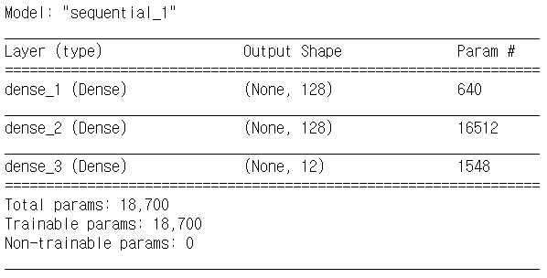
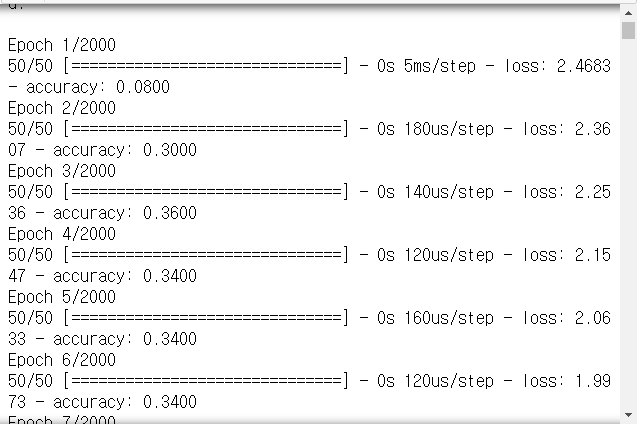
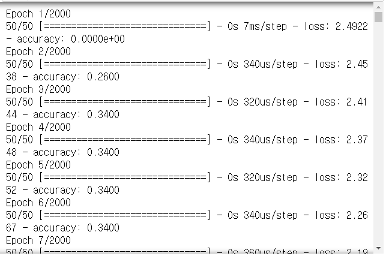
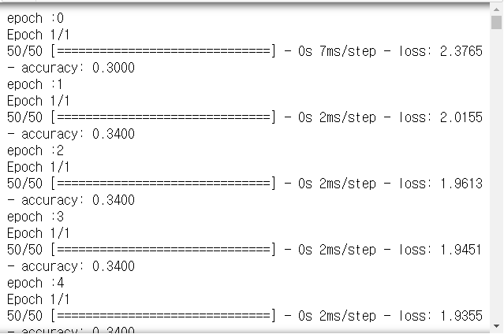

# Day77 RNN을 활용한 챗봇  시스템 구축(4)

## TTS

- Text to Speech
- prompt에서 `pip install gTTS` 수행

```python
from gtts import gTTS
```

```python
textE = 'Hi, everybody. Playing with TF is fun'
tts = gTTS(text=textE, lang='en') # 음성으로 변환하는 함수
tts.save('hi.mp3')
```

```python
textK = '안녕하세요. 여러분, 텐스플로우 재미있어요'
tts = gTTS(text=textK, lang='ko')
tts.save('hi.mp3')
```

```python
ttsEn = gTTS(text=textE, lang='en')
ttsKo = gTTS(text=textK, lang='ko')
f = open('enkr.mp3', 'wb')
ttsEn.write_to_fp(f)
ttsEn.write_to_fp(f)
ttsKo.write_to_fp(f)
f.close()
```

## 컴퓨터에 저장된 소리 재생하기

- [pygame 모듈 사이트](https://www.pygame.org/)

```python
from pygame import mixer
```

```python
mixer.init()
mixer.music.load('sound1.mp3')
mixer.music.play()
```


# 작곡하기

```python
code2idx = {'c4':0, 'd4':1, 'e4':2, 'f4':3, 'g4':4, 'a4':5, 'b4':6,
            'c8':7, 'd8':8, 'e8':9, 'f8':10, 'g8':11, 'a8':12, 'b8':13}

idx2code = {0:'c4', 1:'d4', 2:'e4', 3:'f4', 4:'g4', 5:'a4', 6:'b4',
            7:'c8', 8:'d8', 9:'e8', 10:'f8', 11:'g8', 12:'a8', 13:'b8'}

# 동요 나비야
seq = ['g8', 'e8', 'e4', 'f8', 'd8', 'd4', 'c8', 'd8', 'e8', 'f8', 'g8', 'g8', 'g4',
       'g8', 'e8', 'e8', 'e8', 'f8', 'd8', 'd4', 'c8', 'e8', 'g8', 'g8', 'e8', 'e8', 'e4',
       'd8', 'd8', 'd8', 'd8', 'd8', 'e8', 'f4', 'e8', 'e8', 'e8', 'e8', 'e8', 'f8', 'g4',
       'g8', 'e8', 'e4', 'f8', 'd8', 'd4', 'c8', 'e8', 'g8', 'g8', 'e8', 'e8', 'e4']
```

> - 도 ~ 시 : c d e f g a b
> - 4:4분음표, 8:8분음표

## 전처리

``` python
import numpy as np

def seq2dataset(seq, window_size) :
    dataset = []
    for i in range(len(seq)-window_size) : # 54-4=50
        subset = seq[i:(i+window_size+1)]
        dataset.append([code2idx[item] for item in subset])
    
    return np.array(dataset)
```

```python
dataset = seq2dataset(seq, window_size=4)
dataset.shape
# > (50, 5)

dataset
# > array([[11,  9,  2, 10,  8],
# >        [ 9,  2, 10,  8,  1],
# >        [ 2, 10,  8,  1,  7],
# >        [10,  8,  1,  7,  8],
# >        [ 8,  1,  7,  8,  9],
# > ...
# >        [ 8,  1,  7,  9, 11],
# >        [ 1,  7,  9, 11, 11],
# >        [ 7,  9, 11, 11,  9],
# >        [ 9, 11, 11,  9,  9],
# >        [11, 11,  9,  9,  2]])
```

```python
xTrain = dataset[:, 0:4]
xTrain
# > array([[11,  9,  2, 10],
# >        [ 9,  2, 10,  8],
# >        [ 2, 10,  8,  1],
# >        [10,  8,  1,  7],
# >        [ 8,  1,  7,  8],
# > ...
# >        [ 8,  1,  7,  9],
# >        [ 1,  7,  9, 11],
# >        [ 7,  9, 11, 11],
# >        [ 9, 11, 11,  9],
# >        [11, 11,  9,  9]])

yTrain = dataset[:, 4]
yTrain
# > array([ 8,  1,  7,  8,  9, 10, 11, 11,  4, 11,  9,  9,  9, 10,  8,  1,  7,
# >         9, 11, 11,  9,  9,  2,  8,  8,  8,  8,  8,  9,  3,  9,  9,  9,  9,
# >         9, 10,  4, 11,  9,  2, 10,  8,  1,  7,  9, 11, 11,  9,  9,  2])
```

```python
max_idx_value = 13
```

- 입력값 정규화

 ```python
xTrain = xTrain/max_idx_value
xTrain
# > array([[0.84615385, 0.69230769, 0.15384615, 0.76923077],
# >        [0.69230769, 0.15384615, 0.76923077, 0.61538462],
# >        [0.15384615, 0.76923077, 0.61538462, 0.07692308],
# >        [0.76923077, 0.61538462, 0.07692308, 0.53846154],
# >        [0.61538462, 0.07692308, 0.53846154, 0.61538462],
# > ...
# >        [0.61538462, 0.07692308, 0.53846154, 0.69230769],
# >        [0.07692308, 0.53846154, 0.69230769, 0.84615385],
# >        [0.53846154, 0.69230769, 0.84615385, 0.84615385],
# >        [0.69230769, 0.84615385, 0.84615385, 0.69230769],
# >        [0.84615385, 0.84615385, 0.69230769, 0.69230769]])
 ```

- 출력 데이터 원핫인코딩

```python
from keras.utils import np_utils
yTrain = np_utils.to_categorical(yTrain)
yTrain
# > array([[0., 0., 0., 0., 0., 0., 0., 0., 1., 0., 0., 0.],
# >        [0., 1., 0., 0., 0., 0., 0., 0., 0., 0., 0., 0.],
# >        [0., 0., 0., 0., 0., 0., 0., 1., 0., 0., 0., 0.],
# >        [0., 0., 0., 0., 0., 0., 0., 0., 1., 0., 0., 0.],
# >        [0., 0., 0., 0., 0., 0., 0., 0., 0., 1., 0., 0.],
# > ...
# >        [0., 0., 0., 0., 0., 0., 0., 0., 0., 0., 0., 1.],
# >        [0., 0., 0., 0., 0., 0., 0., 0., 0., 0., 0., 1.],
# >        [0., 0., 0., 0., 0., 0., 0., 0., 0., 1., 0., 0.],
# >        [0., 0., 0., 0., 0., 0., 0., 0., 0., 1., 0., 0.],
# >        [0., 0., 1., 0., 0., 0., 0., 0., 0., 0., 0., 0.]], dtype=float32)
```

```python
oneHotVecSize = yTrain.shape[1]
oneHotVecSize # y : 12가지 음계
# > 12
```

## 신경망 모델

- 신경망 모델 생성

```python
from keras.models import Sequential
from keras.layers import Dense
import keras
```

```python
model = Sequential()
model.add(Dense(128, input_dim=4, activation='relu'))
model.add(Dense(128, activation='relu'))
model.add(Dense(oneHotVecSize, activation='softmax'))
model.summary()
```



- 모델 학습 과정

```python
model.compile(loss='categorical_crossentropy', 
              optimizer='adam', metrics=['accuracy'])
```

```python
model.fit(xTrain, yTrain, 
          epochs=2000, batch_size=10)
```



- 모델 평가

```python
scores = model.evaluate(xTrain, yTrain)
print('%s : %.2f%%' % (model.metrics_names[1], scores[1]*100))
# > 50/50 [==============================] - 0s 500us/step
# > accuracy : 92.00%
```

### 한글자씩 예측

```python
seq_out = ['g8', 'e8', 'e4', 'f8']
pred_out = model.predict(xTrain)
pred_out.shape
# > (50, 12)

pred_count = 50
for i in range(pred_count) :
    idx = np.argmax(pred_out[i])
    seq_out.append(idx2code[idx])
print(seq_out)
# > ['g8', 'e8', 'e4', 'f8', 'd8', 'd4', 'c8', 'e8', 'e8', 'f8', 'g8', 'g8', 'g4', 'g8', 'e8', 'e8', 'e8', 'f8', 'g4', 'd4', 'c8', 'e8', 'g8', 'g8', 'e8', 'e8', 'e4', 'd8', 'd8', 'd8', 'd8', 'e8', 'e8', 'f4', 'e8', 'e8', 'e8', 'e8', 'f8', 'f8', 'g4', 'g8', 'e8', 'e4', 'f8', 'd8', 'd4', 'c8', 'e8', 'g8', 'g8', 'e8', 'e8', 'e4']
```

### 곡 전체 예측

```python
seq_in = ['g8', 'e8', 'e4', 'f8']
seq_out = seq_in
seq_in = [code2idx[it]/float(max_idx_value) for it in seq_in]
seq_in
# > [0.8461538461538461,
# >  0.6923076923076923,
# >  0.15384615384615385,
# >  0.7692307692307693]

for i in range(pred_count) :
    seq_in2 = np.array(seq_in)
    seq_in2 = np.reshape(seq_in2, (1, 4)) # 1:batchsize, 4:feature
    pred_out = model.predict(seq_in2)
    idx = np.argmax(pred_out)
    seq_out.append(idx2code[idx])
    seq_in.append(idx/float(max_idx_value))
    seq_in.pop(0)
print(seq_out)
# > ['g8', 'e8', 'e4', 'f8', 'd8', 'd4', 'c8', 'e8', 'g8', 'g8', 'e8', 'e8', 'e4', 'd8', 'd8', 'd8', 'd8', 'e8', 'f4', 'e8', 'e8', 'e8', 'e8', 'f8', 'g4', 'g8', 'e8', 'e4', 'f8', 'd8', 'd4', 'c8', 'e8', 'g8', 'g8', 'e8', 'e8', 'e4', 'd8', 'd8', 'd8', 'd8', 'e8', 'f4', 'e8', 'e8', 'e8', 'e8', 'f8', 'g4', 'g8', 'e8', 'e4', 'f8']
```

## LSTM(RNN) 모델

- LSTM(RNN)으로 구성

### stateful=False

```python
from keras.layers import LSTM

model = Sequential()
model.add(LSTM(126, input_shape=[4, 1]))
# 128:출력셀, 4:타임스텝, 1:속성개수
# stateful=False(default)
model.add(Dense(oneHotVecSize, activation='softmax'))
```

- 타임 스텝(window size) : 샘플 1개에 포함된 시퀀스의 개수(input length)
- 속성 : 입력되는 음표 1개당 index 1개 입력

```python
np.shape(xTrain) # 샘플수, 타임스텝, 속성수
# > (50, 4)

xTrain = np.reshape(xTrain, (50, 4, 1))
```

```python
model.compile(loss='categorical_crossentropy', 
              optimizer='adam', metrics=['accuracy'])
model.fit(xTrain, yTrain, 
          epochs=2000, batch_size=14)
```



```python
scores = model.evaluate(xTrain, yTrain)
print('%s : %.2f%%' % (model.metrics_names[1], scores[1]*100))
# > 50/50 [==============================] - 0s 1ms/step
# > accuracy : 90.00%
```

### stateful=True

- LSTM(메모리셀개수, input_dim=입력속성수, input_lenght=시퀀스데이터의입력길이)
  - return_sequences : 시퀀스 출력여부
    - False = 마지막 시퀀스에서 한번만 출력(many to one)
    - True = 각 시퀀스에서 출력(many to many)
  - stateful : 상태유지모드
    - 학습 샘플의 가장 마지막 상태가 다음 샘플을 학습할 때 입력으로 전달할 것인지 여부
- 상태유지모드
  - 상태유지모드(stateful)에서 현재 샘플의 학습상태가 다음 샘플의 초기 상태로 전달
  - LSTM 셀 내부적으로 기억할 것은 기억하고, 버릴 것은 버리도록 하기위한 옵션(stateful=True)
  - 상태유지모드에서는 입력 형태를(batch_input_shape)
    (배치사이즈, 타임스텝, 속성)으로 설정

```python
model.reset_states() # 먼저 생성된 모델 삭제
```

```python
model = Sequential()
model.add(LSTM(126, batch_input_shape=(1, 4, 1), stateful=True))
model.add(Dense(oneHotVecSize, activation='softmax'))
```

- 한 에폭안에서 여러개의 시퀀스 데이터가 있을 때, 새로운 시퀀스 데이터를 학습하기 전에 상태 초기화 필요
- 마지막 샘플에 대한 학습을 마치고나서, 새로운 에폭이 실행될 때에는 새로운 샘플 학습을 해야하므로 상태 초기화 필요

```python
num_epochs = 2000
```

```python
model.compile(loss='categorical_crossentropy', 
              optimizer='adam', metrics=['accuracy'])
for i in range(num_epochs) :
    print('epoch :' + str(i))
    model.fit(xTrain, yTrain, 
              epochs=1, batch_size=1, 
              shuffle=False)
    model.reset_states() # 매 에폭마다 state 정보를 초기화
```



```python
scores = model.evaluate(xTrain, yTrain, batch_size=1)
print('%s : %.2f%%' %(model.metrics_names[1], scores[1]*100))
# > 50/50 [==============================] - 0s 3ms/step
# > accuracy : 100.00%
```

- 한글자 씩 예측

```python
seq_out = ['g8', 'e8', 'e4', 'f8']
pred_out = model.predict(xTrain, batch_size=1)
pred_count = 50
for i in range(pred_count) :
    idx = np.argmax(pred_out[i])
    seq_out.append(idx2code[idx])
print(seq_out)
# > ['g8', 'e8', 'e4', 'f8', 'd8', 'd8', 'd8', 'd8', 'g8', 'g8', 'e8', 'e8', 'e8', 'e4', 'e8', 'e8', 'e8', 'e8', 'f8', 'e8', 'c8', 'e8', 'g8', 'g8', 'e8', 'e8', 'e8', 'd8', 'd8', 'd8', 'd8', 'd8', 'e8', 'f4', 'e8', 'e8', 'e8', 'e8', 'f8', 'c8', 'd8', 'f8', 'e8', 'e4', 'f8', 'd8', 'd4', 'c8', 'e8', 'g8', 'g8', 'e8', 'e8', 'e4']
```

- 곡 전체 예측

```python
model.reset_states()
```

```python
seq_in = ['g8', 'e8', 'e4', 'f8']
seq_out = seq_in
seq_in = [code2idx[it]/float(max_idx_value) for it in seq_in]

for i in range(pred_count) :
    seq_in2 = np.array(seq_in)
    seq_in2 = np.reshape(seq_in2, (1, 4, 1))
    # 1:샘플의수, 4:타임스텝의수, 1:속성수
    pred_out = model.predict(seq_in2)
    idx = np.argmax(pred_out)
    seq_out.append(idx2code[idx])
    seq_in.append(idx/float(max_idx_value))
    seq_in.pop(0)
print(seq_out)
# > ['g8', 'e8', 'e4', 'f8', 'd8', 'd4', 'c8', 'd8', 'e8', 'f8', 'g8', 'g8', 'g4', 'g8', 'e8', 'e8', 'e8', 'f8', 'd8', 'd4', 'c8', 'e8', 'g8', 'g8', 'e8', 'e8', 'e4', 'd8', 'd8', 'd8', 'd8', 'd8', 'e8', 'f4', 'e8', 'e8', 'e8', 'e8', 'e8', 'f8', 'g4', 'g8', 'e8', 'e4', 'f8', 'd8', 'd4', 'c8', 'e8', 'g8', 'g8', 'e8', 'e8', 'e4']
```


