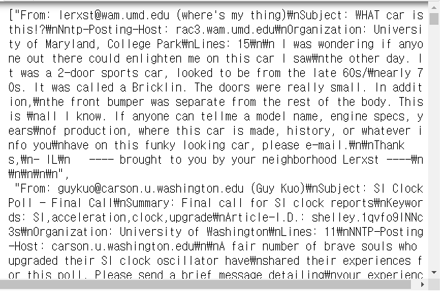
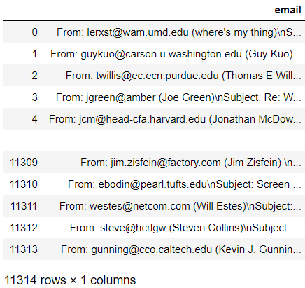
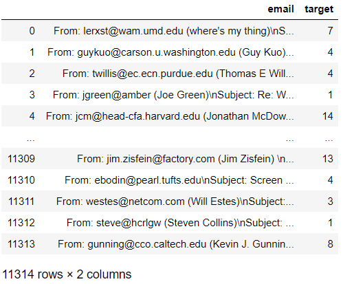
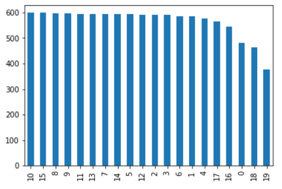
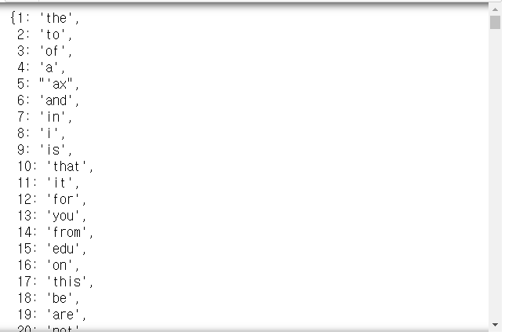

# Day78 TensorFlow와 Keras 라이브러리를 활용한 딥러닝(16)

## Keras Tokenizer

```python
from keras.preprocessing.text import Tokenizer
# Tokenizer : 토큰화
tok = Tokenizer()
text = 'Regret for wasted time is more wasted time'
tok.fit_on_texts(text)

tok 
# > <keras_preprocessing.text.Tokenizer at 0x22079893f88>

tok.word_index
# > {'e': 1,
# >  't': 2,
# >  'r': 3,
# >  's': 4,
# >  'i': 5,
# >  'm': 6,
# >  'o': 7,
# >  'w': 8,
# >  'a': 9,
# >  'd': 10,
# >  'g': 11,
# >  'f': 12}
```

- `[text]` : 단어 단위 토큰화
- `text` : 문자 단위 토큰화

```python
tok = Tokenizer()
text = 'Regret for wasted time is more wasted time'
tok.fit_on_texts([text]) # 사전 생성
tok.word_index
# > {'wasted': 1, 'time': 2, 'regret': 3, 'for': 4, 'is': 5, 'more': 6}
```

```python
test = 'Regret for wasted hour is more wasted hour'
tok.texts_to_sequences([test]) # 사전에 test에 저장된 단어가 있는지 확인
# > [[3, 4, 1, 5, 6, 1]]

seq = tok.texts_to_sequences([test])[0]
seq
# > [3, 4, 1, 5, 6, 1]
```

## Keras pad_sequences

```python
from keras.preprocessing.sequence import pad_sequences
# 샘플의 길이를 동일하게 해주는 함수
pad_sequences([[1, 2, 3], [2, 3, 4, 5], [6, 7]], maxlen=2)
# > array([[2, 3],
# >        [4, 5],
# >        [6, 7]])

pad_sequences([[1, 2, 3], [2, 3, 4, 5], [6, 7]], maxlen=3, padding='pre') # padding='pre'(defualt)
# > array([[1, 2, 3],
# >        [3, 4, 5],
# >        [0, 6, 7]])

pad_sequences([[1, 2, 3], [2, 3, 4, 5], [6, 7]], maxlen=3, padding='post')
# > array([[1, 2, 3],
# >        [3, 4, 5],
# >        [6, 7, 0]])
```

# 텍스트 분류

- 워드 임베딩 : 문장 내의 단어들을 밀집 벡터로 만드는 작업(Embedding)
  - 원핫벡터(고차원, 희소벡터, 기억장소낭비)
    - ex. 원핫벡터 : 00100, ..., 00001 (tiger)
  - 밀집벡터(저차원, 실수값)
    - ex. 밀집벡터 : \[0.1, -1.5, 1.9, 2.4\](tiger)
  - ex. text = \[\[0, 1, 2, 3\], \[3, 4, 1, 5\]\]
  - => Embedding(6, 2, 4)
    - 6:단어개수, 2:벡터크기, 4:시퀀스길이
  - => 0 -> \[1.3, 1.5\], 1->\[2.5, 4.1\], ...

- 복잡한 모델을 만들 때는 함수형 api로 모델 생성
- 단순한 모델은 Sequential을 이용하여 모델 생성

## functional API

```python
from keras.layers import Input, Dense
from keras.models import Model
```

- 모델 생성 방법 (실행용 X)

```python
inp = Input(shape=(10, )) # 10개 입력, 입력층
h1 = Dense(32, activation='relu')(inp)
h2 = Dense(16, activation='relu')(h1)
outp = Dense(1, activation='sigmoid')(h2)

model = Model(inputs=inp, outputs=outp) # 최종 모델생성
model.compile(optimizer='rmsprop', loss='binary_crossentropy', metrics=['accuracy'])
model.fit(xdata, ydata)
```

- 함수형 api로 rnn 구조 표현

```python
from keras.layers import LSTM

inp = Input(shape=(50, 1))
h1 = LSTM(10)(inp)
h2 = Dense(10, activation='relu')(h1)
outp = Dense(1, activation='sigmoid')(h2)
model = Model(inputs=inp, outputs=outp)
```

## MLP로 텍스트 분류

```python
from keras.preprocessing.text import Tokenizer
import numpy as np
```

```python
texts = ['먹고 싶은 사과', '먹고 싶은 바나나', 
         '길고 노란 바나나 바나나', '저는 과일이 좋아요']
```

- 토큰화
  ```python
  tok = Tokenizer()
  tok.fit_on_texts(texts)
  tok.word_index # 빈도수 내림차순 결과
  
  # > {'바나나': 1,
  # >  '먹고': 2,
  # >  '싶은': 3,
  # >  '사과': 4,
  # >  '길고': 5,
  # >  '노란': 6,
  # >  '저는': 7,
  # >  '과일이': 8,
  # >  '좋아요': 9}
  ```

- DTM

  ```python
  tok.texts_to_matrix(texts, mode='count')
  # > array([[0., 0., 1., 1., 1., 0., 0., 0., 0., 0.],
  # >        [0., 1., 1., 1., 0., 0., 0., 0., 0., 0.],
  # >        [0., 2., 0., 0., 0., 1., 1., 0., 0., 0.],
  # >        [0., 0., 0., 0., 0., 0., 0., 1., 1., 1.]])
  ```

- TFIDF

  ```python
  tok.texts_to_matrix(texts, mode='tfidf')
  
  # > array([[0.        , 0.        , 0.84729786, 0.84729786, 1.09861229,
  # >         0.        , 0.        , 0.        , 0.        , 0.        ],
  # >        [0.        , 0.84729786, 0.84729786, 0.84729786, 0.        ,
  # >         0.        , 0.        , 0.        , 0.        , 0.        ],
  # >        [0.        , 1.43459998, 0.        , 0.        , 0.        ,
  # >         1.09861229, 1.09861229, 0.        , 0.        , 0.        ],
  # >        [0.        , 0.        , 0.        , 0.        , 0.        ,
  # >         0.        , 0.        , 1.09861229, 1.09861229, 1.09861229]])
  ```

- 단어의 존재 유무

  ```python
  tok.texts_to_matrix(texts, mode='binary')
  # > array([[0., 0., 1., 1., 1., 0., 0., 0., 0., 0.],
  # >        [0., 1., 1., 1., 0., 0., 0., 0., 0., 0.],
  # >        [0., 1., 0., 0., 0., 1., 1., 0., 0., 0.],
  # >        [0., 0., 0., 0., 0., 0., 0., 1., 1., 1.]])
  ```

- 단어 등장 비율

  ```python
  tok.texts_to_matrix(texts, mode='freq')
  # > array([[0.        , 0.        , 0.33333333, 0.33333333, 0.33333333,
  # >         0.        , 0.        , 0.        , 0.        , 0.        ],
  # >        [0.        , 0.33333333, 0.33333333, 0.33333333, 0.        ,
  # >         0.        , 0.        , 0.        , 0.        , 0.        ],
  # >        [0.        , 0.5       , 0.        , 0.        , 0.        ,
  # >         0.25      , 0.25      , 0.        , 0.        , 0.        ],
  # >        [0.        , 0.        , 0.        , 0.        , 0.        ,
  # >         0.        , 0.        , 0.33333333, 0.33333333, 0.33333333]])
  ```


### fetch_20newsgroups data of sklearn

```python
import pandas as pd
from sklearn.datasets import fetch_20newsgroups
from keras.utils import to_categorical
import matplotlib.pyplot as plt
```

```python
newsData = fetch_20newsgroups(subset='train') # test, all(1.8만여개) 지정 가능

print(newsData.keys())
# > dict_keys(['data', 'filenames', 'target_names', 'target', 'DESCR'])

newsData.data
```



```python
len(newsData.data)
# > 11314

len(newsData.target)
# > 11314

newsData.target
# > array([7, 4, 4, ..., 3, 1, 8])

newsData.target_names
# > ['alt.atheism',
# >  'comp.graphics',
# >  'comp.os.ms-windows.misc',
# >  'comp.sys.ibm.pc.hardware',
# >  'comp.sys.mac.hardware',
# >  'comp.windows.x',
# >  'misc.forsale',
# >  'rec.autos',
# >  'rec.motorcycles',
# >  'rec.sport.baseball',
# >  'rec.sport.hockey',
# >  'sci.crypt',
# >  'sci.electronics',
# >  'sci.med',
# >  'sci.space',
# >  'soc.religion.christian',
# >  'talk.politics.guns',
# >  'talk.politics.mideast',
# >  'talk.politics.misc',
# >  'talk.religion.misc']

df = pd.DataFrame(newsData.data, columns=['email'])
df
```



```python
df['target'] = newsData.target
df
```



```python
df.info()
# > <class 'pandas.core.frame.DataFrame'>
# > RangeIndex: 11314 entries, 0 to 11313
# > Data columns (total 2 columns):
# > email     11314 non-null object
# > target    11314 non-null int32
# > dtypes: int32(1), object(1)
# > memory usage: 132.7+ KB

df.isnull().values.any()
# > False

df['email'].nunique() # unique 개수, 11314개 샘플
# > 11314

df['target'].nunique() # 20가지 주제
# > 20
```

- 주제별 샘플의 개수 확인

  ```python
  df['target'].value_counts()
  # > 10    600
  # > 15    599
  # > 8     598
  # > 9     597
  # > 11    595
  # > 13    594
  # > 7     594
  # > 14    593
  # > 5     593
  # > 12    591
  # > 2     591
  # > 3     590
  # > 6     585
  # > 1     584
  # > 4     578
  # > 17    564
  # > 16    546
  # > 0     480
  # > 18    465
  # > 19    377
  # > Name: target, dtype: int64
  ```

  ```python
  df['target'].value_counts().plot(kind='bar')
  ```

  

  ```python
  df.groupby('target').size()
  # > target
  # > 0     480
  # > 1     584
  # > 2     591
  # > 3     590
  # > 4     578
  # > 5     593
  # > 6     585
  # > 7     594
  # > 8     598
  # > 9     597
  # > 10    600
  # > 11    595
  # > 12    591
  # > 13    594
  # > 14    593
  # > 15    599
  # > 16    546
  # > 17    564
  # > 18    465
  # > 19    377
  # > dtype: int64
  ```

```python
newsDataTest = fetch_20newsgroups(subset='test', shuffle=True)

train_email = df['email']
train_label = df['target']

test_email = newsDataTest.data # 테스트 데이터 본문
test_label = newsDataTest.target
```

- 모델적용을 위한 데이터 편집 분할

  ```python
  def preData(trainData, testData, mode) : # preprocessing
      tok = Tokenizer(num_words=10000)
      # 빈도수가 가장 높은 상위 10000개의 단어를 사용하여 토큰화
      tok.fit_on_texts(trainData)
      xTrain = tok.texts_to_matrix(trainData, mode=mode)
      xTest = tok.texts_to_matrix(testData, mode=mode)
      return xTrain, xTest, tok.index_word
  ```

  ```python
  xTrain, xTest, index_word = preData(train_email, test_email,
                                      'binary')

  xTrain.shape
  # > (11314, 10000)

  xTest.shape
  # > (7532, 10000)

  train_label.shape
  # > (11314,)

  test_label.shape
  # > (7532,)
  ```
  
  - label 원핫인코딩
  
    ```python
    yTrain = to_categorical(train_label, 20)
    yTest = to_categorical(test_label, 20)
    
    yTrain.shape
    # > (11314, 20)
    ```

  ```python
  index_word
  ```
  
  
  
  ```python
  index_word[10000] # 만개의 단어 중 빈도수가 가장 낮은 단어
  # > 'proportion'
  ```

- 모델 생성

```python
from keras.layers import Dropout
from keras.models import Sequential
```

```python
def fitEval(xTrain, yTrain, xTest, yTest) : # fit&evaluate 수행함수
    model = Sequential()
    model.add(Dense(256, input_shape=(10000, ), activation='relu'))
    model.add(Dropout(0.5))
    model.add(Dense(128, activation='relu'))
    model.add(Dropout(0.5))
    model.add(Dense(20, activation='softmax'))
    
    model.compile(loss='categorical_crossentropy',
                  optimizer='adam', metrics=['accuracy'])
    model.fit(xTrain, yTrain, 
              batch_size=128, epochs=5, validation_split=0.1)
    score = model.evaluate(xTest,yTest, batch_size=128)
    
    return score[1]
```

```python
score = fitEval(xTrain, yTrain, xTest, yTest) # score : 모델 정확도
score
# > Train on 10182 samples, validate on 1132 samples
# > Epoch 1/5
# > 10182/10182 [==============================] - 5s 458us/step - loss: 2.2716 - accuracy: 0.3433 - val_loss: 0.9577 - val_accuracy: 0.8101
# > Epoch 2/5
# > 10182/10182 [==============================] - 4s 436us/step - loss: 0.8611 - accuracy: 0.7623 - val_loss: 0.4456 - val_accuracy: 0.8905
# > Epoch 3/5
# > 10182/10182 [==============================] - 4s 435us/step - loss: 0.4272 - accuracy: 0.8877 - val_loss: 0.3360 - val_accuracy: 0.9099
# > Epoch 4/5
# > 10182/10182 [==============================] - 4s 431us/step - loss: 0.2547 - accuracy: 0.9351 - val_loss: 0.2982 - val_accuracy: 0.9134
# > Epoch 5/5
# > 10182/10182 [==============================] - 4s 437us/step - loss: 0.1749 - accuracy: 0.9574 - val_loss: 0.2919 - val_accuracy: 0.9099
# > 7532/7532 [==============================] - 1s 144us/step
# > 0.8301911950111389
```

```python
xTrain, xTest, _ = preData(train_email, test_email, 'binary')
score = fitEval(xTrain, yTrain, xTest, yTest)
print('accuracy :', score)
# > Train on 10182 samples, validate on 1132 samples
# > Epoch 1/5
# > 10182/10182 [==============================] - 4s 428us/step - loss: 2.3185 - accuracy: 0.3256 - val_loss: 1.0191 - val_accuracy: 0.8171
# > Epoch 2/5
# > 10182/10182 [==============================] - 4s 393us/step - loss: 0.8994 - accuracy: 0.7561 - val_loss: 0.4711 - val_accuracy: 0.8807
# > Epoch 3/5
# > 10182/10182 [==============================] - 4s 397us/step - loss: 0.4315 - accuracy: 0.8851 - val_loss: 0.3497 - val_accuracy: 0.8993
# > Epoch 4/5
# > 10182/10182 [==============================] - 4s 410us/step - loss: 0.2579 - accuracy: 0.9347 - val_loss: 0.3090 - val_accuracy: 0.9072
# > Epoch 5/5
# > 10182/10182 [==============================] - 4s 421us/step - loss: 0.1695 - accuracy: 0.9596 - val_loss: 0.3013 - val_accuracy: 0.9134
# > 7532/7532 [==============================] - 1s 133us/step
# > accuracy : 0.8285979628562927
```


