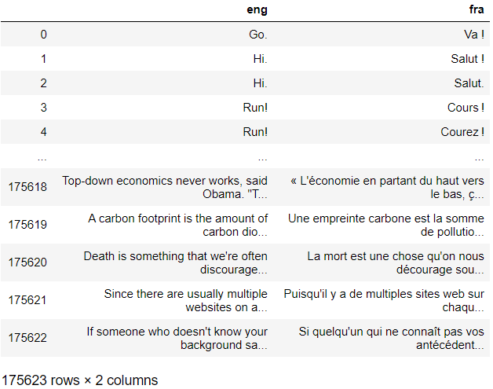
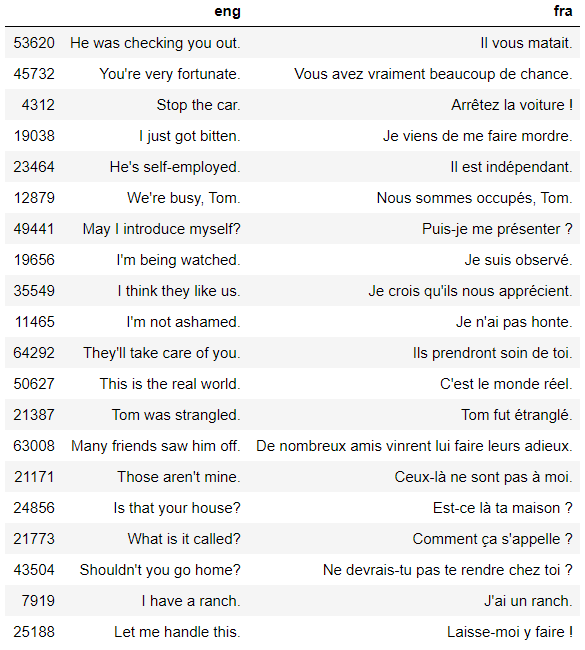
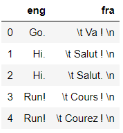
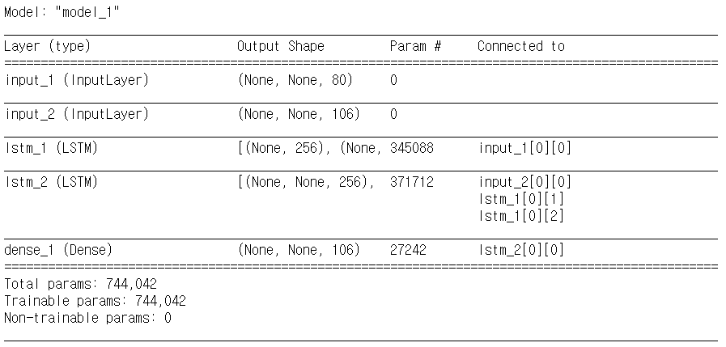
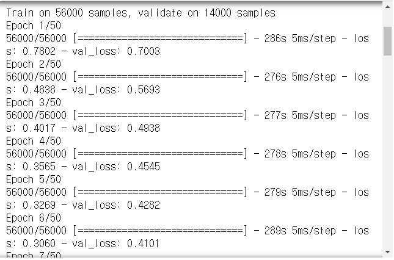
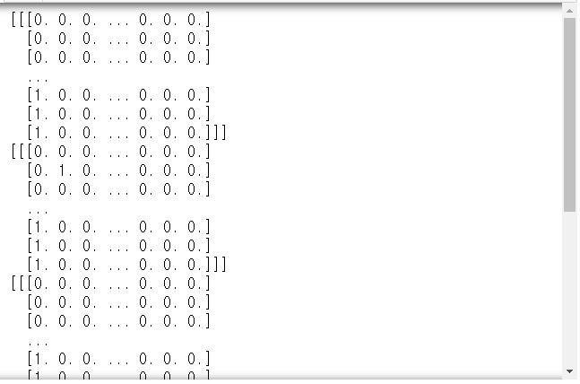
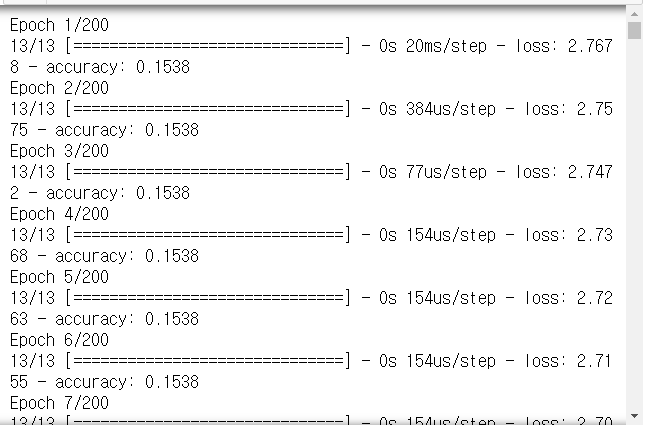

# Day79, 80 TensorFlow와 Keras 라이버리를 활용한 딥러닝(17, 18)

- [word2vec 설명 문서](https://radimrehurek.com/gensim/models/word2vec.html)
- 수업 참조 site - 챗봇을 위한 seq2seq
  - [keras blog](https://blog.keras.io/a-ten-minute-introduction-to-sequence-to-sequence-learning-in-keras.html)
  - [anki](http://www.manythings.org/anki/)

# 자연어 처리 : 번역기 만들기

- [Tab-delimited Bilingual Sentence Pairs](http://www.manythings.org/anki/)에서 `fra-eng.zip` 다운로드

```python
import pandas as pd
import numpy as np
```
```python
path_fra = '../data_for_analysis/fra-eng/'
df = pd.read_csv(path_fra + 'fra.txt', 
                 sep='\t', names=['eng', 'fra', 'kkk'])
df = df[['eng', 'fra']]
df
```



- 다른 방법

  ```python
  df = pd.read_csv(path_fra + 'fra.txt', 
                   sep='\t', header=None)
  del df[2]
  
  df.columns = ['eng', 'fra']
  ```

```python
len(df)
# > 175623

# 7만개 사용하기
df = df[0:70000]
df.sample(20)
```



- fra 열 전체에 대해 아래와 같은 시그널 추가 작업

  > start : '\t ', stop : ' \n'
  >
  > - ex. Rattrape-le. => \t Rattrape-le. \n
  >   - apply + lambda 함수로 적용하는 방법

```python
df['fra'] = df['fra'].apply(lambda x : '\t ' + x + ' \n')
df.head()
```



## 토큰화

- 글자 단위 토큰화

```python
eng_vocab = set()
fra_vocab = set()

for line in df.eng[:3] :
    for c in line :
        print(c)
# > G
# > o
# > .
# > H
# > i
# > .
# > H
# > i
# > .
```

```python
for line in df.eng :
    for c in line :
        eng_vocab.add(c)

for line in df.fra :
    for c in line :
        fra_vocab.add(c)
```

## 문장 -> 정수 변환 -> 패딩

```python
eng_vocab_size = len(eng_vocab) + 1
fra_vocab_size = len(fra_vocab) + 1

print(eng_vocab_size)
print(fra_vocab_size)
# > 80
# > 106
```

- set은 다루기가 어려우므로 list로 변경

```python
eng_vocab = sorted(list(eng_vocab))
print(eng_vocab[:50])
# > [' ', '!', '"', '$', '%', '&', "'", ',', '-', '.', '/', '0', '1', '2', '3', '4', '5', '6', '7', '8', '9', ':', '?', 'A', 'B', 'C', 'D', 'E', 'F', 'G', 'H', 'I', 'J', 'K', 'L', 'M', 'N', 'O', 'P', 'Q', 'R', 'S', 'T', 'U', 'V', 'W', 'X', 'Y', 'Z', 'a']

# {' ':1, '!':2, ...,'€':79} 형태로 변경
eng_to_index = dict([(c, i+1) for i, c in enumerate(eng_vocab)])
print(eng_to_index)
# > {' ': 1, '!': 2, '"': 3, '$': 4, '%': 5, '&': 6, "'": 7, ',': 8, '-': 9, '.': 10, '/': 11, '0': 12, '1': 13, '2': 14, '3': 15, '4': 16, '5': 17, '6': 18, '7': 19, '8': 20, '9': 21, ':': 22, '?': 23, 'A': 24, 'B': 25, 'C': 26, 'D': 27, 'E': 28, 'F': 29, 'G': 30, 'H': 31, 'I': 32, 'J': 33, 'K': 34, 'L': 35, 'M': 36, 'N': 37, 'O': 38, 'P': 39, 'Q': 40, 'R': 41, 'S': 42, 'T': 43, 'U': 44, 'V': 45, 'W': 46, 'X': 47, 'Y': 48, 'Z': 49, 'a': 50, 'b': 51, 'c': 52, 'd': 53, 'e': 54, 'f': 55, 'g': 56, 'h': 57, 'i': 58, 'j': 59, 'k': 60, 'l': 61, 'm': 62, 'n': 63, 'o': 64, 'p': 65, 'q': 66, 'r': 67, 's': 68, 't': 69, 'u': 70, 'v': 71, 'w': 72, 'x': 73, 'y': 74, 'z': 75, 'ç': 76, 'é': 77, '’': 78, '€': 79}
```

- 영어와 똑같이 변형

```python
fra_vocab = sorted(list(fra_vocab))

fra_to_index = dict([(c, i+1) for i, c in enumerate(fra_vocab)])
print(fra_to_index)
# > {'\t': 1, '\n': 2, ' ': 3, '!': 4, '"': 5, '$': 6, '%': 7, '&': 8, "'": 9, '(': 10, ')': 11, ',': 12, '-': 13, '.': 14, '0': 15, '1': 16, '2': 17, '3': 18, '4': 19, '5': 20, '6': 21, '7': 22, '8': 23, '9': 24, ':': 25, '?': 26, 'A': 27, 'B': 28, 'C': 29, 'D': 30, 'E': 31, 'F': 32, 'G': 33, 'H': 34, 'I': 35, 'J': 36, 'K': 37, 'L': 38, 'M': 39, 'N': 40, 'O': 41, 'P': 42, 'Q': 43, 'R': 44, 'S': 45, 'T': 46, 'U': 47, 'V': 48, 'W': 49, 'X': 50, 'Y': 51, 'Z': 52, 'a': 53, 'b': 54, 'c': 55, 'd': 56, 'e': 57, 'f': 58, 'g': 59, 'h': 60, 'i': 61, 'j': 62, 'k': 63, 'l': 64, 'm': 65, 'n': 66, 'o': 67, 'p': 68, 'q': 69, 'r': 70, 's': 71, 't': 72, 'u': 73, 'v': 74, 'w': 75, 'x': 76, 'y': 77, 'z': 78, '\xa0': 79, '«': 80, '»': 81, 'À': 82, 'Ç': 83, 'É': 84, 'Ê': 85, 'Ô': 86, 'à': 87, 'â': 88, 'ç': 89, 'è': 90, 'é': 91, 'ê': 92, 'ë': 93, 'î': 94, 'ï': 95, 'ô': 96, 'ù': 97, 'û': 98, 'œ': 99, 'С': 100, '\u2009': 101, '\u200b': 102, '‘': 103, '’': 104, '\u202f': 105}
```

- 영어 문장 인코딩

```python
encoder_input = []
for li in df.eng :
    t = []
    for c in li :
        t.append(eng_to_index[c])
    encoder_input.append(t)

print(len(encoder_input))
# > 70000

print(encoder_input[:10])
# > [[30, 64, 10], [31, 58, 10], [31, 58, 10], [41, 70, 63, 2], [41, 70, 63, 2], [46, 57, 64, 23], [46, 64, 72, 2], [29, 58, 67, 54, 2], [31, 54, 61, 65, 2], [33, 70, 62, 65, 10]]
```

- 프랑스어 문장 인코딩

```python
decoder_input = []
for li in df.fra :
    t = []
    for c in li :
        t.append(fra_to_index[c])
    decoder_input.append(t)

print(len(decoder_input))
print(decoder_input[:10])
# > 70000
# > [[1, 3, 48, 53, 3, 4, 3, 2], [1, 3, 45, 53, 64, 73, 72, 3, 4, 3, 2], [1, 3, 45, 53, 64, 73, 72, 14, 3, 2], [1, 3, 29, 67, 73, 70, 71, 105, 4, 3, 2], [1, 3, 29, 67, 73, 70, 57, 78, 105, 4, 3, 2], [1, 3, 43, 73, 61, 3, 26, 3, 2], [1, 3, 83, 53, 3, 53, 64, 67, 70, 71, 105, 4, 3, 2], [1, 3, 27, 73, 3, 58, 57, 73, 3, 4, 3, 2], [1, 3, 82, 3, 64, 9, 53, 61, 56, 57, 105, 4, 3, 2], [1, 3, 45, 53, 73, 72, 57, 14, 3, 2]]
```

- 프랑스어 문장 출력 부분
  - \t에 해당하는 인덱스 1 제거해줘야 함

```python
decoder_fra = []
for li in df.fra :
    t = []
    i = 0
    for c in li :
        if i > 0 :
            t.append(fra_to_index[c])
        i = i+1
    decoder_fra.append(t)

print(decoder_fra[:10])
# > [[3, 48, 53, 3, 4, 3, 2], [3, 45, 53, 64, 73, 72, 3, 4, 3, 2], [3, 45, 53, 64, 73, 72, 14, 3, 2], [3, 29, 67, 73, 70, 71, 105, 4, 3, 2], [3, 29, 67, 73, 70, 57, 78, 105, 4, 3, 2], [3, 43, 73, 61, 3, 26, 3, 2], [3, 83, 53, 3, 53, 64, 67, 70, 71, 105, 4, 3, 2], [3, 27, 73, 3, 58, 57, 73, 3, 4, 3, 2], [3, 82, 3, 64, 9, 53, 61, 56, 57, 105, 4, 3, 2], [3, 45, 53, 73, 72, 57, 14, 3, 2]]
```

- 패딩(=각 언어별로 가장 긴 글자로 구성된 문장 길이로 통일해 주는 작업) 필요
    - 동일한 사이즈로 맞춰져야 함
    - 가장 긴 글자로 구성된 문장 찾아야 함
- 인코더/디코더의 문장 길이를 같게 해줄 필요는 없음


- 가장 긴 글자로 구성된 문장 길이 찾기

```python
# 문장을 구성하는 각 글자의 개수(=문장 길이)
max_eng_len = max([len(li) for li in df.eng]) 
# 가장 긴 프랑스어 문장 글자 개수
max_fra_len = max([len(li) for li in df.fra]) 

print(max_eng_len)
print(max_fra_len)
# > 26
# > 76
```

- 패딩 작업

```python
from keras.preprocessing.sequence import pad_sequences

encoder_input = pad_sequences(encoder_input, 
                              maxlen=max_eng_len, padding='post')
decoder_input = pad_sequences(decoder_input, 
                              maxlen=max_fra_len, padding='post')
decoder_fra = pad_sequences(decoder_fra, 
                            maxlen=max_fra_len, padding='post')

np.shape(encoder_input)
# > (70000, 26)

np.shape(decoder_input)
# > (70000, 76)

encoder_input[0]
# > array([30, 64, 10,  0,  0,  0,  0,  0,  0,  0,  0,  0,  0,  0,  0,  0,  0,
# >         0,  0,  0,  0,  0,  0,  0,  0,  0])
```

- 원핫인코딩 작업

```python
from keras.utils import to_categorical

encoder_input = to_categorical(encoder_input)
decoder_input = to_categorical(decoder_input)
decoder_fra = to_categorical(decoder_fra)

np.shape(encoder_input) # (70000, 26, 80)
# (70000줄, 전체 줄에서 최대 글자수, 글자 종류)
# > (70000, 26, 80)

np.shape(decoder_input)
# > (70000, 76, 106)
```

> 트레이닝시 이전 상태의 실제값을 현재 상태의 디코더 입력으로 해야함(예측값으로 하면 안됨)

## LSTM 생성

- 학습시켜 모델 생성하는 과정
    - ex. `ip = Input(shape=(50, 1))`
        - feature(속성):1개, time_step(시점):50개 -> 입력에 대한 shape
        - LSTM 구조 : LSTM(출력)(ip-입력부분)
        - lt = LSTM(출력)(ip)
        - d1 = Dense(10, activation='relu')(lt)
        - d2 = Dense(1, activation='sigmoid')(d1)
        - Model(input=ip, outputs=d2)

```python
from keras.layers import Input, Embedding, Dense, LSTM
from keras.models import Model
```

```python
# Input(shape=(50, 1))
# 인코더 입력 = Input(, 영어 문자 종류 수)
encoder_inputs = Input(shape=(None, eng_vocab_size))

# 디코더 입력 = Input(, 프랑스어 문자 종류 수)
decoder_inputs = Input(shape=(None, fra_vocab_size))

# 인코더 LSTM 셀
# return_state : 인코더의 마지막 상태 정보를 디코더의 입력 상태 정보로 전달 옵션
encoder_LSTM = LSTM(units=256, return_state=True)

# 디코더 LSTM 셀
decoder_LSTM = LSTM(units=256, return_sequences=True, return_state=True)

# 인코더 LSTM 셀의 입력 정의
# _, 히든상태(위쪽), 셀상태(오른쪽) return 됨
_, state_h, state_c = encoder_LSTM(encoder_inputs)

# encoder_states : 컨벡스트 벡터 역할
encoder_states = [state_h, state_c]

decoder_outputs, _, _ = decoder_LSTM(decoder_inputs, initial_state=encoder_states)
decoder_softmax = Dense(fra_vocab_size, activation='softmax')
decoder_outputs = decoder_softmax(decoder_outputs)

# 모델 정의
model = Model(inputs=[encoder_inputs, decoder_inputs], outputs=decoder_outputs)
model.summary()
```



```python
model.compile(optimizer='rmsprop',
              loss='categorical_crossentropy')

model.fit(x=[encoder_input, decoder_input], 
          y=decoder_fra, 
          batch_size=64, epochs=50, validation_split=0.2)
```



```python
# 모델 저장
model.save('eng_fra.h5')

# 모델 불러오기
from keras.models import load_model
model = load_model('eng_fra.h5')
```

- seq2seq 동작
  1. 입력 문장 -> 인코더 -> 은닉 상태, 셀 상태 얻어냄
  2. 상태정보와 Start 시그널('\t')을 디코더로 전달
  3. 다음 문자를 예측(stop 시그널('\n')이 등장할 때 까지) 반복

## test

- 원하는 결과
  - 입력 : I paid.
  - 정답 : 지불했다(프랑스어)
  - 번역기 : 지불했다(프랑스어)

- test 과정의 encoder model

```python
encoder_model = Model(inputs=encoder_inputs,
                      outputs=encoder_states)
```

- 디코더

```python
decoder_state_input_hidden = Input(shape=(256, ))
decoder_state_input_cell = Input(shape=(256, ))
decoder_state_inputs = [decoder_state_input_hidden,
                        decoder_state_input_cell]

decoder_outputs, state_hidden, state_cell = decoder_LSTM(
    decoder_inputs, initial_state=decoder_state_inputs)
decoder_states = [state_hidden, state_cell]
decoder_outputs = decoder_softmax(decoder_outputs)

decoder_model = Model(
    inputs=[decoder_inputs] + decoder_state_inputs , 
    outputs=[decoder_outputs] + decoder_states)
```

```python
index_to_eng = dict((i, c) for c, i in eng_to_index.items())
index_to_fra = dict((i, c) for c, i in fra_to_index.items())
```

```python
for seq_index in [1, 50, 100, 200, 300] :
    print(encoder_input[seq_index:seq_index+1])
```



```python
for seq_index in [1, 50, 100, 200, 300] :
    input_seq = encoder_input[seq_index:seq_index+1]
    print(np.shape(input_seq))
# > (1, 26, 80)
# > (1, 26, 80)
# > (1, 26, 80)
# > (1, 26, 80)
# > (1, 26, 80)
```

```python
def decode_seq(inputSeq) : # (1, 26, 80)
    statesValue = encoder_model.predict(inputSeq)
    
    targetSeq = np.zeros((1, 1, fra_vocab_size)) # 1, 1, 106
    targetSeq[0, 0, fra_to_index['\t']] = 1 # 원핫인코딩
    
    stop = False 
    decodedSent = ''
    while not stop : # '\n'문자를 만날때까지 반복
        output, h, c = decoder_model.predict(
            [targetSeq] + statesValue
        )
        # 예측값 -> 문자
        tokenIndex = np.argmax(output[0, -1, :])
        predChar = index_to_fra[tokenIndex]
        
        # 현시점 예측 문자가 예측 문장에 추가
        decodedSent += predChar
        
        if (predChar == '\n') or (len(decodedSent) > max_fra_len) :
            stop = True
        
        # 현시점 예측 결과가 다음 시점에 입력으로 
        targetSeq = np.zeros((1, 1, fra_vocab_size))
        targetSeq[0, 0, tokenIndex] = 1
        
        # 현시점 상태를 다음 시점 상태로 사용
        statesValue = [h, c]
    return decodedSent # 번역 결과
```

```python
for seq_index in [1, 50, 100, 200, 300] :
    input_seq = encoder_input[seq_index:seq_index+1]
    decoded_seq = decode_seq(input_seq) # 번역 결과
    print('입력문장 :', df.eng[seq_index])
    print('정답 :', df.fra[seq_index][1:-1])
    print('번역기 :', decoded_seq[:-1])
# > 입력문장 : Hi.
# > 정답 :  Salut ! 
# > 번역기 :  Salut. 
# > 입력문장 : I lied.
# > 정답 :  J'ai menti. 
# > 번역기 :  J'ai menti. 
# > 입력문장 : Come in.
# > 정답 :  Entre. 
# > 번역기 :  Entrez ! 
# > 입력문장 : Skip it.
# > 정답 :  Pas grave. 
# > 번역기 :  Pas stupé à l'intérieur. 
# > 입력문장 : I did OK.
# > 정답 :  Je m'en suis bien sortie. 
# > 번역기 :  Je m'en suis deux. 
```

# 텍스트 제너레이션

```python
from keras.preprocessing.text import Tokenizer
from keras.preprocessing.sequence import pad_sequences
```

```python
text = """과수원에 있는 배가 맛있다.
그의 배는 많이 나왔다.
가는 길에 배를 탔고 오는 길에도 배를 탔다."""
```

## 토큰화

```python
t = Tokenizer()
t.fit_on_texts([text])
t.word_index
# > {'배를': 1,
# >  '과수원에': 2,
# >  '있는': 3,
# >  '배가': 4,
# >  '맛있다': 5,
# >  '그의': 6,
# >  '배는': 7,
# >  '많이': 8,
# >  '나왔다': 9,
# >  '가는': 10,
# >  '길에': 11,
# >  '탔고': 12,
# >  '오는': 13,
# >  '길에도': 14,
# >  '탔다': 15}

voc_size = len(t.word_index) + 1
# 1~15까지 존재, 원핫인코딩하면 인덱스가 0부터
# 배열의 크기를 단어집합의 크기보다 +1 만큼
```

## 정수 변환

```python
text
# > '과수원에 있는 배가 맛있다.\n그의 배는 많이 나왔다.\n가는 길에 배를 탔고 오는 길에도 배를 탔다.'

for line in text.split('\n') :
    print(t.texts_to_sequences([line])[0])
# > [2, 3, 4, 5]
# > [6, 7, 8, 9]
# > [10, 11, 1, 12, 13, 14, 1, 15]
```

## 패딩

```python
seqs = list()
for line in text.split('\n') :
    encoded = t.texts_to_sequences([line])[0]
    for i in range(1, len(encoded)) :
        seq = encoded[:i+1]
        seqs.append(seq)
seqs
# > [[2, 3],
# >  [2, 3, 4],
# >  [2, 3, 4, 5],
# >  [6, 7],
# >  [6, 7, 8],
# >  [6, 7, 8, 9],
# >  [10, 11],
# >  [10, 11, 1],
# >  [10, 11, 1, 12],
# >  [10, 11, 1, 12, 13],
# >  [10, 11, 1, 12, 13, 14],
# >  [10, 11, 1, 12, 13, 14, 1],
# >  [10, 11, 1, 12, 13, 14, 1, 15]]

max_len = max([len(i) for i in seqs])
max_len
# > 8

seqs = pad_sequences(seqs, maxlen=max_len, padding='pre')
seqs
# > array([[ 0,  0,  0,  0,  0,  0,  2,  3],
# >        [ 0,  0,  0,  0,  0,  2,  3,  4],
# >        [ 0,  0,  0,  0,  2,  3,  4,  5],
# >        [ 0,  0,  0,  0,  0,  0,  6,  7],
# >        [ 0,  0,  0,  0,  0,  6,  7,  8],
# >        [ 0,  0,  0,  0,  6,  7,  8,  9],
# >        [ 0,  0,  0,  0,  0,  0, 10, 11],
# >        [ 0,  0,  0,  0,  0, 10, 11,  1],
# >        [ 0,  0,  0,  0, 10, 11,  1, 12],
# >        [ 0,  0,  0, 10, 11,  1, 12, 13],
# >        [ 0,  0, 10, 11,  1, 12, 13, 14],
# >        [ 0, 10, 11,  1, 12, 13, 14,  1],
# >        [10, 11,  1, 12, 13, 14,  1, 15]])
```

```python
x = seqs[:, :-1]
y = seqs[:, -1]
x
# > array([[ 0,  0,  0,  0,  0,  0,  2],
# >        [ 0,  0,  0,  0,  0,  2,  3],
# >        [ 0,  0,  0,  0,  2,  3,  4],
# >        [ 0,  0,  0,  0,  0,  0,  6],
# >        [ 0,  0,  0,  0,  0,  6,  7],
# >        [ 0,  0,  0,  0,  6,  7,  8],
# >        [ 0,  0,  0,  0,  0,  0, 10],
# >        [ 0,  0,  0,  0,  0, 10, 11],
# >        [ 0,  0,  0,  0, 10, 11,  1],
# >        [ 0,  0,  0, 10, 11,  1, 12],
# >        [ 0,  0, 10, 11,  1, 12, 13],
# >        [ 0, 10, 11,  1, 12, 13, 14],
# >        [10, 11,  1, 12, 13, 14,  1]])

y
# > array([ 3,  4,  5,  7,  8,  9, 11,  1, 12, 13, 14,  1, 15])

y = to_categorical(y, num_classes=voc_size)
y
# > array([[0., 0., 0., 1., 0., 0., 0., 0., 0., 0., 0., 0., 0., 0., 0., 0.],
# >        [0., 0., 0., 0., 1., 0., 0., 0., 0., 0., 0., 0., 0., 0., 0., 0.],
# >        [0., 0., 0., 0., 0., 1., 0., 0., 0., 0., 0., 0., 0., 0., 0., 0.],
# >        [0., 0., 0., 0., 0., 0., 0., 1., 0., 0., 0., 0., 0., 0., 0., 0.],
# >        [0., 0., 0., 0., 0., 0., 0., 0., 1., 0., 0., 0., 0., 0., 0., 0.],
# >        [0., 0., 0., 0., 0., 0., 0., 0., 0., 1., 0., 0., 0., 0., 0., 0.],
# >        [0., 0., 0., 0., 0., 0., 0., 0., 0., 0., 0., 1., 0., 0., 0., 0.],
# >        [0., 1., 0., 0., 0., 0., 0., 0., 0., 0., 0., 0., 0., 0., 0., 0.],
# >        [0., 0., 0., 0., 0., 0., 0., 0., 0., 0., 0., 0., 1., 0., 0., 0.],
# >        [0., 0., 0., 0., 0., 0., 0., 0., 0., 0., 0., 0., 0., 1., 0., 0.],
# >        [0., 0., 0., 0., 0., 0., 0., 0., 0., 0., 0., 0., 0., 0., 1., 0.],
# >        [0., 1., 0., 0., 0., 0., 0., 0., 0., 0., 0., 0., 0., 0., 0., 0.],
# >        [0., 0., 0., 0., 0., 0., 0., 0., 0., 0., 0., 0., 0., 0., 0., 1.]],
# >       dtype=float32)
```

## 모델 구성

```python
from keras.models import Sequential
from keras.layers import SimpleRNN

model = Sequential()
model.add(Embedding(voc_size, 10, input_length=max_len-1))
# 입력차원, 출력차원, 8-1
model.add(SimpleRNN(32))
# 각 단어의 임베딩 벡터가 10차원, 32개의 히든 상태가 있다.
model.add(Dense(voc_size, activation='softmax'))
model.compile(loss='categorical_crossentropy', 
              metrics=['accuracy'], optimizer='adam')

model.fit(x, y, epochs=200)
```



## 예측

```python
def sent_gen(model, tokenizer, word, n) : 
    # 모델, 토큰나이저, 입력단어, 예측단어 개수
    sent = ''
    word2 = word
    for _ in range(n) :
        encoded = tokenizer.texts_to_sequences([word])[0]
        encoded = pad_sequences([encoded], maxlen=max_len-1, padding='pre')
        res = model.predict_classes(encoded)
        
        for w, i in tokenizer.word_index.items() :
            if i == res :
                break
        word = word + ' ' + w
        sent = sent + ' ' + w
    
    sent = word2 + sent
    return sent
```

```python
t.texts_to_sequences(['과수원에'])
# > [[2]]

# '과수원에' 뒤에 등장하는 3개의 단어 예측
sent_gen(model, t, '과수원에', 3)
# > '과수원에 있는 배가 맛있다'

sent_gen(model, t, '가는', 7)
# > '가는 길에 배를 탔고 오는 길에도 배를 탔다'

sent_gen(model, t, '길에', 7)
# > '길에 있는 탔고 오는 길에도 배를 탔다 길에도'
```