# Day81 TensorFlow와 Keras 라이브러리를 활용한 딥러닝(19)

# 텍스트 생성

-  대한민국 헌법 데이터 사용

```python
from keras.models import Sequential
from keras.layers import Dense, Embedding, LSTM, Dropout
from keras.optimizers import *
from keras.utils import np_utils
from keras.preprocessing import sequence
from keras.preprocessing.text import Tokenizer

from nltk.tokenize import sent_tokenize
from konlpy.corpus import kolaw
from konlpy.tag import Okt
```

```python
c = kolaw.open('constitution.txt').read()
c
```

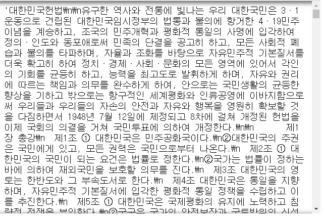

```python
len(c)
# > 18884

sent = [s for s in sent_tokenize(c)]
sent[3]
# > '제2조 ① 대한민국의 국민이 되는 요건은 법률로 정한다.'

len(sent)
# > 357

temp = sent_tokenize(c)[0:5]
len(temp)
# > 5
```

## 데이터 전처리

- [konlpy.org](https://konlpy.org/en/latest/) => API => Okt

```python
okt = Okt()
okt.pos('오늘은 날씨가 따뜻합니다')
# > [('오늘', 'Noun'),
# >  ('은', 'Josa'),
# >  ('날씨', 'Noun'),
# >  ('가', 'Josa'),
# >  ('따뜻합니다', 'Adjective')]
```


```python
okt = Okt()
for i in range(10) :
    for w, t in okt.pos(temp[i]) :
        print('w :',w)
        print('t :',t)
```

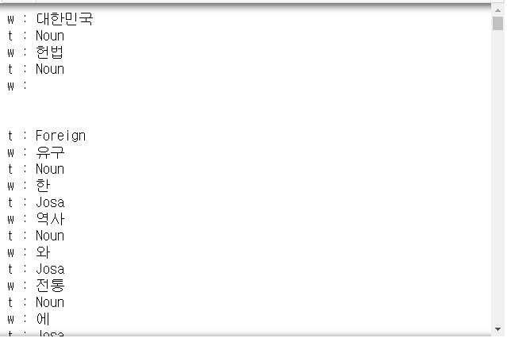

```python
okt = Okt()
doc0 = [' '.join([''.join(w) for w, t in okt.pos(s) if t not in ['Number', 'Foreign'] and w not in ['제', '조']]) for s in sent_tokenize(c)]
doc0
```


```python
len(doc0)
# > 357

doc0[2]
# > '대한민국 의 주권 은 국민 에게 있고 , 모든 권력 은 국민 으로부터 나온다 .'
```

### Tokenizer

```python
tokenizer = Tokenizer()
tokenizer.fit_on_texts(doc0)

tokenizer.index_word
```

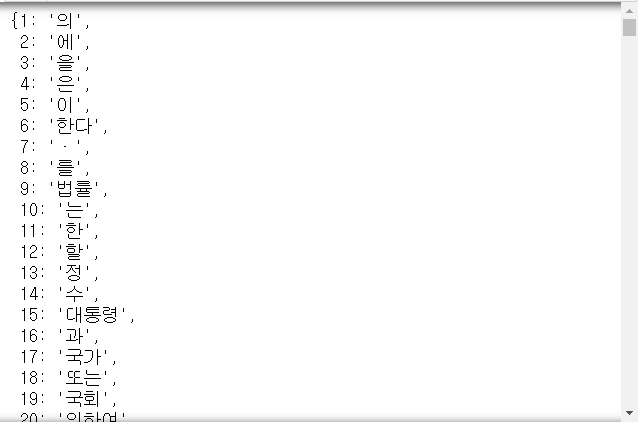

```python
len(tokenizer.index_word) # 중복을 제외한 단어 개수
# > 1164

tokenizer.word_index
```

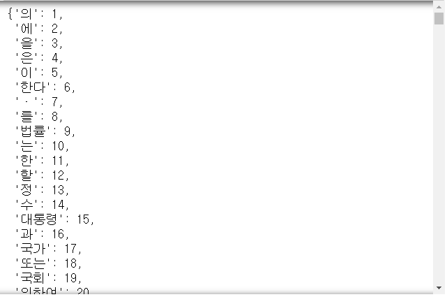

```python
tokenizer.texts_to_sequences(doc0)
```

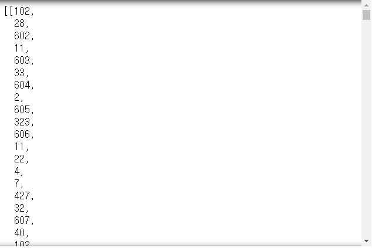

- 길이가 0일 sequence 찾고 삭제하기

```python
import numpy as np
for a in tokenizer.texts_to_sequences(doc0) :
    if len(a) <= 1 :
        print(len(a))
# > 0
# > 0
# > 0

doc = [tok for tok in tokenizer.texts_to_sequences(doc0) if len(tok) > 1]
```

```python
len(doc)
# > 354

doc[1]
# > [45, 439, 648, 102, 4, 649, 650]
```

```python
max_len = max([len(x)-1 for x in doc])
max_len
# > 187
```

```python
tokenizer.word_counts # 전체에서 단어가 몇번 나왔는지
```

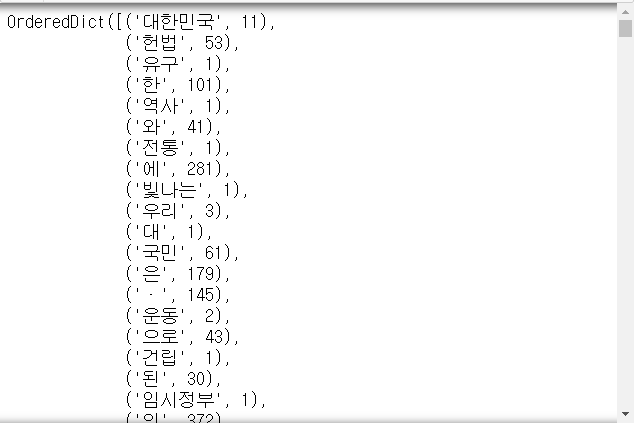

```python
vocab_size = len(tokenizer.word_index) + 1
vocab_size
# > 1165
```

## 패딩

### cf. yield

```python
def cf() :
    for i in range(3) :
        yield i*i # 객체 생성
print(cf())
# > <generator object cf at 0x0000020D08BE1DC8>

obj = cf()
for i in obj :
    print(i)
# > 0
# > 1
# > 4
```

----

```python
def gen_data(doc, maxLen, vocabSize) :
    for sent in doc :
        inputs = []
        targets = []
        for i in range(1, len(sent)) :
            inputs.append(sent[0:i])
            targets.append(sent[i])
        y = np_utils.to_categorical(targets, vocabSize)
        inputSeq = sequence.pad_sequences(inputs, maxlen=maxLen)
        yield (inputSeq, y)
```

```python
for i, (x, y) in enumerate(gen_data(doc, max_len, vocab_size)) :
    print(i)
    print('x', x.shape, '\n', x)
    print('y', y.shape, '\n', y)
```

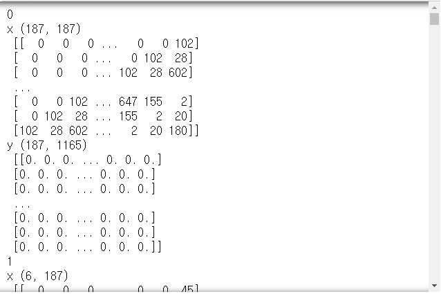

```python
xdata = []
ydata = []
for x, y in gen_data(doc, max_len, vocab_size) :
    xdata.append(x)
    ydata.append(y)

xdata
```

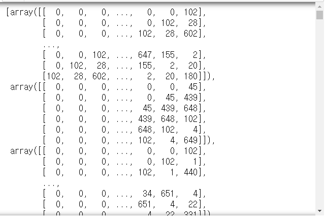

```python
ydata
```

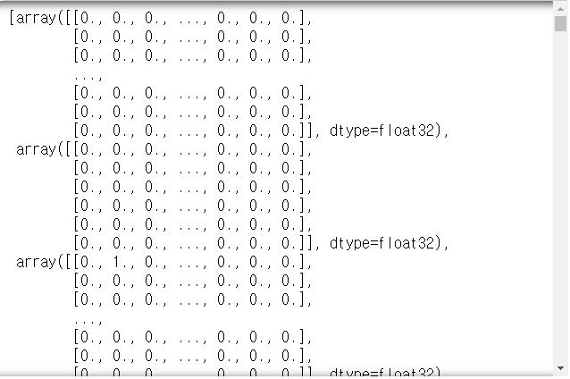

- 배열 합치기
  - ex.
    
    ```python
    a = np.array([[1, 2], [3, 4]])
    b = np.array([[5, 6], [7, 8], [9, 10]])
    
    np.concatenate((a, b), axis=0)
    # > array([[ 1,  2],
    # >        [ 3,  4],
    # >        [ 5,  6],
    # >        [ 7,  8],
    # >        [ 9, 10]])
    
    np.concatenate((a, b.T), axis=1)
    # > array([[ 1,  2,  5,  7,  9],
    # >        [ 3,  4,  6,  8, 10]])

    np.concatenate((a, b), axis=None)
    # > array([ 1,  2,  3,  4,  5,  6,  7,  8,  9, 10])
    ```
  
  ```python
  xdata = np.concatenate(xdata)
  ydata = np.concatenate(ydata)
  
  xdata
  # > array([[  0,   0,   0, ...,   0,   0, 102],
  # >        [  0,   0,   0, ...,   0, 102,  28],
  # >        [  0,   0,   0, ..., 102,  28, 602],
  # >        ...,
  # >        [  0,   0,   0, ...,  38,  29,  61],
  # >        [  0,   0,   0, ...,  29,  61,   8],
  # >        [  0,   0,   0, ...,  61,   8, 237]])
  
  xdata.shape
  # > (6917, 187)
  
  ydata
  # > array([[0., 0., 0., ..., 0., 0., 0.],
  # >        [0., 0., 0., ..., 0., 0., 0.],
  # >        [0., 0., 0., ..., 0., 0., 0.],
  # >        ...,
  # >        [0., 0., 0., ..., 0., 0., 0.],
  # >        [0., 0., 0., ..., 0., 0., 0.],
  # >        [0., 0., 0., ..., 0., 0., 0.]], dtype=float32)
  
  ydata.shape
  # > (6917, 1165)
  ```

## 모델

```python
model = Sequential()
model.add(Embedding(vocab_size, 100, input_length=max_len))
# Embedding : sparse matrix를 차원을 축소하여 표현
# 1165, 축소결과의 차원, input_length=입력 시퀀스의 길이
model.add(LSTM(100, return_sequences=False))
model.add(Dropout(0.5))
model.add(Dense(vocab_size, activation='softmax'))

model.summary()
```

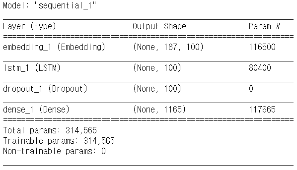

```python
model.compile(loss='categorical_crossentropy', 
              optimizer='rmsprop', # RMSprop()
              metrics=['accuracy'])
hist = model.fit(xdata, ydata, epochs=500, batch_size=800)
```

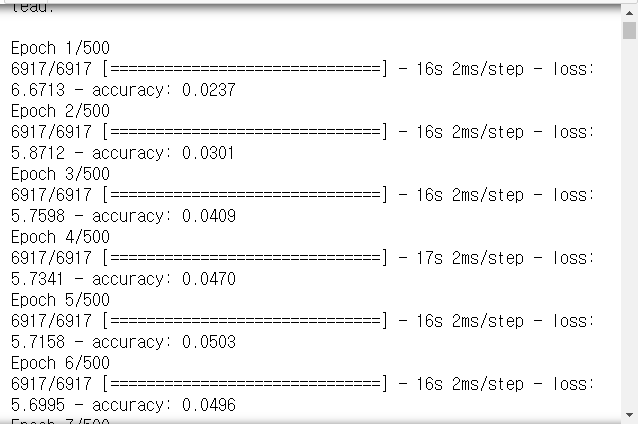

```python
import matplotlib.pyplot as plt
plt.plot(hist.history['accuracy'])
plt.show()
model.save('tentGen.hdf5')
```

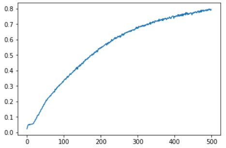

- 모델 불러오기

  ```python
  from keras.models import load_model
  model = load_model('tentGen.hdf5')
  ```

## 예측

```python
word_list = '대한민국 의 국민 이 되는 요건 은 법률 로 정 한다 .'.split()
word_list
# > ['대한민국', '의', '국민', '이', '되는', '요건', '은', '법률', '로', '정', '한다', '.']
```

- 패딩

```python
reverse_word_map = dict(map(reversed, 
                            tokenizer.word_index.items()))
len(reverse_word_map)
# > 1164

x = sequence.pad_sequences(
    [[tokenizer.word_index[w] for w in word_list[:2]]],
    maxlen=max_len)
x
# > array([[  0,   0,   0,   0,   0,   0,   0,   0,   0,   0,   0,   0,   0,
# >           0,   0,   0,   0,   0,   0,   0,   0,   0,   0,   0,   0,   0,
# >           0,   0,   0,   0,   0,   0,   0,   0,   0,   0,   0,   0,   0,
# >           0,   0,   0,   0,   0,   0,   0,   0,   0,   0,   0,   0,   0,
# >           0,   0,   0,   0,   0,   0,   0,   0,   0,   0,   0,   0,   0,
# >           0,   0,   0,   0,   0,   0,   0,   0,   0,   0,   0,   0,   0,
# >           0,   0,   0,   0,   0,   0,   0,   0,   0,   0,   0,   0,   0,
# >           0,   0,   0,   0,   0,   0,   0,   0,   0,   0,   0,   0,   0,
# >           0,   0,   0,   0,   0,   0,   0,   0,   0,   0,   0,   0,   0,
# >           0,   0,   0,   0,   0,   0,   0,   0,   0,   0,   0,   0,   0,
# >           0,   0,   0,   0,   0,   0,   0,   0,   0,   0,   0,   0,   0,
# >           0,   0,   0,   0,   0,   0,   0,   0,   0,   0,   0,   0,   0,
# >           0,   0,   0,   0,   0,   0,   0,   0,   0,   0,   0,   0,   0,
# >           0,   0,   0,   0,   0,   0,   0,   0,   0,   0,   0,   0,   0,
# >           0,   0,   0, 102,   1]])

model.predict(x)
# > array([[2.3346711e-07, 2.7693211e-04, 3.5126504e-04, ..., 1.7630579e-06,
# >         4.1697467e-06, 3.9913415e-04]], dtype=float32)

model.predict(x)[0].sum()
# > 0.9999987
```

- '대한민국 의' 다음에 나올 가능성이 높은 단어

  ```python
  np.argmax(model.predict(x))
  # > 441
  
  tokenizer.index_word[np.argmax(model.predict(x))]
  # > '영토'
  ```

### cf. np.argsort()

```python
tmp = np.array([2.5, 1.5, 0, 1])
tmp.argsort() # 인덱스 번호
# > array([2, 3, 1, 0], dtype=int64)
```

----

- '대한민국 의' 다음에 나올 가능성이 높은 단어 5개 

```python
np.argsort(-model.predict(x))[0][:5]
# > array([441, 440, 157,  65, 894], dtype=int64)

for i in np.argsort(-model.predict(x))[0][:5] :
    print(tokenizer.index_word[i])
# > 영토
# > 주권
# > 유지
# > 조직
# > 종목
```

- 다른 방법

```python
p = model.predict(x)[0]
idx = np.flip(np.argsort(p), 0)
idx
# > array([441, 440, 157, ..., 893, 920, 512], dtype=int64)

p[idx]
# > array([1.3463908e-01, 1.3271762e-01, 3.6195286e-02, ..., 2.2027957e-07,
# >        1.3206828e-07, 3.7605478e-08], dtype=float32)
  
for i in idx[:10] :
    print(reverse_word_map[i])
# > 영토
# > 주권
# > 유지
# > 조직
# > 종목
# > 법
# > 설립
# > 지출
# > 국민
# > 종류
```

- word_list에서 입력하는 갯수에 따라 다음 단어 예측하는 함수 작성

```python
def predict_word(i, n) :
    x = sequence.pad_sequences(
        [[tokenizer.word_index[w] for w in word_list[:i]]],
        maxlen=max_len)
    p = model.predict(x)[0]
    idx = np.flip(np.argsort(p), 0)
    for j in idx[:n] :
        print(' '.join(word_list[:i]), 
              reverse_word_map[j], 
              '(p={:4.2f}%)'.format(100*p[j]))
```

```python
# '대한민국' 다음 단어 3개 예측
predict_word(1, 3)
# > 대한민국 의 (p=67.47%)
# > 대한민국 은 (p=23.39%)
# > 대한민국 헌법 (p=2.86%)

# '대한민국 의' 다음 단어 3개 예측
predict_word(2, 3)
# > 대한민국 의 영토 (p=13.46%)
# > 대한민국 의 주권 (p=13.27%)
# > 대한민국 의 유지 (p=3.62%)

# '대한민국 의 국민 이 되는' 다음 단어 3개 예측
predict_word(5, 3)
# > 대한민국 의 국민 이 되는 요건 (p=96.20%)
# > 대한민국 의 국민 이 되는 되는 (p=1.04%)
# > 대한민국 의 국민 이 되는 중대한 (p=0.43%)
```

  


