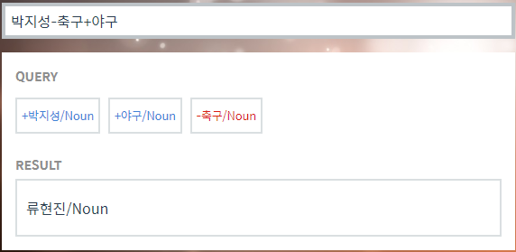
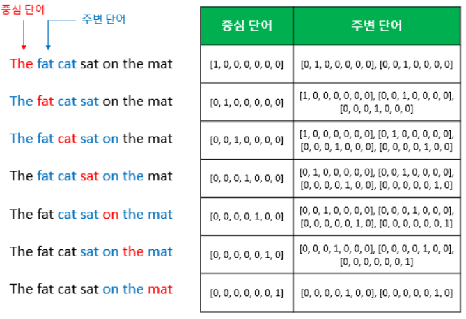
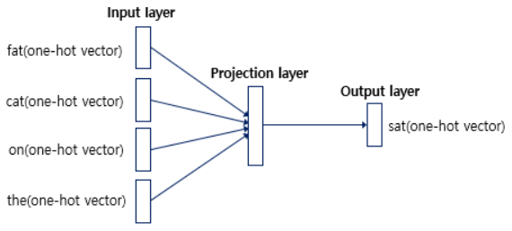
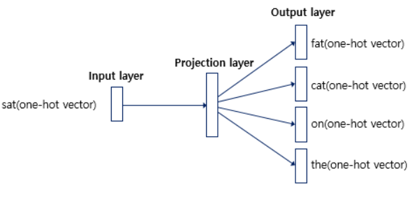
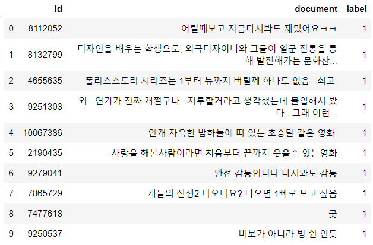
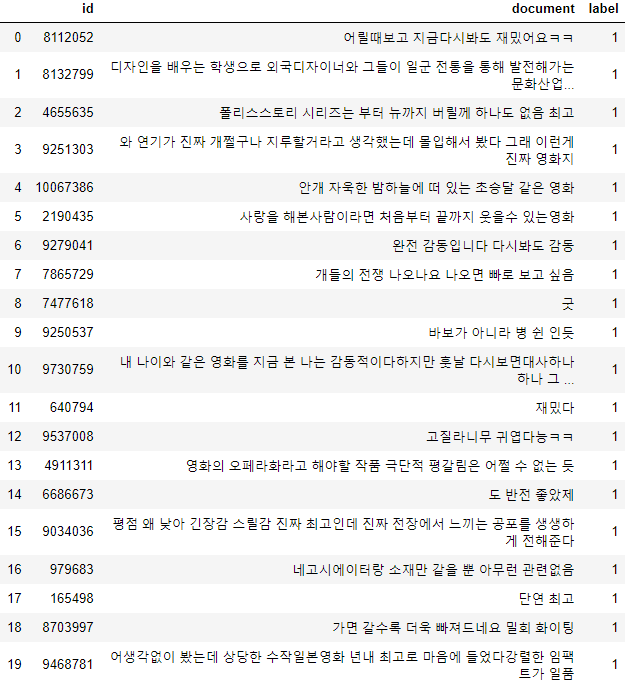
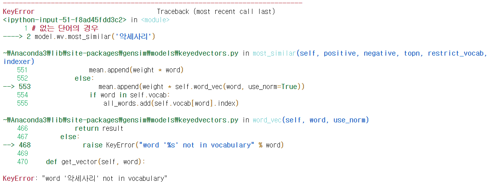

# Day83 TensorFlow와 Keras 라이브러리를 활용한 딥러닝(21)

# 워드 임베딩

- 워드임베딩 : 단어 -> 벡터
- 원핫벡터 문제점
  - 공간 낭비
  - 단어의미 저장X
  - 원핫벡터 ex. `멀캠 = [0 0 0 ... 0 1 0 ... 0]` => 1000차원
  - 임베딩 ex. `멀캠 = [0.3 -1.5 ...]` => 100차원
- 워드 임베딩 관련 알고리즘
  - Word2Vec, GloVe, LSA
  - 신경망 학습

## Word2Vec

- 단어 간 유사도를 방영할 수 있도록 단어의 의미를 벡터화 할 수 있는 방법

- [Word2Vec 예시 사이트](https://word2vec.kr/search/)

  

- [TensorFlow에서의 설명](https://tensorflowkorea.gitbooks.io/tensorflow-kr/content/g3doc/tutorials/word2vec/)

### 희소 표현(Sparse Representation)

- 원핫 벡터 : 원핫 인코딩을 통해서 나온 결과로, 표현하고자 하는 단어의 인덱스 값만 1이고, 나머지 인덱스에는 전부 0으로 표현되는 벡터 표현 방법
- 희소 표현 : 벡터 또는 행렬의 값 대부분이 0으로 표현되는 방법
  - 즉, 원핫 벡터는 회소 벡터

- 이러한 표현방법은 각 단어간 유사성을 표현할 수 없다는 단점이 존재
- 이를 위한 대안으로 단어의 '의미'를 다차원 공간에 벡터화하는 방법을 찾게 되는데, 이러한 표현 방법을 **분산 표현(distributed representation)**이라 한다.
- 이렇게 분산 표현을 이용하여 단어의 유사도를 벡터화하는 작업은 워드 임베딩 작업에 속하므로, 이러한 방식으로 표현된 벡터 또한 임베딩 벡터라 하고, 저차원을 가지므로 밀집 벡터에도 속함.

### 분산 표현(Distributed Representation)

- 분산 표현 방법은 기본적으로 분포 가설이라는 가정하에 만들어진 표현 방법
  - 가정 : **비슷한 위치에 등장한느 단어들은 비슷한 의미를 가진다.**
  - ex. 강아지란 단어는 귀엽다, 예쁘다, 애교 등의 단어가 주로 함께 등장
    - 분포 가설에 따라서 저런 내용을 가진 텍스트를 벡터화 한다면, 저 단어들은 의미적으로 가까운 단어가 됨
- 분산 표현은 분포 가설을 이용하여 단어들의 셋을 학습하고, 벡터에 단어의 의미를 여러 차원에 분산하여 표현

- 이렇게 표현된 벡터들은 원핫 벡터처럼 벡터의 차원이 단어 집합의 크기일 필요가 없으므로, 벡터의 차원이 상대적으로 저차원으로 축소
  - ex. 단어가 10,000개 있고, 인덱스가 1부터 시작한다고 하였을 때 강아지란 단어의 인덱스는 5였다면 원핫벡터는 다음과 같다.
    - 원핫 벡터 : `강아지 = [0 0 0 0 1 0 ... 0]`
  - Word2Vec로 임베딩 된 벡터는 굳이 벡터의 차원이 단어 집합의 크기가 될 필요가 없다. 강아지란 단어를 표현하기 위해 사용자가 설정한 차원을 가지는 벡터가 되면서 각 차원은 실수형 값을 가진다.
    - Word2Vec : `강아지 = [0.2 0.3 0.5 0.7 0.2 ... 0.2]`
- 요약하면 희소 표현이 고차원에 각 차원이 분리된 표현 방법이었다면, 분산 표현은 저차원에 **단어의 의미를 여러 차원에다가 분산**하여 표현
  - 이러한 표현 방법을 사용하면 **단어 간 유사도** 계산 가능
- 이러한 학습 방법에는 NNLM, RNNLM 등이 있으나, 요즘에는 해당 방법들의 속도를 대폭 개선시킨 Word2Vec가 많이 사용되고 있다.

### CBOW(Continuous Bag of Words)

- Word2Vec에는 CBOW(continuous Bag of Words)와 Skip-Gram 두 가지 방식이 존재
  - CBOW : 주변에 있는 단어들을 가지고, 중간에 있는 단어들을 예측하는 방법
  - Skip-Gram : 중간에 있는 단어로 주변 단어들을 예측하는 방법
- 매커니즘 자체는 동일하기 때문에 CBOW를 이해한면 Skip-Gram도 손쉽게 이해 가능

**예문 : 'The fat cat sat on the mat'**

- `{'The', 'fat', 'cat', 'on', 'the', 'mat'}`으로 부터 `sat`을 예측하는 것이 CBOW가 하는 일

  - 예측해야하는 단어 `sat`을 중심 단어(center word)
  - 예측에 사용되는 단어들을 주변 단어(context word)

- 윈도우(window) : 중심 단어를 예측하기 위해서 앞, 뒤로 몇 개의 단어를 볼지를 결정한 범위

  - ex. 윈도우 크기가 2이고, 예측하고자 하는 중심 단어가 `sat`이라고 한다면
    - 앞의 두 단어인 `fat`과 `cat`, 그리고 뒤의 두 단어인 `on`, `the`를 참고
  - 윈도우 크기가 `n`이라고 한다면, 실제 중심 단어를 예측하기 위해 참고하려고 하는 주변 단어의 개수는 `2n`이 될 것
  - 윈도우 크기를 정했다면, 윈도우를 계속 움직여서 주변 단어와 중심 단어를 바꿔가며 학습을 위한 데이터 셋을 만들 수 있는데, 이 방법을 슬라이딩 윈도우(sliding window)라 한다.

  
  - 위 그림에서 좌측의 중심 단어와 주변 단어의 변화는 윈도우 크기가 2일 때, 슬라이딩 윈도우가 어떤 식으로 이루어지면서 데이터 셋을 만드는지 보여줌
  - 또한 Word2Vec에서 입력은 모두 원핫 벡터가 되어야 하는데, 우측 그림은 중심 단어와 주변 단어를 어떻게 선택했을 때에 따라서 각각 어떤 원핫 벡터가 되는지 보여줌
  - 위 그림은 결국 CBOW를 위한 전체 데이터 셋을 보여주는 것

  

  - CBOW의 인공 신경망을 간단히 도식화
  - 입력층의 입력으로서 앞, 뒤로 사용자가 정한 윈도우 크기 범위 안에 있는 주변 단어들의 원핫 벡터가 들어감
  - 출력층에서 예측하고자 하는 중간 단어의 원핫 벡터가 필요
  - 위 그림을 통해, Word2Vec은 딜러닝 모델이 아니라는 점을 알 수 있다.
    - 보통 딥러닝은, 입력층과 출력층 사이의 은닉층의 개수가 충분히 쌓인 신경망을 학습할 때를 말함
    - Word2Vec는 입력층과 출력층 사이에 하나의 은닉칭만 존재
    - 이렇게 은닉층이 1개인 경우에는 일반적으로 심층신경망(Deep Neural Network)이 아니라 얕은신경망(Shallow Neural Netword)라고 부름
  - Word2Vec의 은닉층은 일반적인 은닉층과는 달리 활성화 함수가 존재하지 않으며 룩업 테이블이라는 연산을 담당하는 층으로 일반적인 은닉층과 구분하기 위해 투사층(projection layer)이라고 부르기도 함

### Skip-Gram

- Skip-Gram은 중심 단어에서 주변 단어를 예측



- 앞서 언급한 동일한 예문에 대해서 인공 신경망을 도식화
- 중심 단어에 대해서 주변 단어를 예측하기 때문에, 투사층에서 벡터들을 평균을 구하는 과정이 없다.

- 여러 논문에서 성능 비교를 진행한 결과를 살펴보면, 전반적으로 Skip-Gram이 CBOW보다 성능이 좋다고 알려져 있다.

### 실습

```python
import re
from lxml import etree # parser
from nltk.tokenize import word_tokenize, sent_tokenize
```

- `ted 강연 내용`

```python
path_word2vec = '../data_for_analysis/word2vec/'
target_text = etree.parse(open(path_word2vec + 'ted_en-20160408.xml', 'r', encoding='utf-8'))
```

- content 태그 내부의 내용을 추출

```python
parse_text = '\n'.join(target_text.xpath('//content/text()'))
parse_text[:100]
# > "Here are two reasons companies fail: they only do more of the same, or they only do what's new.\nTo m"
```

- (배경음) 제거 => 강연자의 내용만 남김

```python
content_text = re.sub('\([^)]*\)', '', parse_text) # "(')'를 제외한 모든 문자)"
```

- 문장 단위 토큰화

```python
sent_text = sent_tokenize(content_text)
```

- 대문자 => 소문자, 구두점 제거

```python
normalized_text = []
for sent in sent_text :
    tokens = re.sub('[^a-z0-9]+', ' ', sent.lower())
    normalized_text.append(tokens)
result = [word_tokenize(s) for s in normalized_text]
```

```python
for i in result[:5] :
    print(i)
# > ['here', 'are', 'two', 'reasons', 'companies', 'fail', 'they', 'only', 'do', 'more', 'of', 'the', 'same', 'or', 'they', 'only', 'do', 'what', 's', 'new']
# > ['to', 'me', 'the', 'real', 'real', 'solution', 'to', 'quality', 'growth', 'is', 'figuring', 'out', 'the', 'balance', 'between', 'two', 'activities', 'exploration', 'and', 'exploitation']
# > ['both', 'are', 'necessary', 'but', 'it', 'can', 'be', 'too', 'much', 'of', 'a', 'good', 'thing']
# > ['consider', 'facit']
# > ['i', 'm', 'actually', 'old', 'enough', 'to', 'remember', 'them']
```

- Word2Vec

```python
from gensim.models import Word2Vec
```

```python
model = Word2Vec(sentences=result, 
                 size=100, window=5, 
                 min_count=5, workers=4, sg=0)
# size : 임베딩 벡터 차원
# window : window 크기
# min_count : 최소 등장 횟수
# workers : 사용할 core 개수
# sg : skip-gram(1), cbow(0)

model.wv.most_similar('phone') # 코사인 유사도가 높은 단어를 찾음
# > [('phones', 0.71681809425354),
# >  ('card', 0.711727499961853),
# >  ('facebook', 0.7001460194587708),
# >  ('smartphone', 0.6659349799156189),
# >  ('wrist', 0.639427661895752),
# >  ('car', 0.6360241174697876),
# >  ('license', 0.6330104470252991),
# >  ('camera', 0.6247788667678833),
# >  ('mobile', 0.6245977878570557),
# >  ('file', 0.6224879026412964)]

model.wv.most_similar('boy')
# > [('girl', 0.9330066442489624),
# >  ('kid', 0.8512483835220337),
# >  ('woman', 0.8183084726333618),
# >  ('lady', 0.7915703058242798),
# >  ('man', 0.7763484716415405),
# >  ('mary', 0.7209384441375732),
# >  ('guy', 0.7205684185028076),
# >  ('sister', 0.7131153345108032),
# >  ('brother', 0.7100837230682373),
# >  ('friend', 0.7027981877326965)]
```

- [gensim사이트](https://radimrehurek.com/gensim/)
- computer와 유사한 20개의 단어 출력

```python
model.wv.most_similar(positive=['computer'], topn=20)
# > [('machine', 0.7497844696044922),
# >  ('software', 0.7322745323181152),
# >  ('camera', 0.7024255990982056),
# >  ('device', 0.697179913520813),
# >  ('3d', 0.6677122116088867),
# >  ('robot', 0.6658931970596313),
# >  ('program', 0.6622166037559509),
# >  ('chip', 0.661513090133667),
# >  ('printer', 0.6609671115875244),
# >  ('simulation', 0.6390095353126526),
# >  ('desktop', 0.638795018196106),
# >  ('video', 0.6364630460739136),
# >  ('interface', 0.6306491494178772),
# >  ('gps', 0.6158559918403625),
# >  ('visualization', 0.6040993928909302),
# >  ('satellite', 0.6024469137191772),
# >  ('synthetic', 0.5998781323432922),
# >  ('film', 0.5964647531509399),
# >  ('game', 0.5950872898101807),
# >  ('mouse', 0.5950431823730469)]

model.wv.most_similar(negative=['computer'], topn=20)
# > [('saving', 0.31383904814720154),
# >  ('apiece', 0.3027685880661011),
# >  ('dangerous', 0.2999154329299927),
# >  ('guaranteed', 0.2997066378593445),
# >  ('muslims', 0.28697335720062256),
# >  ('among', 0.2753928601741791),
# >  ('alive', 0.2749882638454437),
# >  ('hates', 0.27164721488952637),
# >  ('tend', 0.26601260900497437),
# >  ('wealthy', 0.2644771635532379),
# >  ('against', 0.26311954855918884),
# >  ('wars', 0.25828316807746887),
# >  ('kills', 0.2579818367958069),
# >  ('agonizing', 0.2561218738555908),
# >  ('vie', 0.25246796011924744),
# >  ('ninety', 0.25226178765296936),
# >  ('dull', 0.25195401906967163),
# >  ('mostly', 0.25071269273757935),
# >  ('miserable', 0.24832552671432495),
# >  ('consuming', 0.24827337265014648)]
```

#### 한글

- `ratings.txt` : 네이버 영화 평점 댓글 모음

```python
import pandas as pd
```

```python
train_data = pd.read_table(path_word2vec + 'ratings.txt')
train_data[:10]
```



```python
len(train_data)
# > 200000
```

- data null 확인

```python
train_data.isnull().sum()
# > id          0
# > document    8
# > label       0
# > dtype: int64

train_data.isnull().values.any()
# > True
```

- null 값이 있는 행 전체 제거

```python
train_data = train_data.dropna(how='any') # null 행 제거
train_data.isnull().sum()
# > id          0
# > document    0
# > label       0
# > dtype: int64
```

- 한글을 제외한 문자들 제거

```python
train_data['document'] = train_data['document'].str.replace('[^가-힣ㄱ-ㅎㅏ-ㅣ ]', '')
train_data[:20]
```



- 불용어 처리(사용X)

```python
stopwords = ['하다', '한', '에', '와', '자', '과', '걍',
             '잘', '좀', '는', '의', '가', '이', '은', '들']
```

- 어근 추출

```python
from konlpy.tag import Okt
import matplotlib.pyplot as plt
```

```python
okt = Okt()
tokenized_data = []
for sent in train_data['document'] :
    t = okt.morphs(sent, stem=True) # 어근 추출
    t = [w for w in t if not w in stopwords]
    tokenized_data.append(t)
```

- `tokenizer_data`에 저장된 리뷰에 대해,

  - 리뷰 최대 길이

    ```python
    print(max(len(l) for l in tokenized_data))
    # > 74
    ```

  - 리뷰 평균 길이

    ```python
    print(sum(map(len, tokenized_data))/len(tokenized_data))
    # > 11.018480739229568
    ```

- stem:어근, norm:그래욬ㅋㅋ => 그래요

```python
plt.hist([len(s) for s in tokenized_data], bins=50)
plt.show()
```


- Word2Vec 적합

```python
model = Word2Vec(sentences=tokenized_data, 
                 size=100, window=5, 
                 min_count=5, workers=4, sg=0)
```

```python
model.wv.vectors.shape
# > (16480, 100)

model.wv.most_similar('송강호')
# > [('설경구', 0.8972939252853394),
# >  ('한석규', 0.8848400712013245),
# >  ('하정우', 0.8739238977432251),
# >  ('류승범', 0.8739123344421387),
# >  ('디카프리오', 0.8687660098075867),
# >  ('엄정화', 0.8659766912460327),
# >  ('능청', 0.8635000586509705),
# >  ('차승원', 0.8625011444091797),
# >  ('최민수', 0.8613600730895996),
# >  ('크로우', 0.8589574098587036)]
```

#### 미리 훈련된 모델

- 구글 wrod2vec 모델 : 3백만개 단어 벡터
- 한글 [미리 훈련된 word2vec](https://github.com/Kyubyong/wordvectors)의 모델 사용

```python
model = Word2Vec.load(path_word2vec + 'ko.bin')

model.wv.most_similar('아저씨')
# > [('아빠', 0.7213807106018066),
# >  ('엄마', 0.7022912502288818),
# >  ('언니', 0.6791576147079468),
# >  ('오빠', 0.6620899438858032),
# >  ('할머니', 0.6500482559204102),
# >  ('아가씨', 0.6499045491218567),
# >  ('하녀', 0.6469343304634094),
# >  ('아주머니', 0.6318455934524536),
# >  ('강아지', 0.6054108142852783),
# >  ('애인', 0.5956813097000122)]

model.wv.most_similar('모델')
# > [('컨버터블', 0.6268141269683838),
# >  ('차종', 0.6252385377883911),
# >  ('기종', 0.6187839508056641),
# >  ('고성능', 0.6137087345123291),
# >  ('제품군', 0.6077162027359009),
# >  ('니콘', 0.5926024913787842),
# >  ('모형', 0.591162919998169),
# >  ('라인업', 0.5850834846496582),
# >  ('세단', 0.5844414234161377),
# >  ('인텔', 0.5693677067756653)]

model.wv.most_similar('고객')
# > [('소비자', 0.7362264394760132),
# >  ('이용자', 0.7075498104095459),
# >  ('구매자', 0.6901414394378662),
# >  ('수요자', 0.6813639998435974),
# >  ('공급자', 0.67668616771698),
# >  ('투자자', 0.6675817966461182),
# >  ('종업원', 0.6328440308570862),
# >  ('판매자', 0.6294743418693542),
# >  ('기업', 0.6054396629333496),
# >  ('가입자', 0.6021339893341064)]

model.wv.most_similar('구매')
# > [('구입', 0.8432365655899048),
# >  ('판매', 0.7250126004219055),
# >  ('매입', 0.6791813373565674),
# >  ('대여', 0.6570079326629639),
# >  ('결제', 0.6531978845596313),
# >  ('지불', 0.6490845680236816),
# >  ('공급자', 0.6160480380058289),
# >  ('납품', 0.6104522347450256),
# >  ('인출', 0.6025936603546143),
# >  ('제공', 0.6014571785926819)]
```

- 없는 단어의 경우 오류가 발생하므로 예외처리 필요

```python
model.wv.most_similar('악세사리')
```



- 위키피디아 데이터 : [kowiki dump](https://dumps.wikimedia.org/kowiki/20200501/)

