# Day84 RNN을 활용한 챗봇  시스템 구축(11)

- 참고 사이트
  - [ratsgo's blog(for textmining)](https://ratsgo.github.io/)
  - [CS224d : Deep Learning for Natural Language Processing](https://cs224d.stanford.edu/)
  - 논문 : [Neural Machine Translation by Jointly Learning to Align and Translate](https://arxiv.org/pdf/1409.0473.pdf)

# Attention

- Seq2Seq 모델은 **인코더**에서 입력 시퀀스를 컨텍스트 벡터라는 하나의 고정된 크기의 벡터 표현으로 압축되고, **디코더**는 이 컨텍스트 벡터를 통해서 출력 시퀀스를 만들어냄
- 하지만 이러한 RNN에 기반한 Seq2Seq 모델에는 크게 두 가지 문제가 존재
  1. 하나의 고정된 크기의 벡터에 모든 정보를 압축하려고 하여 정보 손실이 발생
  2. RNN의 고질적인 문제인 기올기 소설(Vanishing Gradient) 문제가 존재
- 즉, 기계 번역 분야에서 입력 문장이 길면 번역 품질이 떨어지는 현상이 나타남
- 이를 위한 대안으로 입력 시퀀스가 길어지면 출력 시퀀스의 정확도가 떨어지는 것을 보정해주기 위해 어텐션(attention)기법 등장

## 1. 어텐션(Attention)의 아이디어

- 어텐션의 기본 아이디어
  - 디코더에서 출력 단어를 예측하는 매 시점(time step)마다, 인코더에서의 전체 입력 문장을 다시 한 번 참고
  - 단, 전체 입력 문장을 전부 다 동일한 비율로 참고하는 것이 아니라,
    - 해당 시점에서 예측해야할 단어와 연관이 있는 입력 단어 부분을 좀 더 집중(attention)

## 2. 어텐션 함수(Attention Function)

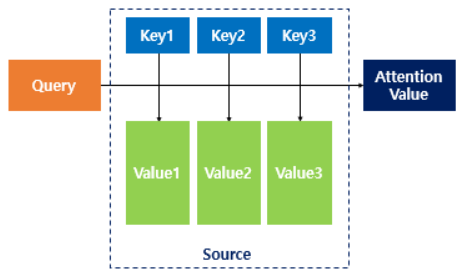

- 어텐션을 함수로 표현하면 주로 다음과 같이 표현

  - **Attention(Q, K, V) = Attention Value**
  - 어텐션 함수는 주어진 '쿼리(Query)'에 대해서 모든 '키(Key)'와의 유사도를 계산
  - 구해낸 이 유사도를 키와 맵핑되어있는 각각의 '값(Value)'에 반영
  - 그리고 유사도가 반영된 '값(Value)'을 모두 더해서 리턴
  - => 여기서 이를 어텐션 값(Attention Value)라고 함

- Seq2Seq + 어텐션 모델에서

  > Q = Query : t 시점의 디코더 셀에서의 은닉 상태
  >
  > K = Keys : 모든 시점의 인코더 셀의 은닉 상태들
  >
  > V = Values : 모든 시점의 인코더 셀의 은닉 상태들

## 3. 닷-프로덕트 어텐션(Dot-Product Attention)

- 어텐션에 다양한 종류가 있는데 그 중에서도 가장 수식저긍로 이해하기 쉽게 수식을 적용한 닷-프로덕트 어텐션(Dot-Product Attention)을 통해 어텐션을 이해
- Seq2Seq에서 사용되는 어텐션 중에서 닷-프로덱트 어텐션과 다른 어텐션의 차이는 주로 중간 수식의 차이로 메커니즘 자체는 거의 유사

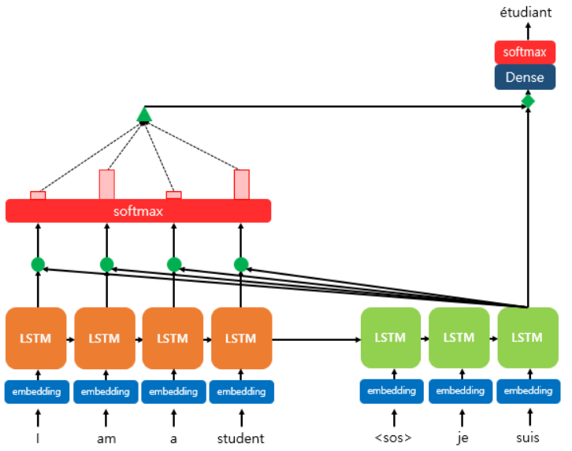

- 위 그림은 디코더의 세번째 LSTM 셀에서 출력 단어를 예측할 때, 어텐션 매커니즘을 사용하는 모습을 보여줌
  - 디코더의 첫번째, 두번째 LSTM 셀은 이미 어텐션 메커니즘을 통해 je와 suis를 예측하는 과정을 거쳤다고 가정
  - 디코더의 세번재 LSTM셀은 출력 단어를 예측하기 위해서 인코더의 모든 입력 단어들의 정보를 다시 참고하고자 함
  - 중간 과정에 대한 설명은 지금은 생략하고 여기서 주목할 것은 인코더의 소프트맥스 함수
- 소프트맥스 함수를 통해 나온 결과값은 I, am, a, student 단어 각각이 출력 단어를 예측할 때 얼마나 도움이 되는지의 정도를 수치화 한 값
  - 위 그림에서 빨간 직사각형의 크기로 소프트맥스 함수의 결과값의 크기를 표현
    - 직사각형의 크기가 클수록 도움이 되는 정도의 크기가 큼
  - 각 입력 단어가 디코더의 예측에 도움이 되는 정도가 수치화하여 측정되면 이를 하나의 정보로 담아서 디코더로 전송
    - 위의 그림에서 초록색 삼각형이 이에 해당
  - 결과적으로, 디코더는 출력 단어를 더 정확하게 예측할 확률이 높아짐

### 1) 어텐션 스코어(Attention Score) 구하기

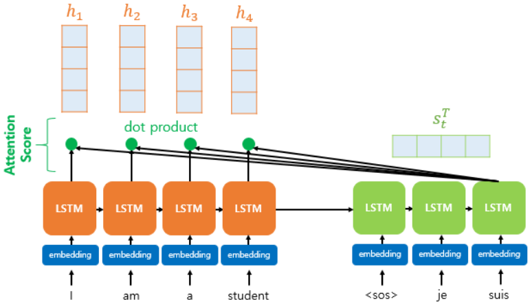

- 인코더의 시점(time step)을 각각 `1, 2, ..., N`이라고 하였을 때, 

  - 인코더의 은닉 상태(hidden state)를 각각 $h_1, h_2, ..., h_N$라고 하고,
  - 디코더의 현재 시점(time step) `t`에서의 디코더의 은닉 상태(hidden state)를 $s_t$라고 하자.
  - 여기서 인코더의 은닉 상태와 디코더의 인닉 상태의 차원이 같다고 가정
  - 위의 그림의 경우에는 인코더의 은닉 상태와 디코더의 은닉 상태가 동일하게 차원이 4이다.

- 어텐션 메커니즘의 첫 걸음인 어텐션 스코어(Attention score)에 대해서 배우기전에, 디코더의 현재 시점 `t`에서 필요한 입력값을 다시 상기

  - 시점 `t`에서 출력 단어를 예측하기 위해서 디코더의 셀은 두 개의 입력값을 필요로 하는데, 바로 이전 시점인 `t-1`의 은닉 상태와 이전 시점 `t-1`에서 나온 출력 단어 이다.

- 그런데 어텐션 메커니즘에서는 출력 단어 예측에 또 다른 값을 필요로 하는데 바로 어텐션 값(Attention Value)이라는 새로운 값이다.

  - `t`번째 단어를 예측하기 위한 어텐션 값을 $a_t$이라고 정의

- 어텐션 값이라는 새로운 개념이 등장한 만큼, 어텐션 값이 현재 시점 `t`에서의 출력 예측에 구체적으로 어떻게 반영되는지는 뒤에서 설명

  - 지금부터 배우는 모든 과정은 $a_t$를 구하기 위한 여정
  - 그리고 그 여정의 첫 걸음은 바로 어텐션 스코어(Attention Score)를 구하는 일
  - 어텐션 스코어(Attention Score)
    - 현재 디코더의 시점 `t`에서 단어를 예측하기 위해, 인코더의 모든 은닉 상태 각각이 디코더의 현 시점의 은닉 상태 $s_t$와 얼마나 유사한지를 판단하는 스코어 값

- 닷-프로덕트 어텐션에서는 이 스코어 값을 구하기 위해 $s_t$를 전치(transpose)하고 각 은닉 상태와 내적(dot product)를 수행

  -  즉, 모든 어텐션 스코어 값은 스칼라

  - ex. $s_t$과 인코더의 `i`번째 은닉 상태의 어텐션 스코어의 계산 방법은 아래과 같다.

    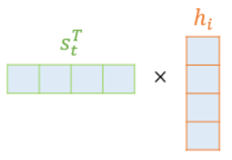

  - 어텐션 스코어 함수 정의

    - $score(s_t, h_i) = s_{i}^{T} h_i$

  - $s_t$와 인코더의 모든 은닉 상태의 어텐션 스코어의 모음값을 $e^t$라고 정의 하면, $e^t$의 수식은 다음과 같다.

    - $e^t = [s_{t}^{T} h_1, ..., s_{t}^{T} h_N]$

### 2) 소프트맥스(softmax) 함수를 통해 어텐션 분포(Attention Distribution) 구하기

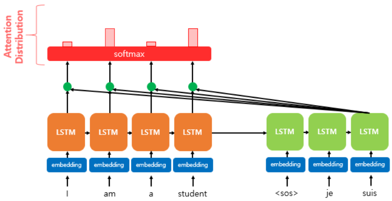

- $e^t$에 소프트맥스 함수를 적용하여, 모든 값을 합하면 1이되는 확률 분포를 구한다.
  - 이를 어텐션분포(Attention Distribution)라고 하며,
  - 각각의 값은 어텐션 가중치(Attention Weight)라고 한다.
  - ex. 소프트맥스 함수를 적용하여 얻은 출력 값인 I, am, a, student의 어텐션 가중치를 각각 0.1, 0.4, 0.1, 0.4라고 하면, 이들의 합은 1이다.
- 위의 그림인 각 인코더의 은닉 상태에서의 어텐션 가중치의 크기를 직사각형의 크기로 시각화
  -  즉, 어텐션 가중치가 클수록 직사각형이 크다.
- 디코더의 시점 `t`에서의 어텐션 가중치의 모음값인 어텐션 분포를 $\alpha^t$라고 할 때, $\alpha^t$을 식으로 정의하면 다음과 같다.
  - $\alpha^t = softmax(e^t)$

### 3) 각 인코더의 어텐션 가중치와 은닉 상태를 가중합하여 어텐션 값(Attention Value) 구하기

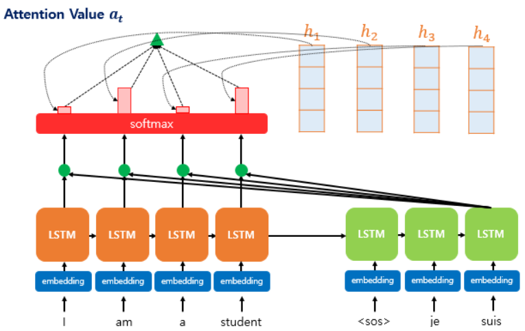

- 지금까지 준비해온 정보들을 하나로 합치는 단계
- 어텐션의 최종 결과 값을 얻기 위해서 각 인코더의 은닉 상태와 어텐션 가중치등르 곱하고, 최종적으로 모두 더한다.
  - 요약하면 가중합(Weighted Sum)을 한다고 할 수 있다.
- 아래는 어텐션의 최종 결과. 즉, 어텐션 함수의 출력 값인 어텐션 값(Attention Value) $a_t$에 대한 식을 보여준다.

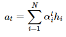

- 이러한 어텐션 값 $a_t$은 종종 인코더의 문맥을 포함하고 있다고하여, **컨텍스트 벡터(context vector)**라고도 불린다.
  - 가장 기본적인 Seq2Seq에서는 인코더의 마지막 은닉 상태를 컨텍스트 벡터라고 부르는 것과 대조

### 4) 어텐션 값과 디코더의 `t`시점의 은닉 상태를 연결(Concatenate) 하기

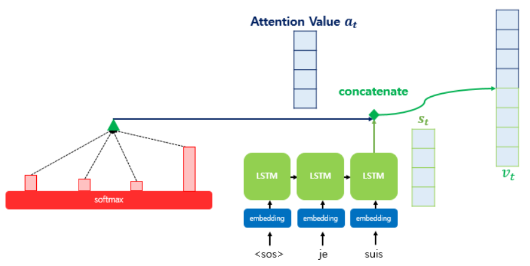

- 어텐션 함수의 최종 값인 어텐션 값 $a_t$을 구하였다.
- 어텐션 값이 구해지면 어텐션 메커니즘은 $a_t$를 $s_t$와 결합(concatenate)하여 하나의 벡터로 만드는 작업을 수행
  - 이러한 작업을 통해 만들어지는 벡터를 $v_t$라 정의
- 구해진 $v_t$를 연산의 입력으로 하여 $\hat{y}$를 구함.

## 4. 다양한 종류의 어텐션(Attention)

- 앞서 Seq2Seq + 어텐션(Attention) 모델에 쓰일 수 있는 다양한 어텐션 종류가 있지만, 닷-프로덕트 어텐션과 다른 어텐션들의 차이는 중간 수식의 차이라고 하였었다.
  - 여기서 말하는 중간 수식은 어텐션 스코어 함수를 의미
  - 위에서 배운 어텐션이 닷-프로덕트 어텐션인 이유는 어텐션 스코어를 구하는 방법이 내적이었기 때문이다.
- 어텐션 스코어를 구하는 방법은 여러가지가 제시되어 있으며, 현재 제시된 여러 종류의 어텐션 스코어 함수는 다음과 같다.

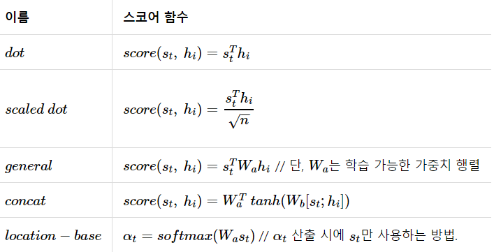

- 어텐션은 처음에는 RNN 기반의 Seq2Seq의 성능을 보정하기 위한 목적으로 소개되었지만, 현재에 이르러서는 어텐션 스스로가 기존의 Seq2Seq를 대체하는 방법이 되어가고 있다.

## 5. 실습

```python
import numpy as np
import pandas as pd
import re
from keras.preprocessing.text import Tokenizer
from keras.preprocessing.sequence import pad_sequences
from bs4 import BeautifulSoup
from nltk.corpus import stopwords
import matplotlib.pyplot as plt
```

```python
path_word2vec = '../data_for_analysis/word2vec/'
data = pd.read_csv(path_word2vec + 'Reviews.csv', nrows=100000)
# 영화 review data
len(data)
# > 100000

data.head()
```

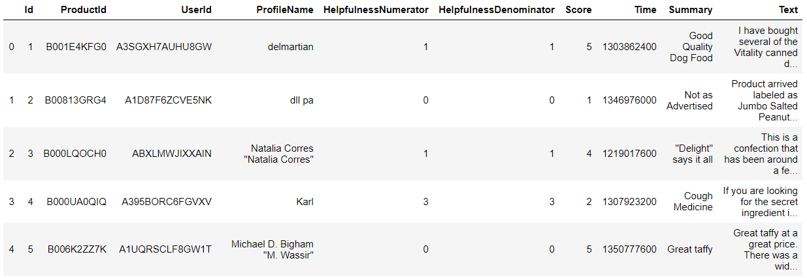

```python
data.info()
# > <class 'pandas.core.frame.DataFrame'>
# > RangeIndex: 100000 entries, 0 to 99999
# > Data columns (total 10 columns):
# > Id                        100000 non-null int64
# > ProductId                 100000 non-null object
# > UserId                    100000 non-null object
# > ProfileName               99996 non-null object
# > HelpfulnessNumerator      100000 non-null int64
# > HelpfulnessDenominator    100000 non-null int64
# > Score                     100000 non-null int64
# > Time                      100000 non-null int64
# > Summary                   99998 non-null object
# > Text                      100000 non-null object
# > dtypes: int64(5), object(5)
# > memory usage: 7.6+ MB
```

- Text, Summary열을 요약에 사용

```python
data = data[['Text', 'Summary']]
data.head()
```

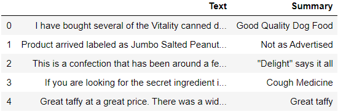

- Text열에 대해서 중복을 제외한 데이터 개수 출력

```python
len(data.Text.unique())
# > 88426
```

- Text열에 대해서 중복 데이터 제거

```python
data.drop_duplicates(subset=['Text'], inplace=True)
data.shape
# > (88426, 2)
```

- null 확인

```python
data.isnull().sum()
# > Text       0
# > Summary    1
# > dtype: int64
```

- null data 제거

```python
data.dropna(axis=0, inplace=True)
data.shape
# > (88425, 2)
```

- 축약형 : 원형 dict

```python
contractions = { 
	"ain't": "am not / are not / is not / has not / have not",
	"aren't": "are not / am not",
	"can't": "cannot",
	"can't've": "cannot have",
	"'cause": "because",
	"could've": "could have",
	"couldn't": "could not",
	"couldn't've": "could not have",
	"didn't": "did not",
	"doesn't": "does not",
	"don't": "do not",
	"hadn't": "had not",
	"hadn't've": "had not have",
	"hasn't": "has not",
	"haven't": "have not",
	"he'd": "he had / he would",
	"he'd've": "he would have",
	"he'll": "he shall / he will",
	"he'll've": "he shall have / he will have",
	"he's": "he has / he is",
	"how'd": "how did",
	"how'd'y": "how do you",
	"how'll": "how will",
	"how's": "how has / how is / how does",
	"I'd": "I had / I would",
	"I'd've": "I would have",
	"I'll": "I shall / I will",
	"I'll've": "I shall have / I will have",
	"I'm": "I am",
	"I've": "I have",
	"isn't": "is not",
	"it'd": "it had / it would",
	"it'd've": "it would have",
	"it'll": "it shall / it will",
	"it'll've": "it shall have / it will have",
	"it's": "it has / it is",
	"let's": "let us",
	"ma'am": "madam",
	"mayn't": "may not",
	"might've": "might have",
	"mightn't": "might not",
	"mightn't've": "might not have",
	"must've": "must have",
	"mustn't": "must not",
	"mustn't've": "must not have",
	"needn't": "need not",
	"needn't've": "need not have",
	"o'clock": "of the clock",
	"oughtn't": "ought not",
	"oughtn't've": "ought not have",
	"shan't": "shall not",
	"sha'n't": "shall not",
	"shan't've": "shall not have",
	"she'd": "she had / she would",
	"she'd've": "she would have",
	"she'll": "she shall / she will",
	"she'll've": "she shall have / she will have",
	"she's": "she has / she is",
	"should've": "should have",
	"shouldn't": "should not",
	"shouldn't've": "should not have",
	"so've": "so have",
	"so's": "so as / so is",
	"that'd": "that would / that had",
	"that'd've": "that would have",
	"that's": "that has / that is",
	"there'd": "there had / there would",
	"there'd've": "there would have",
	"there's": "there has / there is",
	"they'd": "they had / they would",
	"they'd've": "they would have",
	"they'll": "they shall / they will",
	"they'll've": "they shall have / they will have",
	"they're": "they are",
	"they've": "they have",
	"to've": "to have",
	"wasn't": "was not",
	"we'd": "we had / we would",
	"we'd've": "we would have",
	"we'll": "we will",
	"we'll've": "we will have",
	"we're": "we are",
	"we've": "we have",
	"weren't": "were not",
	"what'll": "what shall / what will",
	"what'll've": "what shall have / what will have",
	"what're": "what are",
	"what's": "what has / what is",
	"what've": "what have",
	"when's": "when has / when is",
	"when've": "when have",
    "where'd": "where did",
    "where's": "where has / where is",
    "where've": "where have",
    "who'll": "who shall / who will",
    "who'll've": "who shall have / who will have",
    "who's": "who has / who is",
    "who've": "who have",
    "why's": "why has / why is",
    "why've": "why have",
    "will've": "will have",
    "won't": "will not",
    "won't've": "will not have",
    "would've": "would have",
    "wouldn't": "would not",
    "wouldn't've": "would not have",
    "y'all": "you all",
    "y'all'd": "you all would",
    "y'all'd've": "you all would have",
    "y'all're": "you all are",
    "y'all've": "you all have",
    "you'd": "you had / you would",
    "you'd've": "you would have",
    "you'll": "you shall / you will",
    "you'll've": "you shall have / you will have",
    "you're": "you are",
    "you've": "you have"
}
```

- stopwords

```python
stop_words = set(stopwords.words('english'))
stop_words
```

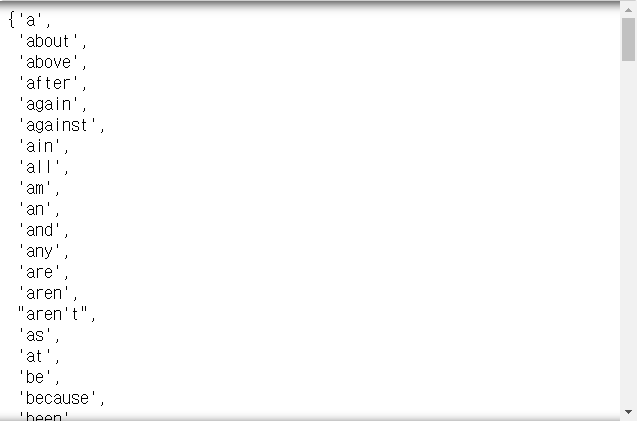

```python
len(stop_words)
# > 179
```

### 전처리

```python
def preprocess_sentence(sent, rs=True) :
    # 대문자 -> 소문자
    sent = sent.lower()
    
    # html tag 제거
    sent = BeautifulSoup(sent, "lxml").text
    
    # 특수문자 제거
    sent = re.sub('\([^?]*\)', '', sent)
    sent = re.sub('"', '', sent)
    
    # 축약어 -> 원형
    sent = ' '.join([contractions[t] if t in contractions else t for t in sent.split()])
    
    # 소유격 제거
    sent = re.sub("'s\b", '', sent)
    
    # 영어를 제외한 모든 문자 제거
    sent = re.sub('[^a-zA-Z]', ' ', sent)
    
    # m이 2개 이상이면, 2개로 표현
    sent = re.sub('[m]{2,}', 'mm', sent)
    
    # 불용어 제거(rs==True)
    if rs :
        tokens = ' '.join(word for word in sent.split() if not word in stop_words if len(word) > 1)
    else :
        tokens = ' '.join(word for word in sent.split() if len(word) > 1)
        
    return tokens
```

```python
preprocess_sentence('<a> I ammmmmmm a student</a>')
# > 'amm student'
```

```python
clean_text = []
for sent in data['Text'] :
    clean_text.append(preprocess_sentence(sent))
print(clean_text[:10])
# > ['bought several vitality canned dog food products found good quality product looks like stew processed meat smells better labrador finicky appreciates product better', 'product arrived labeled jumbo salted peanuts peanuts actually small sized unsalted sure error vendor intended represent product jumbo', 'confection around centuries light pillowy citrus gelatin nuts case filberts cut tiny squares liberally coated powdered sugar tiny mouthful heaven chewy flavorful highly recommend yummy treat familiar story lewis lion witch wardrobe treat seduces edmund selling brother sisters witch', 'looking secret ingredient robitussin believe found got addition root beer extract ordered made cherry soda flavor medicinal', 'great taffy great price wide assortment yummy taffy delivery quick taffy lover deal', 'got wild hair taffy ordered five pound bag taffy enjoyable many flavors watermelon root beer melon peppermint grape etc complaint bit much red black licorice flavored pieces kids husband lasted two weeks would recommend brand taffy delightful treat', 'saltwater taffy great flavors soft chewy candy individually wrapped well none candies stuck together happen expensive version fralinger would highly recommend candy served beach themed party everyone loved', 'taffy good soft chewy flavors amazing would definitely recommend buying satisfying', 'right mostly sprouting cats eat grass love rotate around wheatgrass rye', 'healthy dog food good digestion also good small puppies dog eats required amount every feeding']
```

```python
clean_summary = []
for sent in data['Summary'] :
    clean_summary.append(preprocess_sentence(sent, rs=False))
print(clean_summary[:10])
# > ['good quality dog food', 'not as advertised', 'delight says it all', 'cough medicine', 'great taffy', 'nice taffy', 'great just as good as the expensive brands', 'wonderful tasty taffy', 'yay barley', 'healthy dog food']
```

```python
data['Text'] = clean_text
data['Summary'] = clean_summary
```

- 빈 데이터 확인 후 제거

```python
data.replace('', np.nan, inplace=True)
data.isnull().sum()
# > Text        2
# > Summary    70
# > dtype: int64

data.dropna(axis=0, inplace=True)
data.isnull().sum()
# > Text       0
# > Summary    0
# > dtype: int64

len(data)
# > 88353
```

- 각 데이터의 길이

```python
text_len = [len(s.split()) for s in data['Text']]
summary_len = [len(s.split()) for s in data['Summary']]

np.min(text_len)
# > 1

np.max(text_len)
# > 744

np.mean(text_len)
# > 35.99791744479531

np.min(summary_len)
# > 1

np.max(summary_len)
# > 28

np.mean(summary_len)
# > 4.032641789186559
```

- 최대 길이 지정

```python
text_max_len = 50
summary_max_len = 8
```

- 데이터 길이의 percentile 구하기

```python
def thresh_len(mlen, nlist) :
    c = 0
    for s in nlist :
        if len(s.split()) <= mlen :
            c += 1
    return c / len(nlist)
```

```python
print(thresh_len(text_max_len, data['Text']))
print(thresh_len(summary_max_len, data['Summary']))
# > 0.7979015992665783
# > 0.9400359919866897
```

- max len을 만족하는 데이터만 남기기

```python
data = data[data['Text'].apply(
    lambda x : len(x.split()) <= text_max_len)]
data = data[data['Summary'].apply(
    lambda x : len(x.split()) <= summary_max_len)]
len(data)
# > 67437
```

- Seq2Seq를 위한 token 삽입

```python
data['Summary'] = data['Summary'].apply(
    lambda x : 'sostoken '+ x + ' eostoken')
data['Summary']
# > 0        sostoken good quality dog food eostoken
# > 1            sostoken not as advertised eostoken
# > 2          sostoken delight says it all eostoken
# > 3               sostoken cough medicine eostoken
# > 4                  sostoken great taffy eostoken
# >                           ...                   
# > 99993              sostoken great stuff eostoken
# > 99994               sostoken good stuff eostoken
# > 99995                    sostoken yummy eostoken
# > 99997              sostoken great ramen eostoken
# > 99998                    sostoken spicy eostoken
# > Name: Summary, Length: 67437, dtype: object
```

```python
text_data = list(data['Text'])
summary_data = list(data['Summary'])
```

- train, test data 분할

```python
from sklearn.model_selection import train_test_split

xTrain, xTest, yTrain, yTest = train_test_split(
    text_data, summary_data, 
    test_size=0.2, random_state=42, shuffle=True)

len(xTrain)
# > 53949

len(xTest)
# > 13488
```

- 단어집합 생성

```python
src_token = Tokenizer()
src_token.fit_on_texts(xTrain)

total_cnt = len(src_token.word_index)
total_cnt
# > 32464

src_token.word_counts
```

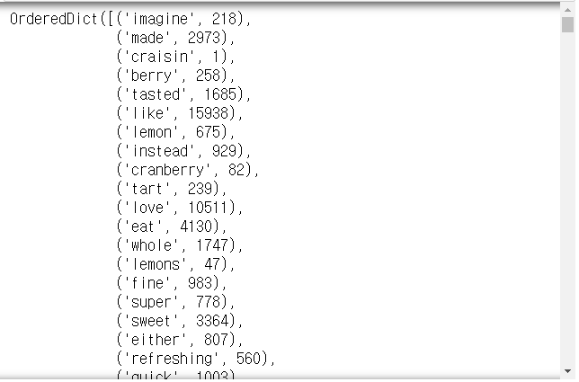

- 사용할 단어의 갯수 줄이기
- 본문

```python
total_freq = 0 # 전체 단어 빈도수 총 합
r_cnt = 0 # 빈도수가 10 미만인 단어의 개수
r_freq = 0 # 빈도수가 10 미만인 단어 빈도수 총 합
for k, v in src_token.word_counts.items() :
    total_freq += v
    if v < 10 :
        r_cnt += 1
        r_freq += v

print('단어 빈도 수 총합 :', total_freq)
print('단어 수 : ', total_cnt)
print('빈도수 10 미만인 단어 빈도 수 총합 :', r_freq)
print('빈도수 10 미만인 단어 수 :', r_cnt)
print('빈도수 10 미만인 단어의 비율 :', r_cnt/total_cnt)
print('빈도수 10 미만인 단어의 빈도 비율 :', r_freq/total_freq)
# > 단어 빈도 수 총합 : 1293918
# > 단어 수 :  32464
# > 빈도수 10 미만인 단어 빈도 수 총합 : 55182
# > 빈도수 10 미만인 단어 수 : 25572
# > 빈도수 10 미만인 단어의 비율 : 0.7877033021192705
# > 빈도수 10 미만인 단어의 빈도 비율 : 0.042647215665907734

total_cnt - r_cnt
# > 6892
```

```python
src_vocab = 7000
src_token = Tokenizer(num_words=src_vocab)
src_token.fit_on_texts(xTrain)
```

- 문장 -> 정수화

```python
xTrain = src_token.texts_to_sequences(xTrain)
xTest = src_token.texts_to_sequences(xTest)

xTrain[:5]
# > [[994,
# >   54,
# >   857,
# >   140,
# >   1,
# >   369,
# >   278,
# >   1985,
# >   910,
# >   6,
# >   32,
# >   130,
# >   2816,
# >   910,
# >   263,
# >   341,
# >   38,
# >   328,
# >   433],
# >  [255, 66, 2139, 59, 43, 3, 50, 9],
# >  [5, 125, 712, 1128, 480],
# >  [853, 2624, 47, 140, 7, 16, 78, 4570, 293, 2002, 23, 134, 81, 3300, 36],
# >  [863, 7, 6893, 6232, 80, 290]]
```

- 요약

```python
tar_token = Tokenizer()
tar_token.fit_on_texts(yTrain)
```

```python
total_freq = 0 # 전체 단어 빈도수 총 합
r_cnt = 0 # 빈도수가 10 미만인 단어의 개수
r_freq = 0 # 빈도수가 10 미만인 단어 빈도수 총 합
for k, v in tar_token.word_counts.items() :
    total_freq += v
    if v < 10 :
        r_cnt += 1
        r_freq += v

print('단어 빈도 수 총합 :', total_freq)
print('단어 수 : ', total_cnt)
print('빈도수 10 미만인 단어 빈도 수 총합 :', r_freq)
print('빈도수 10 미만인 단어 수 :', r_cnt)
print('빈도수 10 미만인 단어의 비율 :', r_cnt/total_cnt)
print('빈도수 10 미만인 단어의 빈도 비율 :', r_freq/total_freq)
print(total_cnt - r_cnt)
# > 단어 빈도 수 총합 : 293701
# > 단어 수 :  32464
# > 빈도수 10 미만인 단어 빈도 수 총합 : 19178
# > 빈도수 10 미만인 단어 수 : 8968
# > 빈도수 10 미만인 단어의 비율 : 0.2762444553967472
# > 빈도수 10 미만인 단어의 빈도 비율 : 0.06529770072284398
# > 23496
```

```python
tar_vocab = 2000
tar_token = Tokenizer(num_words=tar_vocab)
tar_token.fit_on_texts(yTrain)
```

- 문서 -> 정수화

```python
yTrain = tar_token.texts_to_sequences(yTrain)
yTest = tar_token.texts_to_sequences(yTest)
yTrain[:5]
# > [[1, 135, 63, 4, 2],
# >  [1, 17, 2],
# >  [1, 78, 35, 2],
# >  [1, 76, 22, 5, 8, 249, 46, 5, 980, 2],
# >  [1, 3, 2]]
```

- yTrain, yTest에서 길이가 2인 데이터 제거

```python
drop_train = [i for i, sent in enumerate(yTrain) if len(sent) == 2]
drop_test = [i for i, sent in enumerate(yTest) if len(sent) == 2]

xTrain = np.delete(xTrain, drop_train, axis=0)
yTrain = np.delete(yTrain, drop_train, axis=0)
xTest = np.delete(xTest, drop_test, axis=0)
yTest = np.delete(yTest, drop_test, axis=0)

len(xTrain)
# > 52669

len(xTest)
# > 13126
```

- 패딩

```python
xTrain = pad_sequences(xTrain, 
                       maxlen=text_max_len, padding='post')
xTest = pad_sequences(xTest, 
                      maxlen=text_max_len, padding='post')
yTrain = pad_sequences(yTrain, 
                       maxlen=summary_max_len, padding='post')
yTest = pad_sequences(yTest, 
                      maxlen=summary_max_len, padding='post')
```

### 모델

```python
from tensorflow.keras.layers import Input, LSTM, Embedding, Dense, Concatenate
from tensorflow.keras.models import Model
from tensorflow.keras.callbacks import EarlyStopping, ModelCheckpoint
```

```python
embedding_dim = 128
hidden_size = 256

# 인코더
encoder_inputs = Input(shape=(text_max_len,))

# 인코더의 임베딩 층
enc_emb = Embedding(src_vocab, embedding_dim)(encoder_inputs)

# 인코더의 LSTM 1
encoder_lstm1 = LSTM(hidden_size, 
                     return_sequences=True, return_state=True,
                     dropout=0.4, recurrent_dropout=0.4)
encoder_output1, state_h1, state_c1 = encoder_lstm1(enc_emb)

# 인코더의 LSTM 2
encoder_lstm2 = LSTM(hidden_size, 
                     return_sequences=True, return_state=True,
                     dropout=0.4, recurrent_dropout=0.4)
encoder_output2, state_h2, state_c2 = encoder_lstm2(
    encoder_output1
)

# 인코더의 LSTM 3
encoder_lstm3 = LSTM(hidden_size, 
                     return_state=True, return_sequences=True,
                     dropout=0.4, recurrent_dropout=0.4)
encoder_outputs, state_h, state_c= encoder_lstm3(
    encoder_output2
)

# 디코더
decoder_inputs = Input(shape=(None, ))

# 디코더의 임베딩 층
dec_emb = Embedding(tar_vocab, embedding_dim)(decoder_inputs)

# 디코더의 LSTM
decoder_lstm = LSTM(hidden_size, 
                    return_sequences=True, return_state=True,
                    dropout=0.4, recurrent_dropout=0.2)
decoder_outputs, _, _ = decoder_lstm(
    dec_emb, 
    initial_state = [state_h, state_c]
)

# 디코더의 출력층
decoder_softmax_layer = Dense(tar_vocab, activation='softmax')
decoder_softmax_outputs = decoder_softmax_layer(decoder_outputs) 

# 모델 정의
model = Model([encoder_inputs, decoder_inputs], 
              decoder_softmax_outputs)
model.summary()
```

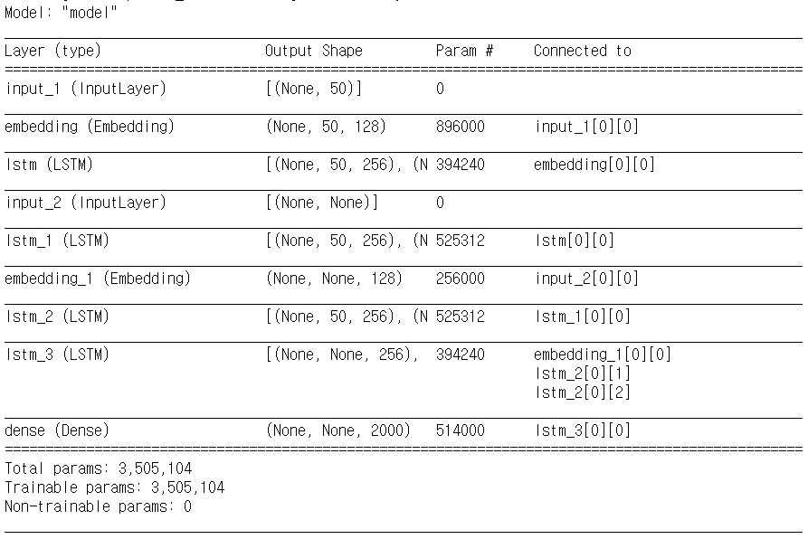

- Attention Layer를 위한 .py파일 로드

```python
import urllib.request
urllib.request.urlretrieve("https://raw.githubusercontent.com/thushv89/attention_keras/master/layers/attention.py", filename="attention.py")
from attention import AttentionLayer
```

```python
# 어텐션 층(어텐션 함수)
attn_layer = AttentionLayer(name='attention_layer')
attn_out, attn_states = attn_layer(
    [encoder_outputs, decoder_outputs]
)

# 어텐션의 결과와 디코더의 hidden state들을 연결
decoder_concat_input = Concatenate(
    axis=-1, name='concat_layer')([decoder_outputs, attn_out])

# 디코더의 출력층
decoder_softmax_layer = Dense(tar_vocab, activation='softmax')
decoder_softmax_outputs = decoder_softmax_layer(
    decoder_concat_input
)

# 모델 정의
model = Model([encoder_inputs, decoder_inputs],
              decoder_softmax_outputs)
model.summary()

model.compile(optimizer='rmsprop', 
              loss='sparse_categorical_crossentropy')

es = EarlyStopping(monitor='val_loss', mode='min', 
                   verbose=1, patience=2)
history = model.fit([xTrain, yTrain[:, :-1]],
                    yTrain.reshape(
                        yTrain.shape[0], 
                        yTrain.shape[1], 
                        1)[:, 1:],
                    epochs=50, callbacks=[es], batch_size = 256,
                    validation_data=(
                        [xTest, yTest[:,:-1]],
                        yTest.reshape(
                            yTest.shape[0], 
                            yTest.shape[1], 
                            1)[:,1:])
                   )

plt.plot(history.history['loss'], label='train')
plt.plot(history.history['val_loss'], label='test')
plt.legend()
plt.show()
```

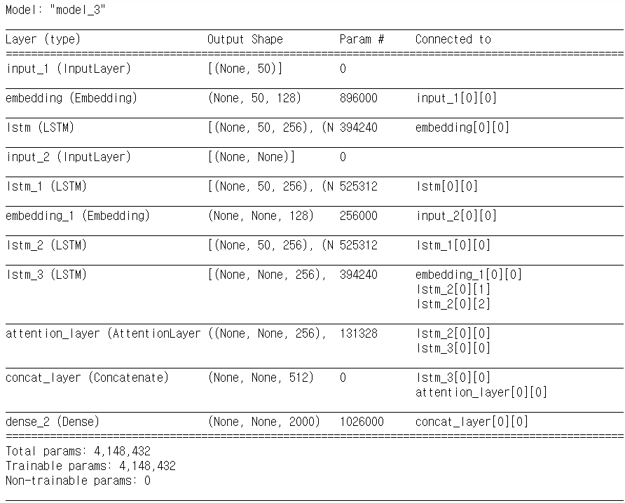

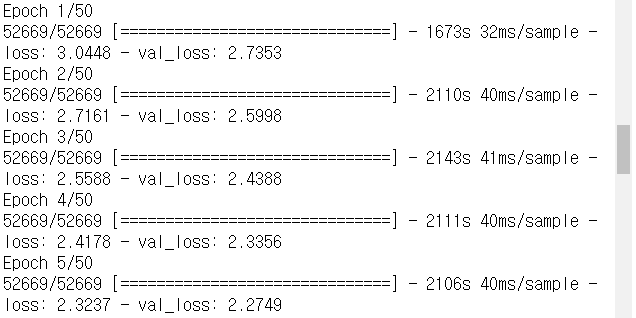

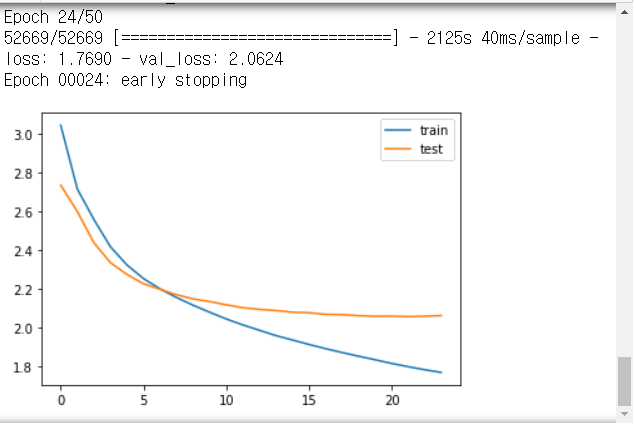

### 테스트

```python
src_index_to_word = src_token.index_word # 원문 단어 집합에서 정수 -> 단어를 얻음
tar_word_to_index = tar_token.word_index # 요약 단어 집합에서 단어 -> 정수를 얻음
tar_index_to_word = tar_token.index_word # 요약 단어 집합에서 정수 -> 단어를 얻음

# 인코더 설계
encoder_model = Model(inputs=encoder_inputs, 
                      outputs=[encoder_outputs, state_h, state_c])

# 이전 시점의 상태들을 저장하는 텐서
decoder_state_input_h = Input(shape=(hidden_size, ))
decoder_state_input_c = Input(shape=(hidden_size, ))

dec_emb2= dec_emb(decoder_inputs) 
# 문장의 다음 단어를 예측하기 위해서 초기 상태(initial_state)를 이전 시점의 상태로 사용. 이는 뒤의 함수 decode_sequence()에 구현
# 훈련 과정에서와 달리 LSTM의 리턴하는 은닉 상태와 셀 상태인 state_h와 state_c를 버리지 않음.
decoder_outputs2, state_h2, state_c2 = decoder_lstm(
    dec_emb2, 
    initial_state=[decoder_state_input_h, decoder_state_input_c])

# 어텐션 함수
decoder_hidden_state_input = Input(
    shape=(text_max_len, hidden_size)
)
attn_out_inf, attn_states_inf = attn_layer(
    [decoder_hidden_state_input, decoder_outputs2]
)
decoder_inf_concat = Concatenate(
    axis=-1, name='concat')([decoder_outputs2, attn_out_inf])

# 디코더의 출력층
decoder_outputs2 = decoder_softmax_layer(decoder_inf_concat) 

# 최종 디코더 모델
decoder_model = Model(
    [decoder_inputs] + [decoder_hidden_state_input, 
                        decoder_state_input_h, 
                        decoder_state_input_c],
    [decoder_outputs2] + [state_h2, state_c2])

def decode_sequence(input_seq):
    # 입력으로부터 인코더의 상태를 얻음
    states_value = encoder_model.predict(input_seq)
    # <SOS>에 해당하는 원-핫 벡터 생성
    target_seq = np.zeros((1, 1, tar_vocab))
    target_seq[0, 0, tar_word_to_index['\t']] = 1.

    stop_condition = False
    decoded_sentence = ""
    while not stop_condition: #stop_condition이 True가 될 때까지 루프 반복
        # 이점 시점의 상태 states_value를 현 시점의 초기 상태로 사용
        output_tokens, h, c = decoder_model.predict(
            [target_seq] + states_value
        )
        sampled_token_index = np.argmax(output_tokens[0, -1, :])
        sampled_char = index_to_tar[sampled_token_index]
        decoded_sentence += sampled_char

        # <eos>에 도달하거나 최대 길이를 넘으면 중단.
        if (sampled_char == '\n' or
           len(decoded_sentence) > maxTarLen):
            stop_condition = True

        # 길이가 1인 타겟 시퀀스를 업데이트 합니다.
        target_seq = np.zeros((1, 1, tar_vocab_size))
        target_seq[0, 0, sampled_token_index] = 1.

        # 상태를 업데이트 합니다.
        states_value = [h, c]

    return decoded_sentence

# 원문의 정수 시퀀스를 텍스트 시퀀스로 변환
def seq2text(input_seq):
    temp=''
    for i in input_seq:
        if(i!=0):
            temp = temp + src_index_to_word[i]+' '
    return temp

# 요약문의 정수 시퀀스를 텍스트 시퀀스로 변환
def seq2summary(input_seq):
    temp=''
    for i in input_seq:
        if((i!=0 and i!=tar_word_to_index['sostoken']) and i!=tar_word_to_index['eostoken']):
            temp = temp + tar_index_to_word[i] + ' '
    return temp

for i in range(500, 1000):
    print("원문 : ",seq2text(xTest[i]))
    print("실제 요약문 :",seq2summary(yTest[i]))
    print("예측 요약문 :",decode_sequence(xTest[i].reshape(1, text_max_len)))
    print("\n")
```

> 강사님이 주신 코드인데 왜 안돌아가는지 이유를 모르겠다....
>
> Error를 고치려해도 계속 나온다... 포기