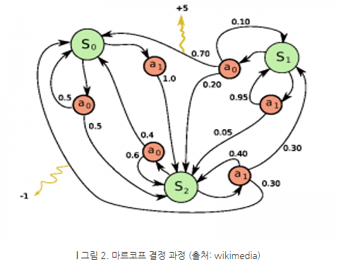
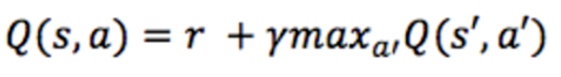
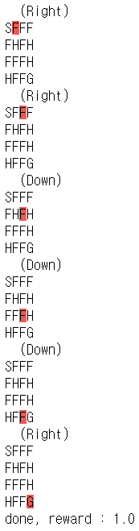

# Day85 강화학습 기법을 활용한 인공지능 고급 구현(1)

- 참고 사이트
  - 강화학습 사이트 [Gym](https://gym.openai.com/)

# 강화학습

- 위키피디아
  - 강화 학습은 기계 학습의 한 영역이다. 행동심리학에서 영감을 받았으며, 어떤 환경(Environment) 안에서 정의된 에이전트(Agent)가 현재의 상태(State)를 인식하여, 선택 가능한 행동(Action) 중 보상(Reward)을 최대화하는 행동 혹은 행동 순서를 선택하는 방법이다.
- 강화학습은 이전부터 존재했지만, 최근에 관심을 받기 시작했다. 그 이유는 고전적인 강화학습 알고리즘은 실생활에 적용할 만큼 좋은 결과를 내지 못했고, 주로 그리드 월드와 같은 작은 환경에서만 적용할 수 있었기 때문이다.
- 하지만 딥러닝의 등장 이후 강화학습에 신경망을 적용하면서부터 바둑이나 자율주행차와 같은 복잡한 문제에 적용할 수 있게 되었다. 좀 더 자세히 설명하면 고전적인 강화학습 알고리즘은 앞으로 나올 상탱 대한 보상을 모두 계산해야 하는데 실제 세상과 같이 상태 공간이 크면 현실적으로 계산을 할 수 없다. 최근에는 계산하는 대신 신경망을 통해 근사값을 구함으로써 복잡한 문제를 해결할 수 있게 되었다.
- 강화학습이 관심을 받게 된 또 다른 요인은 환경과 행동에 따른 보상만 주어지면 별도의 데이터를 제공하지 않아도 된다는 점이다. 딥러닝의 발전을 저해하는 요소 중 하나가 필요한 데이터의 양인데, 지도학습의 경우 만족할만한 수준의 성능을 내려면 엄청나게 많은 데이터와 그에 해당하는 라벨이 필요하다.
- 이런 데이터를 만드는 일은 숙련된 전문가가 많은 시간을 투자해야 하는 일이며 라벨을 만드는 도중에 실수가 일어날 수도 있지만, 강화학습은 이런 데이터가 필요하지 않기 때문에 기존의 지도학습 알고리즘을 보와하려는 연구가 진행되고 있다.

## 문제 정의


주변 상태에 따라 어떤 행동을 할지 판단을 내리는 주체인 에이전트가 있고, 에이전트가 속한 환경이 있다. 에이전트가 행동을 하면 그에 따라 상태가 바뀌게 되고, 보상을 받을 수도 있다. 강화학습의 목표는 주어진 환경에서 보상을 최대한 많이 받을 수 있는 에이전트를 학습하는 것이다.

- 용어 정의
  - 상태(State)
    - 현재 시점에서 상황이 어떤지 나타내는 값의 집합
    - 가능한 모든 상태의 집합을 state space라고 부르고 `S`라고 적는다.
    - 특정 시각 `t`에서의 상태 값은 $s_t$로 적는다.
  - 행동(Action)
    - 우리가 취할 수 있는 선택지를 일컫는 말
    - 가능한 모든 행동의 집합을 action space라고 부르고, `A`라고 적는다.
    - 특정 시각 `t`에서 상태 $s_t$를 본 뒤 취했던 행동은 $a_t$로 적는다.
  - 보상(Reward)
    - 에이전트가 어떤 행동을 했을 때 따라오는 이득
    - 말 그대로 보상이기 때문에 높을수록 좋다.
    - 보상 값에 `-1`을 곱해서 비용(Cost)이라고 부르기도 하고, 이 경우 낮을수록 좋다.
    - 주의할 점
      - 보상이 현재 상태, 행동에 대해서만 평가하는 즉각적인 값이라는 것
      - 장기적으로 가장 좋은 결과를 얻을 수 있는 행동을 고르기 위해선 현재 보상이 제일 높은 행동이 아니라 누적 보상이 제일 높은 행동을 골라야 한다.
    - 같은 알고리즘이더라도 보상 함수를 어떻게 정의하느냐에 따라 성능이 달라질 수 있다.
      - 각 경우에서 보상을 어떻게 할당할지 결정하는 것을 reward shaping이라고 부른다.
    - 상태 $s_t$에서 행동 $a_t$를 취해 상태가 $s_{t+1}$로 바뀌면서 얻은 보상은 $r_t$라고 하고, 이를 나타낸는 함수를 $R : S * A * R \rightarrow \mathbf{R}$로 나타낸다.
  - 에이전트(Agent)
    - 주어진 문제 상황에서 행동하는 주체
    - 게임에서는 플레이어가 조작하는 캐릭터, 또는 조작하는 플레이어 본인이 에이전트가 됨
    - 한번에 하나의 에이전트가 아니라 여러 에이전트를 동시에 다루는 문제는 Multi-Agent 세팅이라고 부른다.
  - 정책(Policy)
    - 에이전트가 판단하는 방식, 에이전트와 혼용하는 경우가 많다.
    - 정책을 수학적으로 나타내면 상태에 따른 행동의 조건부 확률, 즉 `P(action|state)`가 된다.
      - 보통 현재 상태가 `s`일 때 확률분포 자체는 $\pi(\cdot|s)$로 나타내고, 특정 행동 `a`가 뽑힐 확률은 $\pi(a|s)$로 나타낸다.
    - 현재 학습중인 정책(target policy)은 $\pi$로 쓰고, 과거에 데이터를 수집할 때 취했던 정책(behavior policy)은 $\mu$로 쓰는 것이 관례
    - 정책 중 가장 좋은 것을 optimal policy라고 부르고 $\pi^*$로 나타낸다.
  - 환경(Environment)
    - 문제 세팅 그 자체를 의미
    - 게임에서는 에이전트가 취할 수 있는 행동, 그에 따른 보상 등 게임 자체의 모든 규칙이 환경이 된다.
    - 즉 `S, A, R`등은 모두 환경의 구성 요소가 된다.
    - 플레이어가 조작할 수 있는 부분은 에이전트, 그 외의 모든 정해진 것들은 환경이라고 생각하면 된다.
    - 강화학습의 중요한 가정 중 하나는 환경이 Markov property를 가진다는 것
      - 이는 현재 상태만 참조하면 항상 필요한 모든 정보를 알 수 있다는 뜻
      - 수학적으로 나타내면 $s_{t+1}$와 $r_{t}$는 $s_t, a_t$만의 함수라는 것
        - 그보다 과거의 상태/행동 $s_{i}(i<t)$와 $a_i(i<t)$에서 얻을 수 있는 필요한 정보는 이미 $s_t$에 담겨 있어야 하므로 알 필요가 없다는 것
      - ex. 게임 상태를 스크린샷으로 정의하는 경우 테트리스는 모든 정보가 현재 화면의 스크린샷에 담겨있기 때문에 Markov property를 만족하는 환경이지만, 배틀그라운드의 경우 현재 화면 스크린샷 하나만으로는 (과거에 봐서 알고 있는) 자신 기준 뒤쪽에 떨어져 있는 아이템 정보는 알 수 없기 때문에 Markov property를 만족하지 못하게 된다.
    - Deep Reinforcement Learning에서는 이런 경우 RNN 등을 추가해 과거 상태를 요약하는 벡터를 만들어 근사적으로 해결
      - 즉 RNN의 internal context vector가 state space에 추가되는 것이다.
  - 초기상태(Initial State)
    - 에이전트가 처음으로 환경과 상호작용할 때의 상태
      - 게임으로 치면 시작화면
    - 가능한 초기상태는 여러 개일 수 있고, 그를 나타내는 확률분포가 있을 수도 있다.
  - 종료상태(Terminal State)
    - 특정한 상태에 도달할 경우 더 이상의 행동이 불가능한 상태
      - 게임으로 치면 게임오버 또는 클리어
  - 에피소드(Episode)
    - Initial State부터 Terminal State까지 에이전트가 거친 (상태, 행동, 보상)의 sequence를 의미
    - Rollout이나 Trajectory라고 부르기도 함

행동이 다음 상태에 영향을 끼치지 않는 경우는 Contextual Bandit, 거기에다 상태가 하나뿐인 경우는 Multi-Armed Bandit 문제라고 부르며 추천 시스템 등에서 주로 다룬다.

## 마르코프 결정 과정(Markov Decision Process)

기존 강화학습 알고리즘의 한계에 대한 이해를 돕기 위해 대표적인 강화학습 알고리즘인 큐러닝(Q-Learning)을 소개하기 앞서, 큐러닝을 이해하기 위한 마르코프 결정 과정과 차감된 미래 보상에 대한 개념을 먼저 이해할 필요가 있다.

- 강화학습 문제를 수학적으로 공식화하는 가장 일반적인 방법은 마르코프 결정 과정(Markov Decision Process)으로 표현하는 것이다. 환경에 놓여있는 에이전트(ex. 벽돌 깨기 게임)를 가정해 보면, 환경은 특정 상태(ex. 바의 위치, 공의 위치 및 방향, 벽돌의 존재 여부 등)에 있다.
- 에이전트는 환경에서 특정 행동을 취할 수 있다(ex. 바를 오른쪽 or 왼쪽으로 이동). 이러한 행동은 때로 보상(ex. 점수 획득)으로 이어진다. 행동은 환경을 변화시키고, 에이전트가 다른 행동을 취할 수 있는 새로운 상태로 만든다. 이러한 행동을 선택하는 방법에 대한 규칙을 정책(Policy)라고 한다.



- 마르코프 결정 과정은 상태와 행동의 집합, 한 상태에서 다른 상태로 전이하는 규칙과 보상으로 구성된다. 그리고 다음 상태의 확률은 오직 현재의 상태와 현재의 행동에만 영향을 받고, 이전의 상태와 행동에는 영향을 받지 않는 마르코프 가정을 기반으로 한다.

## 차감된 미래의 보상(Discounted Future Reward)

- 에이전트가 오랫동안 잘 동작하게 하려면 즉각적인 보상뿐만 아니라 미래의 보상도 고려해야 한다. 여기서 고려해야 할 사항은 에이전트가 확률적인 환경에 있으면 같은 행동을 해도 같은 보상을 받을지 확신할 수 없다는 점이다. 따라서 현재 받는 보상과 미래에 받을 보상은 가치가 다르다.
- 이런 이유로 보통 현재의 보상에 가중치를 높게 주고, 미래의 보상에 가중치를 낮게 주는데 이것이 차감된 미래의 보상이다. 에이전트에게 좋은 전략은 항상 차감된 미래의 보상을 최대화하도록 행동을 선택하는 것이다.

## 큐러닝(Q-Learning)

- 먼저 주어진 상태에서 동작을 수행할 때 차감된 미래의 보상을 나타내는 **큐함수(Q-Function)**를 정의한다. 큐함수는 *'주어진 상태에서 행동을 수행한 후 게임이 끝날 때 가능한 최상의 점수'*를 의미한다. 큐함수가 있으면 최적의 정책을 찾기 위해 단지 큐함수가 가지는 큐값(Q-Vallue)이 가장 큰 행동을 선택하면 된다.
- 큐함수를 구하기 위해서는 하나의 상태 전이를 고려해 볼 수 있는데, 현재의 상태와 행동의 큐값을 다음 상태와 행동의 큐값으로 표현할 수 있다.



- 위 식을 **벨만 방정식(Bellman Equation)**이라 한다. 현재 상태와 행동에 대한 미래의 최대 보상은 즉각적인 보상과 다음 상태에서 얻을 수 있는 미래의 최대 보상의 합이다.
  - $\gamma$ (discount factor) : 현재가 아닌 나중에 얻을 보상에 대한 가감율
- 큐러닝의 핵심은 벨만 방정식을 반복적으로 사용하여 큐함수를 계산할 수 있다는 점이다. 가장 간단한 방법은 테이블 형태를 사용하는 것으로, 각 행은 상태에 해당하며, 각 열은 행동에 대응하고, 테이블 요소의 값은 큐함수가 가지는 값이다. 다음 상태의 큐값이 추정치이기 때문에 학습 초기 단계에서는 잘못된 방향으로 갈 수 있다. 하지만 반복하면 할수록 추정치가 점점 더 정확해지고 업데이트를 충분히 수행한다면 큐함수가 수렴하여 진자 큐값을 나타내게 될 것이다.
- 큐러닝은 간단한 강화학습 문제를 해결하기에는 좋은 방법이지만 환경의 크기가 크면 적용하기 어렵다.
  - ex. 벽돌 깨기 게임
    - 84\*84 크기의 게임 화면 4개를 입력으로 받는데 가능한 상태를 계산해 보면, 25,684\*84\*4 = 1,067,97이 된다.
    - 큐러닝을 적용하려면 상태를 행으로 가지는 테이블을 만들어야 하는데 1,067,970은 너무 큰 숫자여서 사실상 계산이 불가능하다.

## 실습

```python
import pandas as pd
import numpy as np
import matplotlib.pyplot as plt
import gym
from gym.envs.registration import register
```

- 강화학습을 하기위한 게임 등록
- **1번만 실행 할것, 다시 실행하면 id를 새로 할당해줘야함**

```python
register(
    id = 'Frozen_lake_not_slippery-v1',
    entry_point = 'gym.envs.toy_text:FrozenLakeEnv',
    kwargs={'map_name':'4x4', 'is_slippery':False}
    # is_slippery : 얼음위에서 미끄러질것인지 여부
)
```

```python
env = gym.make('Frozen_lake_not_slippery-v1')
env.reset()
# > 0
```

- 0:left, 1:down, 2:right, 3:up를 의미함

```python
complete_actions = [2, 2, 1, 1, 1, 2] # R, R, D, D, D, R
```

```python
for action in complete_actions :
    new_state, reward, done, _ = env.step(action)
    env.render() # 현재 상태를 보여줌
    if done is True :
        print('done, reward : {}'.format(reward))
```



> - observation(object) : new-state(액션을 취해서 새롭게 옮겨진 위치)
> - reward(float) : 보상을 얻었는지 여부
> - done(boolean) : 도착지에 도착 or 홀에 빠진 경우
> - info(dict) : 디버깅을 위한 정보, 일반적으로 사용X