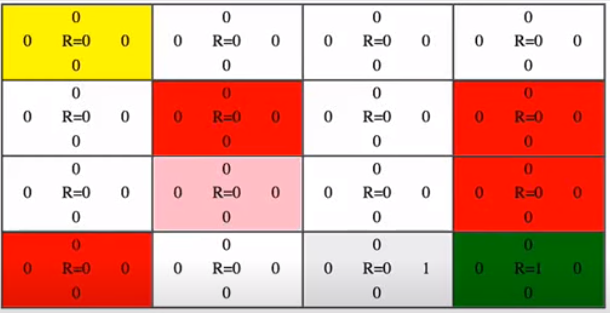
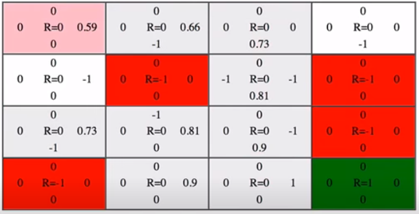

# Day86 강화학습 기법을 활용한 인공지능 고급 구현(2)

## 실습(학습)

```python
import pandas as pd
import numpy as np
import gym
from gym.envs.registration import register
import matplotlib.pyplot as plt
```

```python
register(
    id='FrozenLakeNotSlippery-v5',
    entry_point='gym.envs.toy_text:FrozenLakeEnv',
    kwargs={'map_name':'4x4', 'is_slippery':False}
)
```

```python
env = gym.make('FrozenLakeNotSlippery-v5')
observation = env.reset()
```

```python
env.observation_space.n # 4*4, state의 개수
# > 16

env.action_space.n # action(상하좌우)
# > 4
```

- Q 값

  

```python
Q = np.zeros([env.observation_space.n, env.action_space.n])
Q
# > array([[0., 0., 0., 0.],
# >        [0., 0., 0., 0.],
# >        [0., 0., 0., 0.],
# >        [0., 0., 0., 0.],
# >        [0., 0., 0., 0.],
# >        [0., 0., 0., 0.],
# >        [0., 0., 0., 0.],
# >        [0., 0., 0., 0.],
# >        [0., 0., 0., 0.],
# >        [0., 0., 0., 0.],
# >        [0., 0., 0., 0.],
# >        [0., 0., 0., 0.],
# >        [0., 0., 0., 0.],
# >        [0., 0., 0., 0.],
# >        [0., 0., 0., 0.],
# >        [0., 0., 0., 0.]])
```

```python
num_episodes = 1000 # 에피소드, epoch
decay_rate = 0.9
```

- 강화학습(1000번)

```python
r_list = []
for i in range(0, num_episodes) :
    state = env.reset()
    e = 1. / ((i//100)+1) # i//100 = 0~9 => e = 1~0.1
    r_all = 0 # 한 episode별 reward의 합
    done = False # hole or Goal => True
    
    while not done : # exploration
        if np.random.randn(1) < e :
            action = env.action_space.sample()
        else : # exploit
            action = np.argmax(Q[state, :])
            
        new_state, reward, done, _ = env.step(action)
        Q[state, action] = reward + decay_rate*np.max(Q[new_state, :])
        r_all += reward
        state = new_state
        r_list.append(r_all)

print('강화학습 종료')
# > 강화학습 종료
```

- cf.

  ```python
  env.action_space.sample() # 0~3 난수
  # > 3
  # 이동할 방향을 random으로 추출해준다.
  ```

- 결과

  

```python
print(Q) # left down right up
# > [[0.531441 0.59049  0.59049  0.531441]
# >  [0.531441 0.       0.6561   0.59049 ]
# >  [0.59049  0.729    0.59049  0.6561  ]
# >  [0.6561   0.       0.59049  0.59049 ]
# >  [0.59049  0.6561   0.       0.531441]
# >  [0.       0.       0.       0.      ]
# >  [0.       0.81     0.       0.6561  ]
# >  [0.       0.       0.       0.      ]
# >  [0.6561   0.       0.729    0.59049 ]
# >  [0.6561   0.81     0.81     0.      ]
# >  [0.729    0.9      0.       0.729   ]
# >  [0.       0.       0.       0.      ]
# >  [0.       0.       0.       0.      ]
# >  [0.       0.81     0.9      0.729   ]
# >  [0.81     0.9      1.       0.81    ]
# >  [0.       0.       0.       0.      ]]
```


