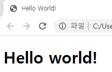
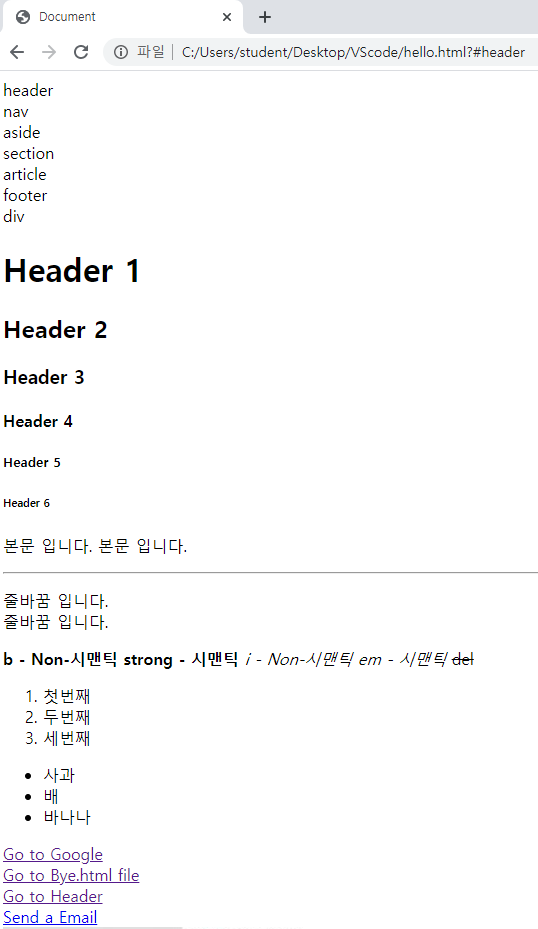
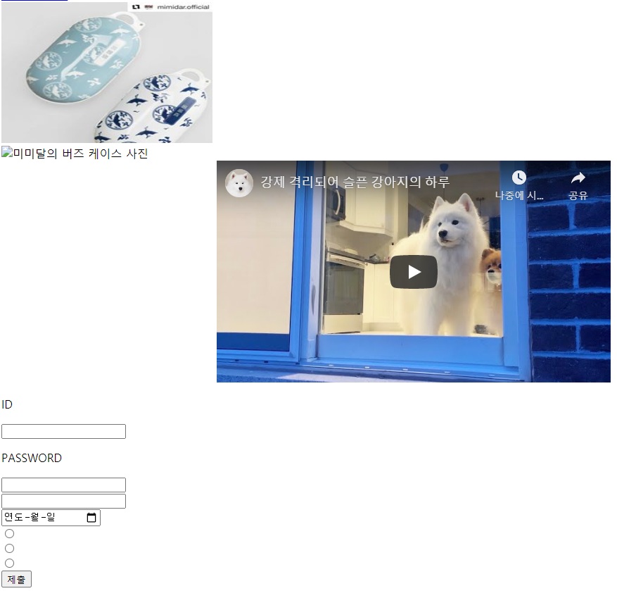
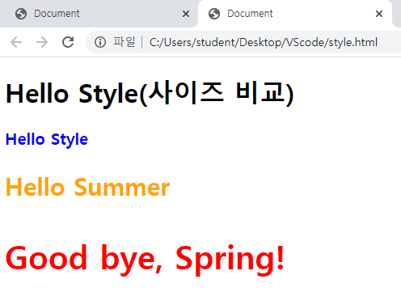
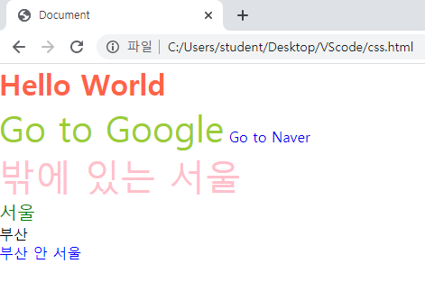
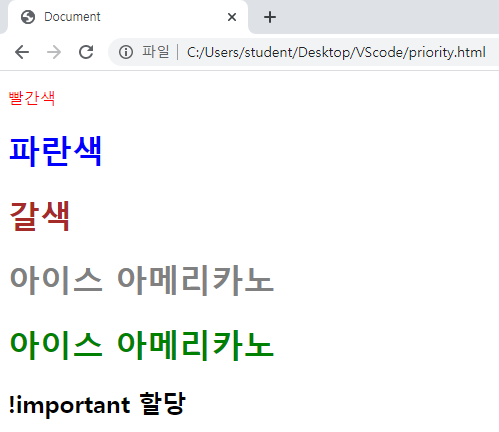
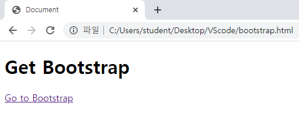
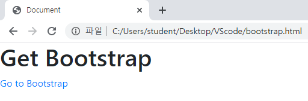

# Day01 종합프로젝트

## 4차 산업혁명 소프트웨어와 프로그래밍

- Goal
  - 우리가 지금까지 배운 내용을, 
  - **Web이라는 가장 범용적인 Interface를 통해, **
  - **다양한 도구들을 활용하여 Agile하게 개발해서,** 
  - 세상에 내보낸다.
- Stack
  - Git, GitHub, Markdown, HTTP, Web, **HTML, CSS, Python, Web App**
  - **Django Framework**, MVC Design Pattern, SQL, ...
- 프로젝트
  - 1차 아이디어톤
    - **학생 전원**이 과정 마지막 Hackathon에서 구현하고자 하는 **아이디어 발표 및 팀 구성**
  - 2차 아이디어톤
    - **팀별**로 Hackathon 때 구현하고자 하는 **목표, App 주요기능, 프로토타입 발표**
  - 해커톤

## HTML

### 1.  HTML 문서의 기본 구조

- DOCTYPE 선언부
  - 사용하는 문서의 종류를 선언하는 부분
  - 보통 html
- html 요소
  - head 요소
    - 문서 제목, 문자코드(인코딩)와 같이 해당 문서 정보를 담고 있으며, 브라우저
  - body 요소
    - 브라우저 화면에 나타나는 정보로 실제 내용에 해당한다.

### 2. Tag와 DOM TREE(Document object)

#### 2.1 요소(Element)

- HTML의 element는 태그와 내용(contents)로 구성되어 있다.
- `<h1> 웹 문서 </h1>`
  - `<h1>` : 여는/시작 태그
  - `</h1>` : 닫는/종료 태그

#### 2.2 Self-closing element

- 닫는 태그가 없는 element도 존재한다.

#### 2.3 속성(Attribute)

- 태그에는 속성이 지정될 수 있다.
- `<a href="https://google.com"/>`
  - `href` : 속성명
  - `google.com` : 속성 값
- `id, class, style` 속성은 태그와 상관없이 모두 사용 가능하다.

#### 2.4 DOM 트리

- 태그는 중첩되어 사용가능하며, 이때 다음과 같은 관계를 갖는다.
- `body` 태그와 `h1` 태그는 부모(parent)-자식(child)관계
- `li` 태그는 형제 관계(sibling)
- `h1`태그와 `ul` 태그는 형제 관계(sibling)

#### 2.5 시맨틱 태그

- 컨텐츠의 의미를 설명하는 태그로서, HTML5에 새롭게 추가된 시맨틱 태그가 있다.
- 개발자 및 사용자 뿐만 아니라 검색엔진(구글, 네이버) 등에 의미있는 정보의 그룹을 태그로 표현하여 단순히 보여주기 위한 것을 넘어서 <u>의미를 가지는 태그들을 활용하기</u> 위한 태그

### 3. HTML 실습

- Visual Studio code 프로그램 사용
- cf. 띄어쓰기 and Enter 인식 못함

```html
<!DOCTYPE html>
<html>
    <head>
        <title>Hello World!</title>
    </head>
    <body>
        <h1>Hello world!</h1>
    </body>
</html>
```



> `title`은 브라우저 이름
>
> `h1`은 문서에서의 제목

- cf. 빈 html 파일에서 `! + tap`을 누르면 기본적인 format이 작성된다.

  ```html
  <!DOCTYPE html>
  <html lang="en">
  <head>
      <meta charset="UTF-8">
      <meta name="viewport" content="width=device-width, initial-scale=1.0">
      <title>Document</title>
  </head>
  <body>
      
  </body>
  </html>
  ```

- 주석

  - `<!--주석-->`
  - 주석 처리할 문장 블럭잡고 `ctrl + /` or 바로 `ctrl + /`

#### 3.1 기본적인 실습

```html
<!-- bye.html -->
<!DOCTYPE html>
<html lang="en">
<head>
    <meta charset="UTF-8">
    <meta name="viewport" content="width=device-width, initial-scale=1.0">
    <title>Document</title>
</head>
<body>
    <h1>Bye</h1>
</body>
</html>
```


```html
<!-- hello.html -->
<!DOCTYPE html>
<html lang="en">
<head>
    <meta charset="UTF-8">
    <meta name="viewport" content="width=device-width, initial-scale=1.0">
    <title>Document</title>
</head>
<body>
    <!--주석-->

    <!-- 2. 레이아웃 시맨틱 태그 -->
    <header id="header">header</header>
    <nav>nav</nav>
    <aside>aside</aside>
    <section>section</section>
    <article>article</article>
    <footer>footer</footer>
    <!-- 위치는 CSS를 통해서 설정해야한다. -->

    <!-- 3. 레이아웃 Non-시맨틱 태그 -->
    <div>div</div>

    <!-- 4. 제목 -->
    <h1>Header 1</h1>
    <h2>Header 2</h2>
    <h3>Header 3</h3>
    <h4>Header 4</h4>
    <h5>Header 5</h5>
    <h6>Header 6</h6>

    <!-- 5. 본문 -->
    <p>본문 입니다. 본문 입니다.</p>
    <hr> 
    <!-- hr : 가로선 추가 -->
    <p>줄바꿈 입니다. <br> 줄바꿈 입니다.</p>
    <!-- 문단 사이에는 자동 줄바꿈이 적용된다. -->

    <!-- 6. 글자 꾸미기 -->
    <p>
        <!-- 굵게 -->
        <b>b - Non-시맨틱</b>
        <strong>strong - 시맨틱</strong>
        <!-- 기울임 -->
        <i>i - Non-시맨틱</i>
        <em>em - 시맨틱</em>
        <!-- 취소선 -->
        <del>del</del>
    </p>

    <!-- 7. 목록 -->
    <!-- 순서가 있는 목록 -->
    <ol>
        <li>첫번째</li>
        <li>두번째</li>
        <li>세번째</li>
    </ol>
    <!-- 순서가 없는 목록 -->
    <ul>
        <li>사과</li>
        <li>배</li>
        <li>바나나</li>
    </ul>

    <!-- 8. 링크 태그 (a) -->
    <!-- 절대 경로(주소) -->
    <a href="https://google.com" target="_self">Go to Google</a>
    <!-- target="_self" : 페이지내에서 이동 변함 --><br>
    <!-- 상대 경로 -->
    <a href="bye.html" target="_blank">Go to Bye.html file</a>
    <!-- target="_blank" : 새창으로 띄움 --><br>
    <!-- id를 지정한 태구 위치 -->
    <a href="#header">Go to Header</a>
    <!-- #뒤의 글자를 id로 인식 --><br>
    <!-- 이메일 -->
    <a href="mailto:admin@example.com">Send a Email</a>
    <br>

    <!-- 9. 미디어 태그 -->
    <!-- 이미지 -->
    
    <!-- src:이미지 경로, alt:이미지에 대한 설명(및 이미지가 안불러지는 경우 대비) -->
    <!-- width:이미지 가로 사이즈, height:이미지 세로 사이즈 --><br>
    <br>
    <!-- 비디오 -->
    <video src=""></video>
    <!-- 비디오 파일이 html 파일과 같이 있어야 하므로 관리에 어려움이 존재함 -->
    <!-- 하여 요즘은 youtube를 공유하여 사용 -->
    <!-- iframe -->
    <iframe width="560" height="315" src="https://www.youtube.com/embed/I0705aOCHmI" frameborder="0" allow="accelerometer; autoplay; encrypted-media; gyroscope; picture-in-picture" allowfullscreen></iframe>

    <!-- 10. Form (양식) -->
    <form action="(주소)">
        <!-- action:밑에서 입력받은 값을 어디로 보낼지 입력하는 곳 -->
        <!-- text -->
        <p>ID</p><input type="text"><br>
        <!-- 입력되는 글자가 보임 -->
        <!-- password -->
        <p>PASSWORD</p><input type="password"><br>
        <!-- 입력되는 글자가 안보임 -->
        <!-- number -->
        <input type="number"><br>
        <!-- 숫자만 입력 가능 -->
        <!-- date -->
        <input type="date"><br>
        <!-- 날짜를 고를 수 있음 -->
        <!-- radio -->
        <input type="radio" name="hello"><br>
        <input type="radio" name="hello"><br>
        <input type="radio" name="hello"><br>
        <!-- submit -->
        <input type="submit">

        <!-- 다른 다양한 type은 구글 참조 -->
    </form>

</body>
</html><!DOCTYPE html>
<html lang="en">
<head>
    <meta charset="UTF-8">
    <meta name="viewport" content="width=device-width, initial-scale=1.0">
    <title>Document</title>
</head>
<body>
    <!-- 2. 레이아웃 시맨틱 태그 -->
    <header>header</header>
    <nav>nav</nav>
    <aside>aside</aside>
    <section>section</section>
    <article>article</article>
    <footer>footer</footer>
</body>
</html>
```





## CSS

- HTML과 서로 다른 언어이지만, 독립적으로는 의미가 없다.

### 1. CSS 활용하기

```css
/* style.css */
h3 {
    color: red;
    font-size: 40px;
}
```

```html
<!-- style.html -->
<!DOCTYPE html>
<html lang="en">
<head>
    <meta charset="UTF-8">
    <meta name="viewport" content="width=device-width, initial-scale=1.0">
    <title>Document</title>
    <!-- 3. 외부 참조 -->
    <link rel="stylesheet" href="style.css">
    <!-- 2. 내부 참조 -->
    <style>
        /* CSS 주석 */
        h2 {
            color:orange;
            font-size: 30px;
        }
    </style>
</head>
<body>
    <h1>Hello Style(사이즈 비교)</h1>
    <!-- 1. 인라인 -->
    <!-- 직접 적용하는 방법 -->
    <h1 style="color:blue; font-size:20px;">Hello Style</h1>

    <!-- 2. 내부 참조 -->
    <!-- header에서 선언 -->
    <h2>Hello Summer</h2>

    <!-- 3. 외부 참조 -->
    <!-- 외부에 있는 CSS 파일을 연결해서 사용 -->
    <h3>Good bye, Spring!</h3>

</body>
</html>
```



- 일반적으로 3번 방법 사용

```html
<!-- css.html -->
<!DOCTYPE html>
<html lang="en">
<head>
    <meta charset="UTF-8">
    <meta name="viewport" content="width=device-width, initial-scale=1.0">
    <title>Document</title>
    <style>
        /* 1. 전체 선택자 */
        /* 전체 태그에 대하여 적용 */
        * {
            margin: 0; /* 바깥 여백 */
            padding: 0; /* 안쪽 여백 */
        }

        /* 2. 태그 선택자 */
        /* 선언한 태그 전체에 대하여 적용 */
        a {
            text-decoration: none;
            /* 텍스트 꾸밈(밑줄) 제거 */
        }

        /* 3. id 선택자 */
        /* 특정 id를 가진 태그에 대하여 적용 */
        /* id는 단 하나의 태그만 가져야한다. */
        #hello {
            color:tomato;
        }

        /* 4. class 선택자 */
        /* 특정 class들을 가진 태그에 대하여 적용 */
        /* class는 여러 태그가 가질 수 있다. */
        .world {
            color:yellowgreen;
        }

        /* 5. 복합 선택자 - 자손 선택자 */
        /* korea안에 있는 seoul에만 적용 */
        .korea .seoul {
            color:blue;
        }

        /* 6. 복합 선택자 - 자식 선택자 */
        /* korea 바로 아래에 있는 seoul에만 적용 */
        .korea > .seoul {
            color:green;
            font-size: 20px;
        }

        /* 7. 다중 클래스 선택 */
        .big {
            font-size: 40px;
        }

        .seoul.big {
            color:pink;
        }
    </style>
</head>
<body>
    <h1 id="hello">Hello World</h1>
    <a class="world big" href="https://google.com">Go to Google</a>
    <a href="https://naver.com">Go to Naver</a>
    
    <div class="seoul big">밖에 있는 서울</div>
    <div class="korea">
        <div class="seoul">서울</div>
        <div class="busan">
            부산
            <div class="seoul">부산 안 서울</div>
        </div>
    </div>
</body>
</html>
```



### 2. style 우선순위

```html
<!-- priority.html -->
<!DOCTYPE html>
<html lang="en">
<head>
    <meta charset="UTF-8">
    <meta name="viewport" content="width=device-width, initial-scale=1.0">
    <title>Document</title>
    <style>
        /* 우선순위6. 상위 요소에 의해 상속된 속성 */
        div {
            color:red;
        }

        /* 우선순위5. 태그 이름으로 지정한 속성 */
        h1 {
            color:blue;
        }

        /* 우선순위4. 클래스 이름으로 지정한 속성 */
        .ame {
            color:brown;
        }

        /* 우선순위3. id로 지정한 속성 */
        #ice {
            color:grey;
        }

        /* 우선순위2. 태그에서 style을 직접 지정한 속성 */
        /* 우선순위1. 속성값 뒤에 !important를 붙인 속성 */
        h2 {
            color:black !important;
        }
    </style>
</head>
<body>
    <div>
        <p>빨간색</p>
        <h1>파란색</h1>
        <h1 class="ame">갈색</h1>
        <h1 id="ice" class="ame">아이스 아메리카노</h1>
        <h1 id="ice" class="ame" style="color:green;">아이스 아메리카노</h1>
        <h2 id="ice" class="ame" style="color:green">!important 할당</h2>
    </div>
</body>
</html>
```



## Bootstrap

- 트위터에서 만든 회사에서 만든 프로그램
- CSS 작성하지 않고, 가져와서 사용

- Bootstrap 적용전

  ```html
  <!-- bootstrap.html -->
  <!DOCTYPE html>
  <html lang="en">
  <head>
      <meta charset="UTF-8">
      <meta name="viewport" content="width=device-width, initial-scale=1.0">
      <title>Document</title>
  </head>
  <body>
      <h1>Get Bootstrap</h1>
      <a href="https://getbootstrap.com">Go to Bootstrap</a>
  </body>
  </html>
  ```

  

- Bootstrap 적용 후

  ```html
  <!-- bootstrap.html -->
  <!DOCTYPE html>
  <html lang="en">
  <head>
      <meta charset="UTF-8">
      <meta name="viewport" content="width=device-width, initial-scale=1.0">
      <title>Document</title>
      <!-- Bootstrap 사이트에서 CSS 부분 copy -->
      <link rel="stylesheet" href="https://stackpath.bootstrapcdn.com/bootstrap/4.5.0/css/bootstrap.min.css" integrity="sha384-9aIt2nRpC12Uk9gS9baDl411NQApFmC26EwAOH8WgZl5MYYxFfc+NcPb1dKGj7Sk" crossorigin="anonymous">
  </head>
  <body>
      <h1>Get Bootstrap</h1>
      <a href="https://getbootstrap.com">Go to Bootstrap</a>
  
      <!-- Bootstrap 사이트에서 JS 부분 copy -->
      <script src="https://code.jquery.com/jquery-3.5.1.slim.min.js" integrity="sha384-DfXdz2htPH0lsSSs5nCTpuj/zy4C+OGpamoFVy38MVBnE+IbbVYUew+OrCXaRkfj" crossorigin="anonymous"></script>
      <script src="https://cdn.jsdelivr.net/npm/popper.js@1.16.0/dist/umd/popper.min.js" integrity="sha384-Q6E9RHvbIyZFJoft+2mJbHaEWldlvI9IOYy5n3zV9zzTtmI3UksdQRVvoxMfooAo" crossorigin="anonymous"></script>
      <script src="https://stackpath.bootstrapcdn.com/bootstrap/4.5.0/js/bootstrap.min.js" integrity="sha384-OgVRvuATP1z7JjHLkuOU7Xw704+h835Lr+6QL9UvYjZE3Ipu6Tp75j7Bh/kR0JKI" crossorigin="anonymous"></script>
  </body>
  </html>
  ```

  


