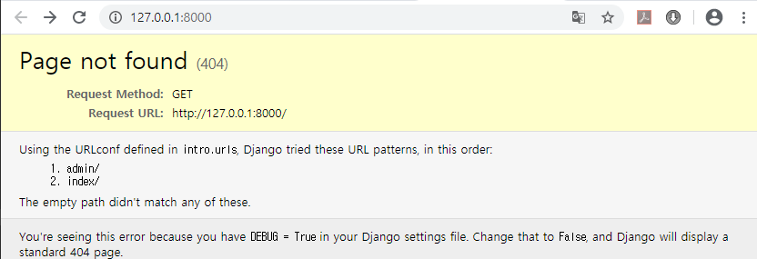
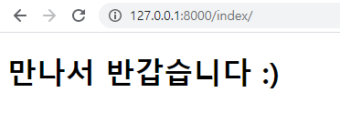
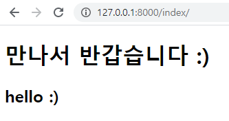
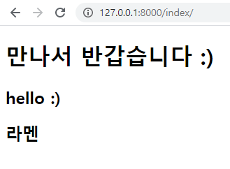
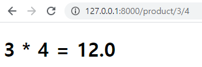
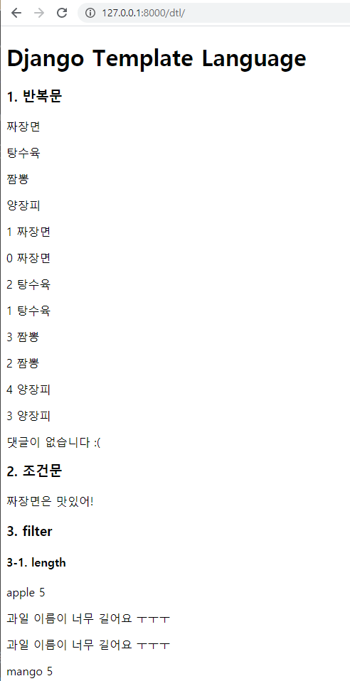
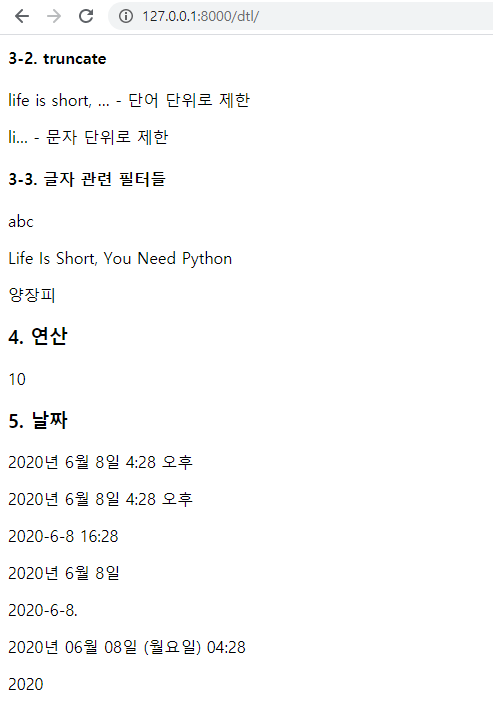
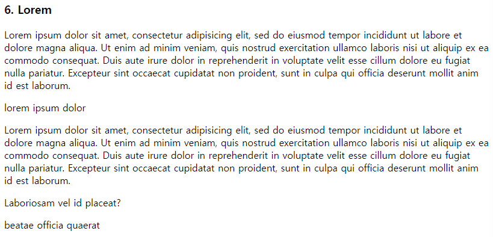

# Day03 종합 프로젝트

# Django Intro

pip를 통하여 설치 가능

- git 코드
  - 폴더 만들기 : `mkdir Django`
  - 프로젝트를 위한 공간 분리 : `python -m venv venv`
    - 첫번째 `venv`는 가상환경을 만드는 함수이고,
    - 두번째 `venv`는 가상환경의 이름을 의미한다.
  - 가상환경 활성화 하기 : `source venv/Scripts/activate`
    - 단, 어떤 terminal을 사용하는냐에 따라 명령어가 다르다
  - Django 설치하기 : `pip install django==2.2.13`
    - 최신 버전으로 하는 경우 다른 library랑 버전호환이 안되서 에러가 발생할 수 있으므로 안정되어 있는 버전으로 설치한다.
  - Djangoproject 만들기 : `django-admin startproject intro .`
    - 현재 폴더(`.`)에 `intro`라는 이름의 프로젝트를 만들겠다.
  - server 실행 : `python manage.py runserver`
  - 실행 중인 명령어 취소 : `ctrl+c`
  - pages라는 이름으로 app개발 시작 : `python manage.py startapp pages`
    - pages 폴더의
      - models.py : 데이터 베이스와 데이터의 관계
      - views.py : 사용자에게 서비스할 기능 구현
    - Django에 생성되었다는 사실을 알려줘야 함.
      - `intro` 폴더의 `settings.py`에서 `INSTALLED_APPS`에 추가해줘야한다.
        - 언어 설정 변화 : `intro` 폴더의 `settings.py`에서 `LANGUAGE_CODE = 'ko-kr'`, `TIME_ZONE = 'Asia/Seoul'`로 변경 후 저장

## 기본 사이트 만들기

```python
# intro > url.py
from django.contrib import admin
from django.urls import path
from pages import views

urlpatterns = [
    path('admin/', admin.site.urls),
    path('index/', views.index),
    # index/(url)를 입력받으면 views.index함수를 실행
]
```

```python
# pages > views.py
from django.shortcuts import render

# Create your views here.
def index(request) : # 실제로 받는것이 없더라도 받아줘야한다.
    return render(request, 'index.html')
    # 'index.html'을 리턴하라
```

```html
<!-- pages > templates > index.html -->
<!DOCTYPE html>
<html lang="en">
<head>
    <meta charset="UTF-8">
    <meta name="viewport" content="width=device-width, initial-scale=1.0">
    <title>Document</title>
</head>
<body>
    <h1>만나서 반갑습니다 :)</h1>
</body>
</html>
```

- terminal에서 `python manage.py runserver`를 실해하여 나온 [주소](http://127.0.0.1:8000/)에 들어가면

  

- 가 나오게 되고, `index/`를 추가하여 들어가면 다음과 같은 결과가 나타난다.

  

### 변수 전달하기

```python
# pages > views.py
from django.shortcuts import render

# Create your views here.
def index(request) : # 실제로 받는것이 없더라도 받아줘야한다.
    hello = 'hello :)'
    return render(request, 'index.html', {'hello':hello})
    # 변수를 넘길 때, 무조건 딕셔너리 형태로 보내야 한다.
```

```html
<!-- pages > templates > index.html -->
<!DOCTYPE html>
<html lang="en">
<head>
    <meta charset="UTF-8">
    <meta name="viewport" content="width=device-width, initial-scale=1.0">
    <title>Document</title>
</head>
<body>
    <h1>만나서 반갑습니다 :)</h1>
    <!-- 변수를 받을 때, Django가 만들어 놓은 template으로 입력함 -->
    <h2>{{hello}}</h2>
</body>
</html>
```



```python
# pages > views.py
from django.shortcuts import render

# Create your views here.
def index(request) : # 실제로 받는것이 없더라도 받아줘야한다.
    hello = 'hello :)'
    lunch = '라멘'
    return render(request, 'index.html', {'hello':hello, 'l':lunch})
    # 변수를 넘길 때, 무조건 딕셔너리 형태로 보내야 한다.
    # or 다음과 같이 표현 가능
# def index(request) : # 실제로 받는것이 없더라도 받아줘야한다.
#    hello = 'hello :)'
#    lunch = '라멘'
#    context = {
#        'hello':hello,
#        'l':lunch
#    }
#    return render(request, 'index.html', context)
```

```html
<!-- pages > templates > index.html -->
<!DOCTYPE html>
<html lang="en">
<head>
    <meta charset="UTF-8">
    <meta name="viewport" content="width=device-width, initial-scale=1.0">
    <title>Document</title>
</head>
<body>
    <h1>만나서 반갑습니다 :)</h1>
    <!-- 변수를 받을 때, Django가 만들어 놓은 template으로 입력함 -->
    <h2>{{hello}}</h2>
    <h2>{{l}}</h2>
</body>
</html>
```



### 사용자에게서 변수를 입력받기

```python
# intro > url.py
from django.contrib import admin
from django.urls import path
from pages import views

urlpatterns = [
    path('admin/', admin.site.urls),
    path('hello/<name>/', views.hello),
    # <name>: name이라는 이름의 변수라는 의미
]
```

```python
# pages > views.py
from django.shortcuts import render

def hello(request, name) : 
    # name : url.py에서 선언한 변수와 이름이 같아야 한다.
    context = {
        'name':name
    }
    return render(request, 'hello.html', context)
```

```html
<!-- pages > templates > hello.html -->
<!DOCTYPE html>
<html lang="en">
<head>
    <meta charset="UTF-8">
    <meta name="viewport" content="width=device-width, initial-scale=1.0">
    <title>Document</title>
</head>
<body>
    <h1>반갑습니다, {{name}}</h1>
</body>
</html>
```


- 곱셈 결과 나타내기

  ```python
  # intro > url.py
  from django.contrib import admin
  from django.urls import path
  from pages import views
  
  urlpatterns = [
      path('admin/', admin.site.urls),
      # 두 수를 입력 받아 곱한 결과를 보여주는 페이지
      path('product/<num1>/<num2>/', views.product),
      # <num1>는 <str:num1>을 의미한다. 문자로 입력을 받는다.
      # <int:num1>이라고 하면 숫자로 바로 받는다.
      # 혹시 int 해놓고 문자가 들어오면 매칭 해주지 않는다.
  ]
  ```

  ```python
  # pages > views.py
  from django.shortcuts import render
  
  def product(request, num1, num2) :
      result = float(num1)*float(num2)
      # result = eval(num1+'*'+num2)
      context = {
          'num1':num1,
          'num2':num2,
          'result':result
      }
      return render(request, 'product.html', context)
  ```

  ```html
  <!-- pages > templates > product.html -->
  <!DOCTYPE html>
  <html lang="en">
  <head>
      <meta charset="UTF-8">
      <meta name="viewport" content="width=device-width, initial-scale=1.0">
      <title>Document</title>
  </head>
  <body>
      <h1>{{num1}} * {{num2}} = {{result}}</h1>
  </body>
  </html>
  ```

  

  

### Django Template Language(DTL)

```python
# intro > url.py
from django.contrib import admin
from django.urls import path
from pages import views

urlpatterns = [
    path('admin/', admin.site.urls),
    path('dtl/', views.dtl),
]
```

```python
# pages > views.py
from django.shortcuts import render
from datetime import datetime

def dtl(request) :
    foods = ['짜장면', '탕수육', '짬뽕', '양장피']
    sentence = 'life is short, you need python'
    fruits = ['apple', 'banana', 'cucumber', 'mango']
    datetimenow = datetime.now()
    empty_list = []

    context = {
        'foods':foods,
        'sentence':sentence,
        'fruits':fruits,
        'datetimenow':datetimenow,
        'empty_list':empty_list,
    }
    return render(request, 'dtl.html', context)
```

```html
<!-- pages > template > dtl.html -->
<!DOCTYPE html>
<html lang="en">
<head>
    <meta charset="UTF-8">
    <meta name="viewport" content="width=device-width, initial-scale=1.0">
    <title>Document</title>
</head>
<body>
    <h1>Django Template Language</h1>
    <h3>1. 반복문</h3>
    
        <p>{{ food }}</p>
    

    

        <p>{{ forloop.counter}} {{food}}</p>
        <p>{{ forloop.counter0}} {{food}}</p>

    

    
        <p>{{comment}}  </p>
    
        <p>댓글이 없습니다 :(</p>
    

    <h3>2. 조건문</h3>
    
        <p>짜장면은 맛있어!</p>
    
        <p>짜장면 좀 주세요!</p>
    

    <h3>3. filter</h3>
    <h4>3-1. length</h4>
    
        
            <p>과일 이름이 너무 길어요 ㅜㅜㅜ</p>
        
            <p>{{fruit}} {{fruit|length}}</p>
        
    
    
    <h4>3-2. truncate</h4>
    <p>{{ sentence|truncatewords:3 }} - 단어 단위로 제한</p>
    <p>{{ sentence|truncatechars:3 }} - 문자 단위로 제한</p>

    <h4>3-3. 글자 관련 필터들</h4>
    <p>{{ 'ABC'|lower }}</p>
    <p>{{ sentence|title }}</p>
    <p>{{ foods|random }}</p>

    <h3>4. 연산</h3>
    <p>{{ 4|add:6 }}</p>
    <!-- 잘 사용하진 않음(python에서 처리하면 되므로) -->

    <h3>5. 날짜</h3>
    <p>{{ datetimenow }}</p>
    <p></p>
    <p></p>
    <p></p>
    <p></p>

    <p></p>
    
    <p></p>
    <p>{{ current_year }}</p>
    <!-- 더 많은 format은 strftime로 찾아보기 -->

    <h3>6. Lorem</h3>
    <!-- Lorem ipsum -->
    <!-- default -->
    <p></p>
    <!-- 3개의 단어 -->
    <p></p>
    <!-- 2개의 문단 -->
    <p></p>
    <!-- random -->
    <p></p>
</body>
</html>
```







- Is it your birthday?

  ```python
  # intro > url.py
  from django.contrib import admin
  from django.urls import path
  from pages import views
  
  urlpatterns = [
      path('admin/', admin.site.urls),
      # Is it your birthday? 오늘이 생일이면 '예', 아니면 '아니오'
      path('birthday/<birthday>', views.birthday),
  ]
  ```

  ```python
  # pages > views.py
  from django.shortcuts import render
  from datetime import datetime
  
  def birthday(request, birthday) :
      context = {
          'birth_month':birthday[-4:-2],
          'birth_day':birthday[-2:]
      }
      return render(request, 'birthday.html', context)
  ```

  ```html
  <!-- pages > template > birthday.html -->
  <!DOCTYPE html>
  <html lang="en">
  <head>
      <meta charset="UTF-8">
      <meta name="viewport" content="width=device-width, initial-scale=1.0">
      <title>Document</title>
  </head>
  <body>
      
      
      
          
              <h1>예</h1>
          
              <h1>아니오</h1>
          
      
          <h1>아니오</h1>
      
  </body>
  </html>
  ```

  - 강사님

    ```python
    # intro > url.py
    from django.contrib import admin
    from django.urls import path
    from pages import views
    
    urlpatterns = [
        path('admin/', admin.site.urls),
        # Is it your birthday? 오늘이 생일이면 '예', 아니면 '아니오'
        path('bday/', views.bday),
    ]
    ```

    ```python
    # pages > views.py
    from django.shortcuts import render
    from datetime import datetime
    
    def bday(request) :
        # 1. 오늘 날짜 가져오기
        today = datetime.now()
        # 2. month, day 가져와서 오늘 날짜와 비교하기
        result = (today.month == 11 and today.day == 23)
        context = {
            'result':result
        }
        return render(request, 'bday.html', context)
    ```

    ```html
    <!-- pages > templates > bday.html -->
    <!DOCTYPE html>
    <html lang="en">
    <head>
        <meta charset="UTF-8">
        <meta name="viewport" content="width=device-width, initial-scale=1.0">
        <title>Document</title>
    </head>
    <body>
        
            <h1>예</h1>
        
            <h1>아니오</h1>
        
    </body>
    </html>
    ```

    > html은 보여주기 위한 파일이므로 로직은 python에서 처리하는 것이 좋다.

## git ignore

- [gitignore](https://raw.githubusercontent.com/github/gitignore/master/Python.gitignore)
  - .gitignore를 만들고 싶은 폴더에 메모장을 이용하여 `.gitignore` 파일을 생성한 후 내용을 붙어 넣으면 된다.
  - VS Code 설정 관련 폴더 제외를 위해서 `.vscode` 추가