# Day04 종합 프로젝트

# Django

- url 주소창이 아닌 페이지에서 입력값 받아서 처리하기


## 페이지에서 입력 값 받기(Basic)

```python
# intro > url.py
from django.contrib import admin
from django.urls import path
from pages import views

urlpatterns = [
    path('admin/', admin.site.urls),
    path('throw/', views.throw),
    path('catch/', views.catch),
]
```

```python
# pages > views.py
from django.shortcuts import render

def throw(request) :
    context = {

    }
    return render(request, 'throw.html', context)

def catch(request) :
    message = request.GET.get('message')
    # request.GET = {'message':'hi'}
    context = {
        'message':message
    }
    return render(request, 'catch.html', context)
```

```html
<!-- pages > tmeplates > throw.html -->
<!DOCTYPE html>
<html lang="en">
<head>
    <meta charset="UTF-8">
    <meta name="viewport" content="width=device-width, initial-scale=1.0">
    <title>Document</title>
</head>
<body>
    <!-- 사용자들이 알 수 있도록 태그 -->
    <h1>Throw</h1>
    <!-- 1. form -->
    <form action="/catch/" method="GET">
    <!-- method 옵션을 통해 어떻게 보낼지 설정할 수 있다.
		default는 "GET" -->
        <!-- 2. input -->
        <!-- 3. label -->
        <label for="content">내용</label>
        <!-- label의 for와 input의 id를 동일하게 연결하면 
            '내용'을 클릭해도 해당 입력값 쪽으로 커서가 옮겨져 간다. -->
        <input id="content" type="text" name="message">
        <!-- type:text, number, date, password, ... -->
        <!-- name옵션을 통하여 입력받은 값을 변수로 저장하여 catch라는 주소로 전송한다. -->
        <input type="submit">
        <!-- submit 버튼을 통해서 입력값을 보낼 수 있다. -->
        <br>
        <input type="text" value="기본값">
        <input type="submit" value="던지기">
        <!-- value 옵션을 통해 버튼의 이름을 바꿀 수 있다. -->
        <br>
        
    </form>
</body>
</html>
```

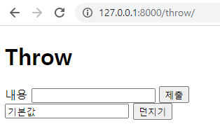

```html
<!-- pages > tmeplates > catch.html -->
<!DOCTYPE html>
<html lang="en">
<head>
    <meta charset="UTF-8">
    <meta name="viewport" content="width=device-width, initial-scale=1.0">
    <title>Document</title>
</head>
<body>
    <h1>Catch</h1>
    <h2>{{ message }}</h2>
</body>
</html>
```

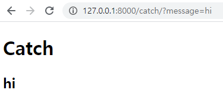

- 두개 입력받기

  ```python
  # pages > views.py
  from django.shortcuts import render
  
  def throw(request) :
      context = {
  
      }
      return render(request, 'throw.html', context)
  
  def catch(request) :
      message = request.GET.get('message')
      username = request.GET.get('username')
      context = {
          'message':message,
          'username':username
      }
      return render(request, 'catch.html', context)
  ```

  ```html
  <!-- pages > tmeplates > throw.html -->
  <!DOCTYPE html>
  <html lang="en">
  <head>
      <meta charset="UTF-8">
      <meta name="viewport" content="width=device-width, initial-scale=1.0">
      <title>Document</title>
  </head>
  <body>
      <!-- 사용자들이 알 수 있도록 태그 -->
      <h1>Throw</h1>
      <!-- 1. form -->
      <form action="/catch/" method="GET">
          <!-- 2. input -->
          <!-- 3. label -->
          <label for="username">이름</label>
          <input id="username" type="text" name="username">
          <label for="content">내용</label>
          <input id="content" type="text" name="message">
          <input type="submit" value="던지기">
                  
      </form>
  </body>
  </html>
  ```

  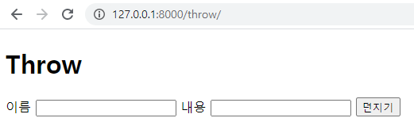

  ```html
  <!-- pages > tmeplates > catch.html -->
  <!DOCTYPE html>
  <html lang="en">
  <head>
      <meta charset="UTF-8">
      <meta name="viewport" content="width=device-width, initial-scale=1.0">
      <title>Document</title>
  </head>
  <body>
      <h1>Catch</h1>
      <h2>{{ username }} : {{ message }}</h2>
  </body>
  </html>
  ```

  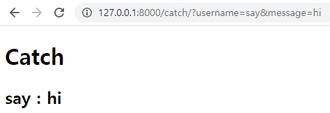

### 실습

- [로또 번호 생성기]
  - 로또 번호 몇 개를 생성할 것인지 input으로 입력받고,
  - 그 갯수 만큼 번호를 random으로 생성하여 보여주기

```python
# intro > url.py
from django.contrib import admin
from django.urls import path
from pages import views

urlpatterns = [
    path('admin/', admin.site.urls),
    path('lotto/', views.lotto),
    path('generate/', views.generate),
]
```

```python
# pages > views.py
from django.shortcuts import render

def lotto(request) :
    return render(request, 'lotto.html')

import random
def generate(request) :
    num = request.GET.get('number')
    num_list = random.sample(range(1, 46), int(num))
    context = {
        'numbers':num_list
    }
    return render(request, 'generate.html', context)
```

```html
<!-- pages > templates > lotto.html -->
<!DOCTYPE html>
<html lang="en">
<head>
    <meta charset="UTF-8">
    <meta name="viewport" content="width=device-width, initial-scale=1.0">
    <title>Document</title>
</head>
<body>
    <h1>Lotto</h1>
    <form action="/generate/" method="GET">
        <label for="number">생성할 번호 개수</label>
        <input id="number" type="text" name="number">
        <input type="submit">
    </form>
</body>
</html>
```

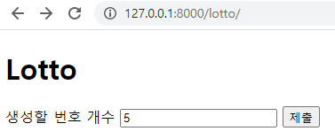

```html
<!-- pages > templates > generate.html -->
<!DOCTYPE html>
<html lang="en">
<head>
    <meta charset="UTF-8">
    <meta name="viewport" content="width=device-width, initial-scale=1.0">
    <title>Document</title>
</head>
<body>
    <h1>Generate</h1>
    <h2>{{ numbers }}</h2>
</body>
</html>
```

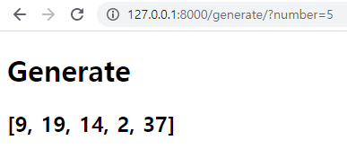

- 강사님

  ```python
  # pages > views.py
  from django.shortcuts import render
  
  def lotto(request) :
      context = {
  
      }
      return render(request, 'lotto.html', context)
  
  import random
  def generate(request) :
      count = int(request.GET.get('count'))
      
      lotto_numbers = range(1, 46)
      lottos = []
      for n in range(count) :
          lottos.append(random.sample(lotto_numbers, 6))
          
      context = {
          'lottos':lottos
      }
      return render(request, 'generate.html', context)
  ```

  ```html
  <!-- pages > templates > lotto.html -->
  <!DOCTYPE html>
  <html lang="en">
  <head>
      <meta charset="UTF-8">
      <meta name="viewport" content="width=device-width, initial-scale=1.0">
      <title>Document</title>
  </head>
  <body>
      <h1>로또 번호 생성</h1>
      <form action="/generate/">
          <label for="count">생성할 로또 번호 갯수</label>
          <input id="count" type="number" name="count">
          <!-- input type을 'number'로 해주면 숫자만 입력받을 수 있게 제한 할 수 있다. -->
          <!-- but. int or float이 아닌 str로 받아진다. -->
          <input type="submit" vlaue="생성!">
      </form>
  </body>
  </html>
  ```

  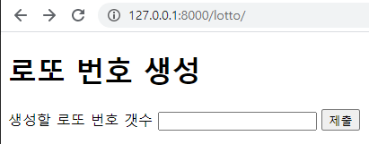

  ```html
  <!-- pages > templates > generate.html -->
  <!DOCTYPE html>
  <html lang="en">
  <head>
      <meta charset="UTF-8">
      <meta name="viewport" content="width=device-width, initial-scale=1.0">
      <title>Document</title>
  </head>
  <body>
      <h1>생성된 로또 번호</h1>
      
          <h2>{{lotto}}</h2>
      
  </body>
  </html>
  ```

  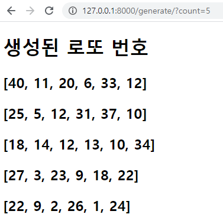

  - `pages > views.py`의 `generate`함수에서

    > lottos.append(sorted(random.sample(lotto_numbers, 6)))

    로 변경하면 다음과 같이 정렬된 결과를 얻을 수 있다.

    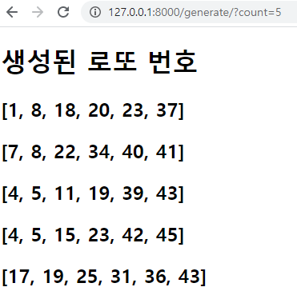

- `GET`요청 방식은 url 주소에 요청사항이 남는다.
- `POST`요청 방식은 body에 데이터를 넣어보내, 주소창에 노출되지 않는다.


## POST 요청 방식

- 회원가입 사이트

  - `GET` 요청 방식

    ```python
    # intro > url.py
    from django.contrib import admin
    from django.urls import path
    from pages import views
    
    urlpatterns = [
        path('admin/', admin.site.urls),
        path('user_new/', views.user_new), # 회원 갑입 양식
        path('user_create/', views.user_create), # 실제로 회원 생성
    ]
    ```

    ```python
    # pages > views.py
    from django.shortcuts import render
    
    def user_new(request) :
        context = {
    
        }
        return render(request, 'user_new.html', context)
    
    def user_create(request) :
        context = {
    
        }
        return render(request, 'user_create.html', context)
    ```

    ```html
    <!-- pages > tmeplates > user_new.html -->
    <!DOCTYPE html>
    <html lang="en">
    <head>
        <meta charset="UTF-8">
        <meta name="viewport" content="width=device-width, initial-scale=1.0">
        <title>Document</title>
    </head>
    <body>
        <h1>회원 가입</h1>
        <form action="/user_create/" method="GET">
            <input type="text" name="username">
            <input type="password" name="pw">
            <input type="submit" value="가입!">
        </form>
    </body>
    </html>
    ```

    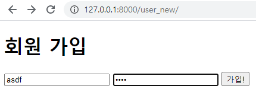

    ```html
    <!-- pages > tmeplates > user_create.html -->
    <!DOCTYPE html>
    <html lang="en">
    <head>
        <meta charset="UTF-8">
        <meta name="viewport" content="width=device-width, initial-scale=1.0">
        <title>Document</title>
    </head>
    <body>
        <h1>회원 생성 완료!</h1>
    </body>
    </html>
    ```

    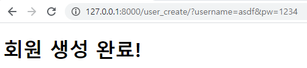

    > GET 요청 방식으로 수행할 경우 아이디와 비번이 노출되고
    >
    > 게시판에 이러한 방식이 적용될 경우, 바로 위의 창에서 계속 새로고침을 하면 똑같은 글이 도배가 되어버린다.

- `POST` 요청 방식

  ```python
  # pages > views.py
  from django.shortcuts import render
  
  def user_new(request) :
      context = {
  
      }
      return render(request, 'user_new.html', context)
  
  def user_create(request) :
      username = request.POST.get('username')
      pw = request.POST.get('pw')
      context = {
          'username':username,
          'pw':pw
      }
      return render(request, 'user_create.html', context)
  ```

  ```html
  <!-- pages > tmeplates > user_new.html -->
  <!DOCTYPE html>
  <html lang="en">
  <head>
      <meta charset="UTF-8">
      <meta name="viewport" content="width=device-width, initial-scale=1.0">
      <title>Document</title>
  </head>
  <body>
      <h1>회원 가입</h1>
      <form action="/user_create/" method="POST">
          <!-- POST 방식을 사용할 경우 제대로 된 경로로 들어온 것인지 확인을 위한
              token이 필요하다. -->
          
          <input type="text" name="username">
          <input type="password" name="pw">
          <input type="submit" value="가입!">
      </form>
  </body>
  </html>
  ```

  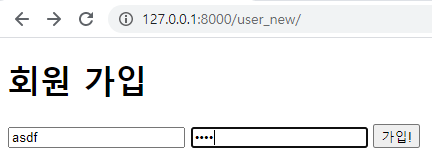

  ```html
  <!-- pages > tmeplates > user_create.html -->
  <!DOCTYPE html>
  <html lang="en">
  <head>
      <meta charset="UTF-8">
      <meta name="viewport" content="width=device-width, initial-scale=1.0">
      <title>Document</title>
  </head>
  <body>
      <h1>회원 생성 완료!</h1>
      <p>{{ username }} / {{ pw }}</p>
  </body>
  </html>
  ```

  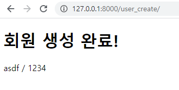

  - CSRF(Cross-site request forgery) : 사이트 간 요청 위조
    - 웹 사이트 취약점 공격의 하나로, 사용자가 자신의 의지와는 무관하게 공격자가 의도한 행위를 특정 웹사이트에 요청하게 하는 공격


## 웹사이트 폴더 분리하기

```python
# intro > url.py
from django.contrib import admin
from django.urls import path, include

urlpatterns = [
    path('admin/', admin.site.urls),
    path('pages/', include('pages.urls')),
]
```

```python
# pages > urls.py
from django.urls import path
from . import views

urlpatterns = [
    path('index/', views.index),
    # index/(url)를 입력받으면 views.index함수를 실행
    path('hello/<name>/', views.hello),
    # 두 수를 입력 받아 곱한 결과를 보여주는 페이지
    path('product/<num1>/<num2>/', views.product),
    path('dtl/', views.dtl),
    # Is it your birthday? 오늘이 생일이면 '예', 아니면 '아니오'
    path('birthday/<birthday>', views.birthday),
    # 강사님
    path('bday/', views.bday),
    
    # 200609
    path('throw/', views.throw),
    path('catch/', views.catch),
    # [로또 번호 생성기]
    # 로또 번호 몇 개를 생성할 것인지 input으로 입력받고,
    # 그 갯수 만큼 번호를 random으로 생성하여 보여주기
    path('lotto/', views.lotto),
    path('generate/', views.generate),
    # POST 방식
    path('user_new/', views.user_new), # 회원 갑입 양식
    path('user_create/', views.user_create), # 실제로 회원 생성
]
```

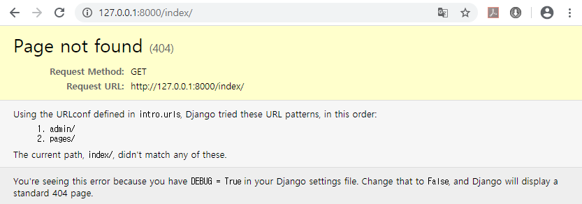

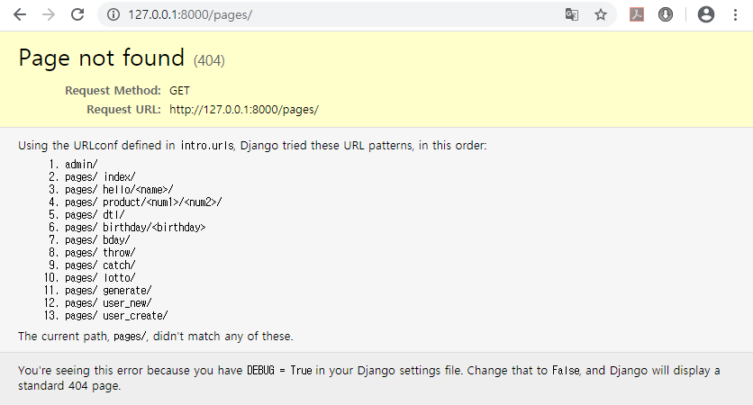

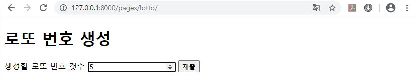

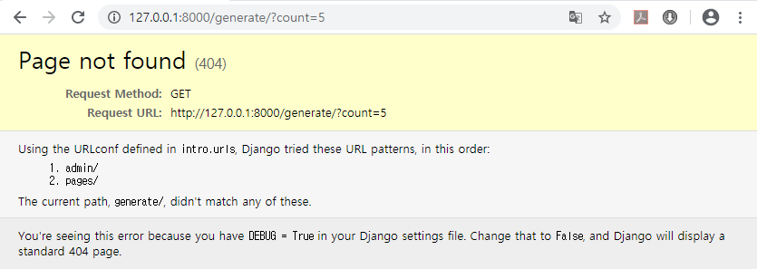

> 해당하는 html에 가서 경로를 변경해야 한다.

```html
<!-- pages > tmeplates > user_new.html -->
<!DOCTYPE html>
<html lang="en">
<head>
    <meta charset="UTF-8">
    <meta name="viewport" content="width=device-width, initial-scale=1.0">
    <title>Document</title>
</head>
<body>
    <h1>회원 가입</h1>
    <!-- 변경사항 -->
    <form action="/pages/user_create/" method="POST">
        
        <input type="text" name="username">
        <input type="password" name="pw">
        <input type="submit" value="가입!">
    </form>
</body>
</html>
```

```html
<!-- pages > tmeplates > throw.html -->
<!DOCTYPE html>
<html lang="en">
<head>
    <meta charset="UTF-8">
    <meta name="viewport" content="width=device-width, initial-scale=1.0">
    <title>Document</title>
</head>
<body>
    <h1>Throw</h1>
    <!-- 변경사항 -->
    <form action="/pages/catch/" method="GET">
        <label for="username">이름</label>
        <input id="username" type="text" name="username">
        <label for="content">내용</label>
        <input id="content" type="text" name="message">
        <input type="submit" value="던지기">
                
    </form>
</body>
</html>
```

```html
<!-- pages > templates > lotto.html -->
<!DOCTYPE html>
<html lang="en">
<head>
    <meta charset="UTF-8">
    <meta name="viewport" content="width=device-width, initial-scale=1.0">
    <title>Document</title>
</head>
<body>
    <h1>로또 번호 생성</h1>
    <!-- 변경사항 -->
    <form action="/pages/generate/">
        <label for="count">생성할 로또 번호 갯수</label>
        <input id="count" type="number" name="count">
        <input type="submit" vlaue="생성!">
    </form>
</body>
</html>
```

위와 같이 변경하면 다음과 같이 잘 실행 된다.

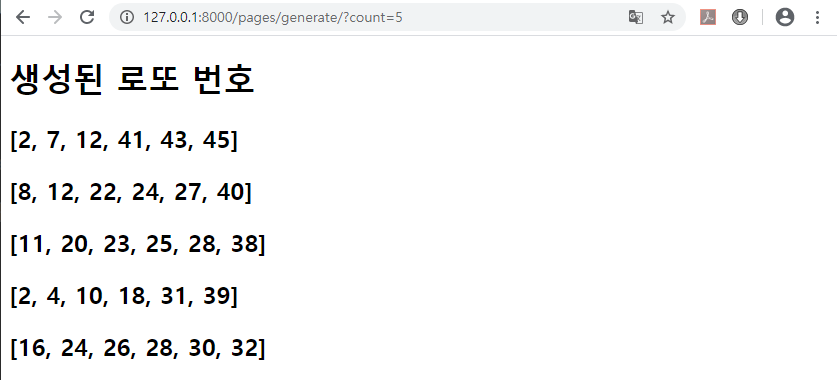


## 새로운 폴더 생성하기

- 실행하고 있는 가상환경을 `ctrl+c`로 종류한 후 `terminal`에 `python mange.py startapp tools`로 tools 생성

- 생성 후 등록 필요

  ```python
  # intro > settings.py 에 INSTALLED_APPS에 'tools' 등록
  
  INSTALLED_APPS = [
      'tools',
      'pages',
      'django.contrib.admin',
      'django.contrib.auth',
      'django.contrib.contenttypes',
      'django.contrib.sessions',
      'django.contrib.messages',
      'django.contrib.staticfiles',
  ]
  ```

  ```python
  # intro > url.py
  from django.contrib import admin
  from django.urls import path, include
  
  urlpatterns = [
      path('admin/', admin.site.urls),
      path('pages/', include('pages.urls')),
      path('tools/', include('tools.urls')),
  ]
  ```

- 기본 사이트 생성

  ```python
  # tools > urls.py
  from django.urls import path
  from . import views
  
  urlpatterns = [
      path('', views.index),
  ]
  ```

  ```python
  # tools > views.py
  from django.shortcuts import render
  
  # Create your views here.
  def index(request) :
      return render(request, 'index.html')
  ```

  ```html
  <!-- tools > templates > index.html -->
  <!DOCTYPE html>
  <html lang="en">
  <head>
      <meta charset="UTF-8">
      <meta name="viewport" content="width=device-width, initial-scale=1.0">
      <title>Document</title>
  </head>
  <body>
      <h1>Tools Index</h1>
  </body>
  </html>
  ```

  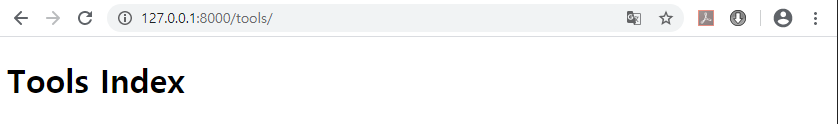

- 그런데, `/pages/index`도 같은 결과를 나타낸다.

  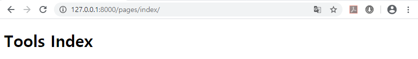

  - `Django` 프로젝트 전체에 있는 `intro > settings.py > INSTALLED_APPS` 중 순서대로 검색해서 `'index.html'`파일을 찾아서 제일 먼저 찾은 파일로 보여준다.

  - 위에서 `tools`가 가장 먼저 있으므로, 가장 먼저 검색되어 `tools/index.html` 파일을 실행한다.

  - 구분하기 위해서 `templates` 폴더 안에 `app의 이름`으로 폴더를 만들어 `.html` 파일들을 모두 넣어주고 `render`함수들을 모두 수정해주면, Django가 제대로 찾아온다.

    - `render` 함수 수정 결과

      ```python
      # pages > views.py
      from django.shortcuts import render
      
      # Create your views here.
      def index(request) : # 실제로 받는것이 없더라도 받아줘야한다.
          hello = 'hello :)'
          lunch = '라멘'
          context = {
              'hello':hello,
              'l':lunch
          }
          return render(request, 'pages/index.html', context)
          # 변수를 넘길 때, 무조건 딕셔너리 형태로 보내야 한다.
      
      def hello(request, name) : 
          # name : url.py에서 선언한 변수와 이름이 같아야 한다.
          context = {
              'name':name
          }
          return render(request, 'pages/hello.html', context)
      
      def product(request, num1, num2) :
          result = float(num1)*float(num2)
          # result = eval(num1+'*'+num2)
          context = {
              'num1':num1,
              'num2':num2,
              'result':result
          }
          return render(request, 'pages/product.html', context)
      
      from datetime import datetime
      def dtl(request) :
          foods = ['짜장면', '탕수육', '짬뽕', '양장피']
          sentence = 'life is short, you need python'
          fruits = ['apple', 'banana', 'cucumber', 'mango']
          datetimenow = datetime.now()
          empty_list = []
      
          context = {
              'foods':foods,
              'sentence':sentence,
              'fruits':fruits,
              'datetimenow':datetimenow,
              'empty_list':empty_list,
          }
          return render(request, 'pages/dtl.html', context)
      
      def birthday(request, birthday) :
          context = {
              'birth_month':birthday[-4:-2],
              'birth_day':birthday[-2:]
          }
          return render(request, 'pages/birthday.html', context)
      
      # 강사님
      def bday(request) :
          # 1. 오늘 날짜 가져오기
          today = datetime.now()
          # 2. month, day 가져와서 오늘 날짜와 비교하기
          result = (today.month == 11 and today.day == 23)
          context = {
              'result':result
          }
          return render(request, 'pages/bday.html', context)
      
      
      ############# 200609
      def throw(request) :
          context = {
      
          }
          return render(request, 'pages/throw.html', context)
      
      def catch(request) :
          message = request.GET.get('message')
          username = request.GET.get('username')
          context = {
              'message':message,
              'username':username
          }
          return render(request, 'pages/catch.html', context)
      
      # 로또 생성기
      def lotto(request) :
          context = {
      
          }
          return render(request, 'pages/lotto.html', context)
      
      import random
      def generate(request) :
          count = int(request.GET.get('count'))
          
          lotto_numbers = range(1, 46)
          lottos = []
          for n in range(count) :
              lottos.append(sorted(random.sample(lotto_numbers, 6)))
              
          context = {
              'lottos':lottos
          }
          return render(request, 'pages/generate.html', context)
      
      def user_new(request) :
          context = {
      
          }
          return render(request, 'pages/user_new.html', context)
      
      def user_create(request) :
          username = request.POST.get('username')
          pw = request.POST.get('pw')
          context = {
              'username':username,
              'pw':pw
          }
          return render(request, 'pages/user_create.html', context)
      ```

      ```python
      # tools > views.py
      from django.shortcuts import render
      
      # Create your views here.
      def index(request) :
          return render(request, 'tools/index.html')
      ```

    - 다시 실행해보면 다음과 같이 잘 실행되는 것을 볼 수 있다.

      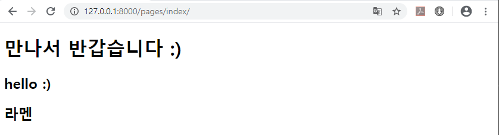

      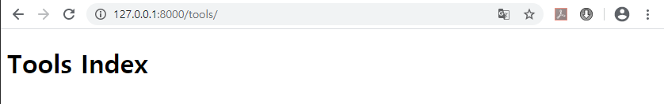


## 이미지 연결하기

- 사용하고 싶은 이미지 파일을 해당 app 파일에 `'static'`이라는 폴더를 만들어 주고, 그 안에 이미지 파일을 넣어준다.

```html
<!-- tools > templates > tools > index.html -->
 <!-- Django 코드로 static 폴더 연결이 필요 -->
<!DOCTYPE html>
<html lang="en">
<head>
    <meta charset="UTF-8">
    <meta name="viewport" content="width=device-width, initial-scale=1.0">
    <title>Document</title>
</head>
<body>
    <h1>Tools Index</h1>
    
</body>
</html>
```

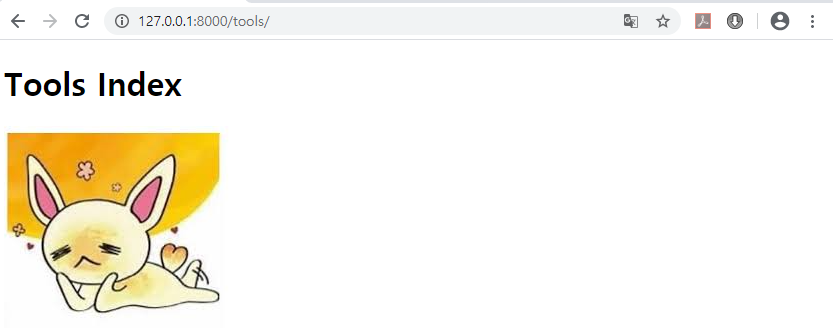

- 이미지 파일이 보이지 않는다면, sever를 껏다가 다시 켜서 사이트를 새로고침 하면 보인다.

### CSS 연결하기

```css
/* tools > static > > tools > index.css */
h1 {
    color:blue
}
```

```html
<!-- tools > templates > index.html -->

<!DOCTYPE html>
<html lang="en">
<head>
    <meta charset="UTF-8">
    <meta name="viewport" content="width=device-width, initial-scale=1.0">
    <title>Document</title>
    <link rel="stylesheet" href="">
</head>
<body>
    <h1>Tools Index</h1>
    
</body>
</html>
```

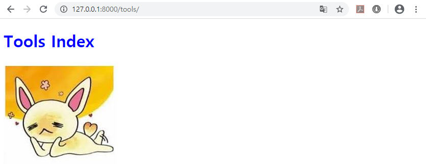

- `static`폴더에 바로 파일을 넣어놓으면 다른 app에 있는 파일과 충돌할 수 있으므로, `app이름의 폴더`을 생성하여 이미지와 css파일을 넣어준다.

### bootstrap.css 적용하기

- [bootstrap 사이트](https://getbootstrap.com/docs/4.5/getting-started/download/)에서 `Compiled CSS and JS`에 있는 파일을 다운로드 후
- 압축 폴더를 압축을 풀어서 `bootstrap.css` 파일을 `statis/tools/`에 붙여 넣는다.

```html
<!-- tools > templates > index.html -->

<!DOCTYPE html>
<html lang="en">
<head>
    <meta charset="UTF-8">
    <meta name="viewport" content="width=device-width, initial-scale=1.0">
    <title>Document</title>
    <link rel="stylesheet" href="">
    <link rel="stylesheet" href="">
</head>
<body>
    <h1>Tools Index</h1>
    
</body>
</html>
```

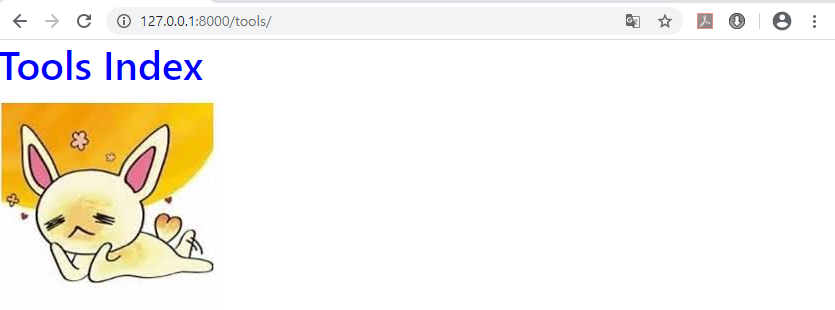


## base.html을 전체적으로 적용하기


- 위의 위치에 `templates` 폴더 생성

```html
<!-- Django > intro > templates > base.html -->

<!DOCTYPE html>
<html lang="en">
<head>
    <meta charset="UTF-8">
    <meta name="viewport" content="width=device-width, initial-scale=1.0">
    <title>Document</title>
    <link rel="stylesheet" href="">
    <link rel="stylesheet" href="">
</head>
<body>
    

    
</body>
</html>
```

```html
<!-- Django > intro > tools > templates > tools > index.html -->






<h1>Tools Index</h1>



```

```python
# Django > intro > intro > settings.py 에서 중간에
# TEMPLATES의 'DIRS'을 다음과 같이 변경

TEMPLATES = [
    {
        'BACKEND': 'django.template.backends.django.DjangoTemplates',
        'DIRS': [
            # base.html의 경로 추가
            os.path.join(BASE_DIR, 'templates'),
            # BASE_DIR : manage.py가 있는 위치
            # os.path로 join하는 이유 : 운영체제에 맞춰 연결하기 위해서
        ],
        'APP_DIRS': True,
        'OPTIONS': {
            'context_processors': [
                'django.template.context_processors.debug',
                'django.template.context_processors.request',
                'django.contrib.auth.context_processors.auth',
                'django.contrib.messages.context_processors.messages',
            ],
        },
    },
]
```

- 결과

  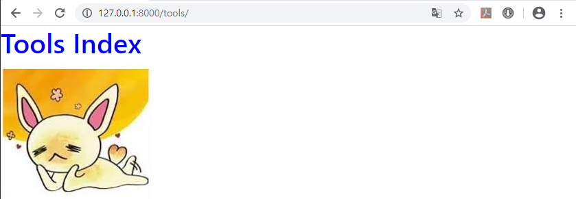

- `pages/index.html` 파일에 적용해보기

  ```html
  <!-- pages > templates > pages > index.html -->
  
  
  
  
  <h1>만나서 반갑습니다 :)</h1>
  <h2>{{hello}}</h2>
  <h2>{{l}}</h2>
  
  
  ```

  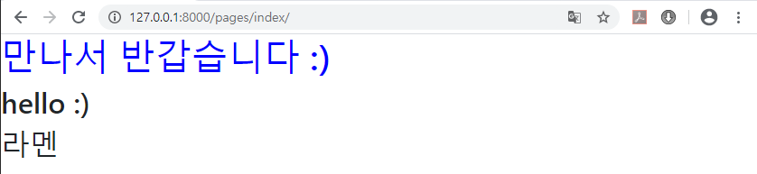

  

  

  


