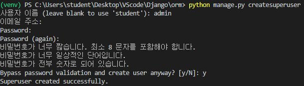
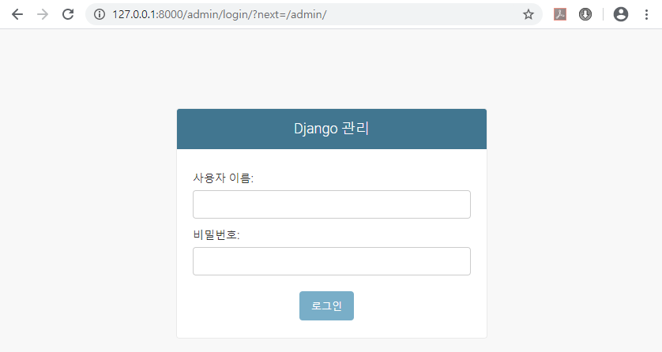
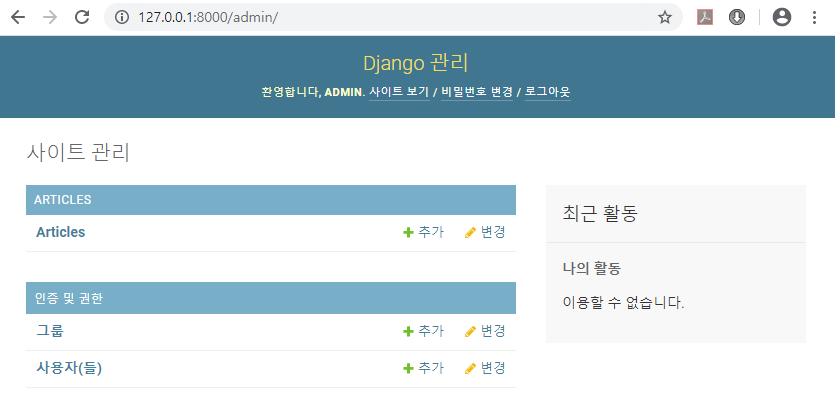
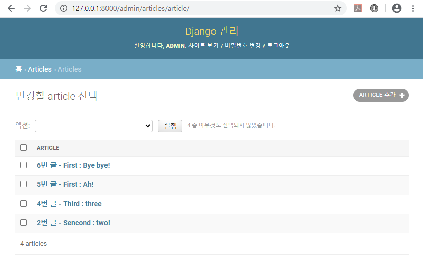
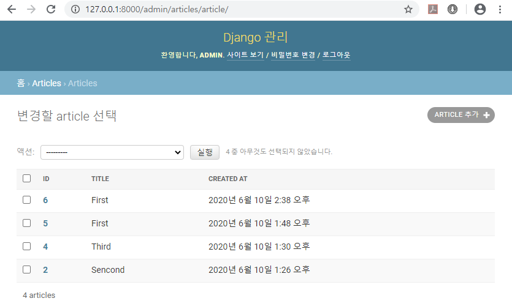
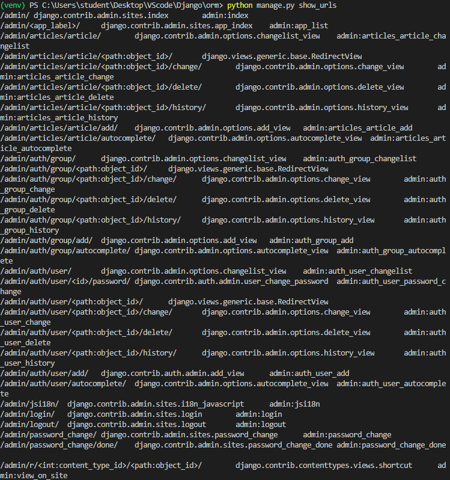

# Day05 종합 프로젝트

# Django ORM

## Database

- 데이터베이스는 **체계화된 데이터의 모임**이다.
- 여러 사람이 공유하여 사용할 목적으로 체계화해 통합, 관리하는 정보의 집합니다. 작성된 목록으로써 여러 응용 시스템들의 통합된 정보들을 저장하여 운영할 수 있는 공용 데이터들의 묶음이다.

### 데이터 베이스로부터 얻는 장점들

- 데이터 중복 최소화
- 데이터 무결성
  - 정확한 정보를 보장
- 데이터 일관성
- 데이터 독립성
  - 물리적 독립성과 논리적 독립성
- 데이터 표준화
- 데이터 보안 유지

### RDBMS

- 관계형 데이터 베이스 관리 시스템
- 관계형 모델을 기반으로하는 데이터베이스 관리시스템
- 대표적으로 오픈소스 RDBMS(MySQL, SQLite, PostgreSQL)와 ORACLE, MS SQL

## 실습

- `Dango` 폴더에 새로운  폴더인 `orm` 생성하고 `orm`에서 VScode 실행
- `orm`폴더에
  - 가상환경이 설치되어 있지 않기 때문에, terminal에서 `python -m venv venv` 으로 가상환경 만들기
  - `Command Palette...(ctrl+shift+p)`에서 `Python: Select Interpreter`를 선택하고, `venv`를 선택하여 가상환경이 바로 실행 될 수 있도록 설정
  - Django가 설치되어 있지 않기 때문에, termnal에서 `pip install django==2.2.13`으로 Django 설치
  - `django-admin startproject orm .`으로 `orm` 이름의 Django 프로젝트 생성
  - `python mange.py runsever`로 작동 확인
  - `python manage.py startapp article`로 `article` 이름의 app 생성

### 예시

- `Django`폴더와 같은 수준에 `python_code` 폴더를 생성하여 VS code 실행

  ```python
  # python_code > person.py
  class Person() : # 클래스
      name = '사람의 고유한 속성' # 클래스 변수
      age = '출생 이후부터 삶을 마감할 때까지의 기간'
  
      def greeting(self) : # 메소드
          print(f'{self.name}이 인사합니다. 안녕하세요.')
      
      def eating(self) :
          print(f'{self.name}은 밥을 먹습니다.')
      
      def aging(self) :
          print(f'{self.name}은 {self.age}살이지만, 나이를 먹어가는 중입니다.')
  
  # 클래스 - 사람(집단, 특성)
  # 인스턴스 - 사람(개인)
  # 메소드 - 사람(개인)이 가지고 있는 행위
  # 클래스 변수 - 사람(집단, 특성)이 가지고 있는 공통 속성
  # 인스턴스 변수 - 사람(개인)이 가지는 고유한 특성
  
  junwoo = Person() # 인스턴스
  print(junwoo.name) # 인스턴스 변수
      # => 사람의 고유한 속성
  print(junwoo.age)
      # => 출생 이후부터 삶을 마감할 때까지의 기간
  junwoo.name = '준우'
  junwoo.age = '50'
  print(junwoo.name)
      # => 준우
  print(junwoo.age)
      # => 50
  print(Person.name)
      # => 사람의 고유한 속성
  print(Person.age)
      # => 출생 이후부터 삶을 마감할 때까지의 기간
  junwoo.eating()
      # => 준우은 밥을 먹습니다.
  
  justin = Person()
  print(justin.name) # => 사람의 고유한 속성
  justin.name = '재석'
  print(justin.name) # => 재석
  print(junwoo.name) # => 준우
  
  # DB - Class
  # 테이블 - 클래스
  # 열(column) - 클래스 변수
  # 행(row) - 인스턴스
  # 행이 가지는 값들 - 인스턴스 변수
  # 값들의 조합 or 가공 - 메소드
  ```


### DB 구조 설정하기

1. `models.py` 작성 및 변경 (생성 및 수정)
2. `python manage.py makemigrations`
   - -> migration(설계도) 파일 생성
3. `python mange.py migrate`
   - 실제 Database에 적용 (테이블 생성)

```python
# articles > models.py
from django.db import models

# Create your models here.
class Article(models.Model) :
    # id = models.AutoField(primary_key=True)
         # Django에서 자동으로 만듦
    title = models.CharField(max_length=100)
        # CharField는 길이 제한이 존재
    content = models.TextField()
        # TextField는 길이 제한 없음
    created_at = models.DateTimeField(auto_now_add=True)
        # DateTimeField는 날짜와 시간 저장
        # auto_now_add는 row가 생성될때 마다 자동으로 추가해준다.
```

- 위의 설계도를 DB에 반영
  - terminal에서 `python manage.py makemigrations` 실행
    - `Create model Article`가 출력 되면 성공
    - `migrations` 폴더에 `0001_initial.py` 파일 생성
      - `0001_initial.py`  : Django와 DB를 연동하기위한 코드로 우리가 직접 작성하지 않는다.
  - 다음으로 terminal에서 `python manage.py migrate` 시행
    - => migrations에 관련된 것들이 모두 적용된다.

- 설계도가 변경될 경우

  ```python
  # articles > models.py
  from django.db import models
  
  # Create your models here.
  class Article(models.Model) :
      # id = models.AutoField(primary_key=True)
           # Django에서 자동으로 만듦
      title = models.CharField(max_length=100)
          # CharField는 길이 제한이 존재
      content = models.TextField()
          # TextField는 길이 제한 없음
      created_at = models.DateTimeField(auto_now_add=True)
          # DateTimeField는 날짜와 시간 저장
          # auto_now_add는 row가 생성될때 마다 자동으로 추가해준다.
      updated_at = models.DateTimeField(auto_now=True)
          # auto_now : row의 data가 삭제, 변경 될때 마다 자동으로 바뀜
  ```

  - 위의 terminal 명령어를 다시 실행
    - Django가 변경된 부분을 확인 해서 그 부분만 추가한 설계도를 생성
      - `0002_article_updated_at.py` 파일 생성
    - 그 부분만 추가하여 DB구조 변경 완료

### DB 관리하기

- `articles/models.py`에 `def __str__(self)` 추가

```python
# articles > models.py
from django.db import models

# Create your models here.
class Article(models.Model) :
    # id = models.AutoField(primary_key=True)
         # Django에서 자동으로 만듦
    title = models.CharField(max_length=100)
        # CharField는 길이 제한이 존재
    content = models.TextField()
        # TextField는 길이 제한 없음
    created_at = models.DateTimeField(auto_now_add=True)
        # DateTimeField는 날짜와 시간 저장
        # auto_now_add는 row가 생성될때 마다 자동으로 추가해준다.
    updated_at = models.DateTimeField(auto_now=True)
        # auto_now : row의 data가 삭제, 변경 될때 마다 자동으로 바뀜


    def __str__(self) : # f-string
        return f'{self.id}번 글 - {self.title} : {self.content}'
```


- Django와 관련된 명령어를 사용하기 위해서 `python manage.py shell`로 interpreter를 실행해야 한다.

> [Django Shell]
>
> python manage.py shell

#### 0. Model import
```python
from articles.models import Article

Article
# > <class 'articles.models.Article'>

# 데이터 불러오기
Article.objects.all()
# > <QuerySet []> # 아직 데이터가 없으므로 빈 값이 나타남
```

#### 1. Create
1-1. 첫번째

> article = Article()
>
> article.title = 'First'
>
> article.content = 'Wow!'
>
> article.save()

```python
article = Article()
article
# > <Article: Article object (None)>

article
# > <Article: Article object (None)>

article.title = 'First'
article.content = 'Wow!'
article.title
# > 'First'
article.content
# > 'Wow!'

article.save()
article        
# > <Article: Article object (1)> # (1) : 데이터 1개가 저장되어 있다는 표시
```

1-2. 두번째

> article = Article(title='Second', content='two!')
>
> article.save()

```python
article = Article(title='Second', content='two!')
article.title
# > 'Second'

article.save()
```

1-3. 세번째 (-> CREATE)

- 생성과 동시에 저장

> article = Article.objects.create(title='Third', content='three')
>
> article.title #  => 'Third'

#### 2. Read

2-1. all() (-> SELECT *)

- 복수 (0개 ~ 여러개)
- 리스트처럼 동작

> articles = Article.objects.all()

```python
articles = Article.objects.all()    
articles
# > <QuerySet [<Article: 1번 글 - First : Wow!>, <Article: 2번 글 - Sencond : two!>, <Article: 3번 글 - Third : three>]>
```

2-2. filter() (-> WHERE)

- 복수 (0개 ~ 여러개)
- 리스트처럼 동작

> articles = Article.objects.filter(title='First')

```python
Article.objects.create(title='First', content='Ah!')
Article.objects.filter(title='First')
# > <QuerySet [<Article: 1번 글 - First : Wow!>, <Article: 4번 글 - First : Ah!>]>
```

2-3. get()

- 단수 (1개) : 무조건 1개만 리턴 필수
- 인스턴스

> article = Article.objects.get(id=1)
>
> or
>
> article = Article.objects.get(pk=1) # Django에서 권장
>
> or
>
> article = Article.objects.get(title='First') # 권장하지 않음, Error 발생 가능성 존재
>
> article = Article.objects.get(pk=10) # Error(10번 게시물이 존재하지 않으므로)

- pk == id_exact의 약자
- 10번째 게시물이 있는지 확인 하기 위해서는
  - `article = Article.objects.filter(pk=10)`로 수행 => 없으면 빈리스트 반환

  ```python
Article.objects.get(id=1)
# > <Article: 1번 글 - First : Wow!>
  ```

  2-4. QuerySet

- 유사 리스트

> articles = Article.objects.all() # -> 복수
>
> articles[0] # 첫번째 데이터 -> 단수
>
> articles.first() # 첫번째 데이터
>
> articles[-1] # 마지막 데이터
>
> articles.last() # 마지막 데이터
>
> articles[1:3] # 2번째 ~ 3번째 데이터
>
> articles[OFFSET:OFFSET+LIMIT] # OFFSET:1, LIMIT:2

2-5. order_by()

> article = Article.objects.order_by('created_at') # 오름차순
>
> article = Article.objects.order_by('-created_at') # 내림차순

```python
Article.objects.order_by('created_at')
# > <QuerySet [<Article: 1번 글 - First : Wow!>, <Article: 2번 글 - Sencond : two!>, <Article: 3번 글 - Third : three>, <Article: 4번 글 - First : Ah!>]>

Article.objects.order_by('-created_at') 
# > <QuerySet [<Article: 4번 글 - First : Ah!>, <Article: 3번 글 - Third : three>, <Article: 2번 글 - Sencond : two!>, <Article: 1번 글 - First : Wow!>]>
```

#### 3. Update

> (1) 데이터 가져오기 (<- DB)
>
> article = Article.objects.get(pk=1)
>
> (2) 인스턴스 수정 (only Python)
>
> article.content = 'Bye bye!'
>
> (3) 인스턴스 저장 (-> DB)
>
> article.save()

```python
article = Article.objects.get(id=1)
article
# > <Article: 1번 글 - First : Wow!>
article.title
# > 'First'
article.content = 'Bye bye!'
article.content             
# > 'Bye bye!'
article.save()
Article.objects.get(pk=1)
# > <Article: 1번 글 - First : Bye bye!>
```

#### 4. Delete

> (1) 데이터 가져오기 (<- DB)
>
> article = Article.objects.get(pk=1)
>
> (2) 인스턴스 삭제 (-> DB)
>
> article.delete()

```python
article = Article.objects.get(pk=1)
article
# > <Article: 1번 글 - First : Bye bye!>

article.delete()
# > (1, {'articles.Article': 1})

Article.objects.all()
# > <QuerySet [<Article: 2번 글 - Sencond : two!>, <Article: 3번 글 - Third : three>, <Article: 4번 글 - First : Ah!>]>
```

- cf) 변심해서 다시 저장할 경우

  - 삭제된 정보에 대한 정보가 Python의 `article` 변수에 남아 있으므로 저장 가능하다. 단, id는 새로 할당 받는다.

    ```python
    article
    # > <Article: 1번 글 - First : Bye bye!>
    
    article.save()
    Article.objects.all()
    # > <QuerySet [<Article: 2번 글 - Sencond : two!>, <Article: 3번 글 - Third : three>, <Article: 4번 글 - First : Ah!>, <Article: 5번 글 - First : Bye bye!>]>
    ```

### interpreter가 아닌 페이지를 통해 DB관리하기

- terminal에서 `python manage.py createsuperuser`를 실행하여 관리자 계정을 먼저 만들어야한다.

  

- 그 결과 `http://127.0.0.1:8000/admin/` 페이지가 다음과 같이 뜬다.

  

- 페이지에서 DB를 관리하기 위해서 `admin.py` 수정이 필요하다.

  ```python
  # articles > admin.py
  from django.contrib import admin
  from .models import Article
  
  # Register your models here.
  admin.site.register(Article)
  ```

  

  => Articles 생성

- 볼 수 있는 column에 대한 한계가 존재

  

  => `admin.py` 수정 필요

- ```python
  # articles > admin.py
  from django.contrib import admin
  from .models import Article
  
  class ArticleAdmin(admin.ModelAdmin) :
      list_display = ['id', 'title', 'created_at']
  
  # Register your models here.
  admin.site.register(Article, ArticleAdmin)
  ```

  

  => 더 많은 정보를 볼 수 있음

### Django에 관련된 라이브러리 설치

- terminal에서 `pip install django-extensions`을 실행

  - 사용할 library를 `settings.py`에 등록 필요

    ```python
    # orm > settings.py 중 INSTALLED_APPS에 추가 필요
    
    INSTALLED_APPS = [
        'articles',
        'django.contrib.admin',
        'django.contrib.auth',
        'django.contrib.contenttypes',
        'django.contrib.sessions',
        'django.contrib.messages',
        'django.contrib.staticfiles',
        'django_extensions',
    ]
    ```

- terminal에서 `python manage.py shell_plus`을 실행하여 interpreter 실행

- `python manage.py show_urls` : 존재하는 url들 list로 보여줌

  

