# Day06 종합프로젝트

# Django CRUD

- CRUD : create, read, update, delete

- Form tag를 통해 데이터 입력받기

### 기본 세팅 하기

1. Python 가상 환경

   ```
   python -m venv venv
   ```

2. Python 가상환경 활성화 (VS Code 기능)

   - Ctrl + Shift + P

   -  'Python: Select Interpreter'

   - 가상 환경 'venv' 선택

   - 잘 연결 되었는지 확인

     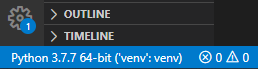

   - terminal을 껏다가 다시 켜면 자동으로 가상환경을 활성화 해 준다.

3. Django 설치

   ```
   pip install django==2.2.13
   ```

4. Django Project 생성

   ```
   django-admin startproject crud .
   ```

5. Django App 생성

   ```
   python manage.py startapp articles
   ```

6. Django App 등록

   - `crud > settings.py > INSTALLED_APPS`
   - `'articles'` 추가

7. 언어 및 시간 설정

   - `crud > settings.py`
   - `LANGUAGE_CODE = 'ko-kr'`
   - `TIME_ZONE = 'Asia/Seoul'`

8. Django Sever 실행

   ```
   python manage.py runserver
   ```

9. `base.html` 설정

   - `crud > settings.py > TEMPLATES > DIRS`

   - `os.path.join(BASE_DIR, 'templates')` 추가

   - 최상위 폴더에서 `templates` 폴더 생성

   - `templates > base.html` 생성

     - 다른 app들에서 공동으로 사용할 형식

     - ```html
       <!-- templates > base.html -->
       <!DOCTYPE html>
       <html lang="en">
       <head>
           <meta charset="UTF-8">
           <meta name="viewport" content="width=device-width, initial-scale=1.0">
           <title>Document</title>
       </head>
       <body>
           
           
       </body>
       </html>
       ```

10. `urls.py`

    - `articles > urls.py` 생성
    - `crud > urls.py` 에서 `include`로 `path` 추가

    ```python
    # crud > urls.py
    from django.contrib import admin
    from django.urls import path, include
    
    urlpatterns = [
        path('admin/', admin.site.urls),
        path('articles/', include('articles.urls')),
    ]
    ```

    ```python
    # articles > urls.py
    from django.urls import path
    
    urlpatterns = [
        
    ]
    ```

    - `articles`만을 위한 `urls.py` 생성 완료

### 데이터 베이스 생성

```python
# articels > models.py
from django.db import models

# Create your models here.
class Article(models.Model) :
    title = models.CharField(max_length=100)
    content = models.TextField()
    created_at = models.DateTimeField(auto_now_add=True)
    updated_at = models.DateTimeField(auto_now=True)
```

- `Ctrl + C`로 서버 종료 후

- 설계도 파일 생성

  ```
  python manage.py makemigrations
  ```

  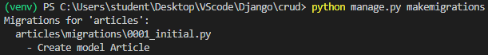

- 설계도 적용

  ```
  python manage.py migrate
  ```

### 기본 화면 생성

```python
# articles > urls.py
from django.urls import path
from . import views

urlpatterns = [
    path('index/', views.index),
]
```

```python
# articles > views.py
from django.shortcuts import render

# Create your views here.
def index(request) :
    context = {

    }
    return render(request, 'articles/index.html', context)
```

```html
<!-- articles > templates > articles > index.html -->




<h1>Article Index</h1>


```

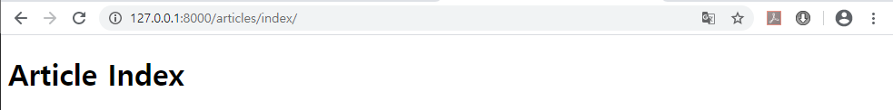

### 값 입력 받기

```python
# articles > urls.py
from django.urls import path
from . import views

urlpatterns = [
    path('index/', views.index),
    path('send/', views.send),
    path('receive/', views.receive),
]
```

```python
# articles > views.py
from django.shortcuts import render

def send(request) :
    context = {

    }
    return render(request, 'articles/send.html', context)

def receive(request) :
    title = request.GET.get('title')
    context = {
        'title':title,
    }
    return render(request, 'articles/receive.html', context)
```

```html
<!-- articles > templates > articles > send.html -->




<h1>Article Send</h1>

<form action="/articles/receive/">
    <label for="title">제목</label>
    <input id="title" type="text" name="title">
    <input type="submit" value="전송!">
</form>


```

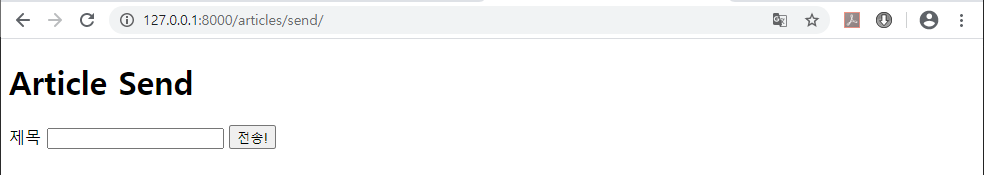

```html
<!-- articles > templates > articles > receive.html -->




<h1>Article Receive</h1>

<h2>제목 : {{ title }}</h2>


```

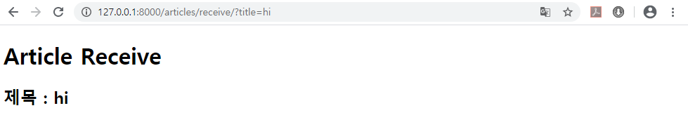


## 데이터 생성 및 저장(Create)

```python
# articles > urls.py
from django.urls import path
from . import views

urlpatterns = [
    path('index/', views.index),
    path('new/', views.new), # 게시글 작성 양식
    path('create/', views.create), # 게시글 생성
]
```

```python
# articles > views.py
from django.shortcuts import render

def new(request) :
    context = {

    }
    return render(request, 'articles/new.html', context)

def create(request) :
    title = request.GET.get('title')
    content = request.GET.get('content')
    
    # Database에 저장
    # 1. Article 인스턴스 생성
    article = Article(title=title, content=content)
    # 2. 저장!
    article.save()
    
    context = {
        'title':title,
        'content':content,
    }
    return render(request, 'articles/create.html', context)
```

```html
<!-- articles > templates > articles > new.html -->




<h1>Article New</h1>

<form action="/articles/create/">
    <label for="title">제목</label>
    <input id="title" type="text" name="title"><br>
    <label for="content">내용</label>
    <textarea name="content" id="content" cols="30" rows="10"></textarea>
    <input type="submit" value="Create!">
</form>


```

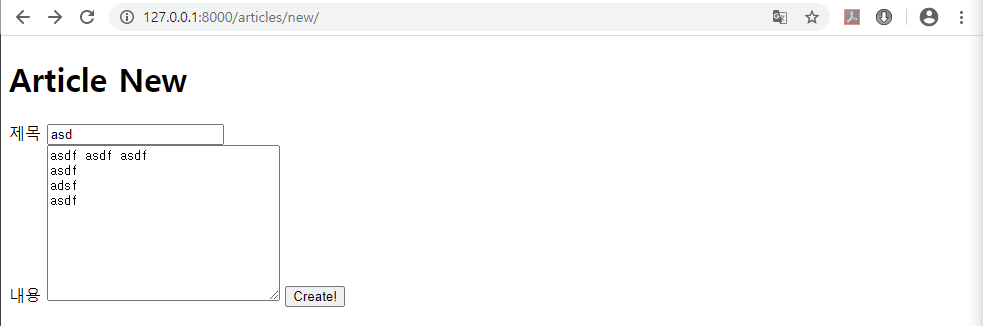

```html
<!-- articles > templates > articles > create.html -->




<h1>Article Create</h1>

<h2>제목 : {{ title }}</h2>

<h3>내용 : {{ content }}</h3>


```

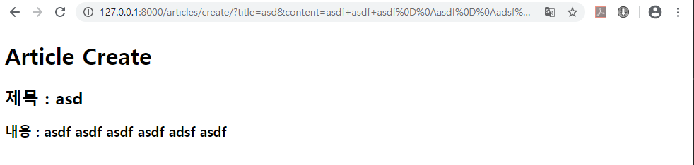

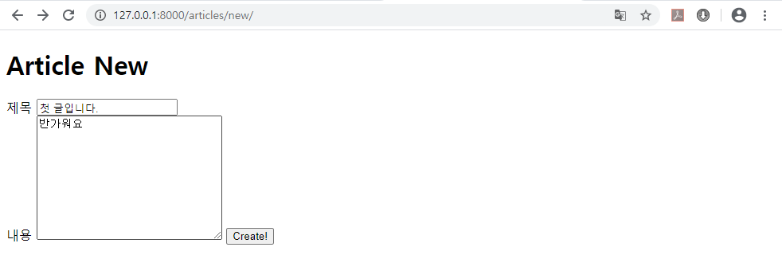

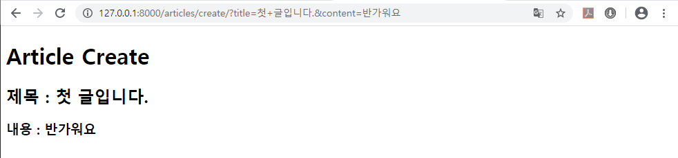


### 저장된 데이터 확인하기

- `index.html` 활용

```python
# articles > views.py
from django.shortcuts import render
from .models import Article

# Create your views here.
def index(request) : # 게시글 목록
    # Database 조회
    articles = Article.objects.all() # 모든 데이터

    context = {
        'articles':articles,
    }
    return render(request, 'articles/index.html', context)
```

```html
<!-- articles > templates > articles > index.html -->




<h1>Article Index</h1>

<ul>

    <li>{{ article }}</li>
    <!-- li는 ul or li tag 안쪽에 존재해야 한다. -->

</ul>


```

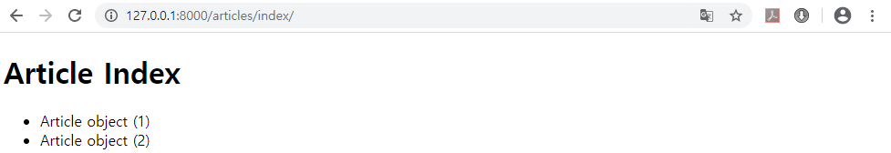

- 제목을 보기 위해서는 `.title` 추가 필요

```html
<!-- articles > templates > articles > index.html -->




<h1>Article Index</h1>

<ul>

    <li>{{ article.title }}</li>
    <!-- li는 ul or li tag 안쪽에 존재해야 한다. -->

</ul>


```

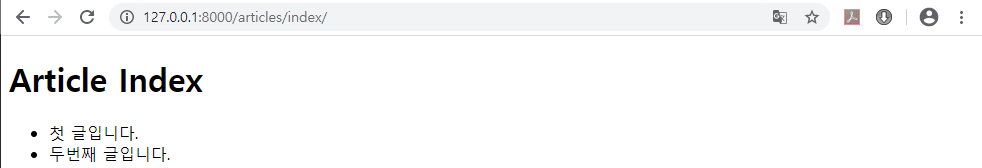

### POST 방식으로 변경

```html
<!-- articles > templates > articles > new.html -->




<h1>Article New</h1>

<form action="/articles/create/" method="POST">
    
    <label for="title">제목</label>
    <input id="title" type="text" name="title"><br>
    <label for="content">내용</label>
    <textarea name="content" id="content" cols="30" rows="10"></textarea>
    <input type="submit" value="Create!">
</form>


```

```python
# articles > views.py
from django.shortcuts import render
from .models import Article

def create(request) :
    title = request.POST.get('title')
    content = request.POST.get('content')

    # Database에 저장
    # 1. Article 인스턴스 생성
    article = Article(title=title, content=content)
    # 2. 저장!
    article.save()

    context = {
        'title':title,
        'content':content,
    }
    return render(request, 'articles/create.html', context)
```


### 자연스럽게 만들기

```python
# articles > views.py
from django.shortcuts import render, redirect
from .models import Article

# Create your views here.
def index(request) : # 게시글 목록
    # Database 조회
    articles = Article.objects.all() # 모든 데이터

    context = {
        'articles':articles,
    }
    return render(request, 'articles/index.html', context)

def new(request) : # GET -> render O
    context = {

    }
    return render(request, 'articles/new.html', context)

def create(request) : # POST -> render X
    title = request.POST.get('title')
    content = request.POST.get('content')

    # Database에 저장
    # 1. Article 인스턴스 생성
    article = Article(title=title, content=content)
    # 2. 저장!
    article.save()

    # context = {
    #     'title':title,
    #     'content':content,
    # }
    
    # 데이터를 바로 저장해서 리스트로 돌아가면 되므로 render가 아닌 redirect 사용
    return redirect('/articles/index/')
    # return render(request, 'articles/create.html', context)
```

```html
<!-- articles > templates > articles > index.html -->




<h1>Article Index</h1>

<!-- 버튼을 통해 새글 작성하기 -->
<a href="/articles/new/">New Aritcle</a>
<ul>

    <li>{{ article.title }}</li>
    <!-- li는 ul or li tag 안쪽에 존재해야 한다. -->

</ul>


```

- 새글을 작성하기 위해서 주소창이 아니라 버튼으로 글을 작성창으로 페이지가 바뀌고
- 글을 작성한 후 `index` 페이지로 돌아온다.

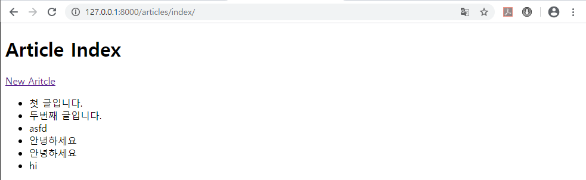

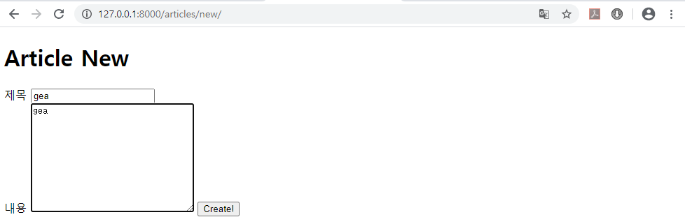


## 게시글 상세페이지(Read)

```python
# articles > urls.py
from django.urls import path
from . import views

urlpatterns = [
    path('index/', views.index), # 게시글 목록
    path('new/', views.new), # 게시글 작성 양식 (GET)
    path('create/', views.create), # 게시글 생성 (POST)
    path('detail/<int:pk>/', views.detail), # 게시글 보기
]
```

```python
# articles > views.py
from django.shortcuts import render, redirect
from .models import Article

def detail(request, pk) :
    # Database 조회 : 단 하나의 data
    article = Article.objects.get(pk=pk)

    context = {
        'article':article,    
    }
    return render(request, 'articles/detail.html', context)
```

```html
<!-- articles > templates > articles > detail.html -->




<h1>Article Detail</h1>

<ul>
    <li>PK : {{ article.pk }}</li>
    <li>제목 : {{ article.title }}</li>
    <li>내용 : {{ article.content }}</li>
    <li>작성 시각 : {{article.created_at}}</li>
    <li>수정 시각 : {{article.updated_at}}</li>
</ul>



```

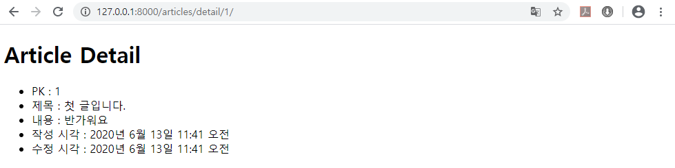

- 게시글 제목 선택으로 상세페이지 보기

```html
<!-- articles > templates > articles > index.html -->




<h1>Article Index</h1>

<a href="/articles/new/">New Aritcle</a>
<ul>

    <li>
        <a href="/articles/detail/{{ article.pk }}">{{ article.title }}</a>
    </li>
    <!-- li는 ul or li tag 안쪽에 존재해야 한다. -->

</ul>


```

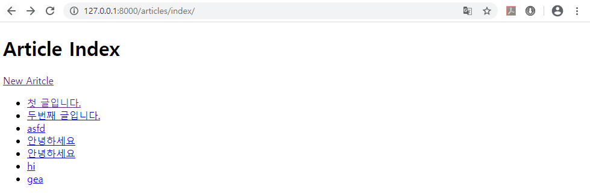

- 글 작성 후 상세페이지로 가도록 설정 변경

```python
# articles > views.py
from django.shortcuts import render, redirect
from .models import Article

def create(request) : # POST -> render X
    title = request.POST.get('title')
    content = request.POST.get('content')

    # Database에 저장
    # 1. Article 인스턴스 생성
    article = Article(title=title, content=content)
    # 2. 저장!
    article.save()

    # context = {
    #     'title':title,
    #     'content':content,
    # }
    return redirect(f'/articles/detail/{article.pk}/')
```

## 게시글 삭제하기(Delete)

```python
# articles > urls.py
from django.urls import path
from . import views

urlpatterns = [
    path('index/', views.index), # 게시글 목록
    path('new/', views.new), # 게시글 작성 양식 (GET)
    path('create/', views.create), # 게시글 생성 (POST)
    path('detail/<int:pk>/', views.detail), # 게시글 보기
    path('delete/<int:pk>/', views.delete), # 게시글 삭제
]
```

```python
# articles > views.py
from django.shortcuts import render, redirect
from .models import Article

def delete(request, pk) : # Database에 접근하므로 POST 방식
    # Database 삭제 (조회 + 삭제)
    # 1. 조회
    article = Article.objects.get(pk=pk)
    # 2. 삭제
    article.delete()

    return redirect('/articles/index/')
```

```html
<!-- articles > templates > articles > detail.html -->




<h1>Article Detail</h1>

<ul>
    <li>PK : {{ article.pk }}</li>
    <li>제목 : {{ article.title }}</li>
    <li>내용 : {{ article.content }}</li>
    <li>작성 시각 : {{article.created_at}}</li>
    <li>수정 시각 : {{article.updated_at}}</li>
</ul>

<a href="/articles/index/">목록</a>
<form action="/articles/delete/{{ article.pk }}/" method="POST">
    
    <input type="submit" value="삭제!">
</form>

```

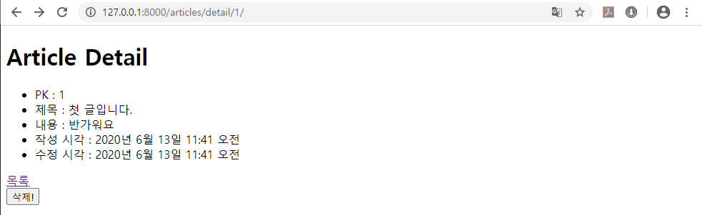

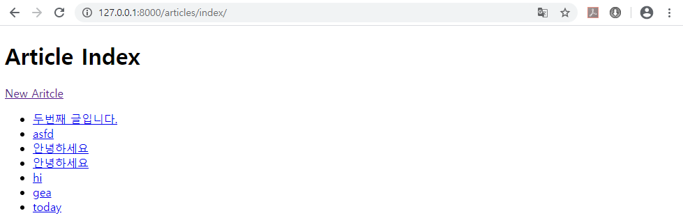

## 게시글 수정하기(Update)

```python
# articles > urls.py
from django.urls import path
from . import views

urlpatterns = [
    path('index/', views.index), # 게시글 목록
    path('new/', views.new), # 게시글 작성 양식 (GET)
    path('create/', views.create), # 게시글 생성 (POST)
    path('detail/<int:pk>/', views.detail), # 게시글 보기
    path('delete/<int:pk>/', views.delete), # 게시글 삭제
    path('edit/<int:pk>/', views.edit), # 게시글 수정 양식 (GET)
    path('update/<int:pk>/', views.update), # 게시글 수정 (POST)
]
```

```python
# articles > views.py
from django.shortcuts import render, redirect
from .models import Article

def edit(request, pk) : # GET
    # Database 조회 (+ 저장)
    # 1. 조회
    article = Article.objects.get(pk=pk)

    context = {
        'article':article,
    }
    return render(request, 'articles/edit.html', context)

def update(request, pk) : #POST
    title = request.POST.get('title')
    content = request.POST.get('content')

    # Database 조회 + 수정 + 저장
    # 1. 조회
    article = Article.objects.get(pk=pk)
    # 2. 수정
    article.title = title
    article.content = content
    # 3. 저장
    article.save()

    return redirect(f'/articles/detail/{article.pk}/')
```

```html
<!-- articles > templates > articles > edit.html -->




<h1>Article Edit</h1>

<form action="/articles/update/{{ article.pk }}/" method="POST">
    
    <label for="title">제목</label>
    <input id="title" type="text" name="title" value="{{ article.title }}"><br>
    <label for="content">내용</label>
    <textarea name="content" id="content" cols="30" rows="10">{{ article.content }}</textarea>
    <input type="submit" value="Update!">
</form>

<form action="/articles/index/">
    <input type="submit" value="Cancel!">
</form>

```

- 추가적으로 페이지 연결

  ```html
  <!-- articles > templates > articles > detail.html -->
  
  
  
  
  <h1>Article Detail</h1>
  
  <ul>
      <li>PK : {{ article.pk }}</li>
      <li>제목 : {{ article.title }}</li>
      <li>내용 : {{ article.content }}</li>
      <li>작성 시각 : {{article.created_at}}</li>
      <li>수정 시각 : {{article.updated_at}}</li>
  </ul>
  
  <a href="/articles/index/">목록</a>
  
  <a href="/articles/edit/{{ article.pk }}/">수정</a>
  
  <form action="/articles/delete/{{ article.pk }}/" method="POST">
      
      <input type="submit" value="삭제!">
  </form>
  
  
  ```

  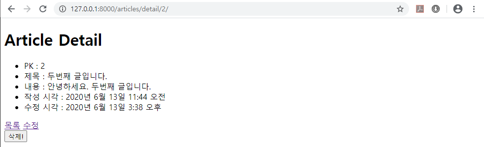

  