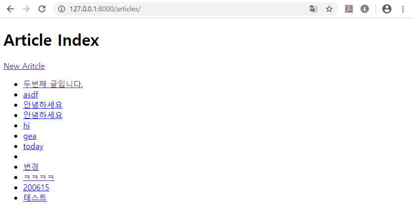
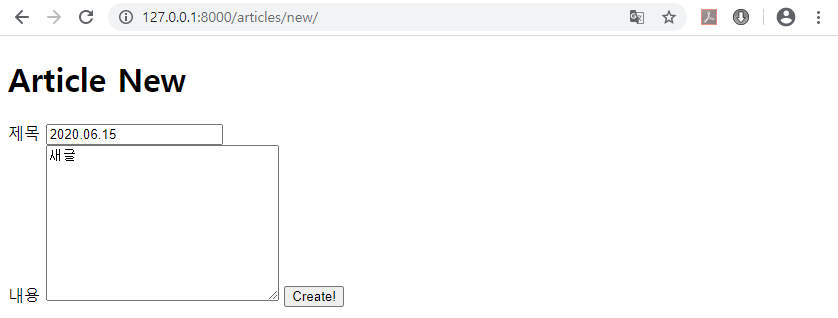
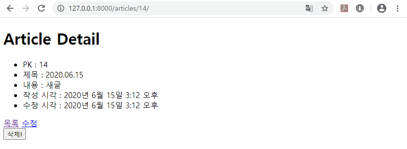
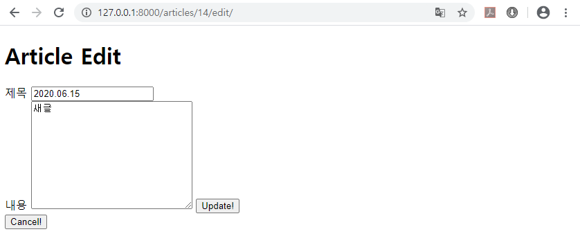

# Day07 종합프로젝트

# Django CRUD

## url 주소 Django code로 작성하기

- `urls.py`에서 `path` 들에 `name`을 명명해주고,

```python
# articles > urls.py
from django.urls import path
from . import views

urlpatterns = [
    path('index/', views.index, name='index'), # 게시글 목록
    path('new/', views.new, name='new'), # 게시글 작성 양식 (GET)
    path('create/', views.create, name='create'), # 게시글 생성 (POST)
    path('detail/<int:pk>/', views.detail, name='detail'), # 게시글 보기
    path('delete/<int:pk>/', views.delete, name='delete'), # 게시글 삭제
    path('edit/<int:pk>/', views.edit, name='edit'), # 게시글 수정 양식 (GET)
    path('update/<int:pk>/', views.update, name='update'), # 게시글 수정 (POST)
]
```

- 해당 html마다 들어가서 Django code로 변경하면 된다.

```html
<!-- articles > templates > articles > index.html -->




<h1>Article Index</h1>

<a href="">New Aritcle</a>
<ul>

    <li>
        <a href="">{{ article.title }}</a>
    </li>
    <!-- li는 ul or li tag 안쪽에 존재해야 한다. -->

</ul>


```

```html
<!-- articles > templates > articles > new.html -->




<h1>Article New</h1>

<form action="" method="POST">
    
    <label for="title">제목</label>
    <input id="title" type="text" name="title"><br>
    <label for="content">내용</label>
    <textarea name="content" id="content" cols="30" rows="10"></textarea>
    <input type="submit" value="Create!">
</form>


```

```html
<!-- articles > templates > articles > detail.html -->




<h1>Article Detail</h1>

<ul>
    <li>PK : {{ article.pk }}</li>
    <li>제목 : {{ article.title }}</li>
    <li>내용 : {{ article.content }}</li>
    <li>작성 시각 : {{article.created_at}}</li>
    <li>수정 시각 : {{article.updated_at}}</li>
</ul>

<a href="">목록</a>

<a href="">수정</a>

<form action="" method="POST">
    
    <input type="submit" value="삭제!">
</form>


```

```html
<!-- articles > templates > articles > edit.html -->




<h1>Article Edit</h1>

<form action="" method="POST">
    
    <label for="title">제목</label>
    <input id="title" type="text" name="title" value="{{ article.title }}"><br>
    <label for="content">내용</label>
    <textarea name="content" id="content" cols="30" rows="10">{{ article.content }}</textarea>
    <input type="submit" value="Update!">
</form>

<form action="">
    <input type="submit" value="Cancel!">
</form>

```

- `views.py`에서 `redirect` 함수의 변수 변경해준다.

```python
# articles > views.py
from django.shortcuts import render, redirect
from .models import Article

# Create your views here.
def index(request) : # 게시글 목록
    # Database 조회
    articles = Article.objects.all() # 모든 데이터

    context = {
        'articles':articles,
    }
    return render(request, 'articles/index.html', context)

def new(request) : # GET -> render O
    context = {

    }
    return render(request, 'articles/new.html', context)

def create(request) : # POST -> render X
    title = request.POST.get('title')
    content = request.POST.get('content')

    # Database에 저장
    # 1. Article 인스턴스 생성
    article = Article(title=title, content=content)
    # 2. 저장!
    article.save()

    # context = {
    #     'title':title,
    #     'content':content,
    # }
    return redirect('detail', article.pk)
    # return redirect(f'/articles/detail/{article.pk}/')
    # return render(request, 'articles/create.html', context)

def detail(request, pk) :
    # Database 조회 : 단 하나의 data
    article = Article.objects.get(pk=pk)

    context = {
        'article':article,    
    }
    return render(request, 'articles/detail.html', context)

def delete(request, pk) : # Database에 접근하므로 POST 방식
    # Database 삭제 (조회 + 삭제)
    # 1. 조회
    article = Article.objects.get(pk=pk)
    # 2. 삭제
    article.delete()

    return redirect('index')

def edit(request, pk) : # GET
    # Database 조회 (+ 저장)
    # 1. 조회
    article = Article.objects.get(pk=pk)

    context = {
        'article':article,
    }
    return render(request, 'articles/edit.html', context)

def update(request, pk) : #POST
    title = request.POST.get('title')
    content = request.POST.get('content')

    # Database 조회 + 수정 + 저장
    # 1. 조회
    article = Article.objects.get(pk=pk)
    # 2. 수정
    article.title = title
    article.content = content
    # 3. 저장
    article.save()

    return redirect('detail', article.pk)
```

- 앱이 여러 개일 때 충돌 방지
  - `urls.py`에 `app_name`을 설정해주고
  - 모든 `html` 파일과 `views.py`에 `app_name`을 `url 주소`와 `redirect` 앞에 `app_name:`을 추가해준다.

```python
# articles > urls.py
from django.urls import path
from . import views

# 앱이 여러 개일 때 충돌 방지
app_name = 'articles'

urlpatterns = [
    path('index/', views.index, name='index'), # 게시글 목록
    path('new/', views.new, name='new'), # 게시글 작성 양식 (GET)
    path('create/', views.create, name='create'), # 게시글 생성 (POST)
    path('detail/<int:pk>/', views.detail, name='detail'), # 게시글 보기
    path('delete/<int:pk>/', views.delete, name='delete'), # 게시글 삭제
    path('edit/<int:pk>/', views.edit, name='edit'), # 게시글 수정 양식 (GET)
    path('update/<int:pk>/', views.update, name='update'), # 게시글 수정 (POST)
]
```

```html
<!-- articles > templates > articles > index.html -->




<h1>Article Index</h1>

<a href="">New Aritcle</a>
<ul>

    <li>
        <a href="">{{ article.title }}</a>
    </li>
    <!-- li는 ul or li tag 안쪽에 존재해야 한다. -->

</ul>


```

```html
<!-- articles > templates > articles > new.html -->




<h1>Article New</h1>

<form action="" method="POST">
    
    <label for="title">제목</label>
    <input id="title" type="text" name="title"><br>
    <label for="content">내용</label>
    <textarea name="content" id="content" cols="30" rows="10"></textarea>
    <input type="submit" value="Create!">
</form>


```

```html
<!-- articles > templates > articles > detail.html -->




<h1>Article Detail</h1>

<ul>
    <li>PK : {{ article.pk }}</li>
    <li>제목 : {{ article.title }}</li>
    <li>내용 : {{ article.content }}</li>
    <li>작성 시각 : {{article.created_at}}</li>
    <li>수정 시각 : {{article.updated_at}}</li>
</ul>

<a href="">목록</a>

<a href="">수정</a>

<form action="" method="POST">
    
    <input type="submit" value="삭제!">
</form>


```

```html
<!-- articles > templates > articles > edit.html -->




<h1>Article Edit</h1>

<form action="" method="POST">
    
    <label for="title">제목</label>
    <input id="title" type="text" name="title" value="{{ article.title }}"><br>
    <label for="content">내용</label>
    <textarea name="content" id="content" cols="30" rows="10">{{ article.content }}</textarea>
    <input type="submit" value="Update!">
</form>

<form action="">
    <input type="submit" value="Cancel!">
</form>

```

```python
# articles > views.py
from django.shortcuts import render, redirect
from .models import Article

# Create your views here.
def index(request) : # 게시글 목록
    # Database 조회
    articles = Article.objects.all() # 모든 데이터

    context = {
        'articles':articles,
    }
    return render(request, 'articles/index.html', context)

def new(request) : # GET -> render O
    context = {

    }
    return render(request, 'articles/new.html', context)

def create(request) : # POST -> render X
    title = request.POST.get('title')
    content = request.POST.get('content')

    # Database에 저장
    # 1. Article 인스턴스 생성
    article = Article(title=title, content=content)
    # 2. 저장!
    article.save()

    # context = {
    #     'title':title,
    #     'content':content,
    # }
    return redirect('articles:detail', article.pk)
    # return redirect(f'/articles/detail/{article.pk}/')
    # return render(request, 'articles/create.html', context)

def detail(request, pk) :
    # Database 조회 : 단 하나의 data
    article = Article.objects.get(pk=pk)

    context = {
        'article':article,    
    }
    return render(request, 'articles/detail.html', context)

def delete(request, pk) : # Database에 접근하므로 POST 방식
    # Database 삭제 (조회 + 삭제)
    # 1. 조회
    article = Article.objects.get(pk=pk)
    # 2. 삭제
    article.delete()

    return redirect('articles:index')

def edit(request, pk) : # GET
    # Database 조회 (+ 저장)
    # 1. 조회
    article = Article.objects.get(pk=pk)

    context = {
        'article':article,
    }
    return render(request, 'articles/edit.html', context)

def update(request, pk) : #POST
    title = request.POST.get('title')
    content = request.POST.get('content')

    # Database 조회 + 수정 + 저장
    # 1. 조회
    article = Article.objects.get(pk=pk)
    # 2. 수정
    article.title = title
    article.content = content
    # 3. 저장
    article.save()

    return redirect('articles:detail', article.pk)
```

# REST

- REST란?
  - Representational State Transfer의 약자로,
  - 월드 와이드 웹과 같은 분산 하이퍼미디어 시스템을 위한 소프트웨어 아키텍처의 한 형식이다.
  - "웹에 존재하는 모든 자원(이미지, 동영상, DB 자원)에 고유한 URI를 부여해 활용"하는 것으로, 자원을 정의하고 자원에 대한 주소를 지정하는 방법론을 의미한다고 한다.
- 이런 REST의 형식을 따른 시스템을 **RESTful** 이라고 부른다.
- HTTP URI를 통해 자원을 명시하고 HTTP Method를 통해 해당 자원에 대한 CRUD Operation을 적용한다.

### CRUD Opertaion, HTTP Method

1. Create : POST (자원 생성)
2. Read : GET (자원의 정보 조회)
3. Update : PUT (자원의 정보 업데이트)
4. Delete : DELETE (자원 삭제)

## REST 구성요소

1. 자원(Resource), URI
   - 모든 자원은 고유한 ID를 가지고, ID는 서버에 존재하고, 클라이언트는 각 자원의 상태를 조작하기 위해 요청을 보낸다.
   - HTTP에서 이러한 자원을 구별하는 ID는 'Students/1'과 같은 HTTP URI이다.
2. 행위(Verb), Method
   - 클라이언트는 URI를 이용해 자원을 지정하고, 자원을 조작하기 위해 Method를 사용한다.
   - HTTP프로토콜에서는 GET, POST, PUT, DELETE 같은 Method를 제공한다.
3. 표현(Representation)
   - 클라이언트가 서버로 요청을 보냈을 때 서버가 응답으로 보내주는 자원의 상태를 Representation이라고 한다.
   - REST에서 하나의 자원은 JSON, XML, TEXT, RSS 등 여러형태의 Representation으로 나타낼 수 있다.

## REST의 특징

1. 클라이언트/서버 구조 (Client-Server)

   자원이 있는 Server, 자원을 요청하는 Client의 구조를 가진다.

2. 무상태 (Stateless)

   HTTP는 Stateless 프로토콜이므로 REST 역시 무상태성을 가진다. 클라이언트의 Context를 서버에 저장하지 않는다.

3. 캐시 처리 가능 (Cachealble)

   웹 표준 HTTP 프로토콜을 그대로 사용하므로, 웹에서 사용하는 기존의 인프라를 그대로 활용 가능하다.

4. 계층화

   API서버는 순수 비즈니스 로직을 수행하고 그 앞단에 사용자 인증, 암호화, 로드밸런싱 등을 하는 계층을 추가하여 구조상의 유연성을 줄 수 있다.

5. 인터페이스 일관성 (Uniform Interface)

   URI로 지정한 자원에 대한 조작을 통일되고 한정적인 인터페이스로 수행한다. HTTP 표준에만 따른다면 모든 플랫폼에 사용이 가능하다.

6. 자체 표현 구조

   동사(Method) + 명사(URI)로 이루어져있어 어떤 메서드에 무슨 행위를 하는지 알 수 있으며 REST API 자체가 매우 쉬워서 API메세지 자체만 보고도 API를 이해할 수 있다.

## REST의 장단점

- 장점

  1. 쉬운 사용

     HTTP 프로토콜 인프라를 그대로 사용하므로 별도의 인프라를 구축할 필요가 없다.

  2. 클라이언트 - 서버 역할의 명확한 분리

     클라이언트는 REST API를 통해 서버와 정보를 주고받는다. REST의 특징인 Stateless에 따라 서버는 클라이언트의 Context를 유지할 필요가 없다.

  3. 특정 데이터 표현을 사용가능

     REST API는 헤더 부분에 URI 처리 메소드를 명시하고, 필요한 실제 데이터를 'body'에 표현할 수 있도록 분리시켰다. JSON, XML 등 원하는 Representation 언어로 사용 가능하다.

- 단점

  1. 메소드의 한계

     REST는 HTTP 메소드를 이용하여 URI를 표현한다. 이러한 표현은 쉬운 사용이 가능하다는 장점이 있지만, 반대로 메소드 형태가 제한적인 단점이 있다.

  2. 표준이 없음

     REST는 설계 가이드일 뿐이지 표준이 아니다. 명확한 표준이 없다.

## 실습

- 앞서 작성한 `articles` 앱을 REST 방식으로 변경

```python
# articles > urls.py
from django.urls import path
from . import views

# 앱이 여러 개일 때 충돌 방지
app_name = 'articles'

urlpatterns = [
    # 1. GET /articles/
    path('', views.index, name='index'), # 게시글 목록
    # 2. GET /articles/new/
    path('new/', views.new, name='new'), # 게시글 작성 양식 (GET)
    # 3. POST /articles/new/ (Django 규칙)
    # path('create/', views.create, name='create'), # 게시글 생성 (POST)
    # 4. GET /articles/1/
    path('<int:pk>/', views.detail, name='detail'), # 게시글 보기
    # 5. DELETE /articles/1 (Django는 DELETE를 제공하지 않음)
    # -> 5. POST /articles/1/delete/
    path('<int:pk>/delete/', views.delete, name='delete'), # 게시글 삭제
    # 6. GET /articles/1/edit
    path('<int:pk>/edit/', views.edit, name='edit'), # 게시글 수정 양식 (GET)
    # 7. PUT or PATCH /articles/1
    # -> 7. POST /articles/1/edit
    # path('update/<int:pk>/', views.update, name='update'), # 게시글 수정 (POST)
]
```

```python
# articles > views.py
from django.shortcuts import render, redirect
from .models import Article

# Create your views here.
def index(request) : # 게시글 목록
    # Database 조회
    articles = Article.objects.all() # 모든 데이터

    context = {
        'articles':articles,
    }
    return render(request, 'articles/index.html', context)

def new(request) : # GET + POST
    if request.method == 'POST' :
        title = request.POST.get('title')
        content = request.POST.get('content')

        # Database에 저장
        # 1. Article 인스턴스 생성
        article = Article(title=title, content=content)
        # 2. 저장!
        article.save()

        return redirect('articles:detail', article.pk)
    else :
        context = {

        }
        return render(request, 'articles/new.html', context)

def detail(request, pk) :
    # Database 조회 : 단 하나의 data
    article = Article.objects.get(pk=pk)

    context = {
        'article':article,    
    }
    return render(request, 'articles/detail.html', context)

def delete(request, pk) : # Database에 접근하므로 POST 방식
    # Database 삭제 (조회 + 삭제)
    # 1. 조회
    article = Article.objects.get(pk=pk)
    # 2. 삭제
    article.delete()

    return redirect('articles:index')

def edit(request, pk) : # GET + POST
    # 1. 조회
    article = Article.objects.get(pk=pk)

    if request.method == 'POST' :
        # 게시물 수정!
        title = request.POST.get('title')
        content = request.POST.get('content')

        # Database 조회 + 수정 + 저장
        # 2. 수정
        article.title = title
        article.content = content
        # 3. 저장
        article.save()

        return redirect('articles:detail', article.pk)
    else :
        # 게시물 수정 양식!
        # Database 조회 (+ 저장)
        
        context = {
            'article':article,
        }
        return render(request, 'articles/edit.html', context)
```

```html
<!-- articles > templates > articles > index.html -->




<h1>Article Index</h1>

<a href="">New Aritcle</a>
<ul>

    <li>
        <a href="">{{ article.title }}</a>
    </li>
    <!-- li는 ul or li tag 안쪽에 존재해야 한다. -->

</ul>


```



```html
<!-- articles > templates > articles > new.html -->




<h1>Article New</h1>

<form action="" method="POST">
<!-- <form action="" method="POST">
    이라고 작성하면 자기자신에게 보내므로 가능하다. -->
    
    <label for="title">제목</label>
    <input id="title" type="text" name="title"><br>
    <label for="content">내용</label>
    <textarea name="content" id="content" cols="30" rows="10"></textarea>
    <input type="submit" value="Create!">
</form>


```



```html
<!-- articles > templates > articles > detail.html -->




<h1>Article Detail</h1>

<ul>
    <li>PK : {{ article.pk }}</li>
    <li>제목 : {{ article.title }}</li>
    <li>내용 : {{ article.content }}</li>
    <li>작성 시각 : {{article.created_at}}</li>
    <li>수정 시각 : {{article.updated_at}}</li>
</ul>

<a href="">목록</a>

<a href="">수정</a>

<form action="" method="POST">
    
    <input type="submit" value="삭제!">
</form>


```



```html
<!-- articles > templates > articles > edit.html -->




<h1>Article Edit</h1>

<form action="" method="POST">
    
    <label for="title">제목</label>
    <input id="title" type="text" name="title" value="{{ article.title }}"><br>
    <label for="content">내용</label>
    <textarea name="content" id="content" cols="30" rows="10">{{ article.content }}</textarea>
    <input type="submit" value="Update!">
</form>

<form action="">
    <input type="submit" value="Cancel!">
</form>

```

