# Day08 종합프로젝트

# Django Form Class

- 참고 사이트 [웹개발자 로드맵](https://github.com/devJang/developer-roadmap)

- 사전작업

  - `formclass` 폴더에서 `formclass` 프로젝트를 만들고 `articles` 앱을 생성하여 `formclass`프로젝트에 등록해준다.

  - 제일 바깥쪽에 `templates` 폴더를 만들어 `base.html`을 만들어서 전역적인 html을 만들어 주고, `formclass > settings.py > TEMPLATES > DIRS` 에 `os.path.join(BASE_DIR, 'templates')`를 등록에 해준다.

  - `articles` 앱에 `urls.py` 을 만들어 `formclass`에

    ```python
    from django.urls import path
    
    urlpatterns = [
        
    ]
    ```

    를 입력하고,  `formclass`에 있는 `urls.py`를

    ```python
    from django.contrib import admin
    from django.urls import path, include
    
    urlpatterns = [
        path('admin/', admin.site.urls),
        path('articles/', include('articles.urls'))
    ]
    ```

    로 변경한다.

  - `articles > models.py`에

    ```python
    from django.db import models
    
    # Create your models here.
    class Article(models.Model) :
        title = models.CharField(max_length=10)
        content = models.TextField()
        created_at = models.DateTimeField(auto_now_add=True)
        updated_at = models.DateTimeField(auto_now=True)
    ```

    를 입력하고 데이터베이스 등록을 위하여, `terminal`에 `python manage.py makemigrations`와 `python manage.py migrate`를 순서대로 입력한다.

### 관리자 계정으로 관리하기

- `admin`에서 `Article`관리하기

  ```python
  # articles > admin.py
  from django.contrib import admin
  from .models import Article
  
  # Register your models here.
  class ArticleAdmin(admin.ModelAdmin) :
      list_display = ('pk', 'title', 'created_at', 'updated_at')
  	# 어떤 것들을 보일 것인지 선언
      
  admin.site.register(Article)
  ```

  저장하고, 관리자 계정 생성하기 위해서 `terminal`에서 `python manage.py createsuperuser`로 계정 생성

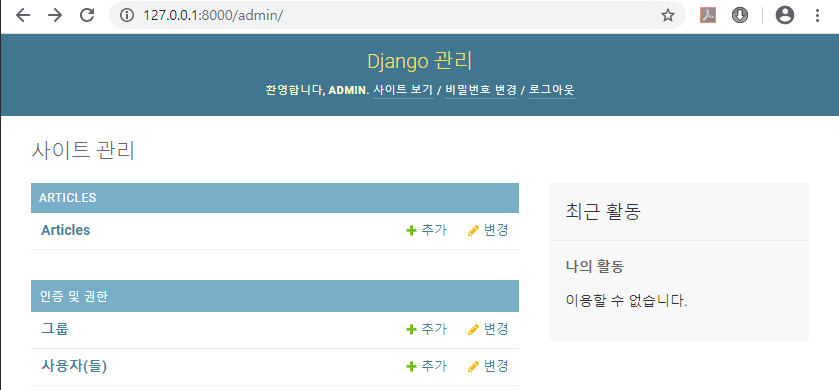

### index.html 초기화

```python
# articles > templates > articles > urls.py
from django.urls import path
from . import views

app_name = 'articles'

urlpatterns = [
    path('', views.index, name='index'),
]
```

```python
# articles > templates > articles > views.py
from django.shortcuts import render
from .models import Article

# Create your views here.
def index(request) :
    articles = Article.objects.all()
    context = {
        'articles':articles
    }
    return render(request, 'articles/index.html', context)
```

```html
<!-- articles > templates > articles > index.html -->




<h1>Article Index</h1>

<ul>
    
        <li>
            {{ article.title }}
        </li>
    
</ul>


```

- `admin` 페이지에서 글 하나를 작성하고 페이지를 열어보면 다음과 같이 나타난다.

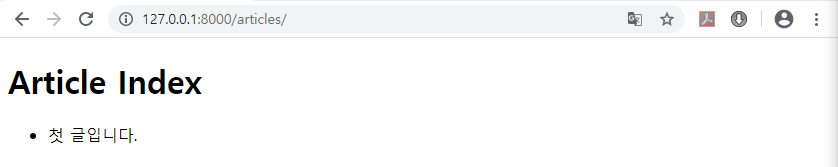

### new.html(새 글 작성) 페이지

```python
# articles > templates > articles > urls.py
from django.urls import path
from . import views

app_name = 'articles'

urlpatterns = [
    path('', views.index, name='index'),
    path('new/', views.new, name='new'),
]
```

```python
# articles > templates > articles > views.py
from django.shortcuts import render, redirect
from .models import Article

# ...

def new(request) :
    if request.method == 'POST' :
        # Database에 저장
        # 1. 요청에 실려온 data 꺼내오기
        title = request.POST.get('title')
        content = request.POST.get('content')
        # 2. Database에 저장
        article = Article(title=title, content=content)
        article.save()
        # 3. 저장된 data를 확인할 수 있는 곳으로 안내?
        return redirect('articles:index')
    else : # GET
        # 작성 양식 보여주기
        context = {

        }
        return render(request, 'articles/new.html', context)
```

```html
<!-- articles > templates > articles > new.html -->




<h1>Article New</h1>
<form action="" method="POST">
    
    <label for="title">제목</label>
    <input id="title" type="text" name='title'><br>
    <label for="content">내용</label>
    <textarea id="content" name="content" id="" cols="30" rows="10"></textarea><br>
    <input type="submit" value="제출">
</form>


```

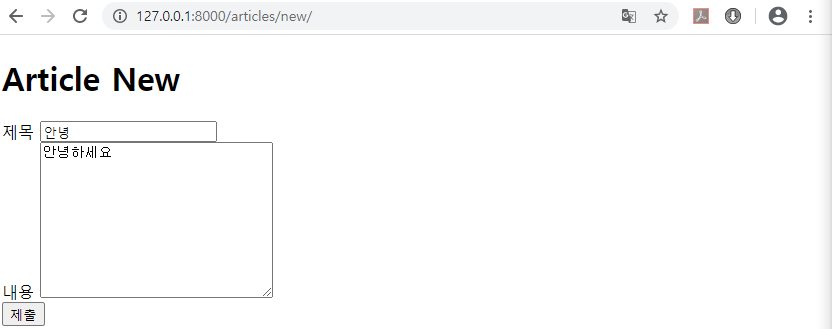

- `New` 버튼 생성

```html
<!-- articles > templates > articles > index.html -->




<h1>Article Index</h1>

<!-- 'New' 버튼 생성 -->
<a href="">New</a>

<ul>
    
        <li>
            {{ article.title }}
        </li>
    
</ul>


```

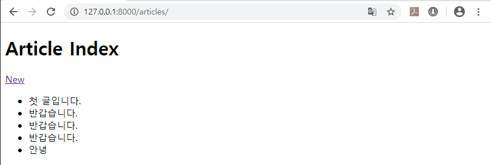

### detail.html(상세 페이지)

```python
# articles > templates > articles > urls.py
from django.urls import path
from . import views

app_name = 'articles'

urlpatterns = [
    path('', views.index, name='index'),
    path('new/', views.new, name='new'),
    path('<int:pk>/', views.detail, name='detail'),
]
```

```python
# articles > templates > articles > views.py
from django.shortcuts import render, redirect
from .models import Article

# ...

def detail(request, pk) :
    # Database에서 data 가져오기
    article = Article.objects.get(pk=pk)
    
    context = {
        'article':article,
    }
    return render(request, 'articles/detail.html', context)
```

```html
<!-- articles > templates > articles > detail.html -->




<h1>Article Detail</h1>

<p>PK : {{ article.pk }}</p>
<p>제목 : {{ article.title }}</p>
<p>내용 : {{ article.content }}</p>
<p>생성 시각 : {{ article.created_at }}</p>
<p>수정 시각 : {{ article.updated_at }}</p>


```

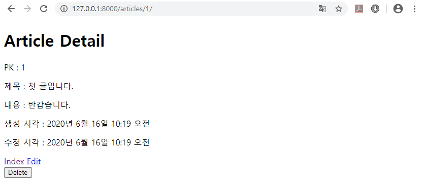

- `index` 페이지에서 게시글 상세 페이지로 바로 들어갈 수 있도록 `a`태그 생성

```html
<!-- articles > templates > articles > index.html -->




<h1>Article Index</h1>

<a href="">New</a>

<ul>
    
        <li>
            <!-- link를 위한 a태그 적용 -->
            <a href="">
                {{ article.title }}
            </a>
        </li>
    
</ul>


```

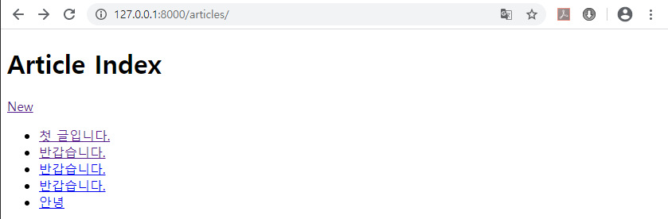

- 새글 작성 후, `detail` 페이지로 들어가고, 목록으로 돌아오기

```python
# articles > templates > articles > views.py
from django.shortcuts import render, redirect
from .models import Article

# ...

def new(request) :
    if request.method == 'POST' :
        # Database에 저장
        # 1. 요청에 실려온 data 꺼내오기
        title = request.POST.get('title')
        content = request.POST.get('content')
        # 2. Database에 저장
        article = Article(title=title, content=content)
        article.save()
        # 3. 저장된 data를 확인할 수 있는 곳으로 안내?
        ###### 변경 ######
        return redirect('articles:detail', article.pk)
    else : # GET
        # 작성 양식 보여주기
        context = {

        }
        return render(request, 'articles/new.html', context)

# ...
```

```html
<!-- articles > templates > articles > detail.html -->




<h1>Article Detail</h1>

<p>PK : {{ article.pk }}</p>
<p>제목 : {{ article.title }}</p>
<p>내용 : {{ article.content }}</p>
<p>생성 시각 : {{ article.created_at }}</p>
<p>수정 시각 : {{ article.updated_at }}</p>

<a href="">Index</a>

```

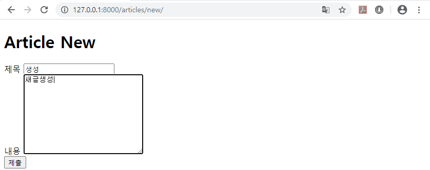

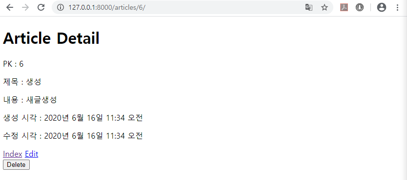

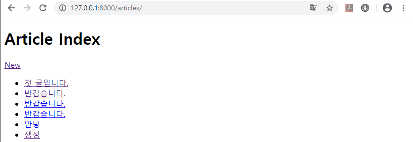

## Django Form Class 생성

```python
# articles > forms.py
from django import forms

class ArticleForm(forms.Form) :
    title = forms.CharField()
    content = forms.CharField()
```

```python
# articles > templates > articles > views.py
from django.shortcuts import render, redirect
from .models import Article
from .forms import ArticleForm ##### 추가 #####

# ...

def new(request) :
    if request.method == 'POST' :
        # Database에 저장
        # 1. 요청에 실려온 data 꺼내오기
        title = request.POST.get('title')
        content = request.POST.get('content')
        # 2. Database에 저장
        article = Article(title=title, content=content)
        article.save()
        # 3. 저장된 data를 확인할 수 있는 곳으로 안내?
        return redirect('articles:detail', article.pk)
    else : # GET
        # 작성 양식 보여주기
        form = ArticleForm() ##### 추가 #####
        context = {
            'form':form, #### 추가 ####
        }
        return render(request, 'articles/new.html', context)

# ...
```

```html
<!-- articles > templates > articles > new.html -->




<h1>Article New</h1>
<form action="" method="POST">
    
    {{ form }}
    <!-- <label for="title">제목</label>
    <input id="title" type="text" name='title'><br>
    <label for="content">내용</label>
    <textarea id="content" name="content" id="" cols="30" rows="10"></textarea><br> -->
    <input type="submit" value="제출">
</form>


```

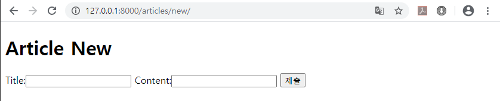

- Django에 의하여 형식 코드가 자동완성되었다.

  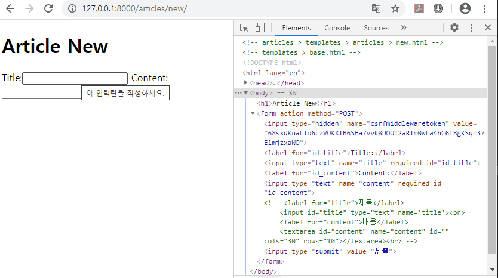

  - cf . `required`옵션이 있으므로 해서 `'이 입력란을 작성하세요.'`가 나타나게 된다.

```python
# articles > templates > articles > views.py
from django.shortcuts import render, redirect
from .models import Article
from .forms import ArticleForm

# ...

def new(request) :
    if request.method == 'POST' :
        # Database에 저장
        # 1. 요청에 실려온 data 꺼내오기
        # title = request.POST.get('title')
        # content = request.POST.get('content')
        form = ArticleForm(request.POST)
        
        # 2-1. data 유효성 검사
        if form.is_valid() :
            # 2-2. 검증된 data 꺼내오기
            title = form.cleaned_data.get('title')
            content = form.cleaned_data.get('content')
            # 2-3. Database에 저장
            article = Article(title=title, content=content)
            article.save()
            # 3. 저장된 data를 확인할 수 있는 곳으로 안내?
            return redirect('articles:detail', article.pk)
    else : # GET
        # 작성 양식 보여주기
        form = ArticleForm()
        context = {
            'form':form,
        }
        return render(request, 'articles/new.html', context)

# ...
```

- `forms.py`에 title의 `CharField` 옵션`'max_length=10'`을 주고

  ```python
  # articles > forms.py
  from django import forms
  
  class ArticleForm(forms.Form) :
      title = forms.CharField(max_length=10)
      content = forms.CharField()
  ```

  `views.py`의 `new` 함수를 다음과 같이 고치면

  ```python
  # articles > templates > articles > views.py
  from django.shortcuts import render, redirect
  from .models import Article
  from .forms import ArticleForm
  
  # ...
  
  def new(request) :
      if request.method == 'POST' :
          # Database에 저장
          # 1. 요청에 실려온 data 꺼내오기
          # title = request.POST.get('title')
          # content = request.POST.get('content')
          form = ArticleForm(request.POST)
          
          # 2-1. data 유효성 검사
          if form.is_valid() :
              # 2-2. 검증된 data 꺼내오기
              title = form.cleaned_data.get('title')
              content = form.cleaned_data.get('content')
              # 2-3. Database에 저장
              article = Article(title=title, content=content)
              article.save()
              # 3. 저장된 data를 확인할 수 있는 곳으로 안내?
              return redirect('articles:detail', article.pk)
      else : # GET
          # 작성 양식 보여주기
          form = ArticleForm()
      context = {
          'form':form,
      }
      return render(request, 'articles/new.html', context)
  ```

  `title`에 10자 이상 들어가지 않고, 들어갈 경우 Error 메세지를 발생 시킨다.

### forms 옵션 변경

```python
# articles > forms.py
from django import forms

class ArticleForm(forms.Form) :
    title = forms.CharField(
        max_length=10, 
        label='제목', 
        widget=forms.TextInput(
            attrs={
                'class':'title',
                'placeholder':'제목을 입력하세요.',
            }
        )
    )
    content = forms.CharField(
        label='내용',
        widget=forms.Textarea(
            attrs={
                'class':'content',
                'rows':5,
                'cols':20,
            }
        )
    )
```


- 더 다양한 옵션은 [Working with forms](https://docs.djangoproject.com/en/3.0/topics/forms/) 참조

###  Delete 기능 추가

```python
# articles > templates > articles > urls.py
from django.urls import path
from . import views

app_name = 'articles'

urlpatterns = [
    path('', views.index, name='index'),
    path('new/', views.new, name='new'),
    path('<int:pk>/', views.detail, name='detail'),
    path('<int:pk>/delete/', views.delete, name='delete'),
]
```

```python
# articles > templates > articles > views.py
from django.shortcuts import render, redirect
from .models import Article
from .forms import ArticleForm

# ...

def delete(request, pk) : # POST
    article = Article.objects.get(pk=pk)
    if request.method == 'POST' :
        article.delete()
    return redirect('articles:index')
```

```html
<!-- articles > templates > articles > detail.html -->




<h1>Article Detail</h1>

<p>PK : {{ article.pk }}</p>
<p>제목 : {{ article.title }}</p>
<p>내용 : {{ article.content }}</p>
<p>생성 시각 : {{ article.created_at }}</p>
<p>수정 시각 : {{ article.updated_at }}</p>

<a href="">Index</a>
<form action="" method="POST">
    
    <input type="submit" value="Delete">
</form>

```

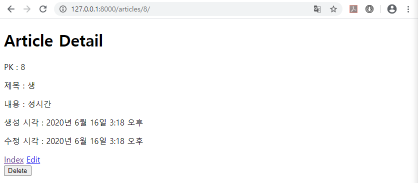

### edit.html(글 수정하기)

```python
# articles > templates > articles > urls.py
from django.urls import path
from . import views

app_name = 'articles'

urlpatterns = [
    path('', views.index, name='index'),
    path('new/', views.new, name='new'),
    path('<int:pk>/', views.detail, name='detail'),
    path('<int:pk>/delete/', views.delete, name='delete'),
    path('<int:pk>/edit/', views.edit, name='edit'),
]
```

```python
# articles > templates > articles > views.py
from django.shortcuts import render, redirect
from .models import Article
from .forms import ArticleForm

# ...

def edit(request, pk) :
    # 1. Database에서 data 가져오기
    article = Article.objects.get(pk=pk)
    
    if request.method == 'POST' :
        # data 수정
        
        # 2-1. form에 data 집어넣기(검증 목적)
        form = ArticleForm(request.POST)
        # 2-2. data 유효성 검사
        if form.is_valid() :
            # 2-3. 검증된 data를 반영하기
            article.title = form.cleaned_data.get('title')
            article.content = form.cleaned_data.get('content')
            article.save()
        # 3. 저장된 내용을 확인할 수 있는 페이지로 안내
        return redirect('articles:detail', article.pk)
    else :
        # 수정 양식 보여주기
        # 2. Form에 data 채워 넣기
        form = ArticleForm(initial=article.__dict__)
    context = {
        'form':form,
    }
    return render(request, 'articles/edit.html', context)
```

```html
<!-- articles > templates > articles > edit.html -->




<h1>Article Edit</h1>

<form action="" method="POST">
    
    {{ form }}
    <input type="submit">
</form>


```

- `Edit` 링크 생성

  ```html
  <!-- articles > templates > articles > detail.html -->
  
  
  
  
  <h1>Article Detail</h1>
  
  <p>PK : {{ article.pk }}</p>
  <p>제목 : {{ article.title }}</p>
  <p>내용 : {{ article.content }}</p>
  <p>생성 시각 : {{ article.created_at }}</p>
  <p>수정 시각 : {{ article.updated_at }}</p>
  
  <a href="">Index</a>
  <!-- Edit link 생성 -->
  <a href="">Edit</a>
  
  <form action="" method="POST">
      
      <input type="submit" value="Delete">
  </form>
  
  ```

## Django Form Class 다른 형태

```python
# articles > forms.py
from django import forms
from .models import Article

# 앞서 진행한 forms.py보다 향상된 기능
class ArticleForm(forms.ModelForm) :
    class Meta :
        model = Article
        fields = ('title', 'content',)
```

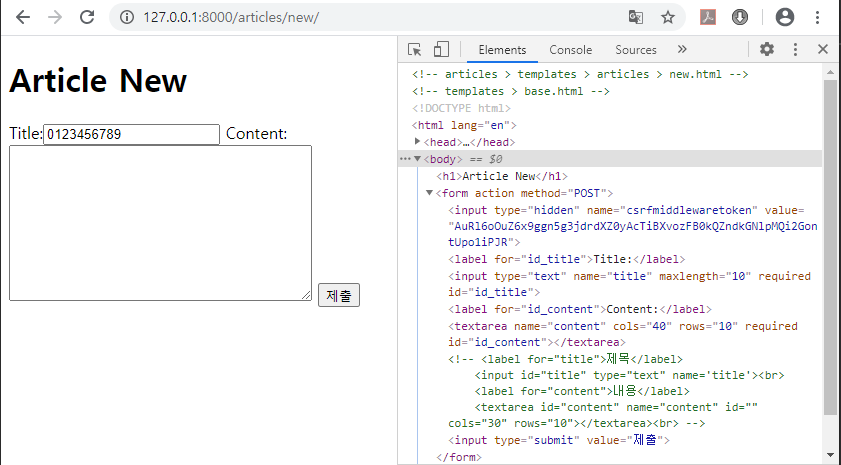

- form class 변경에 따른 변경

```python
# articles > templates > articles > views.py
from django.shortcuts import render, redirect
from .models import Article
from .forms import ArticleForm

# ...

def new(request) :
    if request.method == 'POST' :
        # Database에 저장
        # 1. 요청에 실려온 data 꺼내오기
        # title = request.POST.get('title')
        # content = request.POST.get('content')
        form = ArticleForm(request.POST)
        
        # 2-1. data 유효성 검사
        if form.is_valid() :
            # (ModelForm) 2-2. Database에 저장
            article = form.save()
            # # 2-2. 검증된 data 꺼내오기
            # title = form.cleaned_data.get('title')
            # content = form.cleaned_data.get('content')
            # # 2-3. Database에 저장
            # article = Article(title=title, content=content)
            # article.save()
            # 3. 저장된 data를 확인할 수 있는 곳으로 안내?
            return redirect('articles:detail', article.pk)
    else : # GET
        # 작성 양식 보여주기
        form = ArticleForm()
    context = {
        'form':form,
    }
    return render(request, 'articles/new.html', context)

# ...

def edit(request, pk) :
    # 1. Database에서 data 가져오기
    article = Article.objects.get(pk=pk)

    if request.method == 'POST' :
        # data 수정
        
        # (ModelForm) 2-1. form에 data 집어넣기 + instance와 연결
        form = ArticleForm(request.POST, instance=article)
        # # 2-1. form에 data 집어넣기(검증 목적)
        # form = ArticleForm(request.POST)
        # 2-2. data 유효성 검사
        if form.is_valid() :
            # (ModelForm) 2-3. Database에 저장
            article = form.save()
            # # 2-3. 검증된 data를 반영하기
            # article.title = form.cleaned_data.get('title')
            # article.content = form.cleaned_data.get('content')
            # article.save()
        # 3. 저장된 내용을 확인할 수 있는 페이지로 안내
        return redirect('articles:detail', article.pk)
    else :
        # 수정 양식 보여주기
        # (ModelForm) 2. Form에 data 채워 넣기
        form = ArticleForm(instance=article)
        # # 2. Form에 data 채워 넣기
        # form = ArticleForm(initial=article.__dict__)
    context = {
        'form':form,
    }
    return render(request, 'articles/edit.html', context)
```

```html
<!-- articles > templates > articles > edit.html -->




<h1>Article Edit</h1>

<form action="" method="POST">
    
    {{ form.non_field_errors }}
    <div>
        <!-- 1. label -->
        {{ form.title.label }}
        <!-- 2. input -->
        {{ form.title }}
        <!-- 3. error -->
        {{ form.title.errors}}
    </div>
    <div>
        <!-- 1. label -->
        {{ form.content.label }}
        <!-- 2. input -->
        {{ form.content }}
        <!-- 3. error -->
        {{ form.content.errors}}
    </div>
    
    <input type="submit">
</form>


```

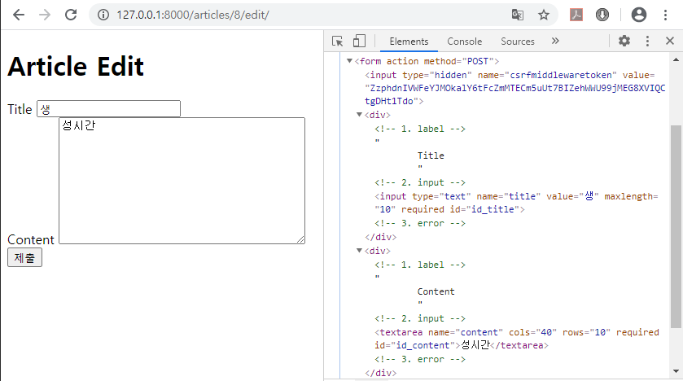