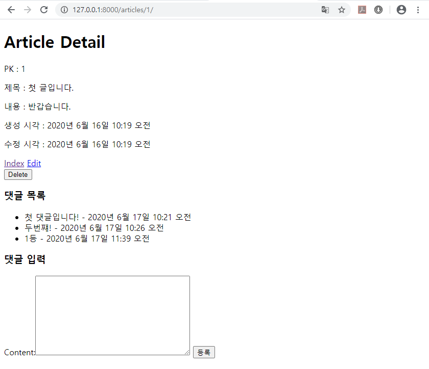
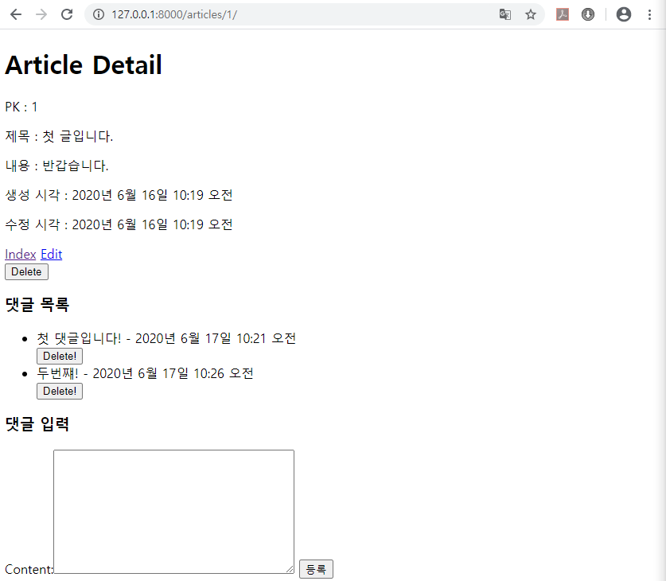
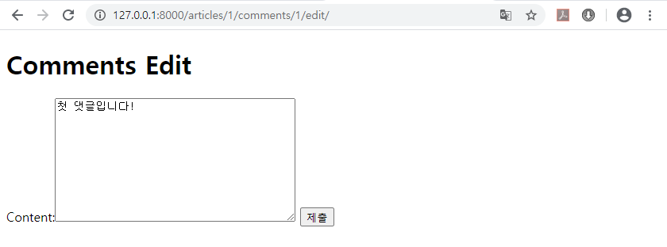
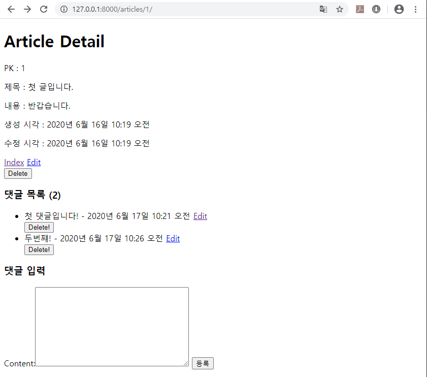
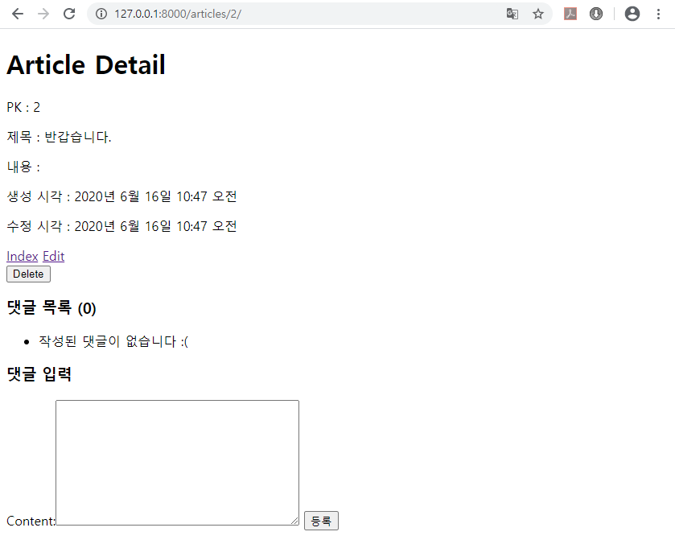

# Day09 종합프로젝트

# Django Class From

## 게시글 댓글 시스템

- Database 두 개 연결하기

### 게시글 댓글 저장을 위한 데이터베이스 만들기

```python
# articles > models.py
from django.db import models

# Create your models here.
class Article(models.Model) : 
    title = models.CharField(max_length=10)
    content = models.TextField()
    created_at = models.DateTimeField(auto_now_add=True)
    updated_at = models.DateTimeField(auto_now=True)

# 1:N Relation
# Article : Comment = 1 : N
# (부모) : (자식)
class Comment(models.Model) :
    content = models.TextField()
    created_at = models.DateTimeField(auto_now_add=True)
    updated_at = models.DateTimeField(auto_now=True)
    article = models.ForeignKey(Article, on_delete=models.CASCADE)
```

- 1:N Relation

  - Article : Comment  = 1: N
  - (부모) : (자식)

- `Comment`의 `article` : 어떤 게시글과 연결되는지 저장되는 변수

  - `on_delete` 옵션 : 연결된 게시글이 삭제되었을 때, 처리 방법

    1. `CASCADE` - 부모가 삭제되면, 자식도 삭제됨
    2. `PROTECT` - 자식이 있으면, 부모 삭제 불가
    3. `SET_NULL` - 부모가 삭제되면, 자식의 `ForeignKey`에 `null` 할당
    4. `SET_DEFAULT` - 부모가 삭제되면, 자식의 `ForeignKey`에 `default 값` 할당
    5. `DO_NOTHING` - 아무것도 하지 않음 (특이한 경우 아니면 사용 X)

    - => Database에서 삭제하기 힘드므로, 보통 `SET_NULL` 사용

- Database에 설계도 할당 및 생성

  ```
  python manage.py makemigrations
  python manage.py migrate
  ```

### python shell에서의 사용 방법

1. Create

   ```python
   article = Article.objects.get(pk=1)
   comment = Comment()
   # (or comment = Comment(content='댓글', article_id=1))
   comment.content = '첫 댓글입니다!'
   comment.article = article
   # (or comment.article_id = 1)
   comment.save()
   ```

2. Read

   1. 부모로 부터 자식들 가져오기

      ```python
      article = Article.objects.get(pk=1)
      comments = article.comment_set.all()
      ```

   2. 자식 테이블에서 조건으로 가져오기

      ```python
      article = Article.objects.get(pk=1)
      comments = Comment.objects.filter(article=article)
      # (or .filter(article_id=1))
      ```

3. 자식으로 부모 부르기(N에서 1 불러오기)

   ```python
   comment = Comment.objects.get(pk=1)
   article = comment.article
   article.title # 첫 글입니다.
   article.content # 반갑습니다.
   ```

### 게시글 Database 사이트에서 관리하기

```python
# articles > admin.py
from django.contrib import admin
from .models import Article, Comment

# Register your models here.
class ArticleAdmin(admin.ModelAdmin) :
    list_display = ('pk', 'title', 'created_at', 'updated_at')

class CommentAdmin(admin.ModelAdmin) :
    list_display = ('pk', 'content')

admin.site.register(Article, ArticleAdmin)
admin.site.register(Comment, CommentAdmin)
```

### 댓글 입력 창 만들기

- Class Form 생성

```python
# articles > forms.py
from django import forms
from .models import Article, Comment

# 앞서 진행한 forms.py보다 향상된 기능
class ArticleForm(forms.ModelForm) :
    class Meta :
        model = Article
        fields = ('title', 'content',)

class CommentForm(forms.ModelForm) : ##### 추가 #####
    class Meta :
        model = Comment
        fields = ('content',)
```

- detail 관련 파일에 입력 창 만들기

```python
# articles > templates > articles > urls.py
from django.urls import path
from . import views

app_name = 'articles'

urlpatterns = [
    path('', views.index, name='index'),
    path('new/', views.new, name='new'),
    path('<int:pk>/', views.detail, name='detail'),
    path('<int:pk>/delete/', views.delete, name='delete'),
    path('<int:pk>/edit/', views.edit, name='edit'),
    path('<int:article_pk>/comments/new/', views.comments_new, name='comments_new'), ##### 추가 #####
]
```

```python
# articles > templates > articles > views.py
from django.shortcuts import render, redirect
from .models import Article
from .forms import ArticleForm, CommentForm

# ...
def detail(request, pk) :
    # Database에서 data 가져오기
    article = Article.objects.get(pk=pk)
    
    # 댓글 작성 양식 가져오기
    comment_form = CommentForm() ##### 추가 #####

    context = {
        'article':article,
        'comment_form':comment_form, ##### 추가 #####
    }
    return render(request, 'articles/detail.html', context)

# ...

def comments_new(request, article_pk) : ##### 추가 #####
    # 1. 요청이 POST인지 점검
    if request.method == 'POST' :
        # 2. form에 data를 집어넣기 (목적 : 유효성 검사)
        form = CommentForm(request.POST)
        # 3. 유효성 검사를 시행
        if form.is_valid() :
            # 4. 통과하면 Database에 저장(?)
            comment = form.save(commit=False)
            # 4-1. article 정보 주입
            comment.article_id = article_pk
            comment.save()
    # 5. 생성된 댓글을 확인 할 수 있는 곳으로 안내
    return redirect('articles:detail', article_pk)
```

```html
<!-- articles > templates > articles > detail.html -->




<h1>Article Detail</h1>

<p>PK : {{ article.pk }}</p>
<p>제목 : {{ article.title }}</p>
<p>내용 : {{ article.content }}</p>
<p>생성 시각 : {{ article.created_at }}</p>
<p>수정 시각 : {{ article.updated_at }}</p>

<a href="">Index</a>
<a href="">Edit</a>

<form action="" method="POST">
    
    <input type="submit" value="Delete">
</form>

<!-- 댓글 목록 -->

<!-- 댓글 입력창 -->
<h3>댓글 입력</h3>
<form action="" method="POST">
    
    {{ comment_form }}
    <input type="submit" value="등록">
</form>


```

### 댓글 목록 보이기

```html
<!-- articles > templates > articles > detail.html -->




<h1>Article Detail</h1>

<p>PK : {{ article.pk }}</p>
<p>제목 : {{ article.title }}</p>
<p>내용 : {{ article.content }}</p>
<p>생성 시각 : {{ article.created_at }}</p>
<p>수정 시각 : {{ article.updated_at }}</p>

<a href="">Index</a>
<a href="">Edit</a>

<form action="" method="POST">
    
    <input type="submit" value="Delete">
</form>

<!-- 댓글 목록 -->
<h3>댓글 목록</h3>
<ul>
    
    <li>
        {{ comment.content }} - {{ comment.created_at }}
    </li>
    
</ul>


<!-- 댓글 입력창 -->
<h3>댓글 입력</h3>
<form action="" method="POST">
    
    {{ comment_form }}
    <input type="submit" value="등록">
</form>


```



### 댓글 삭제하기

```python
# articles > templates > articles > urls.py
from django.urls import path
from . import views

app_name = 'articles'

urlpatterns = [
    path('', views.index, name='index'),
    path('new/', views.new, name='new'),
    path('<int:pk>/', views.detail, name='detail'),
    path('<int:pk>/delete/', views.delete, name='delete'),
    path('<int:pk>/edit/', views.edit, name='edit'),
    path('<int:article_pk>/comments/new/', views.comments_new, name='comments_new'),
    path('<int:article_pk>/comments/<int:pk>/delete/', views.comments_delete, name='comments_delete'), ##### 추가 #####
]
```

```python
# articles > templates > articles > views.py
from django.shortcuts import render, redirect
from .models import Article, Comment
from .forms import ArticleForm, CommentForm

# ...

def comments_delete(request, article_pk, pk) : # POST
    # 0. 요청이 POST인지 점검
    if request.method == 'POST' :
        # 1. pk를 가지고 삭제하려는 data 꺼내오기
        comment = Comment.objects.get(pk=pk)
        # 2. 삭제
        comment.delete()
    # 3. 삭제되었는지 확인 가능한 곳으로 안내
    return redirect('articles:detail', article_pk)
```

```html
<!-- articles > templates > articles > detail.html -->




<h1>Article Detail</h1>

<p>PK : {{ article.pk }}</p>
<p>제목 : {{ article.title }}</p>
<p>내용 : {{ article.content }}</p>
<p>생성 시각 : {{ article.created_at }}</p>
<p>수정 시각 : {{ article.updated_at }}</p>

<a href="">Index</a>
<a href="">Edit</a>

<form action="" method="POST">
    
    <input type="submit" value="Delete">
</form>

<!-- 댓글 목록 -->
<h3>댓글 목록</h3>
<ul>
    
    <li>
        {{ comment.content }} - {{ comment.created_at }}
        <!-- 댓글 삭제 -->
        <form action="" method="POST">
            
            <input type="submit" value="Delete!">
        </form>
    </li>
    
</ul>


<!-- 댓글 입력창 -->
<h3>댓글 입력</h3>
<form action="" method="POST">
    
    {{ comment_form }}
    <input type="submit" value="등록">
</form>


```



### 댓글 수정하기

```python
# articles > templates > articles > urls.py
from django.urls import path
from . import views

app_name = 'articles'

urlpatterns = [
    path('', views.index, name='index'),
    path('new/', views.new, name='new'),
    path('<int:pk>/', views.detail, name='detail'),
    path('<int:pk>/delete/', views.delete, name='delete'),
    path('<int:pk>/edit/', views.edit, name='edit'),
    path('<int:article_pk>/comments/new/', views.comments_new, name='comments_new'),
    path('<int:article_pk>/comments/<int:pk>/delete/', views.comments_delete, name='comments_delete'),
    path('<int:article_pk>/comments/<int:pk>/edit/', views.comments_edit, name='comments_edit') ##### 추가 #####
]
```

```python
# articles > templates > articles > views.py
from django.shortcuts import render, redirect
from .models import Article, Comment
from .forms import ArticleForm, CommentForm

# ...

def comments_edit(request, article_pk, pk) : # GET, POST
    # Database에서 수정하려 하는 data 가져오기
    comment = Comment.objects.get(pk=pk)
    # 0. 요청 종류가 POST인지 GET인지 점검
    if request.method == 'POST' :
        # 실제로 수정!
        # 1. form에 '넘어온 data' & '수정하려는 data' 집어넣기
        form = CommentForm(request.POST, instance=comment)
        # 2. 유효성 검사
        if form.is_valid() :
            # 3. 검사를 통과했다면, save
            comment = form.save()
            # 4. 변경된 결과 확인하는 곳으로 안내
            return redirect('articles:detail', article_pk)
    else : 
        # 수정 양식 보여주기!
        # 1. form class 초기화(생성) & 내용 채우기
        form = CommentForm(instance=comment)

    context = {
        'form':form,
    }
    return render(request, 'articles/comments_edit.html', context)
```

```html
<!-- articles > templates > articles > comments_edit.html -->




<h1>Comments Edit</h1>

<form action="" method="POST">
    
    {{ form }}
    <input type="submit">
</form>


```



- 수정 버튼 만들기

```html
<!-- articles > templates > articles > detail.html -->




<h1>Article Detail</h1>

<p>PK : {{ article.pk }}</p>
<p>제목 : {{ article.title }}</p>
<p>내용 : {{ article.content }}</p>
<p>생성 시각 : {{ article.created_at }}</p>
<p>수정 시각 : {{ article.updated_at }}</p>

<a href="">Index</a>
<a href="">Edit</a>

<form action="" method="POST">
    
    <input type="submit" value="Delete">
</form>

<!-- 댓글 목록 -->
<!-- 댓글 갯수 볼 수 있게 추가 : Django-->
<h3>댓글 목록 ({{ article.comment_set.all|length }})</h3>
<!-- or <h3>댓글 목록 ({{ article.comment_set.all.count }})</h3> : Database-->

<ul>
    
    <li>
        {{ comment.content }} - {{ comment.created_at }}
        <!-- 수정 버튼 생성 -->
        <a href="">Edit</a>
        <form action="" method="POST">
            
            <input type="submit" value="Delete!">
        </form>
    <!-- 댓글이 없을 경우 출력문 설정 -->
    
    <li>
        작성된 댓글이 없습니다 :(
    </li>
    </li>
    
</ul>
```



