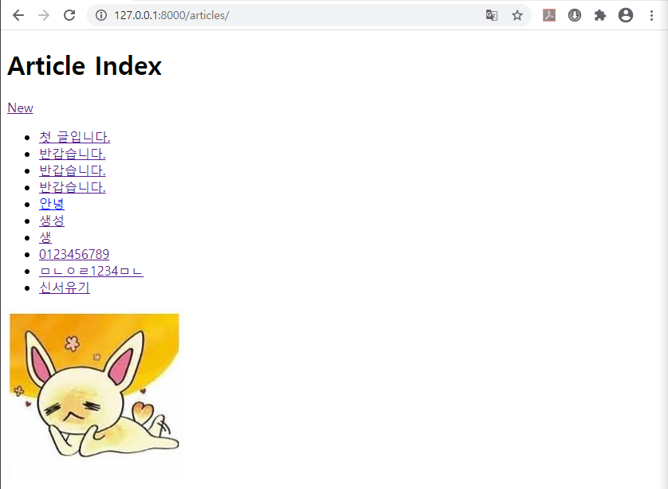
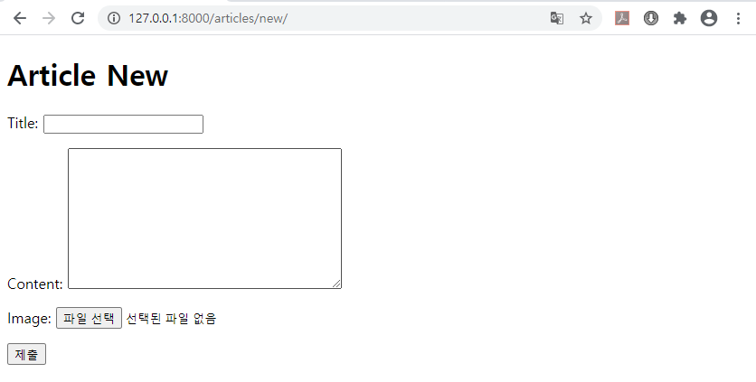
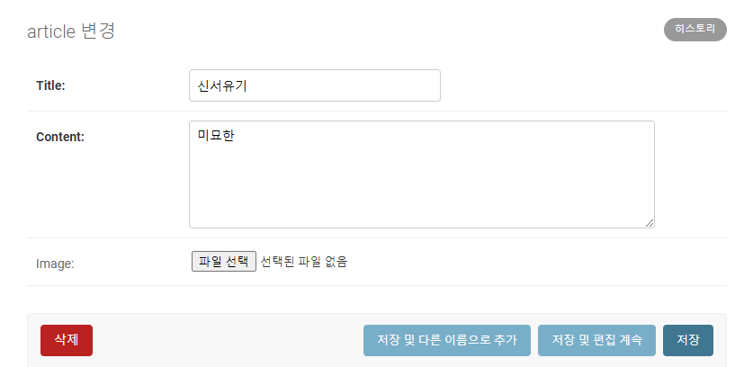
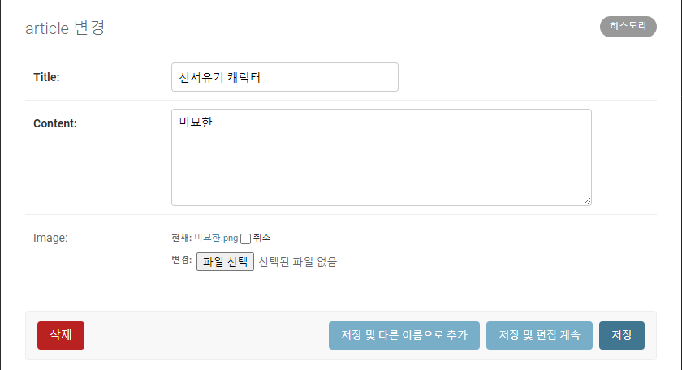
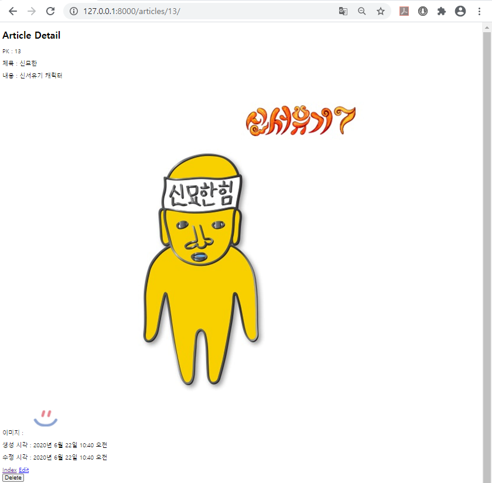
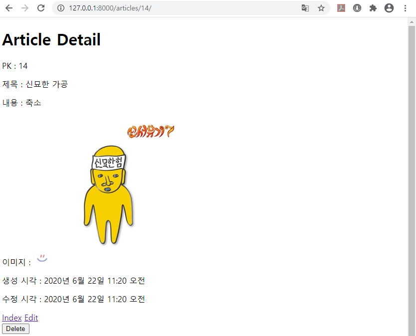

# Day11 종합프로젝트


## 이미지 출력하기

- Static vs. Media

### Static

- `articles`에  `static` 폴더를 생성하여 원하는 이미지를 저장한 후,

```html
<!-- articles > templates > articles > index.html -->


<!-- static 키워드 불러오기 -->




<h1>Article Index</h1>

<a href="">New</a>

<ul>
    
        <li>
            <!-- link를 위한 a태그 적용 -->
            <a href="">
                {{ article.title }}
            </a>
        </li>
    
</ul>

<!-- 이미지 불러오기 -->



```



### 사용자에게 이미지 받기

- 먼저 이미지를 저장할 수 있도록 Database 변경

```python
# articles > models.py
from django.db import models

# Create your models here.
class Article(models.Model) :
    title = models.CharField(max_length=10)
    content = models.TextField()
    image = models.ImageField(blank=True) ##### 추가 #####
    # blank=Treu : None(null) vs 0, '' 중 0, ''를 의미
    created_at = models.DateTimeField(auto_now_add=True)
    updated_at = models.DateTimeField(auto_now=True)

# ... 후략 ....
```

- `pip install Pillow`로 설치 필요(이미지 필드를 사용하기 위해)

```
pip install Pillow
python manage.py makemigrations
python manage.py migrate
```

- 이미지를 입력 받기 위한 형식 만들기

  ```python
  # articles > forms.py
  from django import forms
  from .models import Article, Comment
  
  # 앞서 진행한 forms.py보다 향상된 기능
  class ArticleForm(forms.ModelForm) :
      class Meta :
          model = Article
          fields = ('title', 'content', 'image',)
   
  # ... 후략 ...
  ```

- form를 불러오는 형식 바꾸기

  ```html
  <!-- articles > templates > articles > new.html -->
  
  
  
  
  <h1>Article New</h1>
  <form action="" method="POST">
      
      {{ form.as_p }} <!-- 변경 -->
      <!-- <label for="title">제목</label>
      <input id="title" type="text" name='title'><br>
      <label for="content">내용</label>
      <textarea id="content" name="content" id="" cols="30" rows="10"></textarea><br> -->
      <input type="submit" value="제출">
  </form>
  
  
  ```

  

  - 이 상태로는 Database에 이미지가 저장 되지 않음

    

- 제대로 이미지 입력받기

  ```python
  # articles > templates > articles > views.py
  from django.shortcuts import render, redirect
  from .models import Article, Comment
  from .forms import ArticleForm, CommentForm
  
  # Create your views here.
  def index(request) :
      articles = Article.objects.all()
      context = {
          'articles':articles
      }
      return render(request, 'articles/index.html', context)
  
  def new(request) :
      if request.method == 'POST' :
          # Database에 저장
          # 1. 요청에 실려온 data 꺼내오기
          # title = request.POST.get('title')
          # content = request.POST.get('content')
          # image = request.FILES.get('image')
          form = ArticleForm(request.POST, request.FILES)
  
  # ... 후략 ...
  ```

  ```html
  <!-- articles > templates > articles > new.html -->
  
  
  
  
  <h1>Article New</h1>
  <form action="" method="POST" enctype="multipart/form-data"> <!-- 변경 -->
      
      {{ form.as_p }} <!-- 변경 -->
      <!-- <label for="title">제목</label>
      <input id="title" type="text" name='title'><br>
      <label for="content">내용</label>
      <textarea id="content" name="content" id="" cols="30" rows="10"></textarea><br> -->
      <input type="submit" value="제출">
  </form>
  
  
  ```

  

  - 이미지 저장되는 위치가 이상함

- 이미지 업로드 위치 지정하기

  ```python
  # formclass > settings.py
  
  # ... 전략 ...
  
  STATIC_URL = '/static/'
  
  # Media files
  # 1. 업로드 되는 이미지 파일 위치를 정하는 설정
  MEDIA_ROOT = os.path.join(BASE_DIR, 'media')
  # 2. 업로드 된 이미지의 주소를 생성하는 설정
  MEDIA_URL = '/media/' # 아무거나 해도 됨 
  # 3. urls.py에 동적정의 필요
  ```

  ```python
  # formclass > urls.py
  from django.contrib import admin
  from django.urls import path, include
  from django.conf import settings
  from django.conf.urls.static import static
  
  urlpatterns = [
      path('admin/', admin.site.urls),
      path('articles/', include('articles.urls'))
  ]
  
  urlpatterns += static(settings.MEDIA_URL, document_root=settings.MEDIA_ROOT)
  ```

  ```html
  <!-- articles > templates > articles > detail.html -->
  
  
  
  
  <h1>Article Detail</h1>
  
  <p>PK : {{ article.pk }}</p>
  <p>제목 : {{ article.title }}</p>
  <p>내용 : {{ article.content }}</p>
  <p>
      이미지 :  <!-- 이미지 출력 코드 추가 -->
  </p>
  <p>생성 시각 : {{ article.created_at }}</p>
  <p>수정 시각 : {{ article.updated_at }}</p>
  
  <!-- ... 후략 ... -->
  ```

  

- 이미지가 존재하지 않는 경우 보이지 않는 조건문 추가 -> 조건문을 주지 않으면 오류 발생

  ```html
  <!-- articles > templates > articles > detail.html -->
  
  
  
  
  <h1>Article Detail</h1>
  
  <p>PK : {{ article.pk }}</p>
  <p>제목 : {{ article.title }}</p>
  <p>내용 : {{ article.content }}</p>
  
  <p>
      이미지 : 
  </p>
  
  <p>생성 시각 : {{ article.created_at }}</p>
  <p>수정 시각 : {{ article.updated_at }}</p>
  
  <!-- ... 후략 ... -->
  ```

### 이미지 가공

```
pip install pilkit django-imagekit
```

```python
# formclass > settings.py

# ... 전략 ....

# Application definition

INSTALLED_APPS = [
    'articles',
    'django.contrib.admin',
    'django.contrib.auth',
    'django.contrib.contenttypes',
    'django.contrib.sessions',
    'django.contrib.messages',
    'django.contrib.staticfiles',
    'imagekit', 
]

# ... 후략 ...
```

```python
# articles > models.py
from django.db import models
from imagekit.models import ProcessedImageField
from imagekit.processors import Thumbnail

# Create your models here.
class Article(models.Model) :
    title = models.CharField(max_length=10)
    content = models.TextField()
    # image = models.ImageField(blank=True)
    image = ProcessedImageField(
        blank=True,
        processors=[ # 어떤 가공을 할지
            Thumbnail(300, 300),
        ], 
        format='JPEG', # 이미지 포맷(jpeg, png)
        options={ # 이미지 포맷 관련 옵션
            'quality':90,
        } 
        )
    created_at = models.DateTimeField(auto_now_add=True)
    updated_at = models.DateTimeField(auto_now=True)

# ... 후략 ...
```

```
python manage.py makemigrations
python manage.py migrate
```



- 이미지를 업로드 할 때 가공되는 것이기 때문에, 기존에 저장된 이미지에는 적용되지 않는다.

## Django Fixtures

1. dump data

   ```
   python manage.py dumpdata articles.article --indent=2 > article.json
   ```

   - articles : app 이름
   - article : class 이름

2. loaddata

   ```
   python manage.py loaddata article.json
   ```

3. csv to fixtures
   - [강사님 코드](https://hpy.hk/c2f)

