# Day12 종합프로젝트

# Authentication (인증) - 회원가입, 로그인, 로그아웃

## 회원가입 & 로그인 기능

- `article`과 다른 app을 만들어서 회원가입 & 로그인 기능 추가

### 사전작업

```
python manage.py startapp accounts
```

```python
# formcalss > settings.py

# ... 전략 ...

INSTALLED_APPS = [
    'accounts',
    'articles',
    'django.contrib.admin',
    'django.contrib.auth',
    'django.contrib.contenttypes',
    'django.contrib.sessions',
    'django.contrib.messages',
    'django.contrib.staticfiles',
    'imagekit', 
]

# ... 후략 ....
```

```python
# accounts > urls.py
from django.urls import path
from . import views

urlpatterns = [

]
```

```python
# formclass > urls.py
from django.contrib import admin
from django.urls import path, include
from django.conf import settings
from django.conf.urls.static import static

urlpatterns = [
    path('admin/', admin.site.urls),
    path('articles/', include('articles.urls')),
    path('accounts/', include('accounts.urls'))
]

urlpatterns += static(settings.MEDIA_URL, document_root=settings.MEDIA_ROOT)
```

### 회원가입

- Django 내부에 있는 `UserCreationForm`을 가져와서 사용한다.

```python
# accounts > urls.py
from django.urls import path
from . import views

urlpatterns = [
    path('signup/', views.signup, name='signup'),
]
```

```python
# accounts > views.py
from django.shortcuts import render, redirect
from django.contrib.auth.forms import UserCreationForm

# Create your views here.
def signup(request):
    if request.method == 'POST':
        # User 생성
        # 1. POST로 넘어온 데이터 form에 넣기
        form = UserCreationForm(request.POST)
        # 2. form에서 유효성 검사
        if form.is_valid():
            # 3. 유효하다면 database에 저장
            user = form.save()
            # 4. 저장 결과 확인이 가능한 페이지로 안내
            return redirect('articles:index')
    else:
        # User 생성 양식 보여주기
        form = UserCreationForm()
    context = {
        'form':form,
    }
    return render(request, 'accounts/signup.html', context)
```

```html
<!-- accounts > templates > accounts > signup.html -->




<h1>Sign Up</h1>

<form action="" method="POST">
    
    <!-- as_p : 각 form을 p태그로 감싸서 
        한줄씩 출력되도록 해줌 -->
    {{ form.as_p }}
    <input type="submit" value="Sign up">
</form>


```

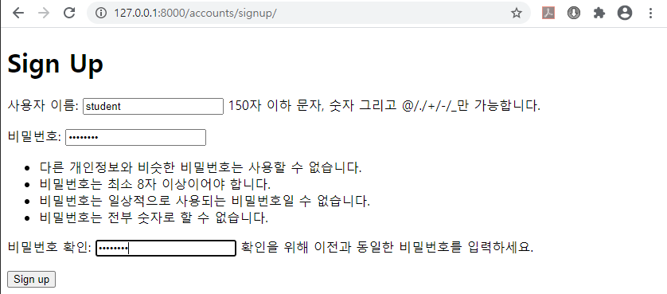

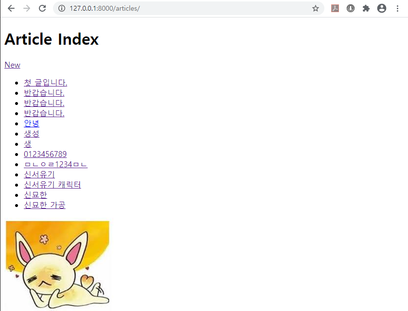

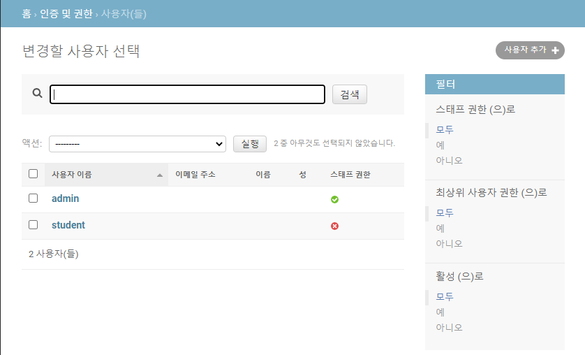

### 로그인

```python
# accounts > urls.py
from django.urls import path
from . import views

app_name = 'accounts'

urlpatterns = [
    path('signup/', views.signup, name='signup'), # User Create
    path('login/', views.login, name='login'), # Session Create
]
```

```python
# accounts > views.py
from django.shortcuts import render, redirect
from django.contrib.auth.forms import UserCreationForm, AuthenticationForm
from django.contrib.auth import login as auth_login

# ... 중략 ...

def login(request):
    if request.method == 'POST':
        # User 검증 + 로그인
        # 1. POST로 넘어온 데이터 form에 넣기
        form = AuthenticationForm(request, request.POST)
        # 2. form 검증 (아이디, 비밀번호 맞음?)
        if form.is_valid():
            # 3. 맞으면, 로그인 시켜줌
            user = form.get_user()
            auth_login(request, user)
        # 4. 로그인 결과 확인이 가능한 페이지로 안내
        return redirect('articles:index')
    else:
        # User 로그인 창 보여주기
        form = AuthenticationForm()
    context = {
        'form':form,
    }
    return render(request, 'accounts/login.html', context)
```

```html
<!-- accounts > templates > accounts > login.html -->




<h1>Login</h1>

<form action="" method="POST">
    
    {{ form.as_p }}
    <input type="submit" value="Login">
</form>


```

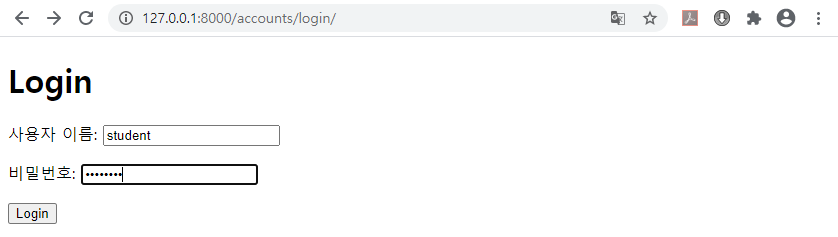


### 로그인 확인하기

```html
<!-- templates > base.html -->
<!DOCTYPE html>
<html lang="en">
<head>
    <meta charset="UTF-8">
    <meta name="viewport" content="width=device-width, initial-scale=1.0">
    <title>Document</title>
</head>
<body>
    <!-- 추가 -->
    <nav>
        <span>{{ user.username }}</span>
    </nav>
    
    
    
</body>
</html>
```

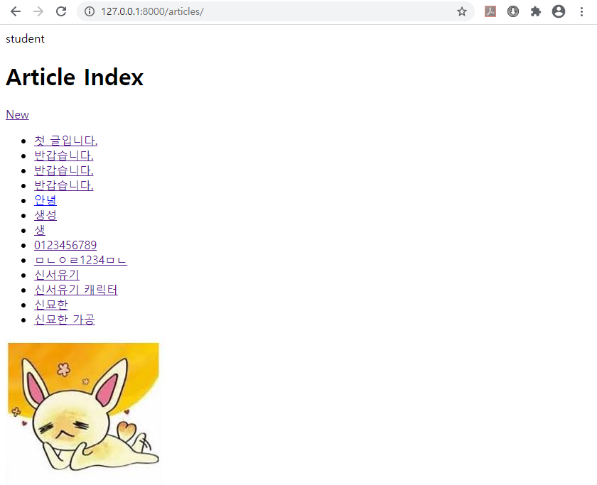

### 로그아웃

```python
# accounts > urls.py
from django.urls import path
from . import views

app_name = 'accounts'

urlpatterns = [
    path('signup/', views.signup, name='signup'), # User Create
    path('login/', views.login, name='login'), # Session Create
    path('logout/', views.logout, name='logout'),
]
```

```python
# accounts > views.py
from django.shortcuts import render, redirect
from django.contrib.auth.forms import UserCreationForm, AuthenticationForm
from django.contrib.auth import login as auth_login, logout as auth_logout

# ... 중략 ...

def logout(request): # POST
    if request.method == 'POST':
        # Logout!
        auth_logout(request)
    return redirect('articles:index')
```

```html
<!-- templates > base.html -->
<!DOCTYPE html>
<html lang="en">
<head>
    <meta charset="UTF-8">
    <meta name="viewport" content="width=device-width, initial-scale=1.0">
    <title>Document</title>
</head>
<body>
    <nav>
        <span>{{ user.username }}</span>
        <form action="" method="POST">
            
            <input type="submit" value="Logout!">
        </form>
    </nav>
    
    
    
</body>
</html>
```

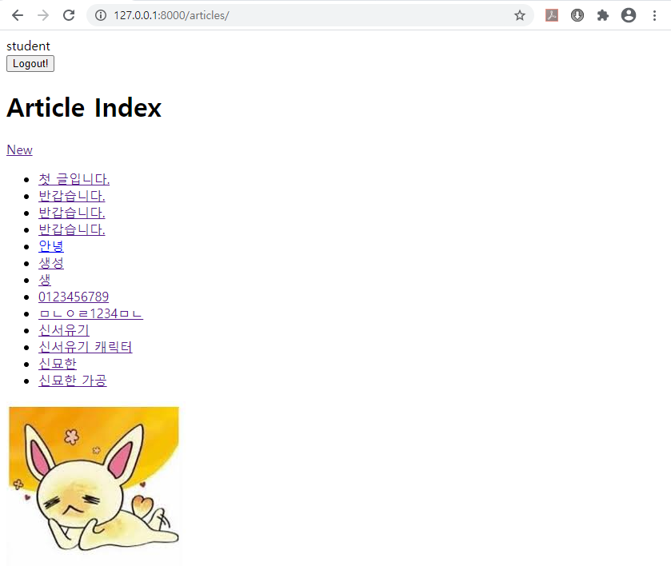

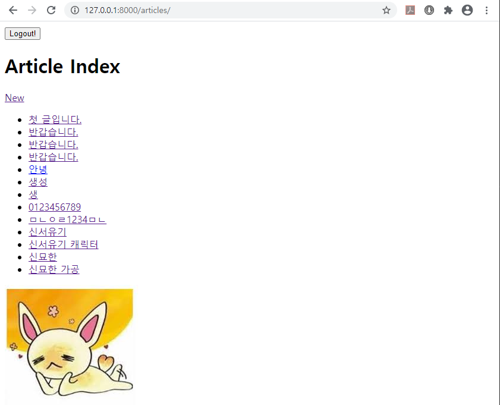

### 상황에 따라 버튼 바꾸기

```html
<!-- templates > base.html -->
<!DOCTYPE html>
<html lang="en">
<head>
    <meta charset="UTF-8">
    <meta name="viewport" content="width=device-width, initial-scale=1.0">
    <title>Document</title>
</head>
<body>
    <nav>
        
        <span>{{ user.username }}</span>
        <form action="" method="POST">
            
            <input type="submit" value="Logout!">
        </form>
        
        <a href="">Login</a>
        <a href="">Sign Up</a>
        
    </nav>
    
    
    
</body>
</html>
```

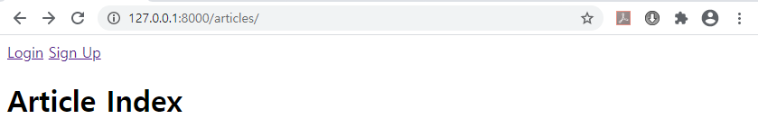

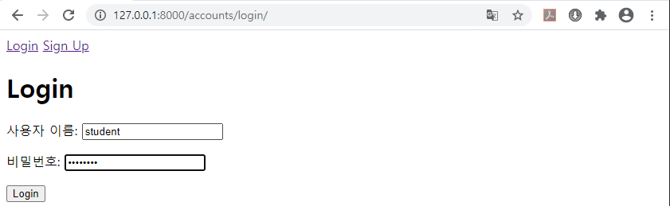

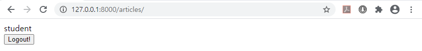

- 사용자가 주소창을 통해 들어갈 수 없도록 제한 걸기

```python
# accounts > views.py
from django.shortcuts import render, redirect
from django.contrib.auth.forms import UserCreationForm, AuthenticationForm
from django.contrib.auth import login as auth_login, logout as auth_logout

# Create your views here.
def signup(request):
    ##### 추가 ####
    # 만약, 로그인이 되었다면 index로 돌려 보내기
    if request.user.is_authenticated: ##### 추가 ####
        return redirect('articles:index')
    ###############
    if request.method == 'POST':
        # User 생성
        # 1. POST로 넘어온 데이터 form에 넣기
        form = UserCreationForm(request.POST)
        # 2. form에서 유효성 검사
        if form.is_valid():
            # 3. 유효하다면 database에 저장
            user = form.save()
            # 4. 저장 결과 확인이 가능한 페이지로 안내
            return redirect('articles:index')
    else:
        # User 생성 양식 보여주기
        form = UserCreationForm()
    context = {
        'form':form,
    }
    return render(request, 'accounts/signup.html', context)

def login(request):
    ##### 추가 ####
    # 만약, 로그인이 되었다면 index로 돌려 보내기
    if request.user.is_authenticated:
        return redirect('articles:index')
    ###############
    if request.method == 'POST':
        # User 검증 + 로그인
        # 1. POST로 넘어온 데이터 form에 넣기
        form = AuthenticationForm(request, request.POST)
        # 2. form 검증 (아이디, 비밀번호 맞음?)
        if form.is_valid():
            # 3. 맞으면, 로그인 시켜줌
            user = form.get_user()
            auth_login(request, user)
        # 4. 로그인 결과 확인이 가능한 페이지로 안내
        return redirect('articles:index')
    else:
        # User 로그인 창 보여주기
        form = AuthenticationForm()
    context = {
        'form':form,
    }
    return render(request, 'accounts/login.html', context)

def logout(request): # POST
    if request.method == 'POST':
        # Logout!
        auth_logout(request)
    return redirect('articles:index')
```

### 회원가입 후 바로 로그인 되도록

```python
# accounts > views.py
from django.shortcuts import render, redirect
from django.contrib.auth.forms import UserCreationForm, AuthenticationForm
from django.contrib.auth import login as auth_login, logout as auth_logout

# Create your views here.
def signup(request):
    # 만약, 로그인이 되었다면 index로 돌려 보내기
    if request.user.is_authenticated:
        return redirect('articles:index')
    if request.method == 'POST':
        # User 생성
        # 1. POST로 넘어온 데이터 form에 넣기
        form = UserCreationForm(request.POST)
        # 2. form에서 유효성 검사
        if form.is_valid():
            # 3. 유효하다면 database에 저장
            user = form.save()
            # 3-1. 저장했다면, 해당 User로 로그인!
            auth_login(request, user) ##### 추가 #####
            # 4. 저장 결과 확인이 가능한 페이지로 안내
            return redirect('articles:index')
    else:
        # User 생성 양식 보여주기
        form = UserCreationForm()
    context = {
        'form':form,
    }
    return render(request, 'accounts/signup.html', context)

# ... 후략 ....
```

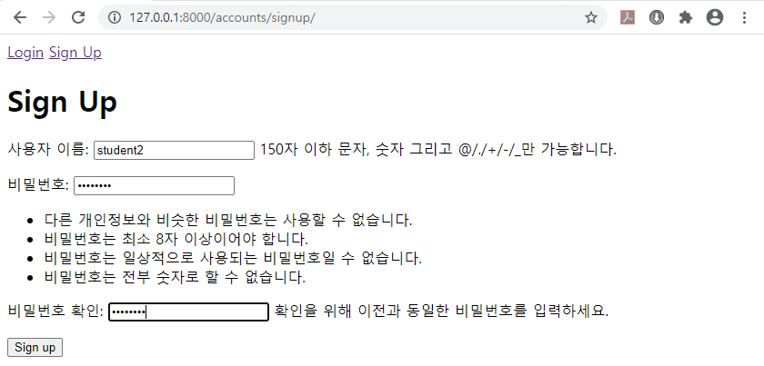

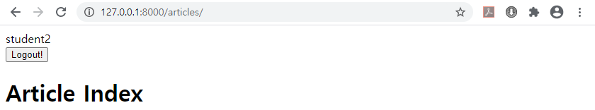

### 회원 탈퇴하기

```python
# accounts > urls.py
from django.urls import path
from . import views

app_name = 'accounts'

urlpatterns = [
    path('signup/', views.signup, name='signup'), # User Create
    path('login/', views.login, name='login'), # Session Create
    path('logout/', views.logout, name='logout'),
    path('delete/', views.delete, name='delete'), # 회원 탈퇴
]
```

```python
# accounts > views.py

# ... 전략 ...

def delete(request): # POST
    # 만약, 로그인이 안되어 있다면 index로 돌려 보내기
    if not request.user.is_authenticated:
        return redirect('articles:index')
    # User 삭제
    if request.method == 'POST':
        request.user.delete()
    return redirect('articles:index')
```

```html
<!-- templates > base.html -->
<!DOCTYPE html>
<html lang="en">
<head>
    <meta charset="UTF-8">
    <meta name="viewport" content="width=device-width, initial-scale=1.0">
    <title>Document</title>
</head>
<body>
    <nav>
        
        <span>{{ user.username }}</span>
        <form action="" method="POST">
            
            <input type="submit" value="로그아웃">
        </form>
        <form action="" method="POST">
            
            <input type="submit" value="회원탈퇴">
        </form>
        
        <a href="">로그인</a>
        <a href="">회원가입</a>
        
    </nav>
    
    
    
</body>
</html>
```

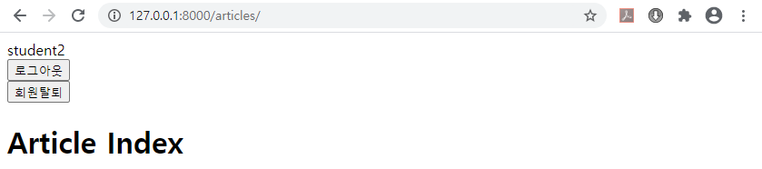


### 회원정보 수정

```python
# accounts > urls.py
from django.urls import path
from . import views

app_name = 'accounts'

urlpatterns = [
    path('signup/', views.signup, name='signup'), # User Create
    path('login/', views.login, name='login'), # Session Create
    path('logout/', views.logout, name='logout'), # Session Delete
    path('delete/', views.delete, name='delete'), # 회원 탈퇴(User Delete)
    path('edit/', views.edit, name='edit'), # 회원정보 수정(User Update)
]
```

```python
# accounts > views.py
from django.shortcuts import render, redirect
from django.contrib.auth.forms import UserCreationForm, AuthenticationForm, UserChangeForm
from django.contrib.auth import login as auth_login, logout as auth_logout
from .forms import CustomUserChangeForm

# ... 중략 ...

def edit(request):
    user = request.user
    form = CustomUserChangeForm(instance=user)
    context = {
        'form':form,
    }
    return render(request, 'accounts/edit.html', context)
```

```python
# accounts > forms.py
from django import forms
from django.contrib.auth.forms import UserChangeForm
from django.contrib.auth import get_user_model

class CustomUserChangeForm(UserChangeForm):
    class Meta:
        model = get_user_model() # => auth.user
        fields = ('username', 'email', 'first_name', 'last_name', )
```

```html
<!-- accounts > templates > accounts > edit.html -->




<h1>User Edit</h1>
<form action="" method="POST">
    
    {{ form.as_p }}
    <input type="submit" value="Update">
</form>

```

> CustomUserChangeForm을 만들어서 사용한 이유
>
> - 사용자가 설정하거나 바꾸면 안되는 것 까지 수정할 수 없도록 하기 위하여

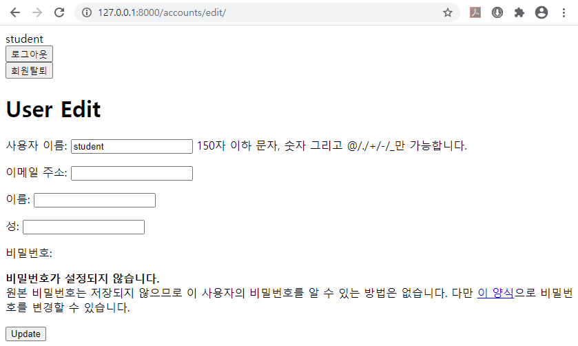

- `Django`에서 제공한 `UserChangeForm`을 그대로 사용할 경우

  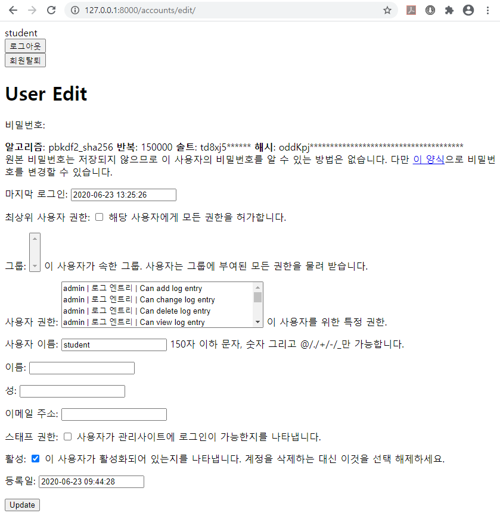

```python
# accounts > views.py
from django.shortcuts import render, redirect
from django.contrib.auth.forms import UserCreationForm, AuthenticationForm, UserChangeForm
from django.contrib.auth import login as auth_login, logout as auth_logout
from .forms import CustomUserChangeForm

# ... 중략 ...

def edit(request):
    user = request.user
    if request.method == 'POST':
        # User 업데이트!
        # 1. POST로 넘어온 데이터 form에 넣기
        form = CustomUserChangeForm(request.POST, instance=user)
        # 2. form에서 데이터 검증하기
        if form.is_valid():
            # 3. 검증 통과하면, database에 저장
            form.save()
            # 4. 업데이트 결과 확인이 가능한 페이지로 안내
            return redirect('articles:index')
    else:
        # User 업데이트 양식 보여주기
        form = CustomUserChangeForm(instance=user)
    context = {
        'form':form,
    }
    return render(request, 'accounts/edit.html', context)
```

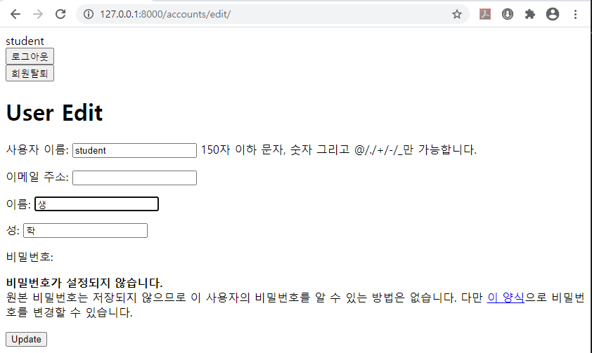

```html
<!-- templates > base.html -->
<!DOCTYPE html>
<html lang="en">
<head>
    <meta charset="UTF-8">
    <meta name="viewport" content="width=device-width, initial-scale=1.0">
    <title>Document</title>
</head>
<body>
    <nav>
        
        <span>{{ user.username }}</span>
        <a href="">회원정보 수정</a>
        <form action="" method="POST">
            
            <input type="submit" value="로그아웃">
        </form>
        <form action="" method="POST">
            
            <input type="submit" value="회원탈퇴">
        </form>
        
        <a href="">로그인</a>
        <a href="">회원가입</a>
        
    </nav>
    
    
    
</body>
</html>
```

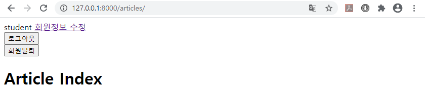

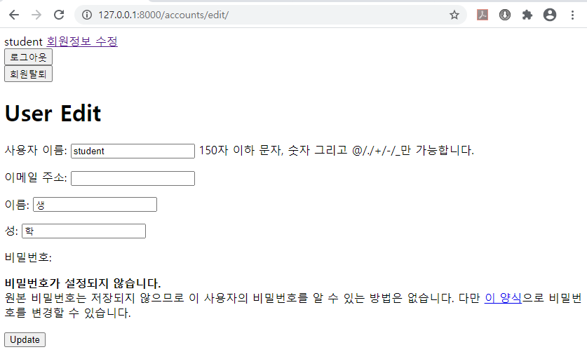

### 비밀번호 변경

```python
# accounts > urls.py
from django.urls import path
from . import views

app_name = 'accounts'

urlpatterns = [
    path('signup/', views.signup, name='signup'), # User Create
    path('login/', views.login, name='login'), # Session Create
    path('logout/', views.logout, name='logout'), # Session Delete
    path('delete/', views.delete, name='delete'), # 회원 탈퇴(User Delete)
    path('edit/', views.edit, name='edit'), # 회원정보 수정(User Update)
    path('password/', views.password, name='password'), # Password Update
]
```

```python
# accounts > views.py
from django.shortcuts import render, redirect
from django.contrib.auth.forms import UserCreationForm, AuthenticationForm, PasswordChangeForm
from django.contrib.auth import login as auth_login, logout as auth_logout
from .forms import CustomUserChangeForm
from django.contrib.auth import update_session_auth_hash

# ... 중략 ...

def password(request):
    user = request.user
    if request.method == 'POST':
        # Password 변경
        # 1. POST로 넘어온 data를 form에 넣기
        form = PasswordChangeForm(user, request.POST)
        # 2. form 유효성 검사
        if form.is_valid():
            # 3. 검사를 통과했다면, 저장!
            user = form.save()
            # 3-1. 저장 완료 후, 로그인 세션 유지!
            update_session_auth_hash(request, user)
            # 4. 어딘가로 돌려보내기
            return redirect('accounts:edit')
    else:
        # Password 변경 양식 보여주기
        form = PasswordChangeForm(user)
    context = {
        'form':form,
    }
    return render(request, 'accounts/password.html', context)
```

```html
<!-- accounts > templates > accounts > password.html -->




<h1>Password Edit</h1>

<form action="" method="POST">
    
    {{ form.as_p }}
    <input type="submit" value="Update">
</form>


```

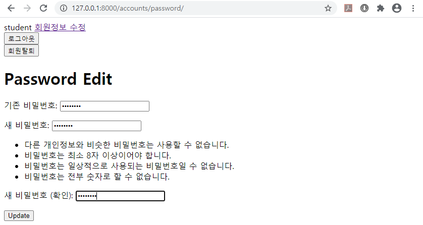

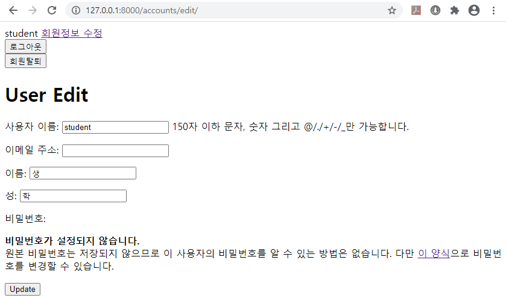