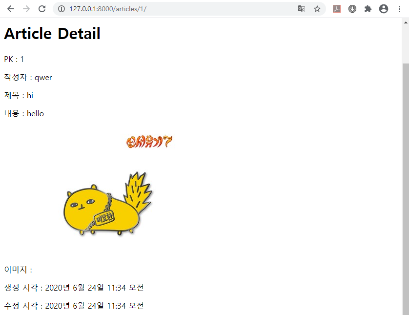
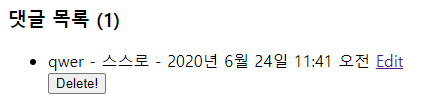
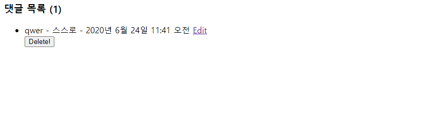
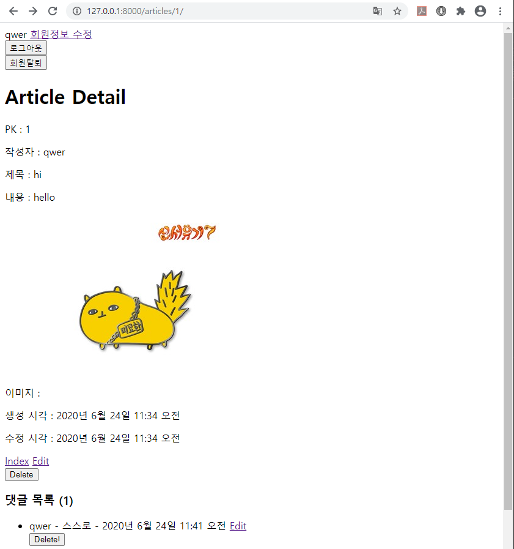
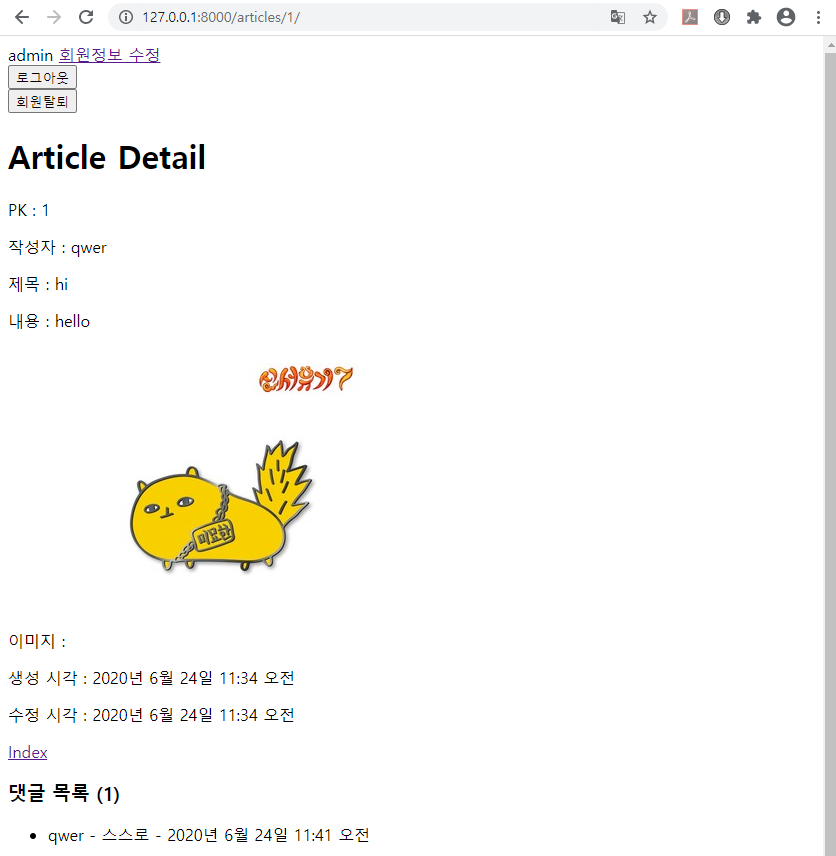

# Day13 종합프로젝트

# Authorization (권한)

- cf. 기본 주소로 들어갔을 때, `articles`로 바로 들어갈 수 있도록 만들기

```python
# formclass > urls.py

from django.contrib import admin
from django.urls import path, include
from django.conf import settings
from django.conf.urls.static import static
from django.shortcuts import redirect

urlpatterns = [
    path('admin/', admin.site.urls),
    path('articles/', include('articles.urls')),
    path('accounts/', include('accounts.urls')),
    path('', lambda r: redirect('articles:index'), name='root'),
]

urlpatterns += static(settings.MEDIA_URL, document_root=settings.MEDIA_ROOT)
```

## 로그인 한 사용자만 글 작성 가능하도록 하기

```python
from .models import Article, Comment
from .forms import ArticleForm, CommentForm
from django.contrib.auth.decorators import login_required ##### 추가 #####

# Create your views here.
def index(request) :
    articles = Article.objects.all()
    context = {
        'articles':articles
    }
    return render(request, 'articles/index.html', context)

##### 추가 #####
@login_required # 메소드(로그인 검증)
def new(request) :
    if request.method == 'POST' :
        # Database에 저장
        # 1. 요청에 실려온 data 꺼내오기
        # title = request.POST.get('title')
        # content = request.POST.get('content')
        # image = request.FILES.get('image')
        form = ArticleForm(request.POST, request.FILES)

        
        # 2-1. data 유효성 검사
        if form.is_valid() :
            # (ModelForm) 2-2. Database에 저장
            article = form.save()
            # # 2-2. 검증된 data 꺼내오기
            # title = form.cleaned_data.get('title')
            # content = form.cleaned_data.get('content')
            # # 2-3. Database에 저장
            # article = Article(title=title, content=content)
            # article.save()
            # 3. 저장된 data를 확인할 수 있는 곳으로 안내?
            return redirect('articles:detail', article.pk)
    else : # GET
        # 작성 양식 보여주기
        form = ArticleForm()
    context = {
        'form':form,
    }
    return render(request, 'articles/new.html', context)

# ... 후략 ...
```

- 함수 앞의 `@login_required`는 함수가 실행되기전에 로그인이 되어있나 확인
  - 로그인 O -> `new` 함수 실행
  - 로그인 X -> `login` 페이지로 이동(Django가 `accounts/login`일 것이라는 가정하에 움직임, 추가적인 변수로 페이지 위치를 변경해 줄 수있다.)

- `delete`, `edit`, `comments_new`, `comments_delete`, `comments_edit` 함수 앞에 `@login_required`를 추가해줌

## 글 작성을 통해서 로그인 했을 때, 다시 글 작성하기로 돌아가기

```python
# accounts > views.py

# ... 전략 ...

def login(request):
    # 만약, 로그인이 되었다면 index로 돌려 보내기
    if request.user.is_authenticated:
        return redirect('articles:index')
    if request.method == 'POST':
        # User 검증 + 로그인
        # 1. POST로 넘어온 데이터 form에 넣기
        form = AuthenticationForm(request, request.POST)
        # 2. form 검증 (아이디, 비밀번호 맞음?)
        if form.is_valid():
            # 3. 맞으면, 로그인 시켜줌
            user = form.get_user()
            auth_login(request, user)
            # 4. 로그인 결과 확인이 가능한 페이지로 안내
            # request.GET.get('next') # /articles/new/
            return redirect(request.GET.get('next') or 'articles:index') ##### 변경(단축 평가 적용) #####
    else:
        # User 로그인 창 보여주기
        form = AuthenticationForm()
    context = {
        'form':form,
    }
    return render(request, 'accounts/login.html', context)

# ... 후략 ...
```

- 단축 평가
  - `a = '' or 'apple'` => `a = 'apple'`
  - `b = 'banana' or ''` => `b = 'banana'`

## 작성자만 글 수정, 삭제 가능하게 하기

### 글과 댓글에 작성자 연결하고, 작성자 나타나게 하기

```python
# articles > models.py
from django.db import models
from imagekit.models import ProcessedImageField
from imagekit.processors import Thumbnail
from django.conf import settings ##### 추가 #####

# Create your models here.
# User : Article = 1 : N
# Article : Comment = 1 : N
# User : Comment = 1 :N
class Article(models.Model) :
    title = models.CharField(max_length=10)
    content = models.TextField()
    # image = models.ImageField(blank=True)
    image = ProcessedImageField(
        blank=True,
        processors=[ # 어떤 가공을 할지
            Thumbnail(300, 300),
        ], 
        format='JPEG', # 이미지 포맷(jpeg, png)
        options={ # 이미지 포맷 관련 옵션
            'quality':90,
        } 
        )
    user = models.ForeignKey(settings.AUTH_USER_MODEL, on_delete=models.CASCADE) # 'auth.User' ##### 추가 #####
    created_at = models.DateTimeField(auto_now_add=True)
    updated_at = models.DateTimeField(auto_now=True)

# 1:N Relation
# Article : Comment = 1 : N
# (부모) : (자식)
class Comment(models.Model) :
    content = models.TextField()
    created_at = models.DateTimeField(auto_now_add=True)
    updated_at = models.DateTimeField(auto_now=True)
    user = models.ForeignKey(settings.AUTH_USER_MODEL, on_delete=models.CASCADE) ##### 추가 #####
    article = models.ForeignKey(Article, on_delete=models.CASCADE)
```

```python
# articles > templates > articles > views.py

# ... 전략 ...

@login_required # 메소드
def new(request) :
    if request.method == 'POST' :
        # Database에 저장
        # 1. 요청에 실려온 data 꺼내오기
        # title = request.POST.get('title')
        # content = request.POST.get('content')
        # image = request.FILES.get('image')
        form = ArticleForm(request.POST, request.FILES)

        
        # 2-1. data 유효성 검사
        if form.is_valid() :
            # (ModelForm) 2-2. Database에 저장
            ##### 변경 & 추가 ######
            article = form.save(commit=False)
            article.user = request.user
            # article.user_id = request.user.pk
            article.save()
            ########################
            # # 2-2. 검증된 data 꺼내오기
            # title = form.cleaned_data.get('title')
            # content = form.cleaned_data.get('content')
            # # 2-3. Database에 저장
            # article = Article(title=title, content=content)
            # article.save()
            # 3. 저장된 data를 확인할 수 있는 곳으로 안내?
            return redirect('articles:detail', article.pk)
    else : # GET
        # 작성 양식 보여주기
        form = ArticleForm()
    context = {
        'form':form,
    }
    return render(request, 'articles/new.html', context)

# ... 후략 ...
```

```html
<!-- articles > templates > articles > detail.html -->




<h1>Article Detail</h1>

<p>PK : {{ article.pk }}</p>
<p>작성자 : {{ article.user.username }}</p> <!-- 추가 -->
<p>제목 : {{ article.title }}</p>
<p>내용 : {{ article.content }}</p>

<p>
    이미지 : 
</p>

<p>생성 시각 : {{ article.created_at }}</p>
<p>수정 시각 : {{ article.updated_at }}</p>

<!-- ... 후략 ... -->
```



```python
# articles > templates > articles > views.py

# ... 전략 ...

@login_required
def comments_new(request, article_pk) :
    # 1. 요청이 POST인지 점검
    if request.method == 'POST' :
        # 2. form에 data를 집어넣기 (목적 : 유효성 검사)
        form = CommentForm(request.POST)
        # 3. 유효성 검사를 시행
        if form.is_valid() :
            # 4. 통과하면 Database에 저장(?)
            comment = form.save(commit=False)
            # 4-1. article 정보 주입
            comment.article_id = article_pk ##### 추가 #####
            # 4-2. user 정보 넣기
            comment.user = request.user
            comment.save()
    # 5. 생성된 댓글을 확인 할 수 있는 곳으로 안내
    return redirect('articles:detail', article_pk)

# ... 후략 ...
```

```html
<!-- articles > templates > articles > detail.html -->

<!-- ... 전략 ... -->

<!-- 댓글 목록 -->
<h3>댓글 목록 ({{ article.comment_set.all|length }})</h3>
<ul>
    
    <li>
        {{ comment.user.username }} - {{ comment.content }} - {{ comment.created_at }} <!-- 변경 -->
        <a href="">Edit</a>
        <form action="" method="POST">
            
            <input type="submit" value="Delete!">
        </form>
    </li>
    
    <li>
        작성된 댓글이 없습니다 :(
    </li>
    
</ul>

<!-- ... 후략 ... -->
```



### 로그인이 안되어 있을 때, 댓글창 숨기기

```html
<!-- articles > templates > articles > detail.html -->

<!-- ... 전략 ... -->

<!-- 댓글 입력창 -->

<h3>댓글 입력</h3>
<form action="" method="POST">
    
    {{ comment_form }}
    <input type="submit" value="등록">
</form>



```



### 작성자가 아닐 경우 `Edit`, `Delete!` 버튼 숨기기

```html
<!-- articles > templates > articles > detail.html -->

<!-- ... 전략 ... -->
<a href="">Index</a>
 <!-- 추가 -->
<a href="">Edit</a>

<form action="" method="POST">
    
    <input type="submit" value="Delete">
</form>
 <!-- 추가 -->

<!-- 댓글 목록 -->
<h3>댓글 목록 ({{ article.comment_set.all|length }})</h3>
<ul>
    
    <li>
        {{ comment.user.username }} - {{ comment.content }} - {{ comment.created_at }}
         <!-- 추가 -->
        <a href="">Edit</a>
        <form action="" method="POST">
            
            <input type="submit" value="Delete!">
        </form>
         <!-- 추가 -->
    </li>
    
    <li>
        작성된 댓글이 없습니다 :(
    </li>
    
</ul>

<!-- ... 후략 ... -->
```





- 주소창으로 접근할 수 없도록 하기

```python
# articles > templates > articles > views.py

# ... 전략 ...

@login_required
def delete(request, pk) : # POST
    article = Article.objects.get(pk=pk)
    
    ##### 추가 #####
    if request.user != article.user:
        return redirect('articles:detail', article.pk)
    
    if request.method == 'POST' :
        article.delete()
    return redirect('articles:index')

@login_required
def edit(request, pk) :
    # 1. Database에서 data 가져오기
    article = Article.objects.get(pk=pk)

    ##### 추가 #####
    if request.user != article.user:
        return redirect('articles:detail', article.pk)

    if request.method == 'POST':
        # data 수정
        
        # (ModelForm) 2-1. form에 data 집어넣기 + instance와 연결
        form = ArticleForm(request.POST, instance=article)
        # # 2-1. form에 data 집어넣기(검증 목적)
        # form = ArticleForm(request.POST)
        # 2-2. data 유효성 검사
        if form.is_valid() :
            # (ModelForm) 2-3. Database에 저장
            article = form.save()
            # # 2-3. 검증된 data를 반영하기
            # article.title = form.cleaned_data.get('title')
            # article.content = form.cleaned_data.get('content')
            # article.save()
        # 3. 저장된 내용을 확인할 수 있는 페이지로 안내
        return redirect('articles:detail', article.pk)
    else :
        # 수정 양식 보여주기
        # (ModelForm) 2. Form에 data 채워 넣기
        form = ArticleForm(instance=article)
        # # 2. Form에 data 채워 넣기
        # form = ArticleForm(initial=article.__dict__)
    context = {
        'form':form,
    }
    return render(request, 'articles/edit.html', context)

# ... 중략 ...

@login_required
def comments_delete(request, article_pk, pk): # POST
    ##### 위치 변경 #####
    # 1. pk를 가지고 삭제하려는 data 꺼내오기
    comment = Comment.objects.get(pk=pk)

    ##### 추가 #####
    if request.user != comment.user:
        return redirect('articles:detail', comment.article.pk)

    # 0. 요청이 POST인지 점검
    if request.method == 'POST' :
        # 2. 삭제
        comment.delete()
    # 3. 삭제되었는지 확인 가능한 곳으로 안내
    return redirect('articles:detail', article_pk)

@login_required
def comments_edit(request, article_pk, pk) : # GET, POST
    # Database에서 수정하려 하는 data 가져오기
    comment = Comment.objects.get(pk=pk)

    ##### 추가 #####
    if request.user != comment.user:
        return redirect('articles:detail', comment.article.pk)
     
    # 0. 요청 종류가 POST인지 GET인지 점검
    if request.method == 'POST' :
        # 실제로 수정!
        # 1. form에 '넘어온 data' & '수정하려는 data' 집어넣기
        form = CommentForm(request.POST, instance=comment)
        # 2. 유효성 검사
        if form.is_valid() :
            # 3. 검사를 통과했다면, save
            comment = form.save()
            # 4. 변경된 결과 확인하는 곳으로 안내
            return redirect('articles:detail', article_pk)
    else : 
        # 수정 양식 보여주기!
        # 1. form class 초기화(생성) & 내용 채우기
        form = CommentForm(instance=comment)

    context = {
        'form':form,
    }
    return render(request, 'articles/comments_edit.html', context)
```

