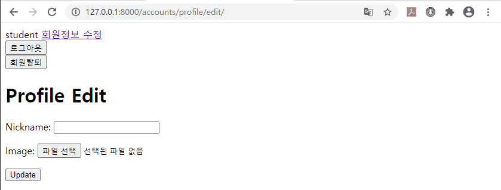
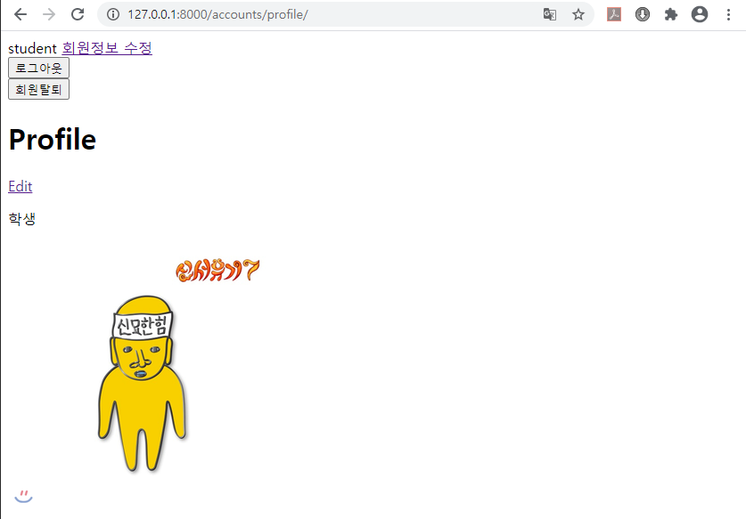
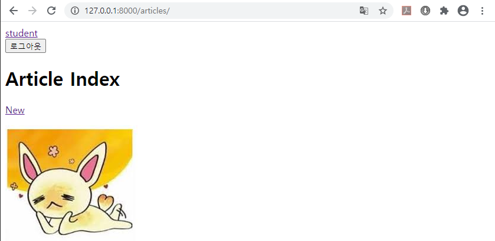
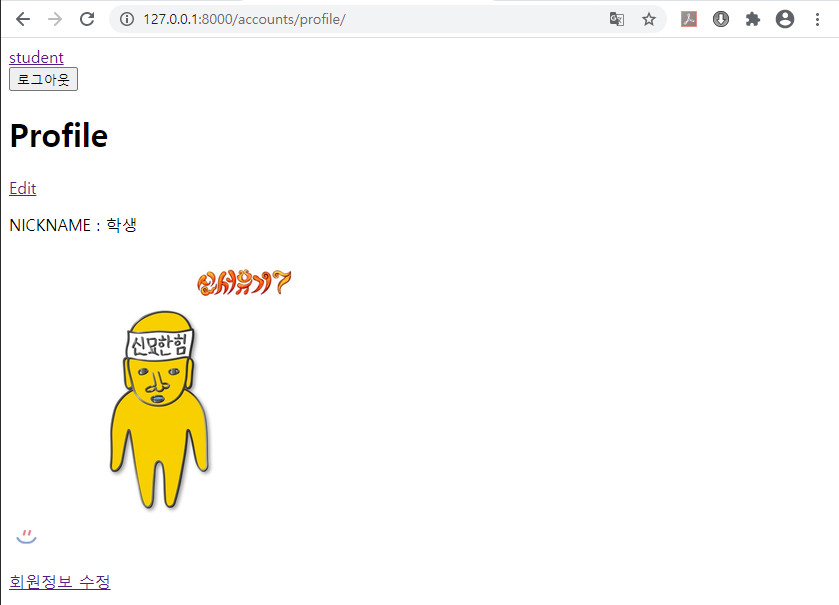
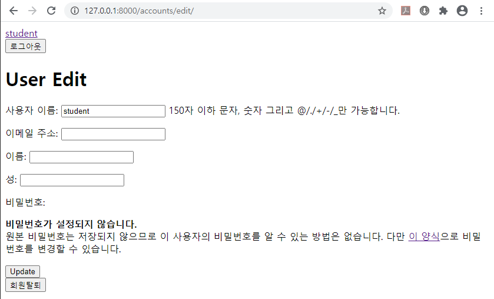
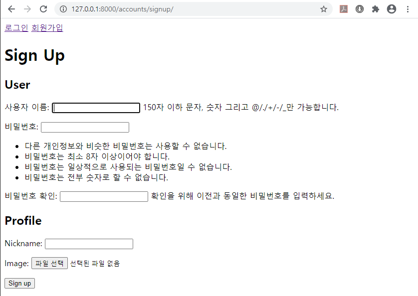
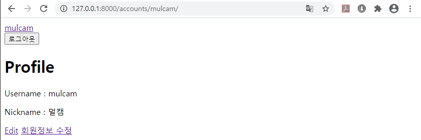
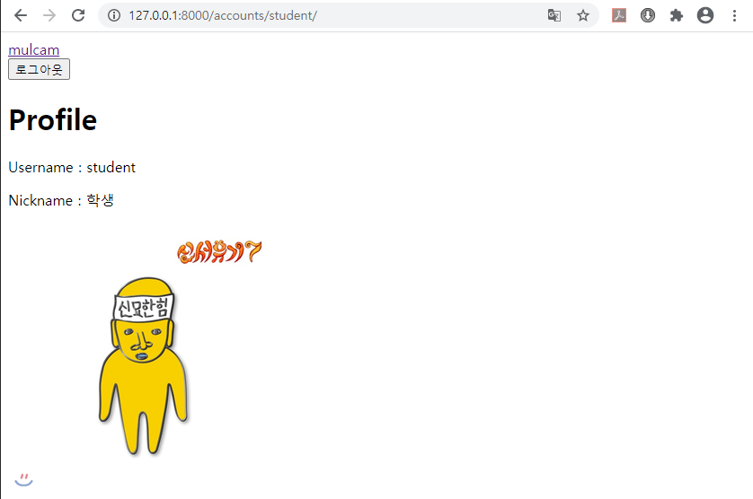
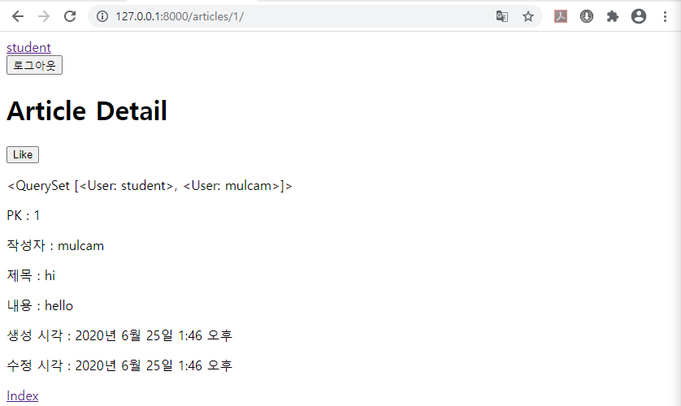
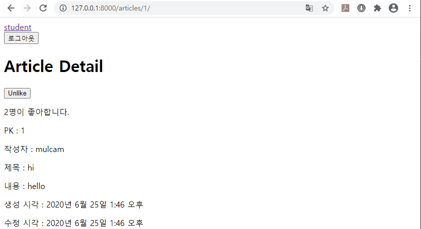

# Day14 종합프로젝트

# Profile (1:1)

- Database 먼저 만들기

```python
# accounts > models.py
from django.db import models
from imagekit.models import ProcessedImageField
from imagekit.processors import Thumbnail
from django.conf import settings

# Create your models here.
class Profile(models.Model):
    nickname = models.CharField(max_length=20, blank=True)
    image = ProcessedImageField(
        blank=True,
        processors=[Thumbnail(300, 300), ], 
        format='png',
        )
    user = models.OneToOneField(settings.AUTH_USER_MODEL, on_delete=models.CASCADE)
```

```
python manage.py makemigrations
python manage.py migrate
```

- `views.py`의 `signup` 함수 수정

```python
# accounts > views.py
from django.shortcuts import render, redirect
from django.contrib.auth.forms import UserCreationForm, AuthenticationForm, PasswordChangeForm
from django.contrib.auth import login as auth_login, logout as auth_logout
from .forms import CustomUserChangeForm
from django.contrib.auth import update_session_auth_hash
from .models import Profile

# Create your views here.
def signup(request):
    # 만약, 로그인이 되었다면 index로 돌려 보내기
    if request.user.is_authenticated:
        return redirect('articles:index')
    if request.method == 'POST':
        # User 생성
        # 1. POST로 넘어온 데이터 form에 넣기
        form = UserCreationForm(request.POST)
        # 2. form에서 유효성 검사
        if form.is_valid():
            # 3. 유효하다면 database에 저장
            user = form.save()
            # profile 생성
            Profile.objects.create(user=user) ##### 추가 #####
            # 3-1. 저장했다면, 해당 User로 로그인!
            auth_login(request, user)
            # 4. 저장 결과 확인이 가능한 페이지로 안내
            return redirect('articles:index')
    else:
        # User 생성 양식 보여주기
        form = UserCreationForm()
    context = {
        'form':form,
    }
    return render(request, 'accounts/signup.html', context)

# ... 후략 ...
```

## Profile 페이지 생성

```python
# accounts > urls.py
from django.urls import path
from . import views

app_name = 'accounts'

urlpatterns = [
    path('signup/', views.signup, name='signup'), # User Create
    path('login/', views.login, name='login'), # Session Create
    path('logout/', views.logout, name='logout'), # Session Delete
    path('delete/', views.delete, name='delete'), # 회원 탈퇴(User Delete)
    path('edit/', views.edit, name='edit'), # 회원정보 수정(User Update)
    path('password/', views.password, name='password'), # Password Update
    path('profile/', views.profile_detail, name='profile_detail'), # Profile Read
]
```

```python
# accounts > views.py

# ... 전략 ...

def profile_detail(request):
    # 1:N - user.comment_set / comment.user
    # 1:1 - user.profile / profile.user
    profile = request.user.profile
    context = {
        'profile':profile,
    }
    return render(request, 'accounts/profile_detail.html', context)
```

```html
<!-- accounts > templates > accounts > profile_detail.html -->




<h1>Profile</h1>

{{ profile }}


```


## Profile 수정 페이지

```python
# accounts > urls.py
from django.urls import path
from . import views

app_name = 'accounts'

urlpatterns = [
    path('signup/', views.signup, name='signup'), # User Create
    path('login/', views.login, name='login'), # Session Create
    path('logout/', views.logout, name='logout'), # Session Delete
    path('delete/', views.delete, name='delete'), # 회원 탈퇴(User Delete)
    path('edit/', views.edit, name='edit'), # 회원정보 수정(User Update)
    path('password/', views.password, name='password'), # Password Update
    path('profile/', views.profile_detail, name='profile_detail'), # Profile Read
    path('profile/edit/', views.profile_edit, name='profile_edit'), # Profile Update
]
```

- form 생성

```python
# accounts > forms.py
from django import forms
from django.contrib.auth.forms import UserChangeForm
from django.contrib.auth import get_user_model
from .models import Profile

class CustomUserChangeForm(UserChangeForm):
    class Meta:
        model = get_user_model() # => auth.user
        fields = ('username', 'email', 'first_name', 'last_name', )

class ProfileForm(forms.ModelForm):
    class Meta:
        model = Profile
        fields = ('nickname', 'image')
```

```python
# accounts > views.py
from django.shortcuts import render, redirect
from django.contrib.auth.forms import UserCreationForm, AuthenticationForm, PasswordChangeForm
from django.contrib.auth import login as auth_login, logout as auth_logout
from .forms import CustomUserChangeForm, ProfileForm ##### 추가 #####
from django.contrib.auth import update_session_auth_hash
from .models import Profile

# ... 중략 ...

def profile_edit(request):
    # 1. 현재 로그인 된 user의 profile 가져오기
    profile = request.user.profile

    if request.method == 'POST':
        # profile 업데이트
        # 1. POST로 넘어온 데이터 form에 넣기
        form = ProfileForm(request.POST, request.FILES, instance=profile)
        # 2. form에서 유효성 검사
        if form.is_valid():
            # 3. 검사를 통과하면 저장
            form.save()
            # 4. 결과 확인이 가능한 페이지로 안내
            return redirect('accounts:profile_detail')
    else:
        # profile 수정 양식 보여주기
        # 2. form에 profile 넣어서 양식 보여주기
        form = ProfileForm(instance=profile)
    context = {
        'form':form,
    }
    return render(request, 'accounts/profile_edit.html', context)
```

```html
<!-- accounts > templates > accounts > profile_edit.html -->




<h1>Profile Edit</h1>

<form action="" method="POST" enctype="multipart/form-data">
    
    {{ form.as_p }}
    <input type="submit" value="Update">
</form>


```



## Profile 제대로 볼 수 있도록 수정

```html
<!-- accounts > templates > accounts > profile_detail.html -->




<h1>Profile</h1>

<a href="">Edit</a>

<p>{{ profile.nickname }}</p>

<p>
    
</p>



```



## 이미지 파일 저장 경로 지정하기

```python
# accounts > models.py
from django.db import models
from imagekit.models import ProcessedImageField
from imagekit.processors import Thumbnail
from django.conf import settings

# Create your models here.
class Profile(models.Model):
    nickname = models.CharField(max_length=20, blank=True)
    image = ProcessedImageField(
        blank=True,
        upload_to='profile/image/', ##### 추가 #####
        processors=[Thumbnail(300, 300), ], 
        format='png',
        )
    user = models.OneToOneField(settings.AUTH_USER_MODEL, on_delete=models.CASCADE)
```


## 각 버튼 위치 바꾸기

```html
<!-- templates > base.html -->
<!DOCTYPE html>
<html lang="en">
<head>
    <meta charset="UTF-8">
    <meta name="viewport" content="width=device-width, initial-scale=1.0">
    <title>Document</title>
</head>
<body>
    <nav>
        
        <!-- 변경 & 추가 -->
        <a href="">{{ user.username }}</a>
        
        <form action="" method="POST">
            
            <input type="submit" value="로그아웃">
        </form>
        <!-- ---------- -->
        
        <a href="">로그인</a>
        <a href="">회원가입</a>
        
    </nav>
    
    
    
</body>
</html>
```

```html
<!-- accounts > templates > accounts > profile_detail.html -->




<h1>Profile</h1>

<a href="">Edit</a> <!-- 추가 -->

<p>NICKNAME : {{ profile.nickname }}</p>

<p>
    
</p>


<a href="">회원정보 수정</a>


```

```html
<!-- accounts > templates > accounts > edit.html -->




<h1>User Edit</h1>
<form action="" method="POST">
    
    {{ form.as_p }}
    <input type="submit" value="Update">
</form>

<!-- 추가 -->
<form action="" method="POST">
    
    <input type="submit" value="회원탈퇴">
</form>


```







## 가입시 Profile 동시에 받기

- 그 전에 로그인을 한 사람만 `Profile`에 접근할 수 있도록

  ```python
  from django.contrib.auth.decorators import login_required
  
  @login_required
  ```

  추가

```python
# accounts > views.py
from django.shortcuts import render, redirect
from django.contrib.auth.forms import UserCreationForm, AuthenticationForm, PasswordChangeForm
from django.contrib.auth import login as auth_login, logout as auth_logout
from .forms import CustomUserChangeForm, ProfileForm
from django.contrib.auth import update_session_auth_hash
from .models import Profile
from django.contrib.auth.decorators import login_required

# Create your views here.
def signup(request):
    # 만약, 로그인이 되었다면 index로 돌려 보내기
    if request.user.is_authenticated:
        return redirect('articles:index')
    if request.method == 'POST':
        # User 생성
        # 1. POST로 넘어온 데이터 form에 넣기
        form = UserCreationForm(request.POST)
        profile_form = ProfileForm(request.POST, request.FILES)
        # form들이 각자 자기가 필요한 것만 가져가서 사용하므로,
        # 똑같이 request.POST를 넘겨줘도 된다.
        # 2. form에서 유효성 검사
        if form.is_valid() and profile_form.is_valid():
            # 3. 유효하다면 database에 저장
            user = form.save()
            profile = profile_form.save(commit=False)
            profile.user = user
            profile.save()
            # profile 생성
            # Profile.objects.create(user=user)
            # 3-1. 저장했다면, 해당 User로 로그인!
            auth_login(request, user)
            # 4. 저장 결과 확인이 가능한 페이지로 안내
            return redirect('articles:index')
    else:
        # User 생성 양식 보여주기
        form = UserCreationForm()
        # Profile 생성 양식 보여주기
        profile_form = ProfileForm()
    context = {
        'form':form,
        'profile_form':profile_form,
    }
    return render(request, 'accounts/signup.html', context)
```

```html
<!-- accounts > templates > accounts > signup.html -->




<h1>Sign Up</h1>

<form action="" method="POST" enctype="multipart/form-data">
    
    <!-- as_p : 각 form을 p태그로 감싸서 
        한줄씩 출력되도록 해줌 -->
    <h2>User</h2>
    {{ form.as_p }}
    
    <h2>Profile</h2>
    {{ profile_form.as_p}}

    <input type="submit" value="Sign up">
</form>


```



## 다른 사용자 프로필 보기

```python
# accounts > urls.py
from django.urls import path
from . import views

app_name = 'accounts'

urlpatterns = [
    path('signup/', views.signup, name='signup'), # User Create
    path('login/', views.login, name='login'), # Session Create
    path('logout/', views.logout, name='logout'), # Session Delete
    path('delete/', views.delete, name='delete'), # 회원 탈퇴(User Delete)
    path('edit/', views.edit, name='edit'), # 회원정보 수정(User Update)
    path('password/', views.password, name='password'), # Password Update
    path('profile/', views.profile_detail, name='profile_detail'), # Profile Read
    path('profile/edit/', views.profile_edit, name='profile_edit'), # Profile Update
    path('<str:username>/', views.profile, name='profile'), # 다른 사용자 프로필 보기
]
```

```python
# accounts > views.py
from django.shortcuts import render, redirect
from django.contrib.auth.forms import UserCreationForm, AuthenticationForm, PasswordChangeForm
from django.contrib.auth import login as auth_login, logout as auth_logout
from .forms import CustomUserChangeForm, ProfileForm
from django.contrib.auth import update_session_auth_hash
from .models import Profile
from django.contrib.auth.decorators import login_required
from django.contrib.auth import get_user_model

# ... 중략 ...

def profile(request, username):
    # username <- User가 들고 있음
    # User : Profile = 1 : 1
    # 1. profile.user.username
    profile = Profile.objects.get(user__username=username)
    # # 2. User에서 username으로 user찾고, user.profile
    # profile = get_user_model().objects.get(username=username).profile
    context = {
        'profile':profile, # 기존의 profile_detail와 context의 key가 동일해야한다.
    }
    return render(request, 'accounts/profile_detail.html', context)
```

```html
<!-- accounts > templates > accounts > profile_detail.html -->




<h1>Profile</h1>

<p>Username : {{ profile.user.username }}</p>
<p>Nickname : {{ profile.nickname }}</p>

<p>
    
</p>



<a href="">Edit</a>
<a href="">회원정보 수정</a>



```





# Like & Follow (M:N)

- 실제로는 `User`와 `Article` Database를 연결한 `join_table`을 만들어야 하지만, Django에서 만들어놓은 기능을 사용
- Follow 기능은 Like 기능에서 좀 더 추가하면 가능하다. 구현 안함.

## Database 추가

```python
# articles > models.py
from django.db import models
from imagekit.models import ProcessedImageField
from imagekit.processors import Thumbnail
from django.conf import settings

# Create your models here.
# User : Article = 1 : N
# Article : Comment = 1 : N
# User : Comment = 1 :N
class Article(models.Model) :
    title = models.CharField(max_length=10)
    content = models.TextField()
    # image = models.ImageField(blank=True)
    image = ProcessedImageField(
        blank=True,
        processors=[ # 어떤 가공을 할지
            Thumbnail(300, 300),
            ], 
        format='JPEG', # 이미지 포맷(jpeg, png)
        options={ # 이미지 포맷 관련 옵션
            'quality':90,
            } 
        )
    user = models.ForeignKey(settings.AUTH_USER_MODEL, on_delete=models.CASCADE) # 'auth.User' # 1:N
    like_users = models.ManyToManyField(settings.AUTH_USER_MODEL, related_name='like_articles', blank=True) ##### 추가 (M:N) #####
    # related_name의 defalut:'articles_set'으로 위에 1:N구조와 이름이 같으므로 변경해줌.
    created_at = models.DateTimeField(auto_now_add=True)
    updated_at = models.DateTimeField(auto_now=True)
```

```
python manage.py makemigrations
python manage.py migrate
```

## Like 기능 생성

```python
# articles > templates > articles > urls.py
from django.urls import path
from . import views

app_name = 'articles'

urlpatterns = [
    path('', views.index, name='index'),
    path('new/', views.new, name='new'),
    path('<int:pk>/', views.detail, name='detail'),
    path('<int:pk>/delete/', views.delete, name='delete'),
    path('<int:pk>/edit/', views.edit, name='edit'),
    path('<int:pk>/like/', views.like, name='like'), # join_table Create ##### 추가 #####
    path('<int:article_pk>/comments/new/', views.comments_new, name='comments_new'),
    path('<int:article_pk>/comments/<int:pk>/delete/', views.comments_delete, name='comments_delete'),
    path('<int:article_pk>/comments/<int:pk>/edit/', views.comments_edit, name='comments_edit'),
]
```

```python
# articles > templates > articles > views.py

# ... 전략 ...

def like(request, pk):
    user = request.user
    article = Article.objects.get(pk=pk)
    if request.method == 'POST':
        article.like_users.add(user)
    return redirect('articles:detail', pk)
```

```html
<!-- articles > templates > articles > detail.html -->




<h1>Article Detail</h1>

<!-- 추가 -->
<form action="" method="POST">
    
    <input type="submit" value="Like">
</form>
<p>{{ article.like_users.all }}</p>

<p>PK : {{ article.pk }}</p>
<p>작성자 : {{ article.user.username }}</p>
<p>제목 : {{ article.title }}</p>
<p>내용 : {{ article.content }}</p>

<p>
    이미지 : 
</p>

<p>생성 시각 : {{ article.created_at }}</p>
<p>수정 시각 : {{ article.updated_at }}</p>

<!-- ... 후략 ... -->
```



## Like 취소하기

```python
# articles > templates > articles > views.py

# ... 전략 ...

def like(request, pk):
    user = request.user
    article = Article.objects.get(pk=pk)
    if request.method == 'POST':
        if user in article.like_users.all():
            # Like 취소하기
            article.like_users.remove(user)
        else:
            article.like_users.add(user)
    return redirect('articles:detail', pk)
```

```html
<!-- articles > templates > articles > detail.html -->




<h1>Article Detail</h1>

<form action="" method="POST">
    
    <input type="submit" value="UnlikeLike"> <!-- 변경 -->
</form>
<p>{{ article.like_users.all }}</p>

<!-- ... 후략 ... -->
```




