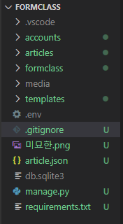

# Day15 종합프로젝트

# Deploy to AWS EC2 using Cloud9


## 1. Local (개인 컴퓨터)

### 1.1. settings.py 분리

- `formclass` app 안에 `settings` 폴더 생성, 생성 후 내부에 `__init__.py` 생성

- `formclass > settings.py`를 `settings` 폴더 안으로 이동시키고, `base.py`로 이름 변경

- `formclass > settings > base.py`
    
- 현재 폴더에서 BASE_DIR까지 가기 위한 폴더가 하나 더 생겼으므로, BASE_DIR 위치를 한 단계 더 상위 폴더로 다시 잡아 준다.
    
    ```python
    BASE_DIR = os.path.dirname(os.path.dirname(os.path.dirname(os.path.abspath(__file__))))
```
    
- `settings` 폴더 안에 `dev.py` 생성

    ```python
    # formclass > settings > dev.py
    from .base import *
    
    SECRET_KEY = config('SECRET_KEY')
    
    DEBUG = True
    
    ALLOWED_HOSTS = []
    ```

- `settings` 폴더 안에 `prod.py` 생성

    ```python
    # formcalss > settings > prod.py
    from .base import *
    
    SECRET_KEY = config('SECRET_KEY')
    
    DEBUG = True # 추후에 False로 변경 예정
    
    ALLOWED_HOSTS = [
        '.compute.amazonaws.com',
    ]
    
    STATIC_ROOT = os.path.join(BASE_DIR, 'staticfiles')
    ```

    - `formclass > settings > base.py` 에 있는

      ```python
      # SECURITY WARNING: keep the secret key used in production secret!
      SECRET_KEY = '-9pt(u7m6=ih4m#+1a#yfa)yj9debjj#1m2f)jq=6a5@ez2r#u'
      
      # SECURITY WARNING: don't run with debug turned on in production!
      DEBUG = True
      
      ALLOWED_HOSTS = []
      ```

      를 삭제하고, `SECRET_KEY`를 `dev.py`와 `prod.py`에 붙여 넣는다. 

- `manage.py`
    
- `def main()`의 첫 줄 코드에 `.dev` 추가
    
    ```python
    os.environ.setdefault('DJANGO_SETTINGS_MODULE', '{ProjectName}.settings.dev')
```
    
- `formclass > wsgi.py`
    
- 14번째 코드에 `.prod` 추가
    
    ```python
    os.environ.setdefault('DJANGO_SETTINGS_MODULE', '{ProjectName}.settings.prod')
    ```

### 1.2. python-decouple (.env)

- decouple 설치 & .env 생성

  - `$ pip install python-decouple`
  - `.env`는 `manage.py`와 같은 수준에 생성
    - `.env`에 `SECRET_KEY` 붙여넣고, 띄어쓰기 없애서 저장하기

- 숨겨야 하는 변수(값)들 숨기기

  - `prod.py`와 `dev.py`에

    ```python
    from decouple import config
    
    SECRET_KEY = config('SECRET_KEY')
    ```

    로 추가 변경하기

### 1.3. Project 복제

- `requirements.txt` 생성

    ```bash
    $ pip freeze > requirements.txt
    ```

- project 폴더 통째로 복제(git으로 관리하는 폴더 안에 있을 경우)

### 1.4. 새 GitHub Repo 생성 & Git Push

- `venv` 제거 (`.git` 있으면 같이 제거) (project 폴더 통째로 복제한 사람만)

- `.gitignore` 생성 [python gitignore](https://github.com/github/gitignore/blob/master/Python.gitignore) 내용 복붙 &

    ```bash
    # Python.gitignore
    # ...
    
    # VS Code
    .vscode
    
    # Django Media
    media/
    
    # Django Static
    staticfiles/
    
    # tmp & log
    tmp/
    log/
    
    # OS(Windows)
    Thumbs.db
    ```

    추가

    - 

    

    ​	회색으로 변한 것은 `git`이 무시하는 파일을 의미한다.

- GitHub Repo 생성(Django 프로젝트 이름과 같은 것을 사용하는 것이 좋음)

- `git init`, `commit`, `remote add`, `push`


## 2. AWS Dashboard

### 2.1. 회원가입

### 2.2. Cloud9 인스턴스 생성 및 실행

- AWS Cloud9 : 다른 컴퓨터로 가기위한 통로들이 막혀있어 우회하기 위하여 사용

### 2.3. EC2 인스턴스 Port 열어주기

- 보안 그룹 → `aws-cloud9-...` → 작업 → 인바운드 규칙 편집
    - 규칙 추가
        - 유형 : `HTTP`
        - 소스 유형 : `위치 무관`
    - 규칙 저장


## 3. AWS Cloud9 IDE

### 3.1. 환경 설정

- pyenv, pyenv-virtualenv

    ```bash
    $ git clone https://github.com/pyenv/pyenv.git ~/.pyenv
    $ echo 'export PYENV_ROOT="$HOME/.pyenv"' >> ~/.bashrc
    $ echo 'export PATH="$PYENV_ROOT/bin:$PATH"' >> ~/.bashrc
    $ echo -e 'if command -v pyenv 1>/dev/null 2>&1; then\n  eval "$(pyenv init -)"\nfi' >> ~/.bashrc
    $ exec "$SHELL"

    $ git clone https://github.com/pyenv/pyenv-virtualenv.git $(pyenv root)/plugins/pyenv-virtualenv
    $ echo 'eval "$(pyenv virtualenv-init -)"' >> ~/.bashrc
    $ exec "$SHELL"
    ```

- python

    ```bash
    $ pyenv install 3.7.6
    ```

- python을 사용하겠다 선언

  ```bash
  $ pyenv global 3.7.6
  ```

### 3.2. Project 설정

- 전체 폴더들에서 나가기(`~`까지)

  ```bash
  $ cd
  ```

- Clone from GitHub

    ```bash
    $ git clone {GitHub Repo URL}
    $ cd {ProjectName} # (master)가 존재해야한다.
    ```

- 가상환경 (virtualenv)

    ```bash
    $ pyenv virtualenv {ProjectName}-venv
    $ pyenv local {ProjectName}-venv # 가상환경 활성화
    ```

- Run pip install

    ```bash
    $ pip install -r requirements.txt
    ```

- Set setting module

    ```bash
    $ export DJANGO_SETTINGS_MODULE='{ProjectName}.settings.prod'
    ```

    - terminal에 입력하는 것이라서, terminal을 다시시작하면 다시 입력해주어야 한다.

- `.env` 파일 수동으로 옮겨주기

- Databse migrate

    ```bash
    $ python manage.py migrate
    ```

- Collect staticfiles

    ```bash
    $ python manage.py collectstatic
    ```

### 3.3. 웹 서버 설정 (Nginx)

- Install

    ```bash
    $ sudo apt install -y nginx
    ```

- 80번 포트를 쓰고 있는 다른 웹 서버(apache) 종료 & nginx 시작

    ```bash
    $ sudo systemctl stop apache2
    $ sudo systemctl start nginx
    ```

- 설정 파일 편집

    - `{ProjectName}`: 본인 프로젝트의 이름(폴더명)

    ```bash
    $ sudo vi /etc/nginx/sites-enabled/default
    ```

    - 코드상 `root` ~ `location` 삭제
    - `i`로 `INSERT` 상태로 만들어 준 후

    ```
    server_name *.compute.amazonaws.com;
    
    location / {
      uwsgi_pass unix:///home/ubuntu/{ProjectName}/tmp/{ProjectName}.sock;
      include uwsgi_params;
    }
    
    location /static/ {
      alias /home/ubuntu/{ProjectName}/staticfiles/;
    }
    ```

    위치 맞춰서, 붙여넣기

- `shift + z` : 저장 후 종료

- 설정 오류 없는지 테스트

    ```bash
    $ sudo nginx -t
    ```

### 3.4. 앱 서버 설정 (uWSGI)

- Install

    ```bash
    $ pip install uwsgi
    ```

- 필요한 폴더들 생성

    ```bash
    $ mkdir tmp
    $ mkdir -p log/uwsgi
    $ mkdir -p .config/uwsgi
    ```

- `.config/uwsgi`에 `{ProjectName}.ini` 파일 생성
    
    - `{ProjectName}`: 본인 프로젝트의 이름(폴더명)
- `{VirtualenvName}`: 앞에서 생성한 가상환경 이름
    
    ```
    [uwsgi]
    chdir = /home/ubuntu/{ProjectName}
    module = {ProjectName}.wsgi:application
home = /home/ubuntu/.pyenv/versions/{VirtualenvName}
    
    uid = ubuntu
gid = ubuntu
    
    socket = /home/ubuntu/{ProjectName}/tmp/{ProjectName}.sock
    chmod-socket = 666
chown-socket = ubuntu:ubuntu
    
    enable-threads = true
    master = true
    vacuum = true
    pidfile = /home/ubuntu/{ProjectName}/tmp/{ProjectName}.pid
    logto = /home/ubuntu/{ProjectName}/log/uwsgi/@(exec://date +%%Y-%%m-%%d).log
    log-reopen = true
```
    
- `.config/uwsgi` 에 `uwsgi.service` 파일 생성
    
    - `{ProjectName}`: 본인 프로젝트의 이름(폴더명)
- `{VirtualenvName}`: 앞에서 생성한 가상환경 이름
    
    ```
    [Unit]
    Description=uWSGI Service
After=syslog.target
    
    [Service]
    User=ubuntu
ExecStart=/home/ubuntu/.pyenv/versions/{VirtualenvName}/bin/uwsgi -i /home/ubuntu/{ProjectName}/.config/uwsgi/{ProjectName}.ini
    
    Restart=always
    KillSignal=SIGQUIT
    Type=notify
    StandardError=syslog
NotifyAccess=all
    
    [Install]
    WantedBy=multi-user.target
```
    
- 심볼릭 링크 생성
    - `{ProjectName}`: 본인 프로젝트의 이름(폴더명)

    ```bash
    sudo ln -s ~/{ProjectName}/.config/uwsgi/uwsgi.service /etc/systemd/system/uwsgi.service
    ```

    - 자동으로 켜져야하는 프로그램을 Ubuntu에 알려주는 명령어
    
- daemon 등록

    - 자동 실행을 설정하는 명령어

    ```bash
    # daemon reload
    sudo systemctl daemon-reload
    
    # uswgi daemon enable and restart
    sudo systemctl enable uwsgi
    sudo systemctl restart uwsgi.service
    
    # check daemons
    sudo systemctl | grep nginx
    sudo systemctl | grep uwsgi
    
    # restart
    sudo systemctl restart nginx
    sudo systemctl restart uwsgi
    ```

### 3.5. 마무리

- 주소로 접속 후, 잘 나오는 지 확인

    - EC2에서 해당 프로젝트의 주소를 복사하면 인터넷창을 통해 들어가기

- `settings/prod.py`
    - Debug 모드 비활성화(개발이 완료된 후)

    ```python
    DEBUG = False
    ```

- 서버 재시작

    ```bash
    $ sudo systemctl restart nginx
    $ sudo systemctl restart uwsgi
    ```


## 4. 코드 업데이트 반영하기

### 4.1. Commands

- Local 작업 내용을 배포된 서버에 반영하기 위한 commands

    ```bash
    $ git pull

    $ pip install -r requirements.txt

    $ export DJANGO_SETTINGS_MODULE='{ProjectName}.settings.prod'

    $ python manage.py migrate
    $ python manage.py collectstatic # 사진 모으기

    $ sudo systemctl restart nginx
    $ sudo systemctl restart uwsgi
    ```

### 4.2. 자동화 스크립트 만들기

- `tmp`에 `up.sh` 파일 생성

    ```bash
    echo '>>> Git Pull'
    git pull

    echo '>>> Install Packages'
    pip install -r requirements.txt

    export DJANGO_SETTINGS_MODULE='{ProjectName}.settings.prod'

    echo '>>> Database Migrate'
    python manage.py migrate

    echo '>>> Collect Staticfiles'
    python manage.py collectstatic --noinput

    echo '>>> Restart Servers'
    sudo systemctl restart nginx
    sudo systemctl restart uwsgi
    ```

- 실행

    ```bash
    $ sh tmp/up.sh
    ```
