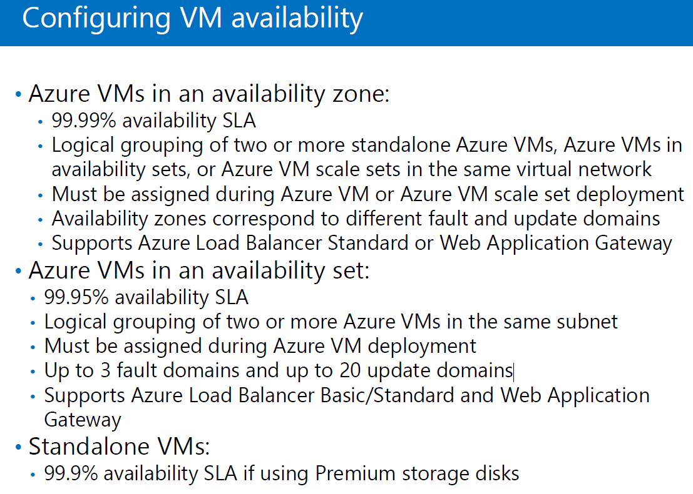

# 10979F Lab Answer Key

## VM availability Set(10979F -Module 3 10p.)

Availability : 가용성(서비스가 유지하게 하는 성질)
SLA : 서비스 유지 가능성

- availability zone
  - DataCenter간의 복제
  - 다른 DataCenter가 날아가도 복제된 정보가 있는 DataCenter에서 서비스 가능
  - 99.999% availability SLA : 1년에 1시간이하 빼고는 서비스 유지가 가능하다.
- availability set
  - Lack 단위
  - 같은 DataCenter 내에 다른 Lack에 데이터 복제
  - fault domain = Lack 
  - Up to 3 fault domains and up to 20 update domains
    : 3개의 Lack에 20개의 VM을 만들어 데이터 복제 해놓겠다.

Github
https://github.com/MicrosoftLearning/10979-Introduction-to-Azure-for-IT-Professionals/blob/master/Instructions/10979F_LAB_AK_02.md

==============
Get-Command 
Get-Process 
Get-Help Get-Process # Power Shell 주석
$env:PSModulePath

Install-Module -Name Az -AllowClobber	1. Azure Module 설치

import-module Az.Accounts			2. Azure Module 등록

Connect-AzAccount

Get-ExecutionPolicy # PowerShell 스크립트 실행 정책 
    # Rescricted  : 제한됨 (*.ps1 파일)
    # Unrestricted : 실행 (보안상 위험)

Set-ExecutionPolicy Unrestricted

===========