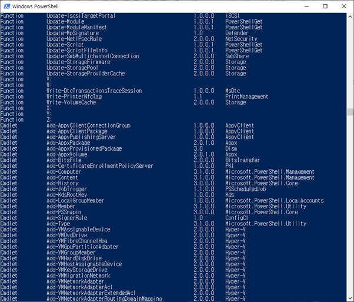
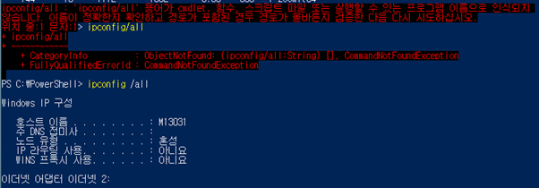
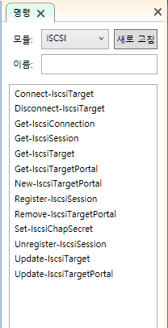

# 10979F - Module 2

- [PowerShell ISE](#powershell-ise)
- [PowerShell Module](#powershell-module)
- [Azure 가상 머신 포털](#azure-가상-머신-포털)

----

- PowerShell은 Azure portal, Visual Studio Tools에서 관리 가능하다.
- Window8.1 부터 PowerShell이 기본으로 설치되어 있다.
- PowerShell은 명령프롬프트(cmd)와 다르다.
- PowerShell의 명령어는 '동사-명사'로 이루어져 있다.
- 예 )  
  - get-command : PowerShell의 모든 명령어를 출력시켜라.
  -  get-command > powershell_command.txt : get-command 수행 결과를 powershell_command.txt에 저장하라.
  - get-process : 작업관리자의 process 정보를 출력하라.
- Cmdlet : PowerShell 명령어를 뜻함
- 구글에 'powershell 명령어이름' 검색하면 MicrosoftDocs에서 세부적인 설명을 보여준다.
- PowerShell 명령어 실행 

...

- cf ) 명령 프롬프트의 명령어를 그대로 사용할 수 있지만 명령어 옵션을 띄어써야 한다.

## PowerShell ISE

- Power Shell 명령어를 스크립트화 시킬 수 있다.
- F5 : 전체실행
- Block + F8 : Block한 부분만 실행

## PowerShell Module

- PowerShell  명령어 들의 집합
- 사용하기 위해서 Module를 등록시켜주어야 그 module과 관련된 명령어가 메모리에 저장되어 사용할 수 있게 된다. (import-Module 사용하기원하는Module)
- Cloud Shell은 이미 설치되어 있기 때문에 Module을 따로 설치할 필요가 없다.
- 해당 Module에서 사용할 수 있는 함수 보는 방법

## Azure 가상 머신 포털

https://docs.microsoft.com/ko-kr/azure/virtual-machines/windows/

- 포털
  - GUI
- PowerShell
  - Windows
  - TXT
  - CloudShell에서 그대로 사용가능
- CLI
  - 모든 운영체제에서 사용가능
  - TXT
  - CloudShell에서 그대로 사용가능

=> CloudShell을 사용하면 Module을 설치할 필요가 없으므로 CloudShell 사용을 권함