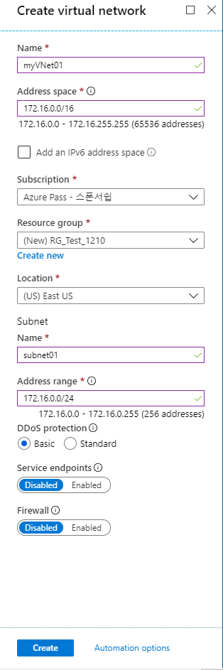
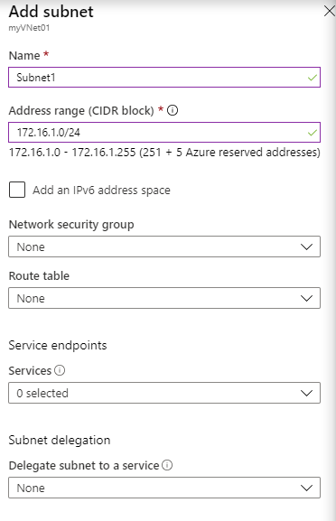
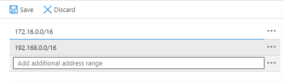
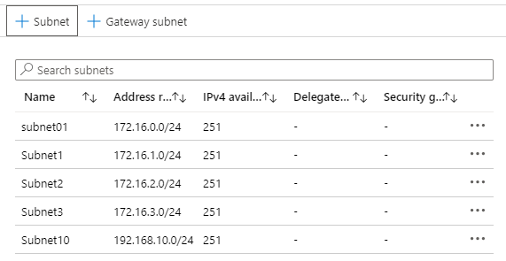

# 10979F Module 5

> Azure Portal -> Create a Resource -> Networking -> Virtual network ->
>
> 
>
> -> Create -> Resource groups -> RG_Test_1210 -> myVNet01 -> Subnets -> +Subnet ->
>
> 
>
> -> Address space ->
>
> 
>
> -> Save - > Subnets -> +Subnets -> ... ->
>
> 
>
> cf ) 다른 네트워크 대역도 등록해 놓았기에 Subnet10이 할당 가능하다.

