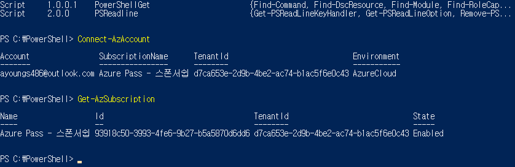
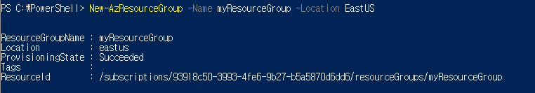
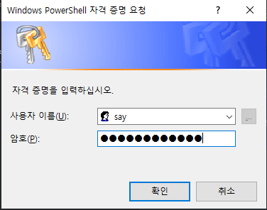
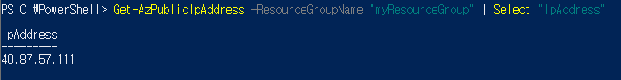
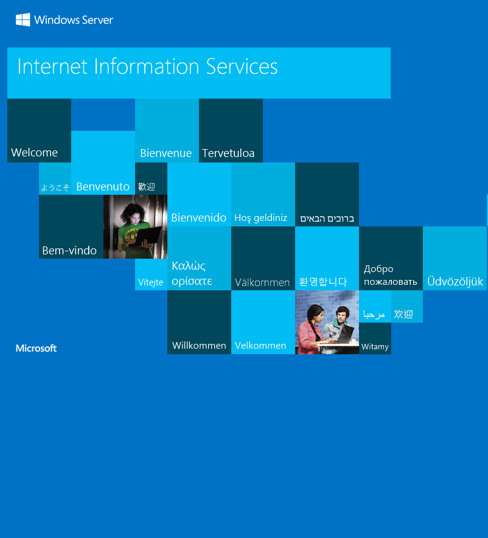
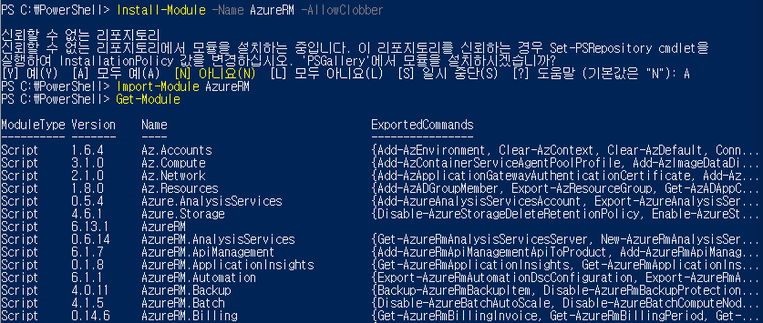

# Az 모듈 설치

- [PowerShell로 VM 만들기](#powershell로-vm-만들기)
- [AzureRM 모듈 설치 (옛날)](#azurerm-모듈-설치-(옛날))

----

- 정보  URL : https://docs.microsoft.com/en-us/powershell/azure/install-az-ps?view=azps-1.8.0&viewFallbackFrom=azps-1.2.0

- Az 모듈설치
```PowerShell
  Install-Module -Name Az -AllowClobber
```

- 실행 정책 허용
```PowerShell
Set-ExecutionPolicy Unrestricted
```

- 모듈 등록 & !!! 컴퓨터를 rebooting할 경우 여기부터 다시 실행 !!!
```PowerShell
import-module Az.Accounts
```

- 모듈 등록 확인
```PowerShell
get-module
```


- Azure 계정 인증 & 등록
```PowerShell  
Connect-AzAccount
```

- Azure 계정에서 가지고 있는 Subscription 확인
```PowerShell
Get-AzSubscription
```

- Subscription이 여러 개인 경우 사용할 Subscription 선택
```PowerShell
Select-AzSubscription -Subscription <Subscription ID>
```

Get-AzSubscription의 결과에서 나온 ID를 복사하여 <Subscription ID> 에 대입하여 입력해준다.

- PowerShell 실행 결과 창들
  
  


## PowerShell로 VM 만들기

- 리소스 그룹 만들기
``` PowerShell  
New-AzResourceGroup -Name myResourceGroup -Location EastUS
```


- 가상 머신 만들기
  명령어
           ㅡ parameter "value"
  cf ) value에 특수문자나 space가 있을 경우 " "로 묶고, 없으면 value 만 적어도 된다.

``` PowerShell
New-AzVm `
    -ResourceGroupName "myResourceGroup" `
    -Name "myVM" `
    -Location "East US" `
    -VirtualNetworkName "myVnet" `
    -SubnetName "mySubnet" `
    -SecurityGroupName "myNetworkSecurityGroup" `
    -PublicIpAddressName "myPublicIpAddress" `
    -OpenPorts 80,3389
# ` : 줄이 넘어가는 경우 연결 표시
```



-> 여기서 사용할 계정 이름과 암호 생성

- 가상 머신에 연결

``` PowerShell
Get-AzPublicIpAddress -ResourceGroupName "myResourceGroup" | Select "IpAddress"
```



 -> cmd 창에서 'mstsc /v: DNS주소 or IP주소' 로 들어가기

- 웹 서버 설치
방금 설치된 가상 머신의 PowerShell 에서 다음 코드 실행
  
``` Power
Install-WindowsFeature -name Web-Server -IncludeManagementTools
```


만들어진 VM의 DNS주소를 크롬에 입력하면 다음과 같은 페이지가 나타나면 잘 만들어진 것이다.




## AzureRM 모듈 설치 (옛날)

**더이상 등록이 안되므로 시도하지 말자**

정보 URL : https://docs.microsoft.com/ko-kr/powershell/azure/azurerm/install-azurerm-ps?view=azurermps-6.13.0

- AzureRM 모듈 설치

```Powershell
Install-Module -Name AzureRM -AllowClobber
```

- AzureRM 등록

```powershell
Import-Module AzureRM
```

- 등록된 모듈 확인

```powershell
get-module
```




- Azure 계정 인증 & 등록

```powershell
Connect-AzureRMAccount
```

- 계정의 Subscription 확인

``` powershell
Get-AzureRMSubscription
```

- 사용할 Subscription 선택

``` powershell
Select-AzureRMSubscription -Subscription <Subscription ID> 
```