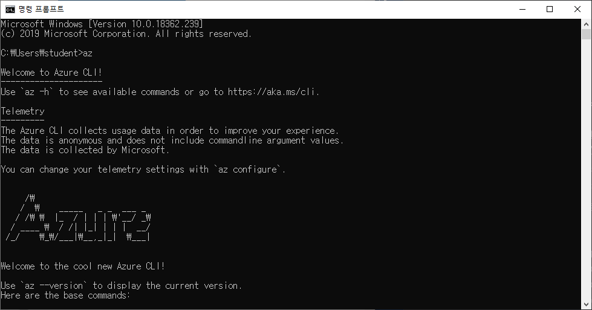
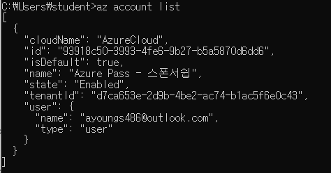
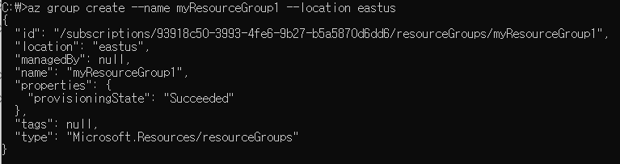
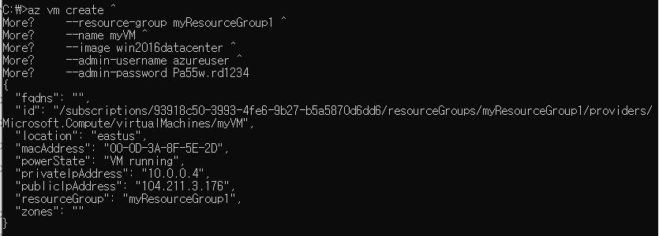
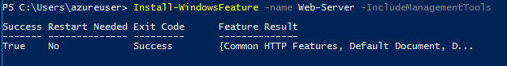
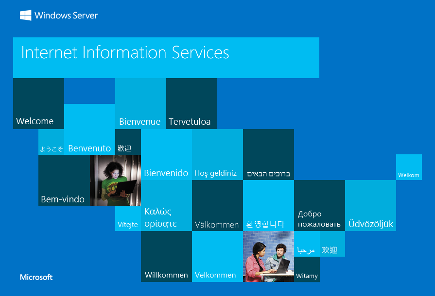

# Azure CLI 설치

- [Azure CLI로 VM 만들기](#azure-cli로-vm-만들기)

----

- https://docs.microsoft.com/en-us/cli/azure/install-azure-cli-windows?view=azure-cli-latest

> 위의 사이트에서 'azure-cli-2.0.63.msi' 를 다운받아 설치 
> -> I accept -> install ->finish

> 명령 프롬프트 as 일반모드 -> az
>
> 
>
> > cf ) 밑에 나오는 함수는 'az 함수이름'로 입력하면 사용할 수 있다.
>
> -> az login
>
> 
>
> -> az account list    (<= Subscription 출력)
>
> 
>
> -> az account set --subscription <value of the subscription id property>    (<= Subscription이 여러 개일때 사용할 Subscription을 선택)

## Azure CLI로 VM 만들기

- 리소스 그룹 만들기

``` Azure CLI
az group create --name myResourceGroup1 --location eastus
```

  

  ; json 형식

- 가상 머신 만들기

``` Azure CLI
az vm create ^
    --resource-group myResourceGroup1 ^
    --name myVM ^
    --image win2016datacenter ^
    --admin-username azureuser ^
    --admin-password Pa55w.rd1234
```

  cf ) ^ : 다음 줄로 넘어 간다는 표시
  


- 웹 트래픽에 대해 포트 80 열기
  
``` Azure CLI
az vm open-port --port 80 --resource-group myResourceGroup1 --name myVM
```

  

  ... -> 방화벽 정보를 .json 형식으로 출력

- 가상 머신에 연결

``` powershell
mstsc /v: publicIPAddress
```

- 웹 서버 설치

``` powershell
Install-WindowsFeature -name Web-Server -IncludeManagementTools
```

  

- 작업에서 웹 서버 보기
  

  -> 완료, 끝

