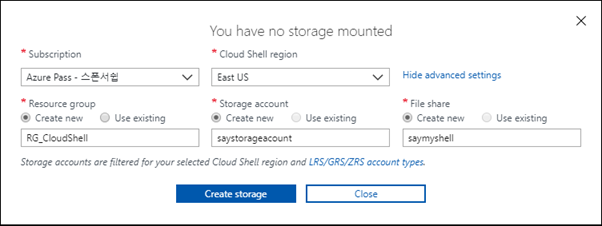

# 0.CLI

- [Cloud Shell](#cloud-shell)
- [PowerShell](#powershell)
- [Azure CLI](#azure-cli)

----

## Cloud Shell

- Azure Portal에서 사용할 수 있는 쉘 (마크 : >\_ ), Power Shell과 Bash 를 사용할 수 있다.
- Cloud Shell 을 처음 쓸 때 Storage를 먼저 만들어야한다.
- Cloud Shell 명령어가 따로 있는 것이 아니라 PowerShell이나 Azure CLI 둘 중 원하는 것을 사용한다.
- 예제에 따라 PowerShell or Azure CLI의 명령어만 존재하여 둘 다 알고 있어야 한다.

Azure Portal에서 Cloud Shell 생성시 세부사항 지정

## PowerShell

- Windows 에서 사용 가능한 쉘 (명령어가 길고, 복잡하다)

## Azure CLI

- Windows, MAC, LINUX 에서 사용가능한 쉘 (명령어가 짧고, 단순하다)