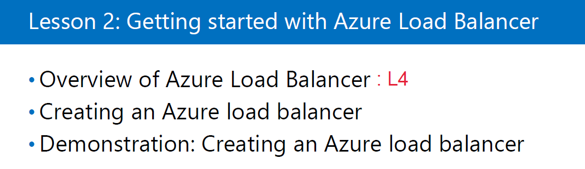

#  LoadBalancer

## 10979F - Module5(9p. ~ 11p.)

- Fronted IP configuration

  - LoadBalance 구성 할때 Client가 접속하는 대역
- probes
    - LoadBalance가 뒷단의 Backend pool에 VM이 살았는지 감시하는 장치(VM의 상태를 확인하는 장치, 5초마다)
- Backend pool
                            - LoadBalance가 부하분산 처리할 대상
                            - VM이 여기에 있음
                            - VM들의 pool을 만들어 놓음
- NAT rules
  - 사설 IP를 공인 IP로 바꿔줌
- LB(LoadBalance) rules
     - LB가 부하분산 처리할 IP포트 맵핑