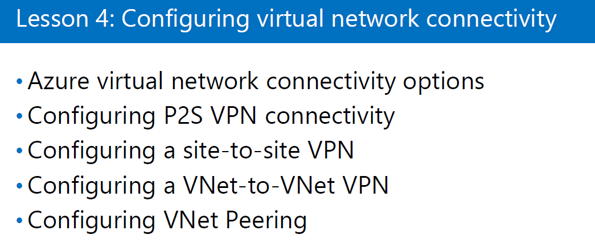

# VPN

## 20533E - Module(30p. ~ 31p.)

- 회사망(Private 망) <- 사설 IP 사용
  - 기본적인 방법으로는 회사밖에서 접근 못함

- VPN
  - 집에서 회사망에 접속할 수 있도록 도와주는 기술
  - VPN이 집에 있는 컴퓨터와 회사망 사이에 가상의 터널을 만들어 마치 집에있는 컴퓨터가 회사망 안에 있는 것처럼 처리되게 함.
  - 터널링 기술 사용

------

VPN : 원격에서 회사 네트워크 접근

터널링

- PPTP : 초장기 기술로 지금은 사용 안함
- L2TP / IPSet(암호화 기술)
  - 방화벽을 많이 열어줘야 함
- SSTP : TCP 443 (SSL)
  - 443번 포트 하나면 열어주면 된다.
- IKEv2 : 세션을 서버에서 자동으로 접속
  - 보통 Client가 세션이 끊기면 Client가 다시 세션을 맺어야 하지만 IKEv2는 서버에서 먼저 세션을 연결한다.

-----

- P2S VPN
  - 외부 컴퓨터(Point) 회사망(Site)
  - 외부 컴퓨터 한대가 회사망에 터널링으로 연결하는 커넥션
- stie-to-site VPN
  - 본사와 지사가 가지고 있는 라우터 '장비'에 Setting하여 VPN 연결
  - 마치 두 site가 하나의 Network를 사용하는 것처럼 만들어짐
- VNet-to-VNet VPN
  - 다른 장소에 있는 VNet과 VNet을 연결하는 터널링
  - 두 개의 VNet을 하나 처럼 사용함

