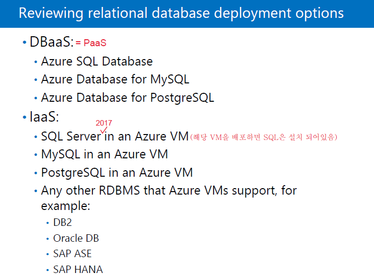
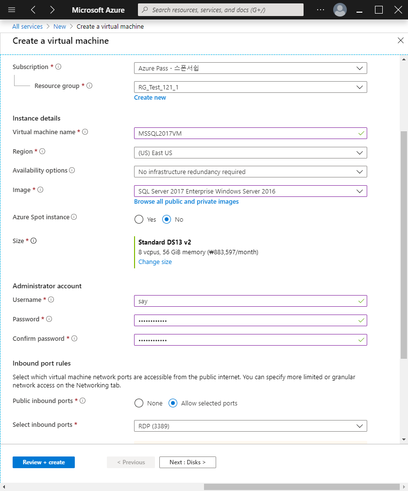
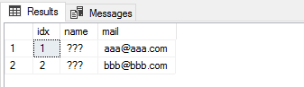
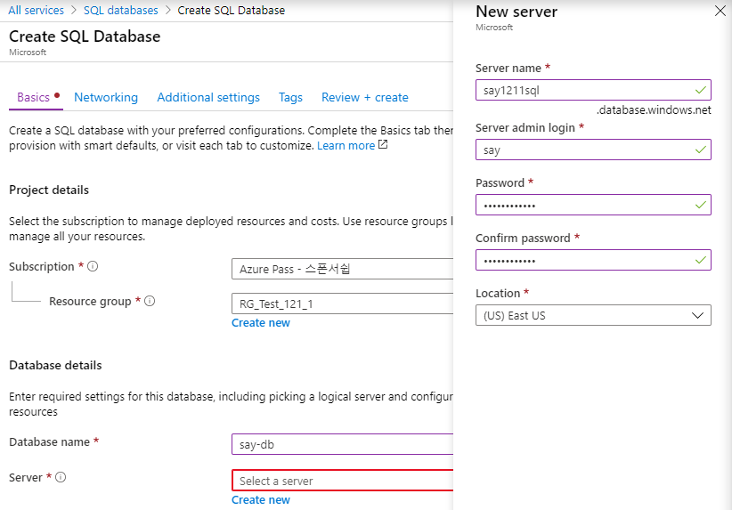
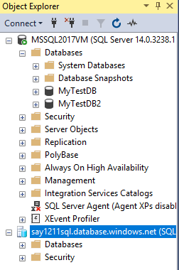
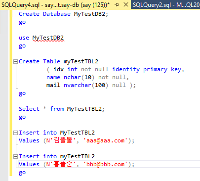

# Azure SQL

- [10979F Module6 Lesson3](#10979f-module6-lesson3)
- [SQL in an Azure VM](#sql-in-an-azure-vm)
  - VM 만들기
  - SQL 사용하기
- [SQL 특징](#sql-특징)
- [PaaS 환경으로 SQL 생성하기](#paas-환경으로-sql-생성하기)
  - SSMS(SQL Server Management Studio)

----

## 10979F Module6 Lesson3

Data Services = Azure SQL


- Azure SQL
  - PaaS
  - 사용자 DB만 관리 가능, 시스템 DB 관리 불가
- SQL in an Azure VM
  - IaaS
  - SQL이 설치된 VM을 배포하면, VM에 SQL이 설치된 상태로 배포됨
  - OS 패치, SQL 패치, 레이드 설계 등등 직접 진행
  - 시스템 DB 관리가능




- DBaaS ( = PaaS )
  - DB 하단에서 관리하는 이슈 포인트가 굉장히 많다. 하여 대부분을 MS에서 관리하고 사용자 DB만 관리

## SQL in an Azure VM

### VM 만들기

> Create a resource -> Databases -> See all -> Featured See More 
>
> -> SQL Server 2017 Enterprise Windows Server 2016 ->
>
> 
>
> -> Review +  creat -> Create

- cf ) SQL Database 서비스 = PaaS

### SQL 사용하기

 - 사용자 DB 생성하기

> 시작 -> SQL Server Tools 17 -> Server Management Studio ; SQL Server 관리 툴 -> Connect -> New Query -> 
>
> ```sql
> Create Database MyTestDB;
> go
> ```
>
> -> block 잡고 Excute(F5) -> Refresh -> 사용자 DB인 'My TestDB' 생성
>
> 

- 내가 만든 DB 접속

``` sql
use MyTestDB
go
```

- DB에 Table 만들기

```sql
Create Table myTestTBL2
  		( idx int not null identity primary key,
  		name char(10) not null,
		mail varchar(100) null ) ;
go
-- column name이 idx, name, mail인 텅 빈 Table 생성
```


- Table 들어가기

```sql
Select * from MyTestTBL;
go
```


- Table에 내용 채우기

```sql
Insert into MyTestTBL2
Values ('김똘똘', 'aaa@aaa.com');
  
Insert into myTestTBL2
Values ('홍똘순', 'bbb@bbb.com');
go
```

- 내용 확인

```sql
Select * from MyTestTBL2;
go
```

  

- 한글 나타나게 하기

  > MyTestDB2 -> Properties -> Options -> Collation : Korean_Wansung -> OK
  
  
## SQL 특징

- SQL은 Excel과 비슷하다

- cf ) Excel : 개인용DB

- SQL은 Network에 있는 사용자들이 동시에 사용가능

- record를 무한히 넣을 수 있다.

- 서버에 설치 되어야 한다.
  
  
  

## PaaS 환경으로 SQL 생성하기

> Azure Portal -> Create a Resource -> Database -> SQL database -> Create ->
>
> 
> 
>
> -> Review + create -> Create

- 방화벽 열기; 보안을 위하여 접근할 Client IP 주소를 입력해줘야 한다.

> 해당 SQL -> Set server firewall -> 
>
> 
>
> -> Save; 고정IP가 아닐 경우 변동된 IP를 계속 등록해줘야 한다.

----

### SSMS(SQL Server Management Studio)
- Local, Remote SQL Server 관리 툴
- 다른 서버에 있는 SQL를 한 서버에 모두 연결해서 한 컴퓨터에서 IaaS뿐만 아니라 PaaS에 있는 SQL까지 관리 가능하다.
- MS SQL 원격관리를 위한 포트
  - TCP 1433

----

- SSMS에서 Connetion하기 




- cf ) PaaS에서 한국어 지원이 안되서 사용하려면 유니코드로 작성하여야 한다.


