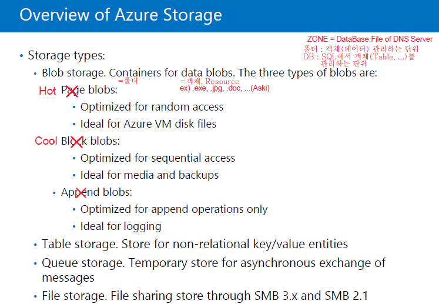
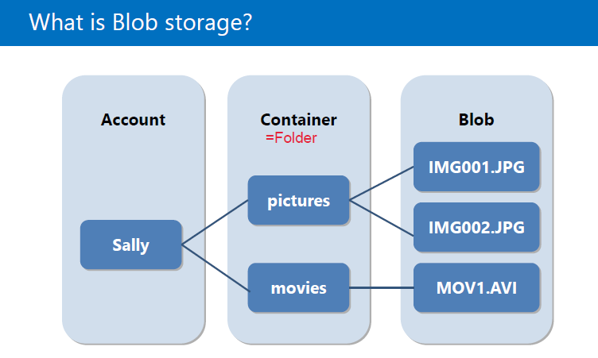
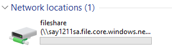
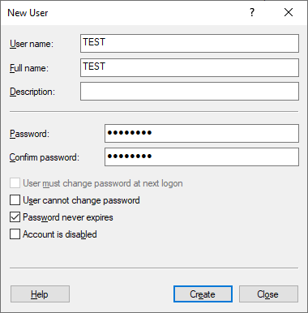

# Azure Storage

- [10979F Module6 Lesson1](#10979f-module6-lesson1)
- [Stroage Account 만들기(Azure Portal)](#stroage-account-만들기(azure-portal))
- [Storage Explorer 프로그램](#storage-explorer-프로그램)
- [드라이브 공유를 통한 Storage 관리하기](드라이브-공유를-통한-storage-관리하기)
- [cf. VM사이에 공유폴더 만들어 연결하기](#cf.-VM사이에-공유폴더-만들어-연결하기)

----

## 10979F Module6 Lesson1


- Azure Storage

  -  VM에 들어가 있는 서비스
  - Azrue의 데이터를 저장하는 장소

----

cf )  VM
- disk, vNet, Public IP, NIC(LAN 카드), NSC(방화벽) 서비스 등 여러가지의 서비스가 합쳐져서 만들어 진다.
- ARM(Azure Resource Manager)로 바뀌어 각각의 서비스를 따로 볼 수 있다.

----

- Storage 종류

  1. Blob storage(Containers)
  2. Table storage
  3. Queue storage
  4. File storage
- Storage Account(Storage에 접근하기 위한 계정)를 만들어야 Storage를 사용할 수 있다.




- Blob storage -> Containers 로 이름 바뀜
  - Hot = Page blobs
    - 랜덤 엑세스에 최적화
    - VM에 attach 되는 Disk File에 사용됨
  - Cool = Block blobs
    - Sequential access(가끔 필요할 때 access)에 최적화
    - .iso 데이터 파일 형식(OS or Backup File)에 사용됨
    - 자주 들어가면 요금이 많이 과금된다.
  - Append blobs
    - 지금은 사라짐
    - 블록으로 구성되어있고 추가 작업에 최적화
    - 소프트웨어가 실행될 때 발생하는 이벤트를 추적하는 수단으로 사용됨
  
- Table storage
  - NoSQL로 키와 값을 실시간으로 Azure에 업로드
  - 센서 등과 같은 대량의 데이터를 처리하는 storage
  
- Queue storage
  - 메일에 사용하는 형식으로 사용자들의 정보를 받아 알림을 자동으로 보냄
  - 프로그램 알림(notification)
  - 하나의 메세지를 모든 사용자에게 전달하는데 메세지가 Queue Storage에 저장되어 있음
  - 임시저장된 상태로 보관하다가 사용자에게 전달
  
- File storage
  
- Azure로 공유폴더에 접근하는 방식으로 SMB 3.8을 사용
  

cf ) Azure Portal의 Storage에서 궁금한 storage 밑의 Learn more를 클릭하면 더 많은 설명을 볼 수 있다.





## Stroage Account 만들기(Azure Portal)

> Azure Portal -> Create a Resource -> Storage -> Storage account ->  Create -> 
> 
>
> - Standard : HDD, Premium : SSD
>
> - StorageV2 : 기본
>
> - LRS : 하나의 데이터 센터 안에서 3개를 복제함
>   ZRS : 쌍이 되는 데이터 센터와 나누어 복제본 3개를 나눠가짐
>   GRS : 데이터 센터 간에 복제함
>   RA-GRS : 원본에서 Read/Write 가능하지만 복제본은 Read만 가능
>
> - Cool : 가끔, Hot : 자주(v)
>
> cf ) Azure 서비스 중에 Storage 서비스가 굉장히 쌈.
> cf ) VM서비스를 중지하더라도 disk에 대한 과금은 일어남.
>
> -> Next ->
>
>  
>
> - Public endpoint : Azure 외부에서 접근 가능
> - Private endpoint : Azure 내에서만 접근 가능
>
> -> Review + create -> Create

## Storage Explorer 프로그램

- 컴퓨터에서 Azure의 storage를 탐색기처럼 관리하게 도와줌
- Google에 Azure Storage Explorer 검색
  -> https://azure.microsoft.com/ko-kr/features/storage-explorer/ 에서 다운로드후 설치
- Azure Storage에 연결
  - Azure 계정 추가
    - Azure 환경
      - Azure China, Germany : Azure 망이 막혀있어 특수한 Azure DataCenter로 들어가야함.
      - 일반적으로는 Azure 선택해서 들어감
  - 본인 계정 인증 -> 본인이 관리할 수 있는 모든 Subscription이 나타남
- Premium Storage를 만들 경우 모든 Storage가 나타나지 않고, Blob Storage만 나타난다.

## 드라이브 공유를 통한 Storage 관리하기

- Storage Explorer에서 More -> Connect VM -> URL 복사
  <`net use [drive letter] \\say1211sa.file.core.windows.net\fileshare /u:say1211sa Yb/55+XUGQyun9ELhzuWYSDq9P67DUuFAT+alm2KCycJNVk5EnNVpjZFEfkghJ8heBv21kaDxptXst7TWOhN3A==`
  에서 '[drive letter]' 를 예를 들어 'K:'로 바꿔줘야 한다.>
  -> 관리자 권한 cmd 창에 입력 -> 완료




- 이를 통해 Storage Explorer를 통하지 않아도 편하기 Storage를 관리 할 수 있다.

## cf. VM사이에 공유폴더 만들어 연결하기

- 공유포트 (SMB3.0)
  - TCP 445
  - SMB 2.0 인 경우 밑에 Port도 열어줘야 한다.
    - TCP 139
    - UDP 138
    - UDP 137
- 고급 방화벽 열기 : 실행 -> wf.msc
- NSG(Network Security Group)에서 Port 열어줌
> 열어줄 VM의 Network security group -> Inbound security rule -> Add -> 
> 
>
> -> Add

> VM의 Server Manager -> Tool -> Computer Management -> Local User and Groups 
>
> -> Users 폴더 오른쪽 클릭 -> New User ->
>
> 
>
> -> Create

> 내 폴더를 공유할 사람의 vm에서 cmd 창
>
> ```cmd
> net use Y: \\13.82.104.146\sayshare /u:test
> # net use 할당할_드라이브_대문자: \\내_Public_IP_Address or DNS_name\share할_폴더_이름 /u:허용해줄_User_name
> ```
>
> 
>
> -> 연결 완료


- 연결 완료 됬지만 들어가 지지 않을 때
> 
>
> 보안에 Users 계정 or 해당 계정이 들어가 있나 확인하고 없을 경우 넣어주기

