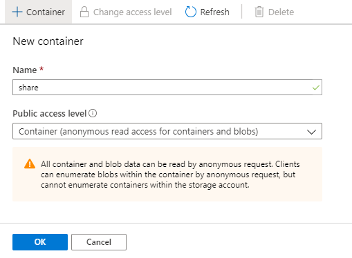
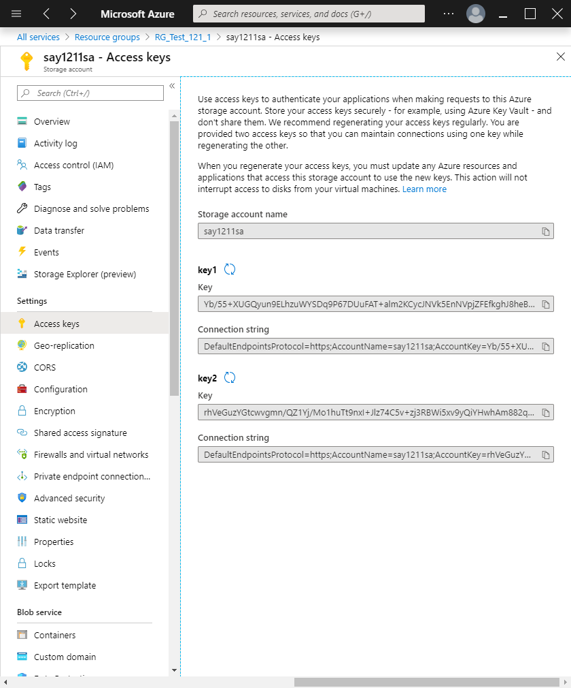

# Azure Storage에서 하위 Storage 만들기

- [Container 만들기](#container-만들기)
  - [1. 파일 업로드 하기](#1.-파일-업로드-하기)
    - Azure Portal
    - Storage Explorer
  - [2. Blob Storage Access URL](#2.-blob-storage-access-url)
    - Azure Portal 이용
      - Generate SAS
      - cf. Access keys
    - Storage Explorer 이용
- [File Storage 만들기](#file-storage-만들기)

----

## Container 만들기

>  Azure Portal -> 해당 Storage -> Container -> +Container
>
>  -> Name : share, Public access level : Container -> OK
>
>  

- anonymous : 익명사용자라는 의미로 Azure Pass가 없는 사람이 사용가능하게 하는 옵션이다.
- Private : 혼자만 접근 가능
- Blob : Blob 파일만 접근 가능
- Container : Container 밑의 Container와 Blob 모두 접근 가능

### 1. 파일 업로드 하기

#### Azure Portal

> Azure Portal에서 Storage Account -> 해당 Storage Account -> Containers 
>
> -> 해당 Container -> Upload -> Files Search -> Upload

- 계정과 Subscription이 많을 때는 로그인, 로그아웃을 반복하여 Storage를 관리하여야 한다.

#### Storage Explorer

> Storage Explorer 프로그램 -> Subscription -> 해당 Storage Account
>
> -> 해당 Storage -> 해당 Container -> Upload
>
> => 폴더 or 파일 업로드 ->원하는 폴더 or 파일 선택 -> Upload
>
> or => 파일 드래그 하여 업로드

- 계정과 Subscription을 많아도 등록해두면 로그인, 로그아웃 필요없이 한 번에 Storage를 관리를 할 수 있다.

### 2. Blob Storage Access URL

#### Azure Portal 이용

- 위의 위치에서 URL을 복사하여 크롬 주소창에 입력하면 해당 파일을 볼 수 있다.

##### Generate SAS

- SAS : Shared Access Signature

- 특정 문서를 공유할 때 / 특정 날짜, 시간에만 / W, R 여부 / 허용 IP 설정 / 을 통해 공유가능하도록 설정

-  HTTPS : TCP 443(암호화), HTTP : TCP 80
- Blob SAS URL = URL?Blob SAS token
- Blob SAS URL을 공유하면 된다.

##### cf. Access keys

- Connection string : 프로그램에서 SQL로 Azure Storage에 접근하기 위해 만들어지는 key 이다.

#### Storage Explorer 이용

- 해당 파일 오른쪽 클릭 -> URL 복사
- 바로 열 경우 : 해당파일 더블 클릭

## File Storage 만들기

> 해당 Storage -> File shares -> + File share 
>
> -> Name : fileshare, Quota : 100 GiB(나중에 수정 가능) -> Create

- cf )
      - 100 GB : 2진법 계산으로 실제로는 약 98 GB 할당 된다.
      - 100 GiB : 정확하게 100 GB 할당