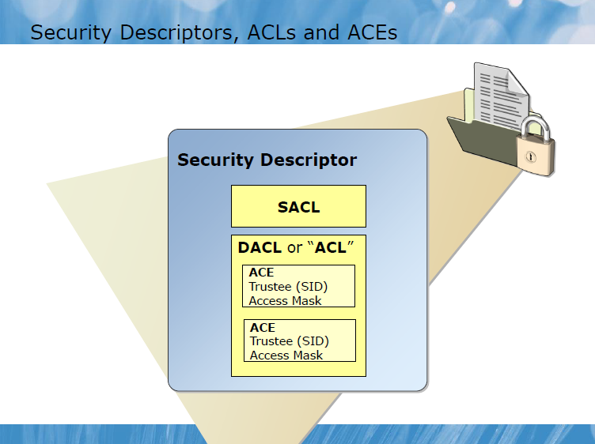
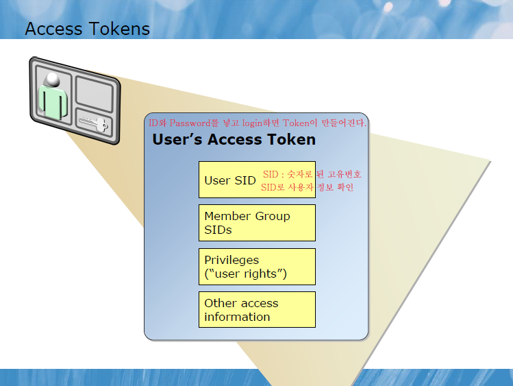
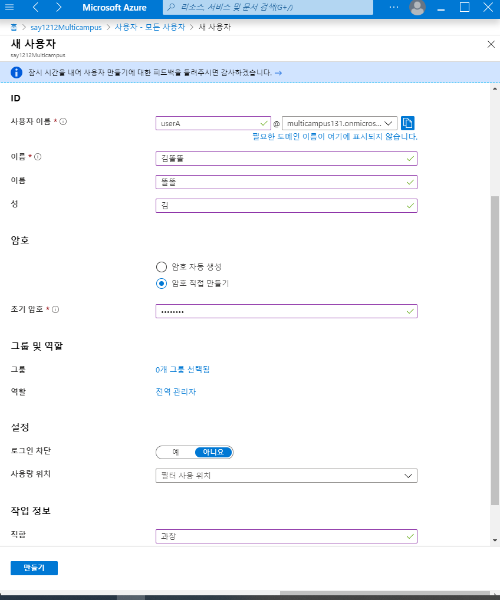
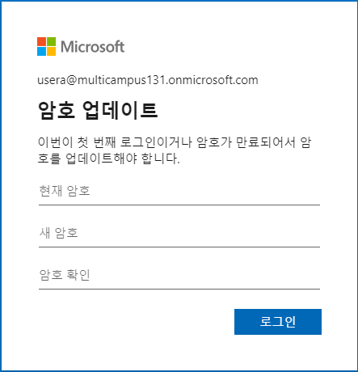
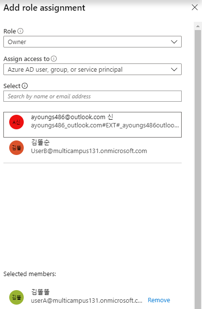
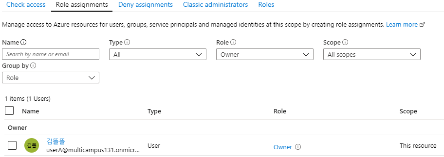

# AAD(Azrue Active Directory)

- [Active Directory](#active-directory)
  - [1. Domain](#1.-domain)
  - [2. WorkGroup](#2.-workgroup)
  - [3. DC(Domain Controller)](#3.-dc(domain-controller))
- [6425C_01 Acrive Directory.pdf](#6425c_01-acrive-directory.pdf)
- [AAD 만들기(Azure)](#aad-만들기(azure))
  - [1. User 생성](#1.-user-생성)
  - [2. User login](#2.-user-login)
  - [3. MFA(Multi Factor Authentication)](#3.-mfa(multi-factor-authentication))
  - [4. 로그인 기록](#4.-로그인-기록)

----

## Active Directory

- MS Directory Service  <- LDAP
  - MS에서 관리하기 쉽게 만들어 놓은 Service
- x.500 ( Directory Service의 표준 ) <- DAP 
  - 서버장비회사(IBM, SUN->EMC->DELL, Nobell->X, HP)에서 만든 Directory Service로 관리하기 너무 복잡하고 어렵다
- 각 컴퓨터의 계정 그룹 보안정보
- 중앙에서 처리되는 서비스

### 1. Domain

- 하나의 보안 단위
- SSO (Single Sign On)
- 중, 대규모 네트워크 환경
- DC(Donmain Controller)에서 인증(Authentication; Credential( = ID + Password) 확인), 허가(Authorization) 
- 중앙화된 관리 (GPO)
- DC라는 컴퓨터가 있어야 도메인 환경을 만들 수 있어야 하므로 반드시 있어야 한다.
- DC에 Server를 깔아놓는데 여기에 AD DS(Active Directory Domain System)을 설치하여야 한다.
- 도메인의 계정을 DC에서 만들어 도메인의 계정을 각자 컴퓨터에 가져와 보안을 Setting 함
- 로그인 할 때 DC에서 인증을 받고 token을 부여받아 네트워크에 있는 다른 서버를 이용할 때 인증할 필요 없음 ( = SSO)

### 2. WorkGroup

- 각각의 시스템이 보안 단위
- 소규모 네트워크 환경에서 사용 (20대 미만)
- 각자의 시스템에서 인증처리 (SAM 파일로 인증)
  
- A컴퓨터가 같은 작업그룹에 있는 B 컴퓨터에 접근하려면 인증창이 나타나 B 컴퓨터에 있는 계정으로 인증을 하여야한다. 이를 다른 컴퓨터에 들어갈 때마다 반복하여 인증해야 한다.
- 계정의 비번을 변경하면 각자 컴퓨터에 있는 계정의 비번을 모두 변경해 주어야 하기 때문에 일이 많아진다.

> Server Manager -> Local Server -> Workgroup 에서 Workgroup과 Domain을 수정 가능하다.

### 3. DC(Domain Controller)

- Server manager -> Tool -> Roles and Features -> next ->next -> next -> Server Roles에서 볼 수 있음 

1. Active Directory Domain Service (AD DS)
   - 도메인 서비스안에 계정이 만들어져 인증하고 허가하고 관리 를 다함

2. Active Directory Lightweight Domain Service (AD LDS)

   - 디렉토리 서비스의 간략한 정보를 가지고 있음
   - DMZ에서 주로 사용

3. Active Directory Cartification Service (AD CS)

   - Active Directory에서 인증서를 배포하는 서비스 (인증서를 통해 암호화 복호화 진행)

4. Active Directory Right Management Service (AD RMS)

   - 권한 관리

5. Active Directory Federation Service (AD FS)

   - 도메인과 도메인 사이에서의 SSO
   - A회사의 사원이 B 회사의 공유서버에 접근하려면 B의 DC에서 접근가능하도록 인증해 줘야함. but, Federation을 맺으면 B의 DC에서 인증 필요 없이 A의 DC의 인증만으로 접근가능함;
   - 회사와 Azure 사이에 Federation Service가 있다면, Azure Directory 계정없이 회사 계정으로 Azure 서비스를 이용가능하다.

- 제일 밑에 AD DS가 구성되어 있고 그 위에 CS, FS, LDS, FS가 올라간다.

## 6425C_01 Acrive Directory.pdf

- SACL : 컴퓨터 이용한 전체 로그, 감사에 대한 Setting
- DACL or "ACL" 
  - Access Controll에 대한 권한 설정
  - 상속된 권한은 제거 불가 / 추가만 가능
    - 상속을 Disable로 만들어 줘야한다.
    - 해당 폴더 속성 -> 보안 -> 고급 -> 상속 안 함 -> 변경함 -> 확인 -> 편집 -> 원하는 상태로 만들어주기 -> 확인

- ACL(Access Control List) or DACL : 

- SACL : 

## AAD 만들기(Azure)

> Azure Portal -> Actvie Directory -> 기본 디렉터리 -> Create a dirctory -> Next : Configuration -> 
>
> 
>
> -> Next : Review + create -> Create
>
> 
>
> -> 생성완료

- Tenant : Directory를 만들면 생성됨, 하나의 보안 단위, 하나의 Directory

### 1. User 생성

> Users -> +New user ->
> 
>
> -> Create

- RBAC(Role Base Access Controll)
  - Azure에 만들어 놓은 Role에 계정을 할당해 놓으면 Azure Role에 적용 됨
  - !!! Global Administrator !!!
    - Azure의 전반전인 모든 서비스뿐만 아니라 Microsoft 서비스에 대한 모든 권한을 갖게 된다.
  - Azure AD에 Premium 버전을 가지고 있어야 Custom Role을 만들어 사용할 수 있다.
- 사용량 위치 : 어느 지역의 데이터센터를 사용할지 한정

### 2. User login

- usera@multicampus131.onmicrosoft.com 계정으로 로그인

- 현재암호 : 관리자가 부여해 준 암호, 새 암호 : user가 부여하는 암호
  
  
- User 계정에 Subscriptions을 등록 해 놓아야 Resource Access를 할 수 있음
  
  > Subscription이 있는 계정 -> Subscriptions -> 해당 Subscription 클릭 
  >
  > -> Change directory -> 새로 만든 디텍터리로 변경 -> Change 
  >
  > -> 새로 만든 디렉토리의 Subscription에 있는 지 확인
  
  > 해당 Subscription -> Access control (IAM) ; Subscription에 권한을 줄 수 있는 곳 
  >
  > -> Add -> Add role assignment ->
  > 
  >
  > -> Save ->
  >
  > 
  >
  > -> 할당 완료
  
  - userA로 로그인하여 확인

### 3. MFA(Multi Factor Authentication)

- MFA(Multi Factor Authentication) : 다단계인증

  - Azure Premium이상으로 업그레이드 필요

> Azure Active Directory -> User -> 해당 계정 -> Authentication methods 
>
> -> 인증 연락처 정보 -> 저장 -> WFA 다시 등록 필요 -> 비밀번호 재설정 -> 재설정 
>
> -> 임시비밀번호 복사 하여 다시 로그인하면서 비밀번호 재설정

- Subscription은 하나의 디렉토리만 적용가능하다.
- 디렉토리에는 여러 개의 Subscription이 적용 될 수 있다.

### 4. 로그인 기록

- ADD -> Sign-ins 
  - 사용자들이 언제, 어떤 IP로 들어왔는지 확인 가능하다.