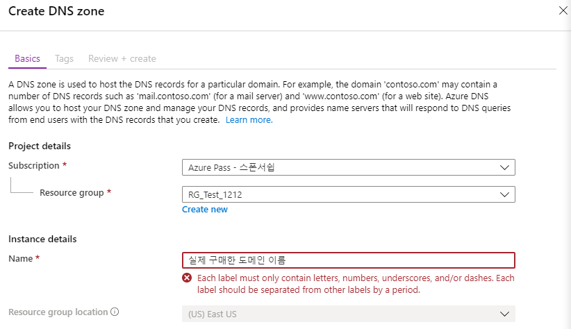
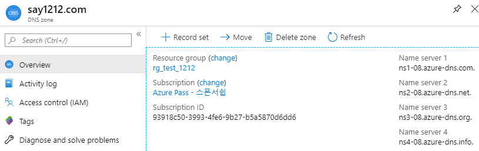
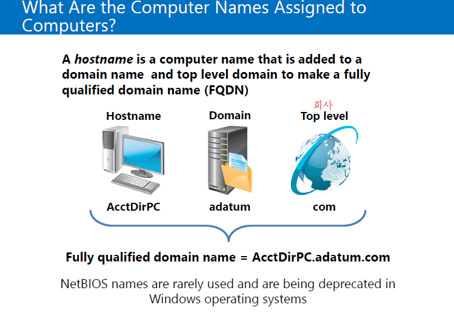
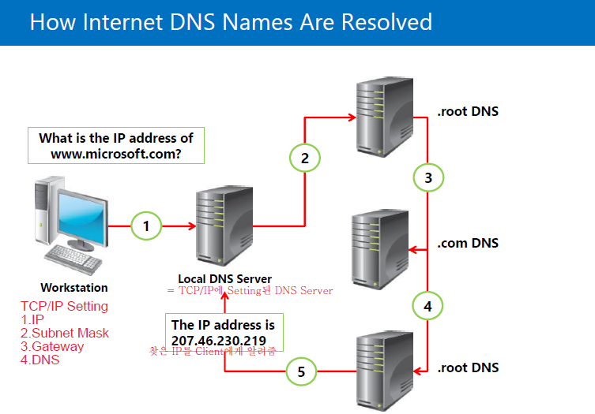
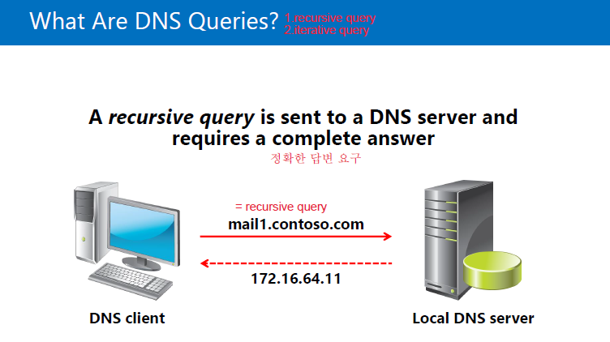

# Azure DNS

- [Azure DNS 만들기](#azure-dns-만들기)
  - [Record](#record)
- [20410D_07 DNS.pdf](#20410d_07-dns.pdf)

DNS (Domain Name System)

- FQDN을 IP Address로 변환, 서비스의 위치 검색
  - www.naver.com =DNS=> 210.89.160.88
  - www.**naver.com** = Host+**Domain Name** = FQDN
    - Domain name = Network ID
    - Host(ex. www) = Network에 있는 각각의 컴퓨터

## Azure DNS 만들기

>  DNS Zone -> Add ->
>
>  
>
>  cf ) 앞에 www 는 적지 않음
>
>  -> Review + create -> Create

> 
>
> Name Server 1,2,3,4를 Domain업체에 직접 등록하여 매칭시키면 제대로 작동 됨

> AAD -> Custom domain names -> Add custom domain ->  Custom domain name 입력 -> Add domian -> 
>
> 
>
> 를 이용하여 Domain Setting
>
> -> Verify -> 오류없이 잘 작동하면 성공

- 도메인 연동에 성공하면 새로운 계정을 등록할 때 user name에서 @뒤에 연동한 도메인이 나타난다.

----

### Record

- SOA : 권한의 시작
- NS : Name Server를 지정
- A : Host Name => IPv4 Address로 매핑
- CNAME : Host Name을 다른 Host Name으로 매핑
- SVR : Service의 위치 정보를 알려줌
- PTR : IP Address => Host Name로 매핑
- AAAA : Host Name => IPv6 Address로 매핑

- MX : 메일 서버를 지정
  - ALIAS OR HOST NAME : @
  - DESTINATION OR POINT TO ADDRESS : ms67059357.msv1.invalid
  - TTL : 3600
  - PRIORITY : 32767
- TXT : 특정 서버를 지정
  - ALIAS OR HOST NAME : @ ; 자기자신을 의미함
  - DESTINATION OF POINT TO ADDRESS : MS=ms67059357
  - TTL : 3600
- AD에서 제공하는 Domain Name을 MX와 TXT를 잘 Setting하여 넣으면 회사 Domain으로 AD를 사용할 수 있다.

---

- Domain Setting

> DNS Zone -> 해당 DNS -> Record set ->
>
> 
>
> -> OK -> Record set ->
>
> 
>
> -> OK

## 20410D_07 DNS.pdf

- 이름 풀이 (Name Resolution)
  - Host 이름을 IP Address로 변환하는 과정
    1. DNS Cache (hosts)
    2. Local DNS

- cmd 창 

  - ipconfig /displaydns ; RAM(Memory)에 있는 DNS의 Cache를 보는 명령어
  - ipconfig /flushdns ; DNS의 cache를 모두 날리는 명령어

- cache

  - 장점 : 서버의 부하 감소
    - 서버에 요청하기 전에 cache를 이용하여 정보를 받으므로 서버에 요청이 줄어든다.

  - 단점 : 부정확
    - 캐시를 처음 받은 후에 서버가 업데이트 됬을 경우 적용되지 않음

- `C:\Windows\System32\drivers\etc\hosts`; flushdns  적용 안됨

  - 마지막줄에 `naver.com IP	aaa		aaa.aaa.com` 입력 -> 저장
  - URL에 `aaa.aaa.com`입력시 NAVER 열림
  - 해킹을 당한 후 정상적인 도메인으로 이상한 사이트가 들어가지면 hosts 파일이 변경된 것

