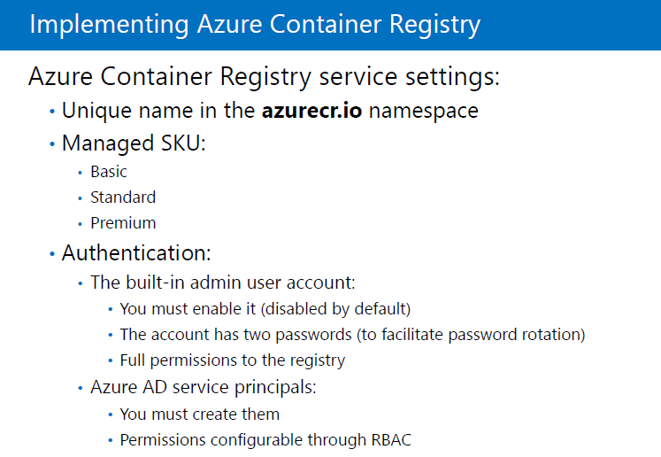
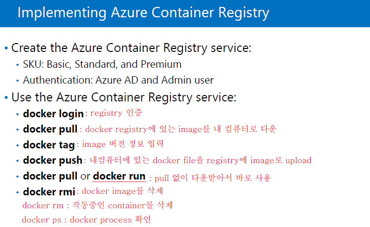

# ACS(Azure Container Service) 

- 10979F_Module 7

- Window 운영체제에도 Container engine이 있음

- 밑에 docker만 있으면 window, linux, cloud 에 상관없이 작동 됨

- 전에는 개발 소스를 서버에 올리면
  - 라이브러리가 없어서 or 기본값이 달라서
  - 오류 나거나 or 작동 안되기도 했는데 
  - docker로 개발해서 docker engine만 있으면 동일하게 작동됨.

- 요즘은 하드웨어 위에 바로 container(docker) engine이 올라감
  - => 굉장히 가볍게 개발, 배포 가능

- VM은 용량이 큰데 Docker engine은 용량이 작다.

- 앱을 쓰기 위하여 운영체제를 관리

- Docker Engine
  - Container들이 H/W를 운용할 수 있도록 도와주는 기능
  - H/W위에 올라감

- Container
  - Memory(RAM)에서 실행되고 있는 상태
  - 이미지가 작동 된 상태

- Image
  - container가 실행되기 전에 파일로 저장되어 있는 상태
  - 저장된 곳은 Registry

- Docker Registry
  - 이미지들이 저장된 곳
    1. Public Registry : Docker hub라는 사이트에 등록된 Image를 누구나 다운받을 수 있는 상태
       - https://hub.docker.com/ -> Explore -> 원하는 서비스 pool -> 설치
    2. Private Registry : 특정 사용자들만 접근할 수 있도록 만든 Registry 

- Dockerfile
  - Registry에서 다운만 받아놓은 상태
  - 실행하면 Container가 됨

- Docker Compose : 많은 컨테이너를 스크립트화 해서 쉽게 실행하기 위한 프로그램

- .yml에 실행할 컨테이너를 스크립트로 저장 -> docker-compose up이란 명령어로 실행 -> 실행할 컨테이너들이 한꺼번에 올라감

- Azure Container Registry : docker image를 저장하기 위한 저장소

20533E_07

