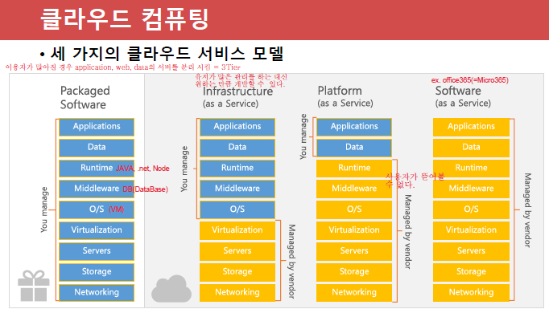

# Azure

- 수업 내용 순서대로 작성이 이루어져 이상해 보일 수 있음

## 목차

- [수업내용](#수업내용)
- [참고사항](#참고사항)
  - [191206](#191206)
  - [191209](#191209)
  - [191210](#191210)
  - [191211](#191211)
  - [191212](#191212)
  - [191213](#191213)

## 수업내용

- 191206
  1. [10979 module4 WordPress 생성](./191206_10979_module4_WordPress_생성.md)
     - WordPress 만들기(Azure)
     - Azure에서 사용한 비용보기
     - WordPress 시작하기(Azure)
     - 클라우드 없이 WordPress 설치하기
     - WP slot 추가하기
     - WP Swap 하기
  2. [Virtual Machine scale set](./191206_Virtual_Machine_scale_set.md)
     - Virtual Machine scale set 생성하기
     - Web Server 허용하기
  3. [Resource group Lock](./191206_Resource_group_Lock.md)
  4. [실습](./191206_실습.md)
  5. [10979F의 1-13](./191206_10979F의_1-13.md)
     - Azure management models
- 191209
  1. [Network 기본](./191209_Network_기본.md)
  2. [Overview of load balancers](./191209_Overview_of_load_balancers.md)
  3. [IP Address](./191209_IP_Address.md)
  4. [CIDR 표기법](./191209_CIDR_표기법.md)
  5. [Subnetting](./191209_Subnetting.md)
  6. [VLSM](./191209_VLSM.md)
  7. [데이터 전송 방식](./191209_데이터_전송_방식.md)
  8. [10979F Module5](./191209_10979F_Module5.md)
  9. [Azure 실습(subnet 만들기)](./191209_Azure_실습(subnet_만들기).md)
- 191210
  1. [CLI](./191210_CLI.md)
     - Cloud Shell
     - PowerShell
     - Azure CLI 
  2. [10979F Module2](./191210_10979F_Module2.md)
     - PowerShell ISE
     - PowerShell Module
     - Azure 가상 머신 포털
  3. [PowerShell 설치](./191210_PowerShell_설치.md)
  4. [Az 모듈 설치](./191210_Az_모듈_설치.md)
     - PowerShell로 VM 만들기
     - AzureRM 모듈 설치 (옛날)
  5. [Azure CLI 설치](./191210_Azure_CLI_설치.md)
     - Azure CLI로 VM 만들기
  6. [10979F Module5](./191210_10979F_Module5.md)
  7. [LoadBalancer](./191210_LoadBalancer.md)
     - 10979F - Module5(9p. ~ 11p.)
  8. [VPN](./191210_VPN.md)
     - 20533E - Module(30p. ~ 31p.)
  9. [10979F Lab Answer Key](./191210_10979F_Lab_Answer_Key.md)
     - VM availability Set(10979F -Module 3 10p.)

- 191211
  1. [Azure Storage](./191211_Azure_Storage.md)
     - 10979F Module6 Lesson1
     - Stroage Account 만들기(Azure Portal)
     - Storage Explorer 프로그램
     - 드라이브 공유를 통한 Storage 관리하기
     - cf. VM사이에 공유폴더 만들어 연결하기
  2. [Azure Storage에서 하위 Storage 만들기](./191211_Azure_Storage에서_하위_Storage_만들기.md)
     - Container 만들기
       - 파일 업로드 하기
         - Azure Portal
         - Storage Explorer
       - Blob Storage Access URL
         - Azure Portal 이용
           - Generate SAS
           - cf. Access keys
         - Storage Explorer 이용
     - File Storage 만들기
  3. [Azure SQL](./191211_Azure_SQL.md)
     - 10979F Module6 Lesson3
     - SQL in an Azure VM
       - VM 만들기
       - SQL 사용하기
     - SQL 특징
     - PaaS 환경으로 SQL 생성하기
       - SSMS(SQL Server Management Studio)
- 191212
  1. [AAD(Azrue Active Directory)](./191212_AAD(Azrue_Active_Directory).md)
     - Active Directory
       - Domain
       - WorkGroup
       - DC(Domain Controller)
     - 6425C_01 Acrive Directory.pdf
     - AAD 만들기(Azure)
       - User 생성
       - User login
       - MFA(Multi Factor Authentication)
       - 로그인 기록
  2. [Azure DNS](./191212_Azure_DNS.md)
     - Azure DNS 만들기
       - Record
     - 20410D_07 DNS.pdf
- 191213
  1. [시험 리뷰](./191213_시험리뷰.md)
  2. [Azure DNS](./191213_Azure_DNS.md)
  3. [ACS(Azure Container Service)](./191213_ACS(Azure_Container_Service).md)
  4. [AKS(Azure Kubernetes Service)](./191213_AKS(Azure_Kubernetes_Service).md)
  5. [10979F_LAB_AK_07](./191213_10979F_LAB_AK_07.md)

## 참고 사항

### 191206

Azure에서 제공해주는 DNS 이름은 길다. 회사 도메인처럼 짧은 DNS이름은 따로 구매해서 사용하여야 한다.

WSL2  : Windows Subsystem For Linux 2

Internic : 전 세계의 도메인을 관리
www.internic.org

>internic 사이트 -> Registrars -> Alphabetical Listing by Company/Organization Name
>
>-> internic에서 공인한 도메인 판매업체 -> HANGANG Systems, Inc. dba Doregi.com 
>
>-> 등록하고 싶은 도메인을 검색하여 없는지 확인하여 신청할 수 있음

cf ) Azure는 메뉴와 내용이 6개월에 한번씩 싹 바뀜

- www.github.com/kite01 : 강사님 github
- www.github.com/10979F : Microsogt Azure Fundamentals 실습
- www.github.com/20533E : Implementing Microsoft Azure Infrastructure Solutions 실습
- www.github.com/AZ-103 : Azure 관리자 관련 실습
- www.github.com/MicrosoftLearning : MS 관련 공인 교재 실습

cf )  Fork를 선택하면 나의 Github에 복사(Fork를 한 시점의 내용으로 고정되고, 업데이트는 되지 않는다.)

- Azure 메뉴
  - All services : Azure에서 제공하는 모든 서비스
  - All resources : 본인이 생성한 모든 서비스

----

### 191209

Azure Pass 사용 내역 (요금 정보) : https://www.microsoftazuresponsorships.com/

20533E - Module2 / 10979F - Module5

시험 총 30문제 (상, 중, 하)로 구성 80% 넘기

과제 3개를 발표(5분 ~10분)수업으로 대체, 시간이 없을 경우 금요일 4 or 5시 부터 시작할 수 있음

PPT로 5분 발표 -> 2분 가량 데모(Azure) 오래걸리는 부분은 미리 Setting 해 놓기

수업에서 하지 않은 내용을 추가하여 발표할 경우 추가 배점

PPT 작성, 데모, 마지막 질문

cf ) network 베스트 셀러 : sisco networking

- 시험 : 다음 중 사설 IP가 아닌 것을 고르시오.


### 191210

- vNet내에 Subnet 10.10.10.0/24 할당

- 마지막 자리의 1 ~ 3 번 IP는 Azure 내부에서 예약해 놓은 IP

  -> 우리는 4번 ~ 254번 사이의 IP를 할당 받는다.

- MS-SQL
  
  - TCP 1433
- RDP
  
  - TCP 3389

subnet과 subnet 사이에 라우터가 있어야 한다. Azure에서는 없어도 된다.

- VNet Peering
  - 같은 DataCenter 내에 있는 VNet을 서로 연결해 주는 것 
  - VNet-to-VNet과 같은 개념
- ExpressRoute
  - VPN은 기존 인터넷선을 사용하는데
  - 회사와 Azure사이에 전용선을 깔아 Direct로 연결
  - 속도가 빠름

### 191211

MS에서 제공하는 서비스에 관한 설명 : https://docs.microsoft.com/

-  시험 문제
  - SaaS : Office365, dropbox
  - PaaS : WebApp
  - IaaS :  MS Azure, Amazon Web Services(AWS)

#### 클라우드 인프라.pdf 32p.



- ESXi
  - 실 프로덕션에서 사용하는 Hyper-V
  - MS가 아닌 다른 회사 제품
  - vCenter : 서버 관리 소프트웨어
  - ESXi와 vCenter를 합쳐서 vSphere라 한다.
- SC(System Center)
  - 가상화된 서버들을 중앙에서 쉽게 관리하는 곳
  - Azure와 비슷한 곳

#### Microsoft Learn

- https://docs.microsoft.com/ko-kr/azure
- https://docs.microsoft.com/ko-kr/learn
- 한국어 해석이 이상하면 ko-kr -> en-us 로 바꿔 보기
- 순서대로 따라며 배울 수 있는 곳

#### 평가판 - MS의 모든 제품

- https://www.microsoft.com/ko-kr/evalcenter/
- SQL
  - 예전에는 Windows에만 설치가 가능했는데 최신버전은 Linux에도 설치 가능하다.
  - SQL Server 2016 with SP2 -> EXE -> 정보입력 -> 64bit -> 다운로드
  - SQL Server 2014 SP3 -> ISO -> 정보입력 -> 64bit -> 다운로드
- .Net Framework 4.3
  - https://dotnet.microsoft.com/download/dotnet-framework/net48?utm_source=getdotnet&utm_medium=referral
  - SQL Server Management Studio 설치를 위한 필수 조건

#### 컴퓨터 리부팅 PowerShell 코드

- 리부팅 하라(관리자 계정)

```powershell
Restart-Computer -force
```

  - -force : 사용자가 로그온 한 경우에도 강제로 다시 시작

### 191212

- 발표 시나리오 및 PPT 작성요령

  - 파일 이름 : 1. Cloud 기초 - 발표자 이름
  - 시나리오
    - 모 회사에서 클라우드 제품()의 각 기능을 소개해 달라고 요청 받았습니다.
    - 여러분은 MS 회사의 직원(대리, 과장)입니다. 
    - 각 회사(MS 파트너)의 사장님을 모시고 Public Cloud 각 제품(서비스)을 소개 합니다.
  - 10분 : 발표
  - 5분 : 질의 응답

  1. 업체에 자신의 회사 제품의 기능 소개하는 마음으로 발표
  2. 셋팅 내용 STEP By STEP 로 캡쳐 (목차 및 간단 내용입력) <<공유>>
  3. 다른 분들이 알수 있도록 쉽게 작성		
  4. Azure 에서 전체 내용 셋팅후 결과 내용 데모 (셋팅 내용은 PPT로 캡쳐)

  - PPT 작성요령
    1. 제목/발표자이름/메일주소/전화번호/GIT 주소/홈페이지(블로그)(옵션)
    2. 발표목차 (Overview)
    3. 발표내용 (Step by Step) 캡쳐
    4. 데모 (셋팅 완료 내용)
    5. 질의 응답
  - 평가항목
    1. PPT 작성능력 A, B, C
    2. 의사전달능력 A, B, C
    3. 질의 응답 A, B, C
  
- 공유폴더 연결하기(cmd에서 안될 경우)

  - cmd 창에서 `net use X: \\\70.12.113.130\PPTshare`가 적용되지 않을 경우

    > 내 PC 오른쪽클릭 -> 네트워크 드라이브 연결 ->
    >
    > 
    >
    > -> 마침 -> 연결완료

- 시험
  - ARM 특징
    - 서비스 확장이 쉽다.(Micro Service 특징)
    - Tag(Resource에 넣은 정보)기능 제공
    - 모든 RBAC 지원
  - availability (상 문제)
    - 서비스가 죽지 않도록 하는 것
    - 99.9%
    - set vs zone
      - set : 복제 단위가 Lack, 99.95%
        - 장애 도메인 = Lack
        - 업데이트 도메인 = 업데이트를 위한 복제 VM
          - 윈도우 패치시 리부팅을 해야하는데 서비스 중지를 막기 위한  VM
      - zone : 복제 단위가 DataCenter, 99.99%
  - 서브넷마스크가 있는 이유 : 네트워크와 호스트를 식별하기 위해서
  - 게이트웨이(라우터 주소)가 있어야 외부 네트워크와 통신이 됨/ 외부로 빠져나감
  - DNS 서버(KT에 있는 DNS서버)
    - URL에 영문으로 된 도메인 이름을 DNS 서버에서 응답받아 IP를 찾아냄 
    - 없으면 영문으로는 된 URL은 못들어가고 IP로 된 URL만 들어갈 수 있다.
  - 명령어도 시험에 나옴

### 191213

Azure 처음 시작하는 사람을 위한 단계별 데모 : https://github.com/kite01/AZ-900T0x-MicrosoftAzureFundamentals

Microsoft에서 제공하는 데모 : https://github.com/MicrosoftLearning


